# 卷积神经网络:从日常理解到更具技术性的深度探讨

> 原文：<https://towardsdatascience.com/convolutional-neural-networks-from-an-everyday-understanding-to-a-more-technical-deep-dive-83af329e5d89>

## 等等，电脑知道怎么看？！？

最近，我不得不使用卷积神经网络(CNN)进行研究，并不断试图自己理解它们是什么。虽然研究不同的功能并不难，但最难的部分是试图用一种有意义且不太专业的方式向我的朋友和家人解释 CNN。今天，我想提供 CNN 的技术定义和非技术定义，以帮助你更好地理解什么是 CNN，并帮助你向你认识的人解释它们！

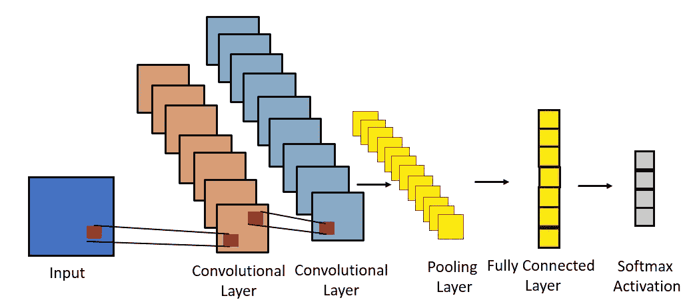

图片来自作者

# 哇哦。我的电脑有眼睛？！

电脑是怎么看的？**卷积神经网络(CNN)！**这些机器学习算法目前处于计算机视觉和解释图像和视频的最高梯队。这篇文章将提供一个技术定义，加上一个“*我对机器学习一无所知”*的定义，让你更深入地理解 CNN，并在日常对话中向你的朋友和同事解释它们。对于这个例子，我将使用我的狗 Biscotti 的图片作为参考！

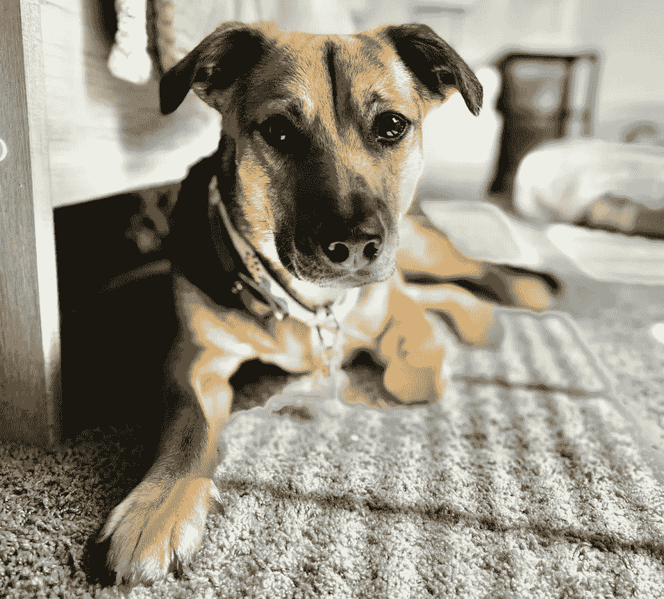

意大利脆饼！(图片来自作者)

# 卷积层

现在，请注意，由于我们看到的是红色、绿色和蓝色(RGB)光谱，从技术上讲，每种颜色都有自己的层。为了今天的讨论，我把这个因素放在一边，以减少解释的复杂化。

## “我对机器学习一无所知”的解释

神经网络的卷积层充当计算机的眼睛，并像人眼一样扫描图像！随着时间的推移，图层帮助网络将不同的要素与某一类样本相关联，以进行分类。例如，如果我向 CNN 展示狗和人类的各种图片，它可能会学会将任何有 4 条腿的东西与狗联系起来，而将两条腿与人类联系起来！实质上，CNN 将从图像的每个部分获取信息。它将为图像的每个部分创建一个小部分。例如，一个内核可能通过网络的第一层获得我的狗的某些部分。

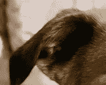

找到一只耳朵！(图片来自作者)

随着内核继续沿着图像移动，它将获得图像的其他属性。例如，它可以在一个节点中找到我们的狗的鼻子。

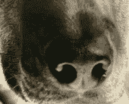

找到一个鼻子！(图片来自作者)

使用不同的模式，CNN 的各层将学习如何提取特征和这些特征的某些方面(鼻子的轮廓和组成鼻子的不同颜色)。你可能想知道，计算机能看到颜色吗？嗯，算是吧。一幅图像必须被转换成一个数值数组，每个数值代表一种特定的颜色。解释这一点的一种方式是想象计算机将一幅图像变成一个数字网格，其中距离较近的数字代表相似的颜色。

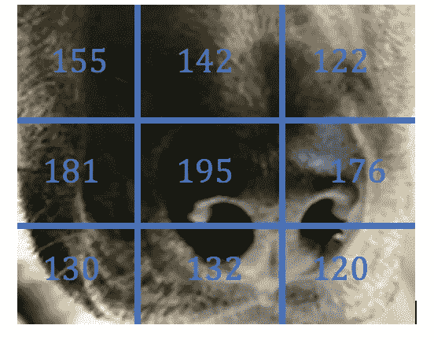

图像变成像素值(图片来自作者)

# 技术解释

在 CNN 的卷积层中，这些层以密集相关的点为目标，这些点最终是图像中的重要特征(1)。一层中放置的神经元数量取决于数据集的复杂性、计算能力和内存可用性。卷积层是根据它们对图像中给定张量执行的卷积矩阵运算而命名的。卷积运算需要一个张量

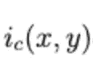

并在图像片段和之间进行逐元素乘法

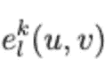

其中 *kI* 是由第*层索引的第*k*卷积核。提取数据的图像区域
由坐标 *x* 和 *y 给出。c* 是通道的索引(1 代表灰度，3 代表 RGB)。*

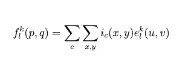

卷积方程(图片来自作者)

*P* 是特征矩阵中的总行数，而 *Q* 是特征矩阵中的总列数。

# 卷积核(滤波器)

## “我对机器学习一无所知”的解释

本质上，内核是 CNN 的一部分，它从图像的每个部分获取信息。每个内核；会有不同的图案，这样计算机就可以找到样本的不同特征。例如，一些过滤器会在图像中找到波状图案，而其他过滤器可能会找到直的、水平的图案。看情况吧！一个过滤器可能会找到狗的边缘，而另一个过滤器能够拾取构成狗的皮毛的图案。

## 技术解释

卷积层中的滤波器(也称为“内核”)通过为每个神经元设置不同的权重来分解采样到该层的输入，
产生各种特征图。神经元将忽略除了在其感受野收集的数据以外的所有信息。例如，具有代表穿过其 *nxn* 感受野中间的水平线的核的神经元将把所有输入乘以零，除了穿过中心水平线的那部分输入。卷积核在图像上的移动由层的步幅决定。

# 进展

## “我对机器学习一无所知”的解释

步幅告诉我们，我们的计算机应该移动多少来拾取图像的下一个特征框。例如，选择一个太大的步幅，你可能会错过图像的特征。如果我们选择一个巨大的步幅，我们可能会迫使 CNN 跳过狗的脸，让计算机认为狗没有脸和两只耳朵。那就太可怕了！

这一大步迈得真大！(图片来自作者)

## 技术解释

步幅是每个感受野之间的距离(一个核从一个分区移动到另一个分区的距离)。通常，使用跨距 2，因为它也具有对图像进行下采样的效果。

# 汇集层

## “我对机器学习一无所知”的解释

想象一下，在这一点上，美国有线电视新闻网已经扫描了我的狗的一堆较小的图像。也许它会有一些重要的特征，比如我的狗的鼻子

找到一个鼻子！(图片来自作者)

也许会有一些不太重要的特征，比如图像的背景噪声

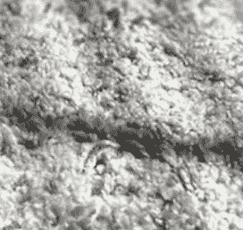

通过汇集图像的特征，计算机可以开始丢弃不太重要的特征，并专注于感兴趣的特征，将从这些重要特征收集的信息结合在一起。随着时间的推移，计算机希望摆脱图像的背景信息，只关注描述实体的重要特征的组合(在这种情况下，鼻子对狗很重要，但地毯不重要！)，导致模型以某种概率对图像内的对象类型进行分类。

## 技术解释

在卷积层之后，实施汇集层，目的是对图像执行维数减少，减少参数的数量和模型的复杂性(2)。在汇集层，“几个附近的特征检测器的输出被组合成一个局部或全局的‘特征包’，以某种方式保留与任务相关的信息，同时移除不相关的细节”(3)。池层的目标是在每一步获得图像的子样本，并揭示不变特征。(4)图像分类中流行的两种方法是平均池和最大池。平均池取每个步长内核中所有元素的平均值。

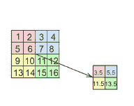

平均池(图片来自作者)

最大池在每一步中获取过滤器中的最大数量。对于对象识别，已经发现最大池化减少了误差，并且在用于特征提取的图像下采样中提供了改进。

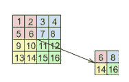

最大池(图片来自作者)

# 填料

## “我对机器学习一无所知”的解释

进入的图像大小必须与出去的图像大小相同！说够了！

## 技术解释

由于样本的输入大小随着其穿过
CNN 的层而减小，填充确保网络的输出样本大小与输入样本大小和形状相同。零填充将零添加到输入图像的任何边界，当向下传递到神经网络的层时，该边界被丢弃。

# 全连接层

## “我对机器学习一无所知”的解释

想象一下，现在计算机已经找到了所有重要的特征，需要弄清楚它在看什么。全连接层是 CNN 的“大脑”，将从提供给它的特征中提取信息，并预测所有这些特征的相似之处。

## 技术解释

一旦图像通过 CNN 架构的卷积层，它必须被展平为一维数组，以通过一系列完全连接的层。CNN 架构的全连接层反映了典型的人工神经网络(ANN)。信息通过各层传递，最终进入激活功能。然后，在网络优化器
的支持下，使用反向传播来更新全连接层的权重，以输出更准确的结果。随着时间的推移，不断向完全连接的层提供批量样本将有助于它学习对 CNN 解析的图像进行正确的分类预测。

# 结论

现在你知道了！现在你对计算机如何看有了高层次的理解！围绕 CNN 做了很多研究，我强烈建议你找到更多，并尝试自己实现它们！

**如果你喜欢今天的阅读，请关注我，并告诉我你是否希望我探讨另一个主题(这对我的帮助超乎你的想象)！另外，在**[**LinkedIn**](https://www.linkedin.com/in/benjamin-mccloskey-169975a8/)**上加我，或者随时联系！感谢阅读！**

## 来源

1.  Asifullah Khan、Anabia Sohail、Umme Zahoora 和 A. Qureshi。深度卷积神经网络的最新结构综述。人工智能评论，第 1-62 页，2020 年。
2.  凯龙·奥谢和瑞安·纳什。卷积神经网络导论。更正，abs/1511.08458，2015 年
3.  伊兰·布鲁，让·庞塞和扬·勒昆。视觉识别中特征池的理论分析。《第 27 届国际机器学习会议论文集》, ICML，10 年，第 111-118 页，麦迪逊，WI，美国，2010 年。全媒体。
4.  奥雷连恩·杰龙。用 Scikit Learn & TensorFlow 实践机器学习。O Reilly 媒体公司，塞瓦斯托波尔，2017。