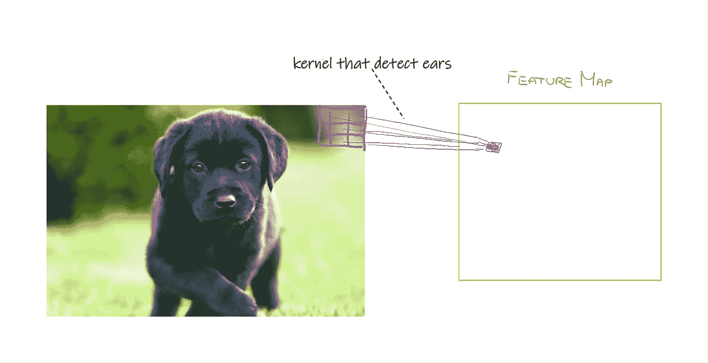
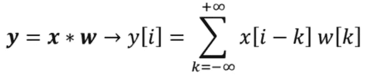
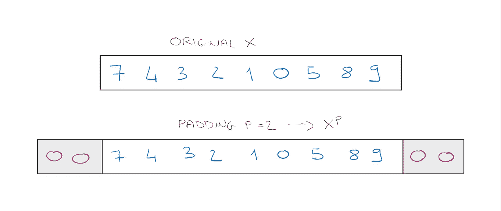
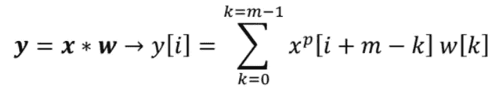
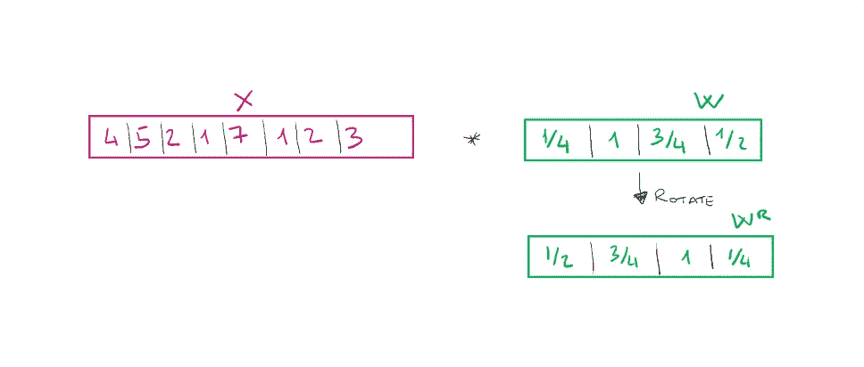
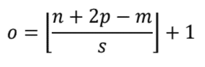
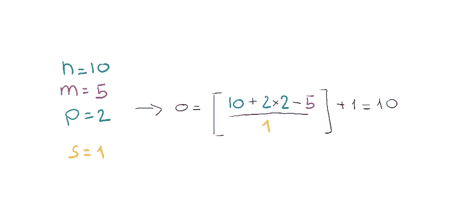
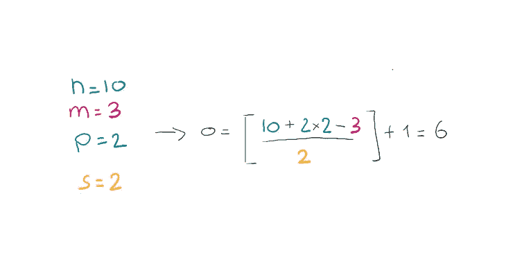

# 使用 Python 实现一维卷积

> 原文：<https://towardsdatascience.com/convolutions-in-one-dimension-using-python-54d743f18063>

在 [Unsplash](https://unsplash.com?utm_source=medium&utm_medium=referral) 上由 [Ocramnaig_o1](https://unsplash.com/@ocramnaig_o1?utm_source=medium&utm_medium=referral) 拍摄的照片

## 了解 CNN 的构建模块，停止获取大小不匹配的错误

我经常看到有人想学习如何快速开发深度学习应用程序，他们学习了 PyTorch 或 Tensorflow 等一些库的基础知识，但他们并没有真正理解那些他们如此肤浅地使用的神奇功能背后的含义。经常会发生这样的情况，当一些东西不工作或者你需要定制一些功能时，没有人知道从哪里开始。

当一个人对计算机视觉感兴趣时，他通常会开始研究卷积神经网络，从高层次来看，它们是非常容易理解的。但有时，当我的朋友或同事不是在处理二维图像，而是必须使用一维卷积时(例如，因为他们必须处理信号)，他们会感到非常困惑，因为他们无法想象正在发生什么。这是因为他们还没有完全理解 CNN 的构建模块。因此有了这篇文章的名字。

## 介绍📚

1959 年，大卫·H·哈贝尔和托尔斯滕·威塞尔发现了人类视觉皮层的一种特殊功能。根据一个人正在看的图像，神经元被不同地激活。具体来说，视觉皮层有不同的层次。第一层是在看有边缘的图像时激活的，第二层是在给图像添加细节时激活的，依此类推…

卷积神经网络正是受到这种功能的启发。如您所知，它们被分为不同的层，每一层都试图从正在处理的原始图像中提取特征。
第一个 CNN 是由 **Yann LeCun** 在 20 世纪 90 年代开发的，并且在著名的论文 [*中描述了使用反向传播网络*](https://papers.nips.cc/paper/1989/file/53c3bce66e43be4f209556518c2fcb54-Paper.pdf) 的手写数字识别。

## 一点背景知识👨🏼‍🎓

在开发机器学习算法时，最重要的事情之一(如果不是最重要的话)是提取最相关的特征，这是在项目的特征工程部分中完成的。在 CNN 中，这个过程是由网络自动完成的。特别是在早期层中，网络试图提取图像的最重要的特征，例如边缘和形状。另一方面，在最后一层，它将能够结合各种特征来提取更复杂的特征，如眼睛或嘴巴，这可能是有用的，例如，如果我们想创建一个人类图像的分类器。

让我们想象一只狗的形象。我们希望在这个图像中找到一只耳朵，以确保有一只狗。我们可以创建一个**过滤器**或**内核**，一次运行整个图像的一部分，看看它是否能在图像的不同点找到一只耳朵。

特征图(图片由作者提供)

在图像中，我们有一组紫色的权重(内核),当乘以输入图像的像素值时，它会告诉我们是出现了耳朵还是下巴。我们是如何创建这些重量参数的？嗯……随意！这将是网络的训练，它将慢慢地学习正确的权重参数。

最终的输出(橙色)被称为**特征图**。
通常在卷积之后，所以在获得特征地图之后，我们有汇集图层来汇总更多信息，然后我们将有另一个卷积，等等——但是在本文中我们不讨论其他图层。

## 一维卷积💻

我们已经直观地理解了卷积是如何从图像中提取特征的。但是卷积也经常用于其他类型的数据，如文本，这是因为**卷积只不过是一个公式**，我们需要了解它是如何工作的。
**一维卷积是在两个向量之间定义的，而不是像图像中常见的那样在矩阵之间定义的**。

所以我们将有一个*向量 x* 作为我们的输入，还有一个*内核 w* 作为第二个向量。

卷积公式(图片作者提供)

符号 ***** 表示卷积(不是乘法)。 *Y[i]* 是合成向量 *y* 的条目 *i* 。

首先，如果你注意到求和的极值从 *-inf* 到 *+inf* ，但是这在机器学习中没有多大意义。我们通常在前面加上一定的尺寸。假设输入向量的大小必须是 12。但是如果向量小于前缀的大小会发生什么呢？嗯，我们可以在向量的开头和结尾添加**零，使其大小合适，这种技术被称为**填充**。**

填充(图片由作者提供)

然后我们假设原始输入 *x* 和滤波器 *w* 分别具有尺寸 *n* 和 *m* ，其中 *n ≤ m* 。那么具有填充的输入将具有大小 *n + 2p* 。而原来的公式会变成如下。

卷积公式(图片作者提供)

从上面的公式中，我们可以注意到一点。我们所做的是滚动矢量 *x_p* 和矢量 *w* 的单元格。不过，向量 *x_p* 是从右向左滚动，w 是从左向右滚动。但是然后我们可以简单地反转向量 *w* 并且执行 *x_p* 和 *w_rotated* 之间的向量积。
让我们直观地看看会发生什么。首先，我们旋转过滤器。

滤镜旋转(图片由作者提供)

初始公式告诉我们要做的是，在两个向量之间做矢量积，只考虑初始向量的一部分。这部分被称为**局部感受野**。然后，我们每次将向量 *w_r* 滑动两个位置，在这种情况下，我们会说我们使用的是 **stride = 2** 。后者也是我们需要优化的网络的超参数。

步幅=2 的 1D 卷积(图片由作者提供)

## 衬垫️⃣

您应该注意到，根据我们使用的填充模式，我们会或多或少地强调一些输入单元格。在前面的例子中，当我们计算输出 *y[0]* 时，单元格 *x[0]* 只被考虑了一次。相反， *x[2]* 单元格在 *y[1]* 和 *y[2]* 的计算中都被考虑，因此它更重要。我们还可以通过使用填充来处理向量边界处的单元格的重要性。
有 3 种不同类型的衬垫:

1.  **全模式**:填充参数 *p* 设置为 *p = m-1* ，其中 *m* 为内核大小。这种填充导致输出大于输入，因此很少使用。
2.  **相同模式**:用于确保输出与输入大小相同。例如，在计算机视觉中，输出图像将与输入图像大小相同，因此通常是最常用的。
3.  **有效模式**:当 p =0 时，所以我们不使用填充。

**如何确定卷积输出的大小？**

许多人经常对 CNN 各层的输入和输出大小感到困惑，并与不匹配错误作斗争！实际上，计算卷积层的输出大小非常简单。

假设我们有一个输入 *x，* a 内核 *w* 并且想要计算卷积 *y = x*w* 。

要考虑的参数将是 *x* 的尺寸 *n* 、 *w* 的尺寸 *m* 、*填充 p* 和*步距 s* 。输出的尺寸 *o* 将由以下公式给出:

卷积输出尺寸(图片由作者提供)

⌊⌋符号表示楼层操作。例如⌊2.4⌋ = 2。
让我们通过例子来看看如何应用这个公式:

示例 1(图片由作者提供)

在第一个示例中，我们看到输出大小与输入大小相同，因此我们推断我们使用了相同的模式填充。
我们看到另一个例子，我们改变了内核大小和步幅。

示例 2(图片由作者提供)

## 我们来编码吧！⌨️

如果到目前为止你还是有点迷茫，没问题。让我们开始接触代码，事情会变得更加清晰。

让我们试着在一些真实数据上运行这个函数，看看结果。让我们将结果与 NumPy 内置的自动计算卷积结果的函数进行比较。

# 最后的想法🤔

如您所见，我们开发的函数和 NumPy 的卷积方法的结果是相同的。卷积是卷积神经网络以及现代计算机视觉的基本元素。我们经常在不了解组成复杂算法的构件的情况下，立即开始实现复杂的算法。在我看来，一开始，花一点时间去更详细地了解那些看起来更没用、更无聊的东西，可以在未来节省我们很多时间，因为我们将知道如何立即解决我们在途中发现的各种错误。在下一篇文章中，我的目标是在二维情况下进行归纳！👋🏽

# 结束了

*马赛洛·波利蒂*

[Linkedin](https://www.linkedin.com/in/marcello-politi/) ， [Twitter](https://twitter.com/_March08_) ， [CV](https://march-08.github.io/digital-cv/)