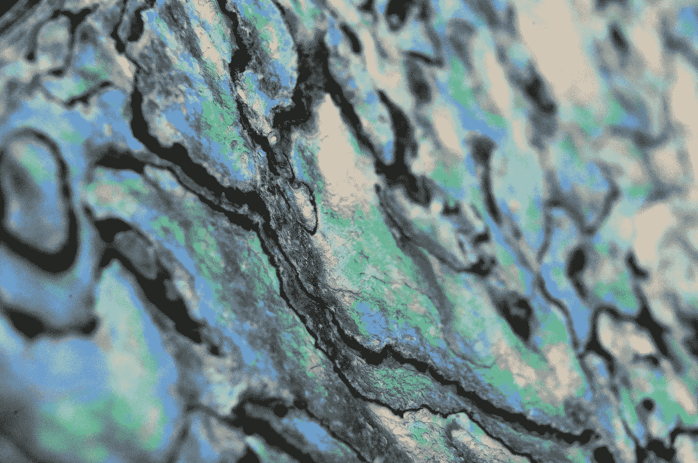
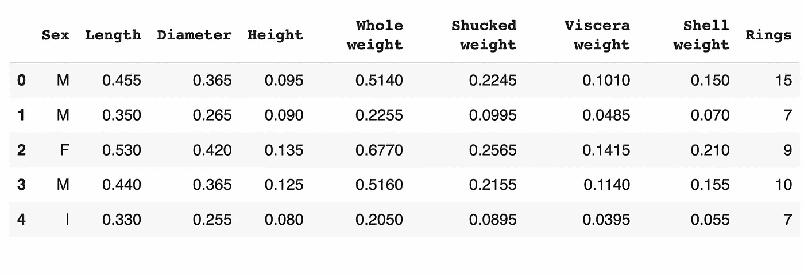
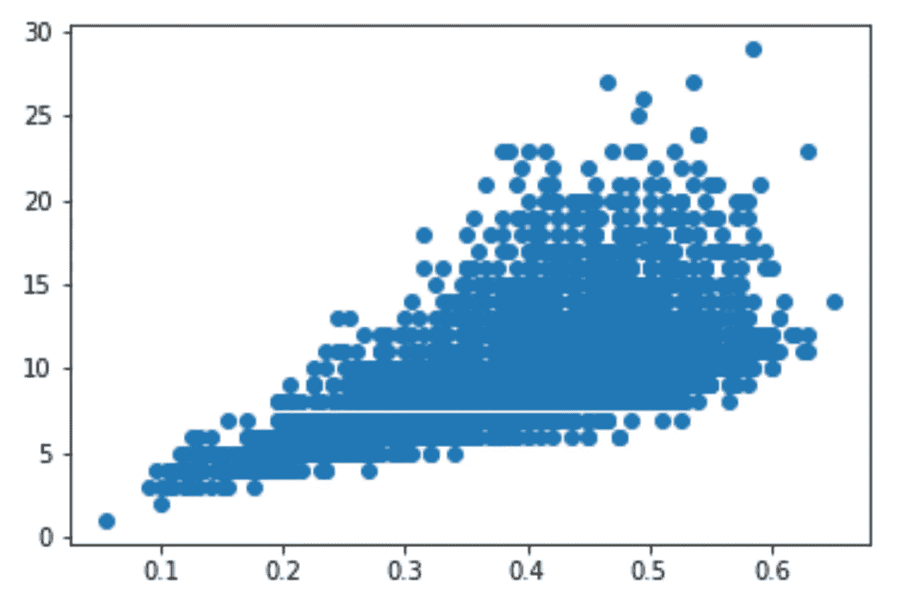
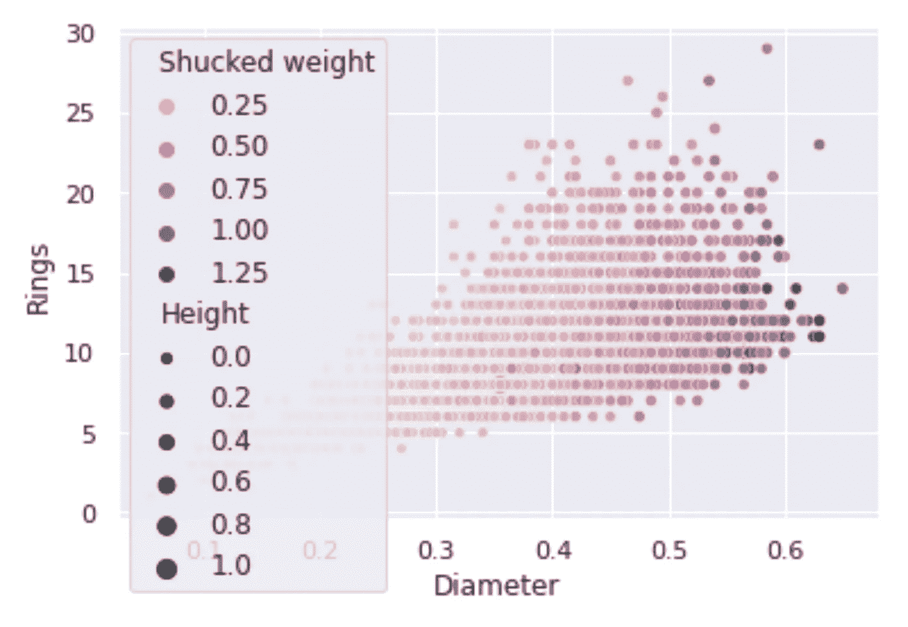
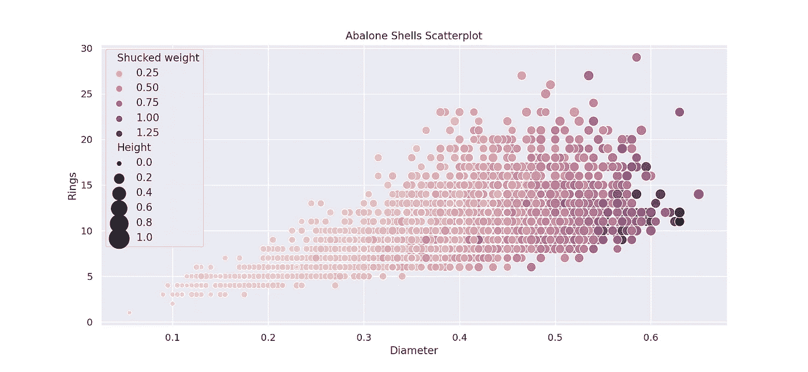
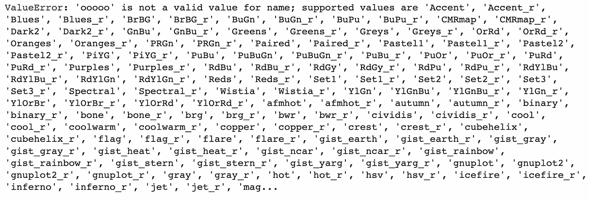
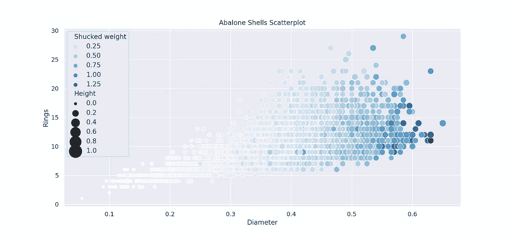
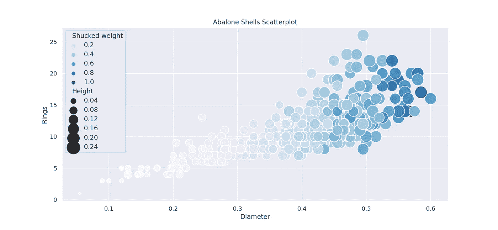
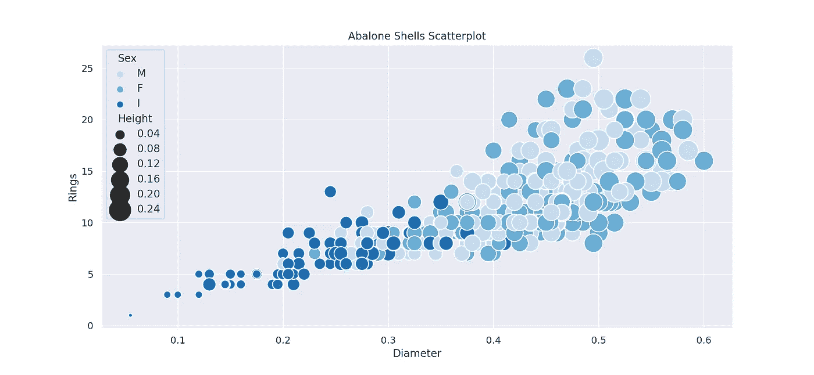
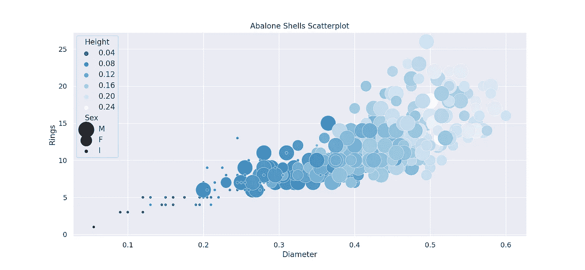

# 凉爽散点图

> 原文：<https://towardsdatascience.com/cool-scatter-plots-dfb23bebb3dc>

## 如何改变 seaborn 的大小和颜色

*在本文中，作者 Corey Wade，*[*Berkeley Coding Academy*](https://www.berkeleycodingacademy.com/)，*承担了 Python、pandas 和 matplotlib 的基础知识。所有代码都可以在* [*Colab 笔记本这里*](https://colab.research.google.com/drive/1_LCks_XBBM1Cgro9R29HhpXQTW6M5Exh?usp=sharing) *。*

你可能在网上看到过非常酷的散点图。这些点不是显示统一大小和颜色的点，而是以某种方式改变大小和颜色，增加了新的数据维度。图表不仅看起来更好，而且信息量也更大。

在本文中，我将向您展示如何通过几个简单的步骤使用 seaborn 创建非常酷的散点图。Seaborn 与 matplotlib 配合得很好，所以如果您以前使用过 matplotlib，就可以使用了。



来自维基共享，免费的媒体仓库。[知识共享](https://en.wikipedia.org/wiki/en:Creative_Commons) [归属 2.0 通用许可](https://creativecommons.org/licenses/by/2.0/deed.en)。

# 鲍鱼壳数据

首先，让我们找一些数据来处理。我从 UCI 机器学习库中选择了[鲍鱼壳数据](https://archive.ics.uci.edu/ml/datasets/abalone)。下面是将鲍鱼壳数据加载到 Jupyter 或 Colab 笔记本的 Python 代码。

```
import pandas as pddf = pd.read_csv(‘https://archive.ics.uci.edu/ml/machine-learning-databases/abalone/abalone.data', header=None)df.columns = [‘Sex’, ‘Length’, ‘Diameter’, ‘Height’,‘Whole weight’, ‘Shucked weight’, ‘Viscera weight’,‘Shell weight’, ‘Rings’]df.head()
```



图片由作者科里·韦德提供

如您所见，鲍鱼壳数据包含除“性别”列之外的所有数字列。鲍鱼壳数据集的通常目标是在给定长度、高度和性别测量值的情况下预测年轮的数量。

# Matplotlib 图

在创建 seaborn 图之前，让我们创建一个标准的 matplotlib 图进行比较。

y 值将是我们试图预测的“环”列，而 x 值可以是任何值。让我们从“直径”一栏开始。

```
# Create baseline scatterplot
import matplotlib.pyplot as plt
plt.scatter(df['Diameter'], df['Rings'])
plt.show()
```



图片由作者科里·韦德提供

正如所料，图表呈上升趋势。当鲍鱼壳的直径增加时，环的数量通常增加，比预期的变化更多。(设置 *alpha=0.4* 在 *plt.scatter* 显示异常值。)

# 第一 Seaborn 图

让我们使用 seaborn 添加一些大小和颜色的变化。首先，seaborn 需要进口。我更喜欢实现 seaborn 的灰色背景和白色网格。两者都可以如下进行。

```
# Import seaborn and set grid
import seaborn as sns
sns.set()
```

现在让我们创建一个 seaborn 散点图。和 *plt.scatter* 有点不同，但是风格足够接近。除了设置 *x=df['直径']* 和 *y=df['环']* 之外，我们还可以自由选择列的大小和色调，如下面的代码片段所示。

```
# Create scatter plot with size and hue variation
sns.scatterplot(x=df['Diameter'], y=df['Rings'],
                size=df['Height'], hue=df['Shucked weight'])
plt.show()
```



图片由作者科里·韦德提供

从上图可以看出，seaborn 自动包含了一个 x 和 y 标签，以及一个关于色调和尺寸的漂亮图例。但是大小变化不清楚，图例截断了太多数据。

# 改进的 Seaborn 图

美化图形没有限制。我更喜欢在视觉吸引力和高效代码之间取得平衡。以下改进用最少的代码优化了 seaborn 散点图。

1.  使用*PLT . fig . fig(figsize)*放大绘图，以获得更多屏幕空间，同时限制图例。
2.  通过 *sns .散点图*中的*尺寸*参数包含更多尺寸变化。
3.  使用 *plt.savefig* 获得带标题的高分辨率输出。(“dpi”参数代表“每英寸点数”。)

下面是上述实现的 Python 代码，以及从 Colab Notebook 文件夹下载到我的本地机器的 png 图像。

```
# Change figure size
plt.figure(figsize=(13,6))# Create cool scatter plot
sns.scatterplot(x=df['Diameter'], y=df['Rings'],
               size=df['Height'], hue=df['Shucked weight'],
               sizes=(20,600))# Give title
title = 'Abalone Shells Scatterplot'
plt.title(title)# Save graph
plt.savefig(title, dpi=200)
plt.show()
```



图片由作者科里·韦德提供

上图是一个明确的改进。散点图清楚地显示，壳重和壳高以及直径的增加结合起来预测鲍鱼壳有更多的环，图例放置得很好。

# Seaborn 调色板

虽然 seaborn 的默认颜色令人印象深刻，但改变调色板以适应您的数据故事绝对值得付出努力。

*调色板*参数包含在 *sns .散点图*选项中。查看调色板选项的一个很酷的技巧是向*调色板*参数中输入天书(无论你想要什么),如下面的代码片段所示。

```
# Create cool scatter plot
sns.scatterplot(x=df['Diameter'], y=df['Rings'],
               size=df['Height'], hue=df['Shucked weight'],
               sizes=(20,600),
               palette='ooooo')
```



图片由作者科里·韦德提供

当调色板值强制出错时，seaborn 显示调色板选项是多么好啊！在 seaborn 语言中，' _r '是反转的意思，表示调色板是可逆的，原色是缩写的，所以' Bu '是' Blue '的缩写，以此类推。

既然鲍鱼壳来自海洋，那就试试‘蓝色’的调色板吧。

```
# Change figure size
plt.figure(figsize=(13,6))# Create cool scatter plot
sns.scatterplot(x=df['Diameter'], y=df['Rings'],
               size=df['Height'], hue=df['Shucked weight'],
               sizes=(20,600),
               palette='Blues')# Give title
title = 'Abalone Shells Scatterplot'
plt.title(title)# Save graph
plt.savefig(title, dpi=200)
plt.show()
```



图片由作者科里·韦德提供

现在，代表海浪的颜色选择为数据故事添加了一个新的图层。

# 散点图子集

防止大型散点图拥挤的一个重要调整是查看数据的子集。通常，几百行就足以获得模式的指示，而不会丢失临界值。

以下 Python 代码将散点图限制为前 400 行。

```
# Take subset of data for scatterplots
df_sub = df[:400]# Change figure size
plt.figure(figsize=(13,6))# Create cool scatter plot
sns.scatterplot(x=df['Diameter'], y=df['Rings'],
               size=df['Height'], hue=df['Shucked weight'],
               sizes=(20,600),
               palette='Blues')# Give title
title = 'Abalone Shells Scatterplot'
plt.title(title)# Save graph
plt.savefig(title, dpi=200)
plt.show()
```



图片由作者科里·韦德提供

这是一个漂亮的图表。一些高度较大的异常值已被移除，以允许更大的视觉变化。

# 分类列有效

回想一下，鲍鱼壳数据集包括带有选项“M”、“F”和“I”的“性别”列，这些选项根据数据源代表“男性”、“女性”和“婴儿”[。](https://archive.ics.uci.edu/ml/datasets/abalone)

令人惊叹的是，seaborn 散点图允许对色调和大小进行分类选择，如下面的代码片段所示。

首先，我们设置 *hue=df['Sex']* ，其他都不变。

```
# Change figure size
plt.figure(figsize=(13,6))# Create cool scatter plot
sns.scatterplot(x=df['Diameter'], y=df['Rings'],
               size=df['Height'], hue=df['Sex'],
               sizes=(20,600),
               palette='Blues')# Give title
title = 'Abalone Shells Scatterplot'
plt.title(title)# Save graph
plt.savefig(title, dpi=200)
plt.show()
```



图片由作者科里·韦德提供

正如预期的那样，深蓝色的幼鲍壳较小，尽管雌雄壳之间没有明显的图案。

接下来，我们设置 *size=df['性别']* 和 *hue=df['高度']* 。换句话说，我们呈现相同的数据，但是切换了*尺寸*和*颜色*参数。我也选择了通过设置*调色板='Blues_r'* 来反转蓝色。

```
# Change figure size
plt.figure(figsize=(13,6))# Create cool scatter plot
sns.scatterplot(x=df['Diameter'], y=df['Rings'],
               size=df['Sex'], hue=df['Height'],
               sizes=(20,600),
               palette='Blues_r')# Give title
title = 'Abalone Shells Scatterplot'
plt.title(title)# Save graph
plt.savefig(title, dpi=200)
plt.show()
```



图片由作者科里·韦德提供

我喜欢上图中婴儿鲍鱼壳很小！

# 把所有的放在一起

在本文中，您了解了如何使用 seaborn 改变散点图的大小和颜色，以及修剪数据集、使用分类列和优化图像输出的额外好处。

下面是所有的代码，加上一个调整后的参数 *size=df['Shell weight']* 得出一个原始的图形。

```
# Load Abalone Shell Data
import pandas as pd
df = pd.read_csv('https://archive.ics.uci.edu/ml/machine-learning-databases/abalone/abalone.data', header=None)
names = ['Sex', 'Length', 'Diameter', 'Height', 'Whole weight', 'Shucked weight', 'Viscera weight', 'Shell weight', 'Rings']
df.columns=names# Take subset of data for scatterplots
df_sub = df[:400]# Change figure size
plt.figure(figsize=(13,6))# Create cool scatter plot
sns.scatterplot(x=df_sub['Diameter'], y=df_sub['Rings'],
               size=df_sub['Sex'], hue=df_sub['Shell weight'],
               sizes=(20,600),
               palette='Blues_r')# Give title
title = 'Abalone Rings Scatterplot'
plt.title(title)# Save graph
plt.savefig(title, dpi=200)
plt.show()
```


图片由作者科里·韦德提供

编码快乐！[这里是完整的 Colab 笔记本](https://colab.research.google.com/drive/1_LCks_XBBM1Cgro9R29HhpXQTW6M5Exh?usp=sharing)供你参考。

*“酷散点图”是在* [*柏克莱编码学院*](https://www.berkeleycodingacademy.com/) *教授给湾区及更远地区青少年的众多主题之一。暑假期间，* [*伯克利编码学院*](https://www.berkeleycodingacademy.com/) *提供了机器学习& AI 暑期项目，此外还有全年 1-1 节课。作者科里·韦德是伯克利编码学院*[](https://www.berkeleycodingacademy.com/)**的导演和创始人。**