# 浓缩咖啡中味道与提取率的关系

> 原文：<https://towardsdatascience.com/correlating-taste-to-extraction-yield-in-espresso-75f4ecddd809>

## 咖啡数据科学

## 检查多年的拍摄数据

当我发布与浓缩咖啡相关的结果时，我经常会得到类似的批评:你的口味是主观的(因此只是一种观点)，提取率(咖啡最可量化的指标)与口味无关；因此你什么也没做。

我想用数据来解决这个问题，这些年来我已经收集了不少数据。经过 4 年的数据收集，我有 3000 杯浓缩咖啡的数据，如果萃取率和味道之间存在相关性，我应该可以看到。

我将从数据清理开始，然后讨论我是如何基于 based 对数据进行规范化的。我有跨多种机器、烘烤和技术的数据。

# 绩效指标

我使用两组[指标](/metrics-of-performance-espresso-1ef8af75ce9a)来评估技术之间的差异:最终得分和咖啡萃取。

[**最终得分**](https://towardsdatascience.com/@rmckeon/coffee-data-sheet-d95fd241e7f6) 是记分卡 7 个指标(尖锐、浓郁、糖浆、甜味、酸味、苦味和回味)的平均值。当然，这些分数是主观的，但它们符合我的口味，帮助我提高了我的拍摄水平。分数有一些变化。我的目标是保持每个指标的一致性，但有时粒度很难确定。

**用折射仪测量总溶解固体量(TDS)，这个数字结合咖啡的输出重量和输入重量用于确定提取到杯中的咖啡的百分比，称为**提取率(EY)** 。**

**[**【IR】**](/improving-coffee-extraction-metrics-intensity-radius-bb31e266ca2a)**强度半径定义为 TDS vs EY 控制图上原点的半径，所以 IR = sqrt( TDS + EY)。这一指标有助于标准化产量或酿造比的击球性能。****

# ****数据清理****

****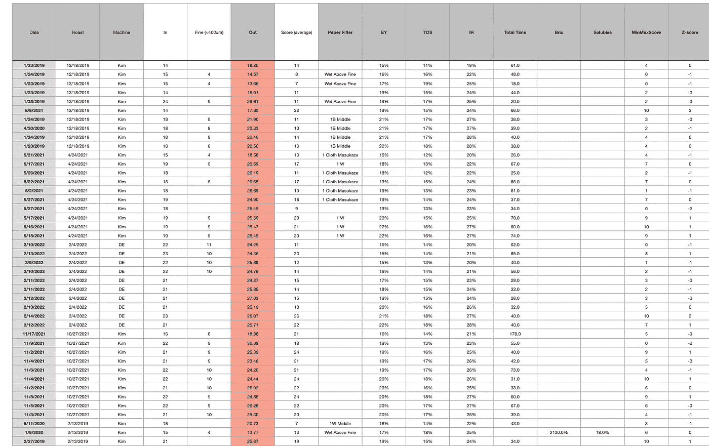****

****所有图片由作者提供****

****我把所有的数据都整理成一张简化的表格。目的是为了简单，所以我没有保留所有的行。我从 3000 多张照片开始。****

****首先，我删除了所有没有提取产量信息或没有味道评分的镜头。然后，我去除了少于 10 次的烘烤以及一些其他指标(见下表)，剩下 51 次烘烤中的 934 次。****

****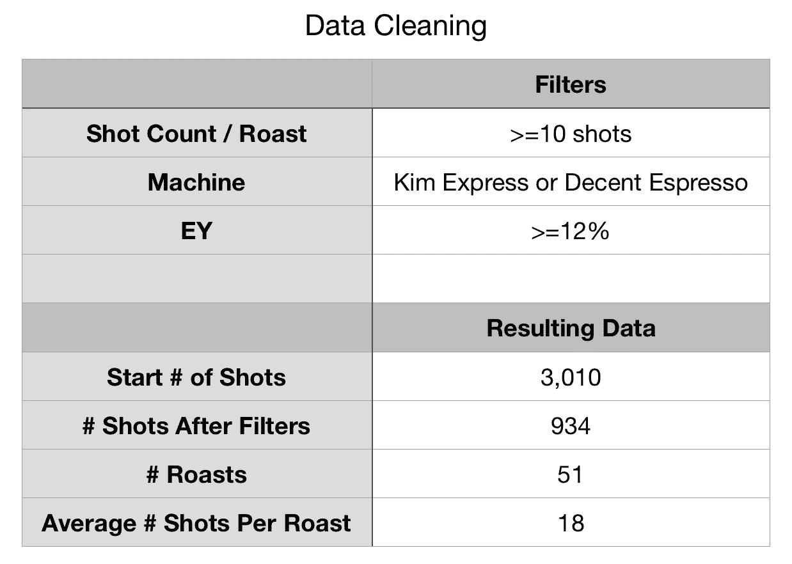****

# ****数据分析****

****我们可以绘制原始数据，非标准化，有一个总的趋势是随着 EY 增加味觉评分。****

****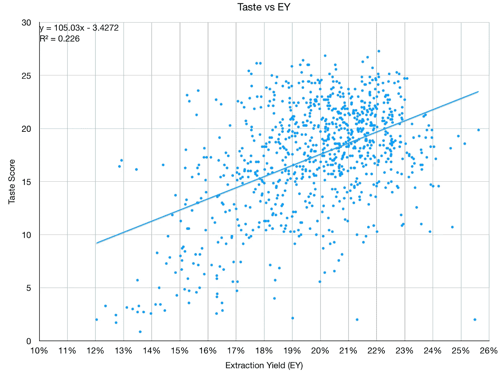****

****对于每一次烘焙，我都使用 Z 归一化法对 EY 和味道进行归一化处理:****

****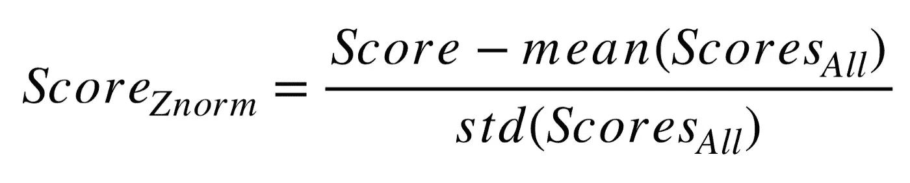****

****然后，我使用所有分数的平均值和标准差将这些数字转换回它们的常规域。****

****在高层次上，我做了一个关联。对于大多数指标来说，它们似乎与味道的相关性在 50%左右。100%表示它们是相同的，0%表示它们不相关，而-100%表示反向相关。****

****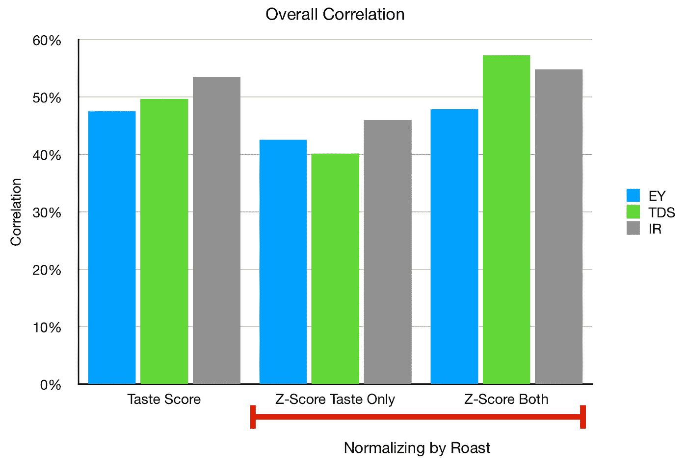****

****我们可以将所有的标准化值绘制成每次烘烤的散点图和柱状图。****

****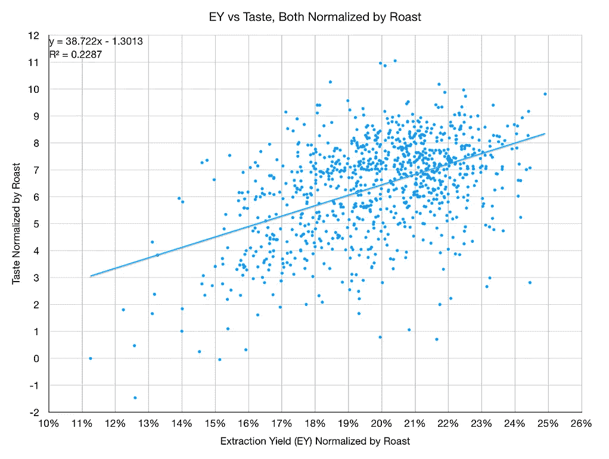********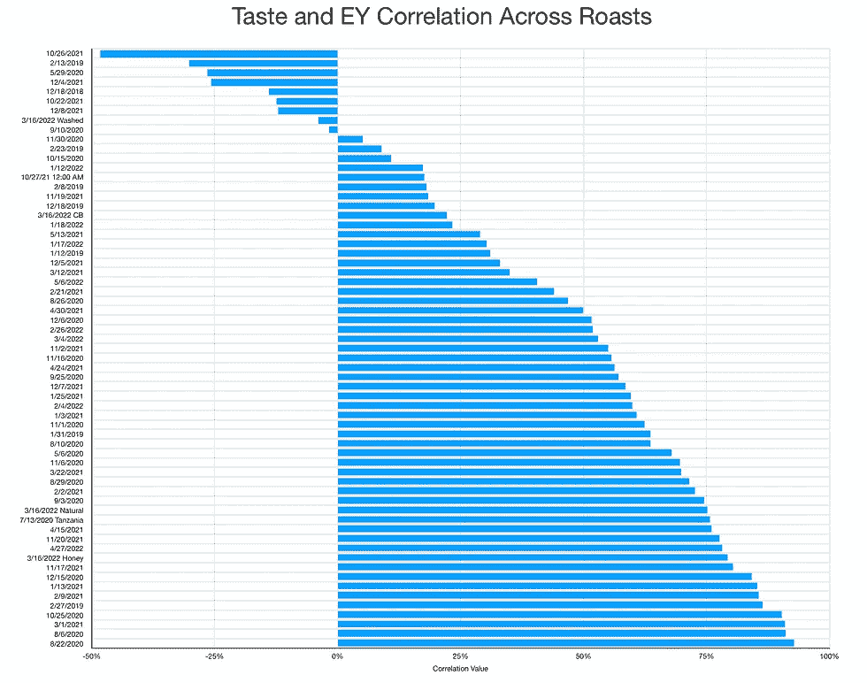****

****TDS 似乎与最佳拟合的较小 R 值更相关。****

****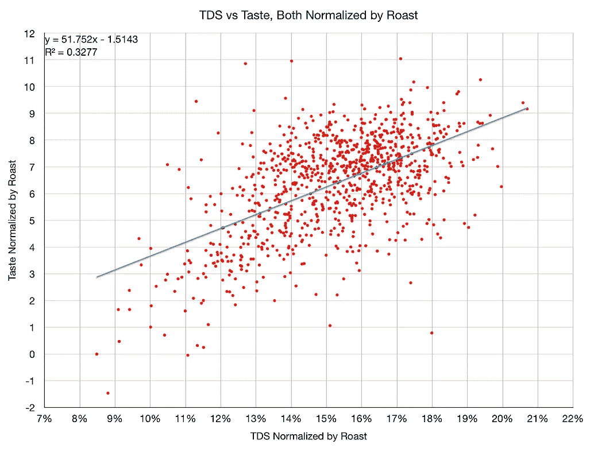********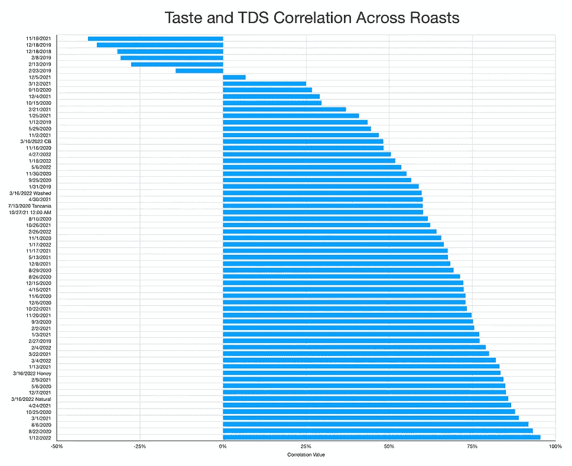****

****我特别喜欢强度半径(IR ),因为它结合了 TDS 和 EY，可以标准化输出产量。****

****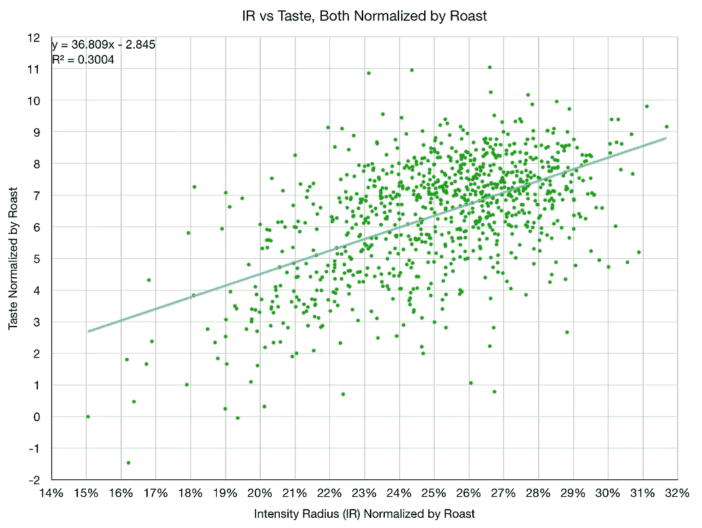********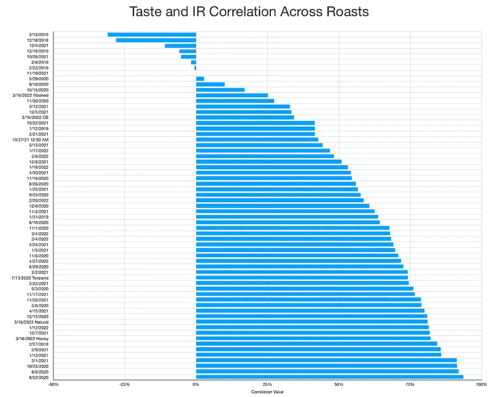****

****大多数烘焙的相关性高于 50%。我们还可以绘制出 TDS 相关性和 EY 相关性与味觉的关系。一些烘焙真的很低，甚至是负的。****

****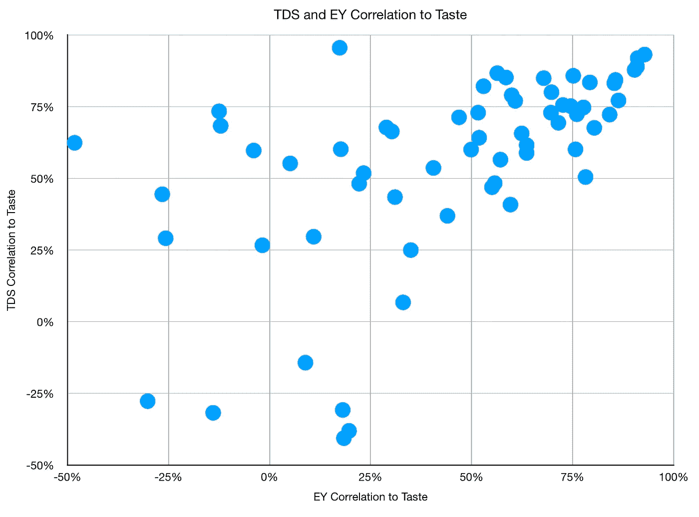****

# ****故障分析****

****其中六种烘焙食物与味道呈负相关，当我单独观察每一种时，它们似乎与趋势相反。除了一些看起来很好的解释，我在这些数据中看不到任何东西。****

****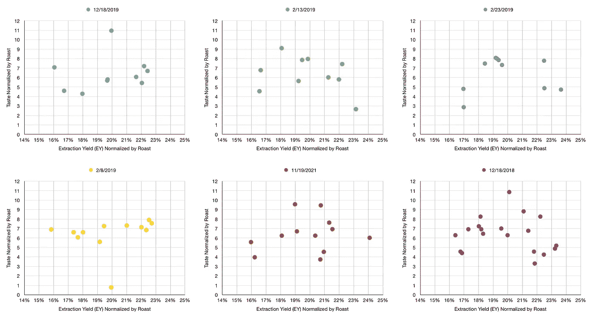****

****这六次烘焙中有五次发生在疫情之前，所以有可能与当时的咖啡烘焙或某种浓缩咖啡工艺有关。我没有删除它们，因为我认为它们是故事中有趣的一部分。不是所有的烘焙在萃取率和味道之间都有很好的相关性，但是大部分都有。****

****对于 2019 年的烘烤，我一直在做大量的滤纸实验，所以变量有点混淆。****

****总的来说，我发现了我的口味和提取率之间的相关性。一些烘焙的相关性比其他的更高。每个人的经历都是不一样的，但公开的关于这个话题的数据大多是跨越几个镜头的小样本，而不是更大的探索。这就是为什么更大规模的数据是重要的。****

****与此同时，EY 在味道方面波动很大，因为味道可能会很嘈杂，尤其是在多次烘焙、年份和技术上。噪音中肯定有可分离的信号，我希望其他人能收集类似的数据，以帮助更广泛地将提取率作为咖啡领域的有用工具。****

****如果你愿意，可以在推特、 [YouTube](https://m.youtube.com/channel/UClgcmAtBMTmVVGANjtntXTw?source=post_page---------------------------) 和 [Instagram](https://www.instagram.com/espressofun/) 上关注我，我会在那里发布不同机器上的浓缩咖啡照片和浓缩咖啡相关的视频。你也可以在 [LinkedIn](https://www.linkedin.com/in/dr-robert-mckeon-aloe-01581595) 上找到我。也可以关注我在[中](https://towardsdatascience.com/@rmckeon/follow)和[订阅](https://rmckeon.medium.com/subscribe)。****

# ****[我的进一步阅读](https://rmckeon.medium.com/story-collection-splash-page-e15025710347):****

****[我未来的书](https://www.kickstarter.com/projects/espressofun/engineering-better-espresso-data-driven-coffee)****

****[我的链接](https://rmckeon.medium.com/my-links-5de9eb69c26b?source=your_stories_page----------------------------------------)****

****[浓缩咖啡系列文章](https://rmckeon.medium.com/a-collection-of-espresso-articles-de8a3abf9917?postPublishedType=repub)****

****工作和学校故事集****