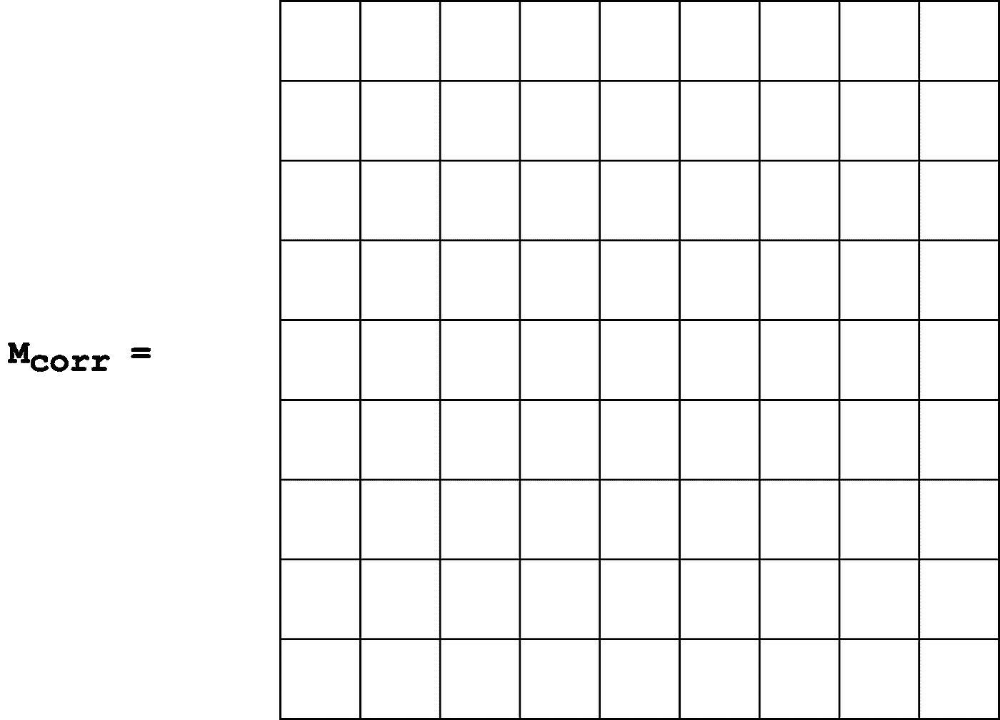
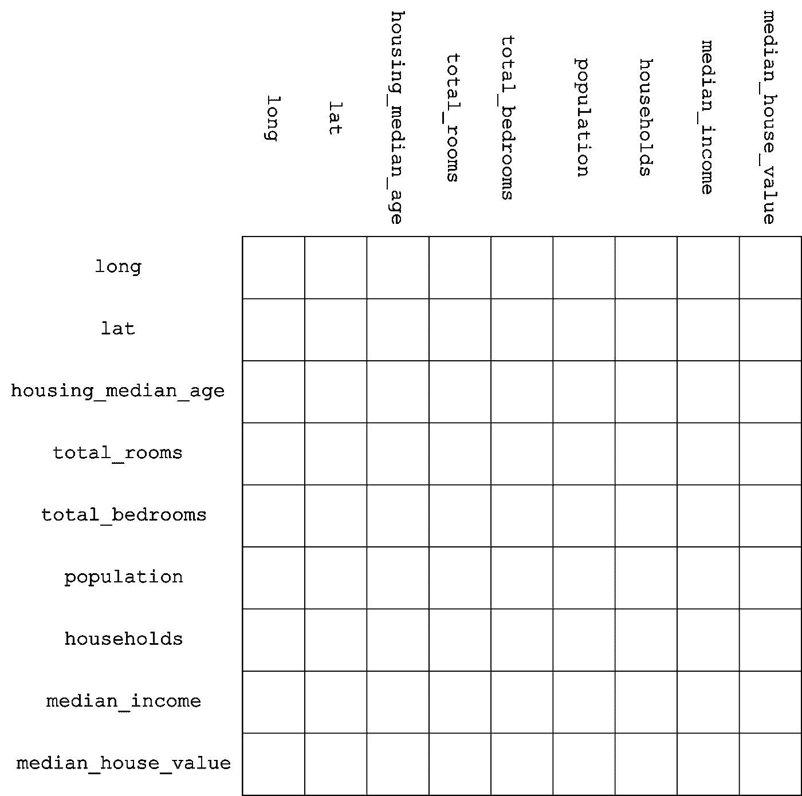
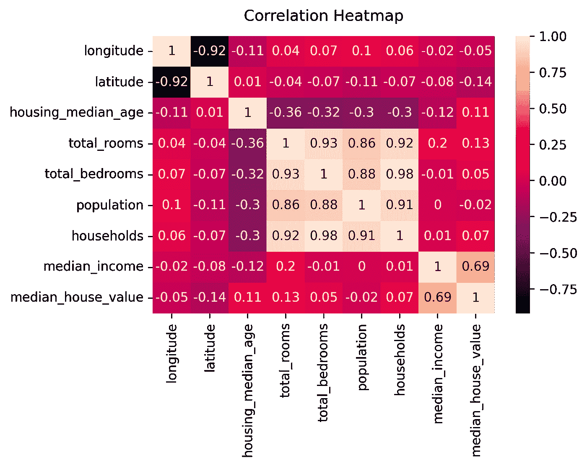
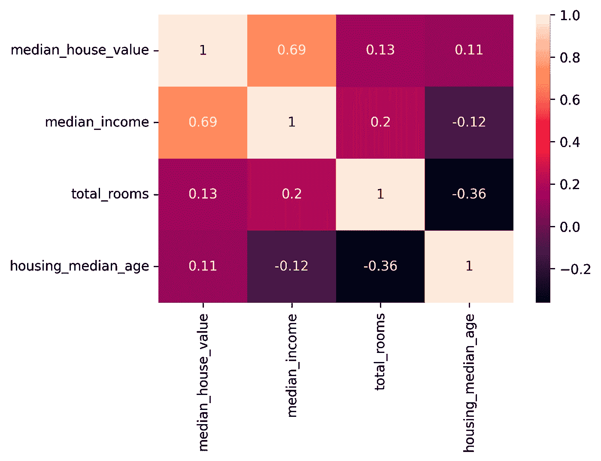
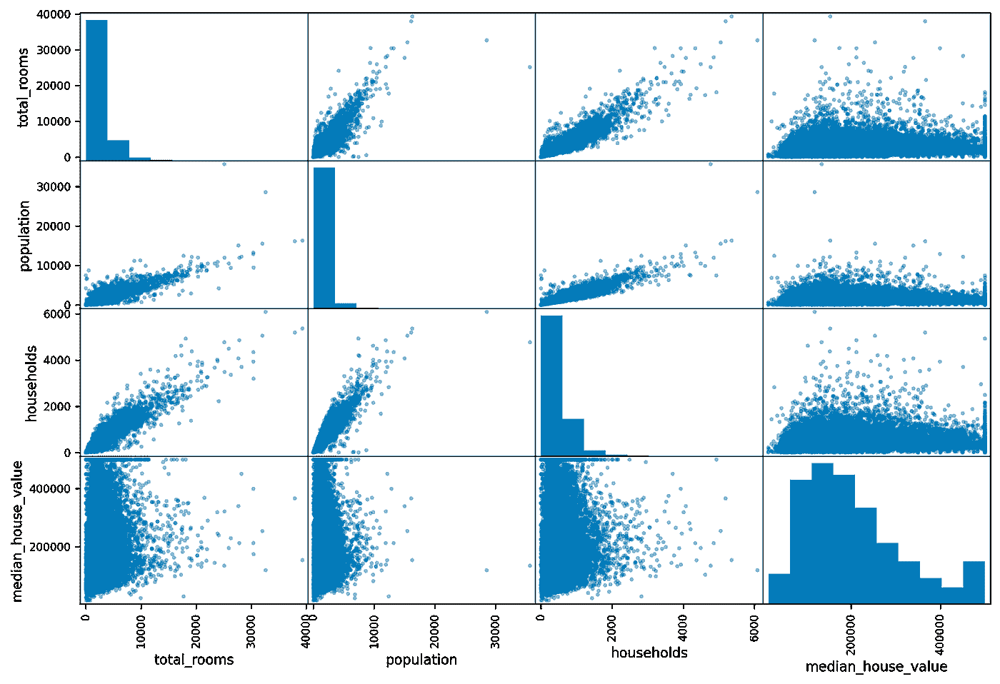
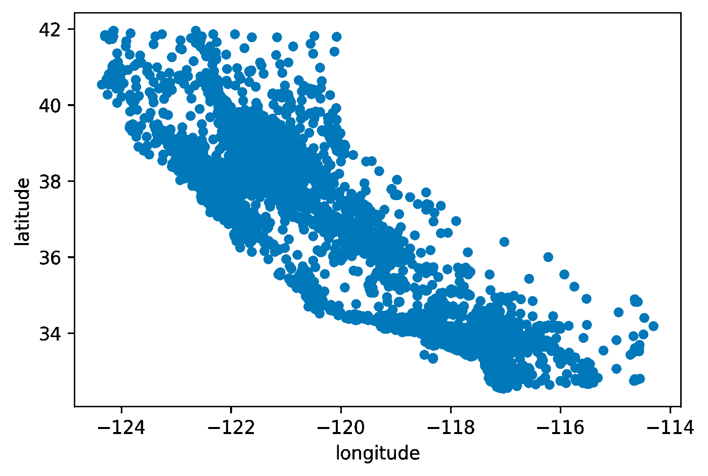

# 相关矩阵，非神秘化

> 原文：<https://towardsdatascience.com/correlation-matrix-demystified-3ae3405c86c1>

## 关联矩阵:什么是关联矩阵，它是如何构建的，它有什么用途


这看起来像散点图，不是吗？稍后将详细介绍。照片由[rovenimages.com](https://www.pexels.com/photo/yellow-bokeh-photo-949587/):

在这个关于统计指数的迷你系列(最初是根据我在 [Datamasters.it](https://datamasters.it/) 当老师的经验设计的)的上一篇文章中，我们已经研究了[方差、标准差、协方差](https://medium.com/@mastrandreagiuseppe/come-non-avere-paura-di-deviazione-standard-varianza-e-covarianza-12425a9dca09) e [相关性](https://medium.com/@mastrandreagiuseppe/correlazione-vs-covarianza-%C3%A8-tutto-pi%C3%B9-semplice-di-quel-che-sembra-be16d74d080d)。在本文中，我们将重点关注上一篇文章中概述的一种数据结构，当我开始学习机器学习时，我简直惊呆了，不是因为这是一个难以理解的概念，而是因为它让我清楚地了解了数据科学和机器学习的力量。

# 我们在哪里停下来的？相互关系

我说的数据结构就是强大的**相关矩阵。**像许多其他数据科学概念一样，它是一个易于理解甚至更易于使用的代数概念。让我们快速回顾一下相关性:它是一个指数，显示两个随机变量 X 和 y 之间的线性关系。它总是一个介于-1 和 1 之间的数字，其中:

*   -1 意味着这两个变量具有逆线性关系:当 X 增加时，Y 减少
*   0 表示 X 和 Y 之间没有线性相关性
*   1 表示这两个变量具有线性关系:当 X 增加时，Y 也增加。

当心！相关性并不意味着因果关系。当 X 和 Y 之间的相关性接近 1 时，我们不能说 X 的变化意味着 Y 的后续变化。例如，考虑两个变量:“一年内每天售出的冰淇淋数量”和“一年内晒伤的数量”。这两个变量可能有很高的相关性，但是两个变量**中一个的变化不会反映另一个**。高相关性，低因果性。现在:回到相关矩阵。

# 相关矩阵

相关矩阵是一个**平方**(行数等于列数)**对称**(矩阵等于其转置)，所有主对角元素等于 1 且**半正定**(其所有特征值均非负)的矩阵。虽然前 3 个属性很容易理解和可视化，但在最后一个条件上花一些时间是值得的，因为*不是所有主对角线等于 1 的正方形对称矩阵都是半正定的*，因此不是所有满足前 3 个必要条件的矩阵都是相关矩阵。例如，下面的矩阵:

```
m = [
    [1, 0.6, 0.9],
    [0.6, 1, 0.9],
    [0.9, 0.9, 1]
]
```

有一个负特征值。你可以用纸和笔找到它，但是当我们可以让其他人做算术的时候，为什么还要麻烦呢？我们可以用 Python 和 numpy 得到 m 的所有特征值:

```
m = [
    [1, 0.6, 0.9],
    [0.6, 1, 0.9],
    [0.9, 0.9, 1]
]eigenvalues = np.linalg.eig(m)
print(eigenvalues[0])Out: [ 2.60766968  0.4        -0.00766968]
```

[np.linalg.eig](https://numpy.org/doc/stable/reference/generated/numpy.linalg.eig.html) 函数将一个矩阵作为输入(在所有编程语言中，它可以表示为一个列表列表、一个数组数组或一个矢量向量),并返回一个包含两个元素的元组:

*   第一个是矩阵的**特征值**列表
*   第二个是包含矩阵的**归一化特征向量**的列表

特征值是返回的元组中索引为`[0]`的元素。有一些技术可以使一个非半正定矩阵成为半正定矩阵，但是我们不会在这里讨论这个话题。如果你想进一步研究这个话题，你可以查看这个网址。

# 构建相关矩阵

现在让我们试着去理解**一个相关矩阵是如何产生的**，假设它已经有了之前写的所有属性。

让我们从一个数据集开始，也称为“随机变量集”，或者如果你喜欢一组代表单个**观察值**的行和列，其中每行有一定数量的列或**特征**。

当我开始阅读[这本书](https://www.oreilly.com/library/view/hands-on-machine-learning/9781492032632/)来研究 ML 时，第一个完整的预测模型例子(一个简单的线性回归，第二章)在一个由加州地区房屋数据组成的数据集上训练自己。你可以从[这里](https://www.kaggle.com/datasets/camnugent/california-housing-prices)下载。当我第一次读到什么是线性回归，当我学习探索性分析部分(相关性和相关性矩阵出现的地方)时，我的感知之门很快就打开了，正如有人所说。是的，没有麦斯卡林。我们，计算机科学家，很少需要去旅行。顺便说一下:数据集的每一行代表不同的加州区；另外，每一行都有以下特性(*特性*是一个很酷的名字，可以称之为“随机变量”，或者更好:*变量你可以在*上计算一些统计指数):

*   经度
*   纬度
*   房屋年龄中位数
*   房间总数
*   卧室总数
*   人口数量
*   家庭
*   中等收入
*   房价中位数
*   海洋接近度

这本书对于任何想学习机器学习的人来说都是真正的*必读*，尽管它不适合完全初学者，如果你有基本的数据科学背景就更好了。所有的代码都可以在这里[找到](https://github.com/ageron/handson-ml2)，把它收藏起来。

我们可以说我们的数据集有一个`n x 10`维度，其中`n`是行数，即加利福尼亚地区的数量。

让我们为这个数据集构建相关矩阵。我们要计算相关性的变量是数据集的 10 个特征。哦，好吧，在这个数据集中，有一个特征的相关性是没有意义的:我们正在谈论的是`ocean_proximity`特征，一个**分类**变量。“分类”意味着变量的定义域是一组**离散的**值，而不是一组连续的数字。特别是，对于这些特性**，唯一允许的值是**:

```
{“1H OCEAN”, “INLAND”, “NEAR OCEAN”, “NEAR BAY”, “ISLAND” }
```

所以用这个变量计算相关性(计算两个连续随机变量之间线性关系的指标)是没有意义的。我们可以把它从相关矩阵中排除。让我们从头开始:我们的数据集由 10 个特征组成，但我们忽略了其中的一个，因此我们的相关矩阵最初将是一个空的 9x9 矩阵:



一个空的 9x9 矩阵。图片由作者提供。

现在让我们用实际的相关性填充矩阵。让我提醒您，矩阵的每个元素都有一个行索引和一个列索引，用于描述它在矩阵中的位置。我们从 0 开始对行和列进行计数:这意味着(例如)最左边的最低值的位置是`8, 0`(第 8 行，第 0 列)。第四行最右边的元素的位置是`3, 8`(第 3 行，第 8 列)。矩阵的对称性告诉我们一件更有趣的事情:位置为`i, j`的元素等于位置为`j, i`的元素(位置为`3, 8`的元素等于位置为`8, 3`的元素):为了满足这一性质，我们必须构建矩阵，使得位于某一位置的变量也位于同一列。例如，让我们从`longitude`特性开始，假设我们想在第 0 行使用它。对称条件要求我们必须对第 0 列使用`longitude`特性。然后我们对`latitude`做同样的操作:第 1 行，第 1 列。`housing_median_age`？第 3 行，第 3 列，依此类推，直到我们使用了所有的数据集特征并得到这个空矩阵:



相关矩阵的标签。图片由作者提供。

我们试着*读一下*这个矩阵:位置为`0, 5`(第 0 行，第 5 列)的元素表示经度与人口的**相关性；对于对称属性，它等于位置为`5, 0`的元素，表示人口和经度**之间的**相关性。两个变量 X 和 Y 之间的相关性等于 Y 和 X 之间的相关性。对于位置为`6, 7`的元素，包含“家庭”和“中位数 _ 收入”之间的相关性的元素以及等于索引为`7, 6`的元素，`median_income`和`households`之间的相关性也是如此。**

现在考虑矩阵主对角线上的一个元素，例如，位置为`4, 4`的元素:它将表示“总卧室数”*与其自身*的相关性。根据定义，变量与其自身的相关性是**总是 1** 。当然，所有的主对角线元素都有这个性质:一个相关矩阵的所有主对角线元素都等于 1。

# Python、pandas 和 seaborn 中的相关矩阵

现在:要用实际值填充相关矩阵，我们应该计算每对变量的相关性。**无聊**。*这个证明留给读者做练习*。我们可以用“熊猫”来代替:

```
import pandas as pdhousing = pd.read_csv('datasets/housing.csv')rounded_corr_matrix = housing.corr().round(2)print(rounded_corr_matrix[‘median_income’])
```

在命名的(它是`as pd`部分)导入指令之后，让我们使用 pandas 方法`read_csv`读取我们之前下载的 CSV 文件，该方法将文件的路径作为输入，让我们将读取结果存储在一个名为`housing`的变量中。`read_csv`返回的数据类型是一个`DataFrame`，pandas 中定义的最重要的数据类型，代表一组数据(有人说“数据集”了吗？).我们可以在一个数据帧上使用许多方法和函数，其中有`corr()`方法；顾名思义，我们可以用它从一个数据集中得到一个相关矩阵！我们使用方法`round(2)`将相关值四舍五入到第二个小数位，只是因为我们想使用可读性更好的*矩阵。在下一条指令中，我们以熊猫`Series`的形式打印`median_income`和所有其他特征之间的相关值。它是一种类似于常规数组的数据结构(例如，我们可以使用数字索引来访问它的值)，但是具有超能力。另外，我们可以访问一个指定第二个*索引的特定值。例如:

```
rounded_corr_matrix['median_income']['housing_median_age']
```

将保持`median_income`和`housing_median_age`之间的相关性。得心应手，对吧？我们还可以使用以下指令打印按降序排列的`median_income`特征的所有相关值

```
rounded_corr_matrix["median_income"].sort_values(ascending=False)
```

输出将是:

```
median_income         1.00
median_house_value    0.69
total_rooms           0.20
households            0.01
population            0.00
total_bedrooms       -0.01
longitude            -0.02
latitude             -0.08
housing_median_age   -0.12
Name: median_income, dtype: float64
```

因此，要获得*整个*数据集的相关矩阵，需要使用`corr()`方法。如果我们想*改进*可视化相关矩阵的方式，我们可以使用 seaborn 的`heatmap`函数。

```
import seaborn as snsheatmap = sns.heatmap(rounded_corr_matrix, annot=True)
heatmap.set_title('Correlation Heatmap', fontdict={'fontsize':12}, pad=12)
```

热图是一种数据可视化工具，可以将特定现象映射到色标上。在我们的例子中，较深的颜色用于映射较低的值(黑色映射相关值-1)，而较高的值映射到较浅的颜色(白色映射相关值+1)。Seaborn 有一个`heatmap`方法，它将我们将要创建热图的二维数据结构作为第一个参数:在我们的例子中是相关矩阵。我们向名为`annot`的`heatmap`函数传递另一个参数:在热图单元格中写入实际的相关值很有用，可以更精确地了解正在发生的事情。

​​



加州住房数据集的 Seaborn 热图。图片由作者提供。

正如我们所见，热图的有用性依赖于对可视化数据解释的即时性。例如，快速浏览后，很明显“总卧室数”和`total_rooms` (0.93，*非常接近于 1)，`total_roomns`和`population`，`total_bedrooms`和`households`之间有很高的相关性。很有道理，不是吗？相比之下，我们将为`latitude`和`longitude`设置一个较低的相关值(稍等片刻，试着想象一下加利福尼亚州的*形状*)。对于 0 附近的值(例如`median_income`和`population`)，我们不能说什么。*

多亏了 pandas，我们可以获取数据集特征的子集并打印相关的相关矩阵。为了获取我们的相关矩阵特征的子集，我们所要做的就是创建一个带有*特征* *名称*的列表，并在原始矩阵上使用括号符号:

```
features = ["median_house_value", "median_income", "total_rooms",
                  "housing_median_age"]subset = rounded_corr_matrix[features].loc[features]
heatmap = sns.heatmap(subset, annot=True)
```

我们注意到，如果我们试图简单地访问`rounded_corr_matrix[features]`，我们将得到一个 9x4 的矩阵，其中包含 4 个所选特征与*所有其他数据集特征的关联。我们使用`loc` pandas 属性，这允许我们使用它们的名称而不是数字索引来访问 9x4 数据结构的特性子集。这些名字当然是`features`的名字。我们得到一个 4x4 的结构，可以在上面使用我们的热图。结果如下:*



数据集子集的热图。图片由作者提供。

# 散点图—基础

最后，我们使用 pandas 函数`scatter_matrix`，它为我们提供了更加*直观的*相关矩阵可视化。顾名思义，该矩阵不是由数字构成的，而是由散点图(2D 图，其中每个轴都是一个数据集要素)构成的。

将特征对之间的线性关系可视化是很有用的(与经典相关矩阵的目的相同，但从*视觉*的角度来看)。

```
from pandas.plotting import scatter_matrixfeatures = ["total_rooms", "population", "households", "median_house_value"]
scatter_matrix(housing[features], figsize=(12, 8))
```

输出是:



加州住房数据集子集的散布矩阵。图片由作者提供。

注意一件奇怪的事情:我们在主对角线上有直方图。理论上，我们应该在这些位置找到变量和*本身*之间的相关性，但是如果我们画出它们，我们只会得到方程 y=x 的直线(我们在 x 轴和 y 轴上有相同的值，一条直线)。“scatter_matrix”向我们展示了这些变量的**直方图**，而不是可视化的 45 度线，只是为了快速了解特征的分布。查看其他图，对于某些变量对(es。人口/总房间数，或家庭/人口)有明显的正相关，在某些情况下*非常接近*1。相比之下，所有变量都呈现出一个与' median_house_value '(最有趣的特征，我们应该设计一个机器学习预测模型)接近 0 的相关值，而且这些图非常“稀疏”。

# 相关矩阵的使用

既然我们知道了如何构建关联矩阵，并且在探索了 Python 中其他形式的数据可视化技术之后，我们可以问自己这种数据结构的实际用途是什么。通常，在机器学习中使用相关矩阵来进行一些探索性和初步的分析，以推测*哪种*预测模型可以有效地解决给定的任务。例如，如果我们的模型是一个能够预测房价的回归模型(即我们的模型应该预测一个*连续值*),我们可以对最感兴趣的特征使用相关矩阵。在这种情况下，最相关的特征(毫无疑问)将是`median_house_value`，因此传统的方法是绘制该特征和具有更高相关性的特征之间的相关性的热图或散点图:

```
features = ["median_house_value", "total_rooms", "median_income"]scatter_matrix(housing[features], figsize=(12, 8))
```

我们会发现`median_income`和`median_house_value`之间有非常明显的相关性(收入中值越高，房屋价值中值越高……一如既往，这是有道理的)。然后我们可以尝试建立、训练和优化一个简单的线性回归模型。我们不会得到一个非常精确的模型，但这仍然是一个起点，不是吗？

# 奖励赛道—加州，我们来了！

在文章的前面，我们问了`latitude`和`longitude`之间非常低的相关值意味着什么。为了科学起见，让我们画一个这两个变量的散点图:



加州，我们来了！作者图片

嘿，它看起来不像真正的加州的**吗？是的，当然！纬度和经度之间的低相关值是由于**地理加州形状**类似于具有负角度系数的直线。这不是很有趣吗？**

下面是生成熊猫散点图的代码:

```
housing[['longitude', 'latitude']].plot.scatter(x="longitude", y="latitude")
```

快乐学习和编码！