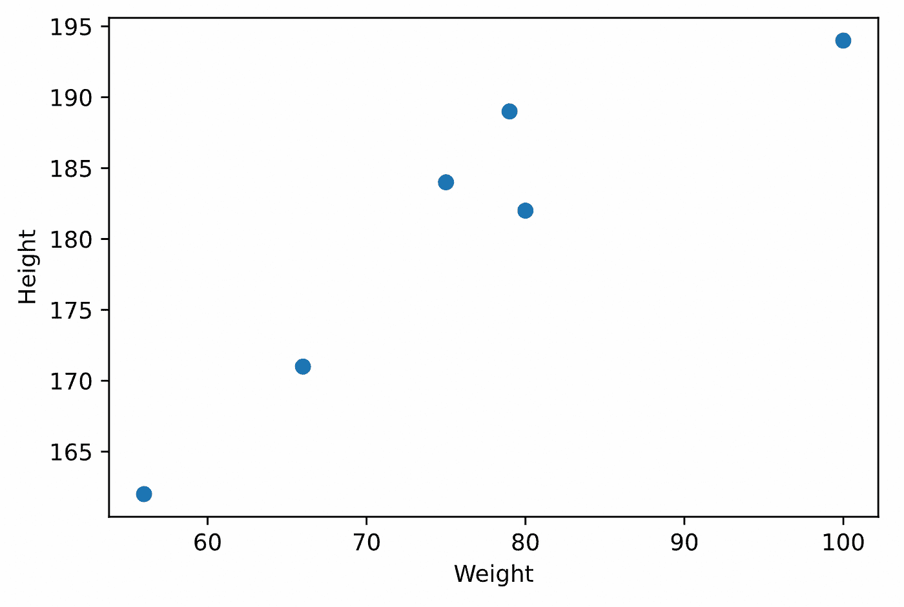
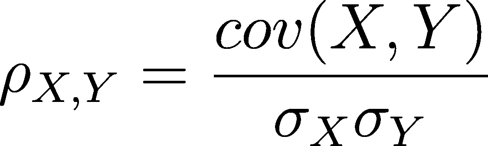
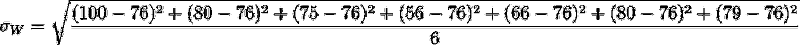
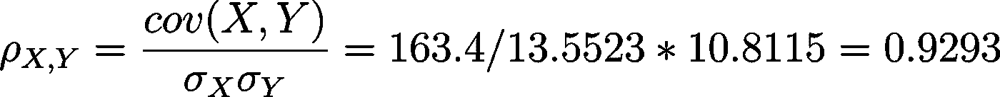
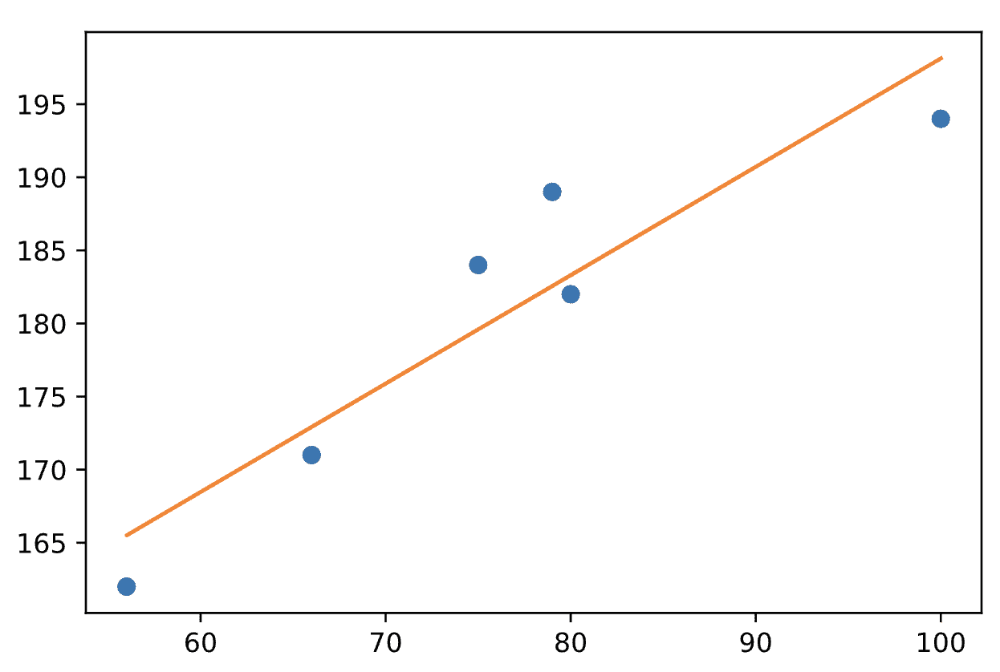
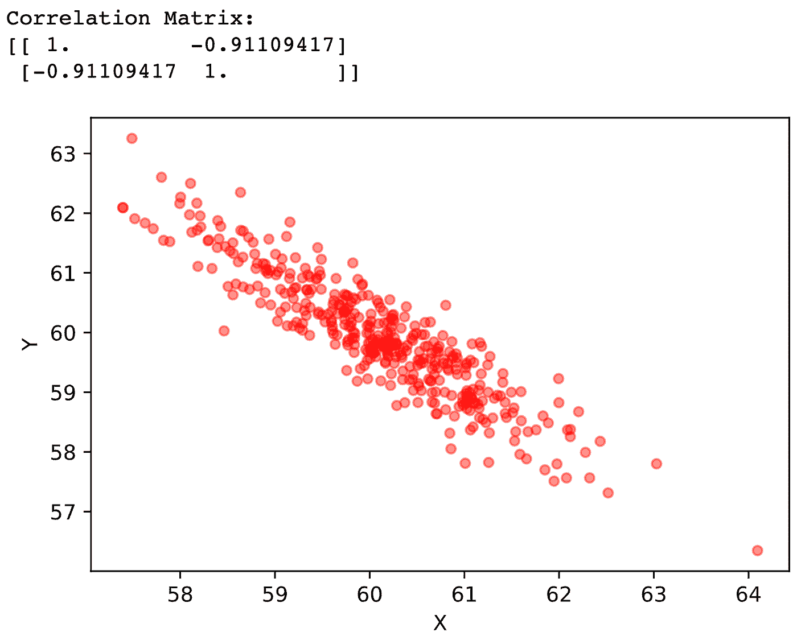
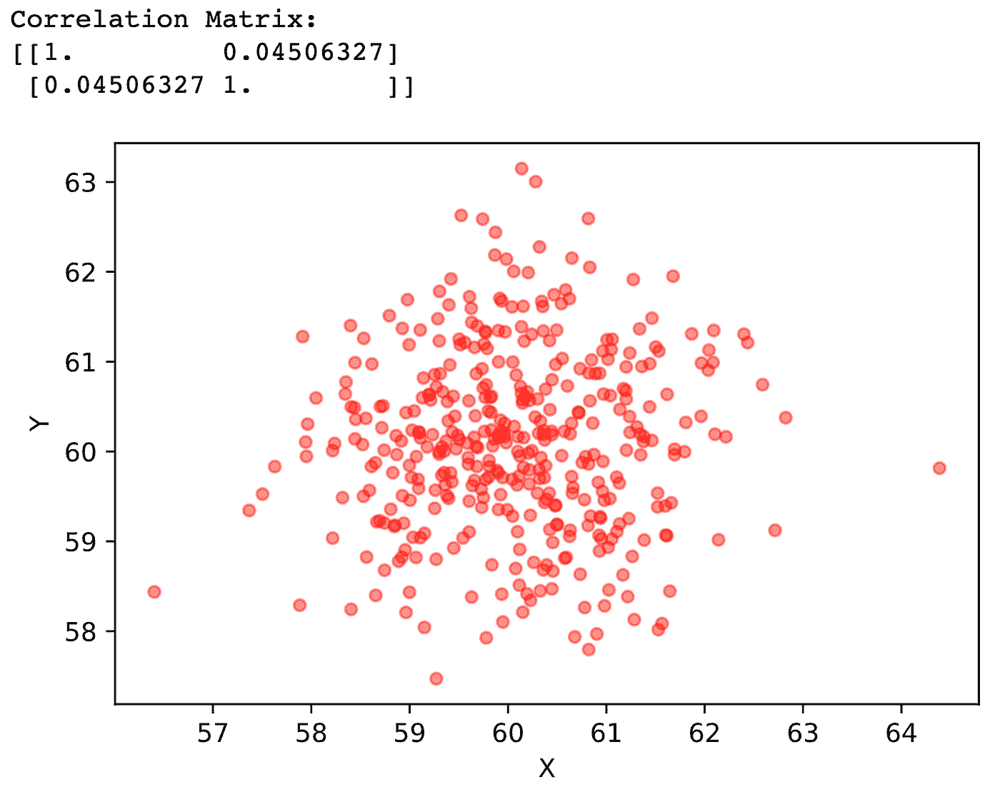
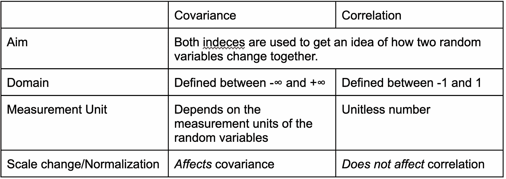

# 相关性 vs 协方差:这比看起来简单得多

> 原文：<https://towardsdatascience.com/correlation-vs-covariance-its-much-simpler-than-it-seems-2e9a5d33945b>

## 什么是相关性？我们如何计算连续变量之间的相关性？和协方差有什么区别？


显然，两个人都明白什么是相关性。吉尔·威灵顿摄:[https://www . pexels . com/it-it/foto/due-persone-in-piedi-nella-fotografia-di-sa Goma-40815/](https://www.pexels.com/it-it/foto/due-persone-in-piedi-nella-fotografia-di-sagoma-40815/)

机器学习是一个奇妙的研究领域。研究机器学习意味着从最不同的领域(数学、金融、生物学、计算机科学等)获取最有趣的概念，目的是产生准确可靠的预测模型。在我在 [Datamasters](https://datamasters.it/) 担任机器学习和数据科学教师的经历中，学生们不止一次对与数据科学世界相关的基本概念和索引感到困惑。在我的第一篇文章中(这里有意大利语的)，我写了一些指数:方差、标准差和协方差。

在这篇文章中，我们将研究另一个听起来令人困惑的指数，但是让我告诉你:它绝对不是火箭科学。我们说的是**相关**系数。相关性看起来很像协方差，它的使用非常精确:为我们提供关于两个随机变量之间存在**关系**的信息(如果是的话，还有存在的*种类*)。不同寻常的是，在“相关性”这个术语下，可以找到许多彼此非常不同的公式和系数。一个系数对另一个系数的使用是基于我们想要计算相关性的变量的类型。

似乎是件大事，嗯？嗯，也许吧。事实是，在某些情况下，事实证明这根本不是限制性的，比你所能想象的要简单得多。让我们从两个随机变量开始，旧好的 6 个人的“体重”和“身高”:

让我们想象一下这些要点:



用 pyplot 制作的数据集的可视化。图片由作者提供。

在开始之前，我们先做个声明。这些变量是*数字*，即可以在一个数字集合或该集合的区间中采用任何值的变量。它们是**而不是** **分类变量**(其可能值在预定义的集合中的变量，例如“头发颜色”，该集合中可能只有值[“棕色”、“金发”、“黑色”等])。对于我们之前介绍的数值变量，计算相关系数的最常见方法是使用**皮尔逊系数**。公式是:



皮尔逊相关系数。图片由作者提供。

正如我们所看到的，皮尔逊相关只不过是一个分数，分子是协方差，分母是变量标准差的乘积。

皮尔逊系数用于检测两个随机连续变量之间的线性关系。如果您想测量两个随机变量之间的非线性关系，您只需使用其他系数(如 Spearman 系数)。计算两个随机变量样本之间相关性的公式[稍微复杂一些](https://en.wikipedia.org/wiki/Pearson_correlation_coefficient#For_a_sample)，但基本上我们总是使用相对于变量标准偏差“标准化”的协方差测量。毕竟，为了计算两个随机变量(X，Y)之间的相关性，我们必须:

*   计算变量平均值
*   计算变量 std。偏差
    -计算每个样本与变量平均值之差的平方
    -对所有这些平方求和
    -除以样本数
    -求这个分数的平方根
*   计算 X 和 Y 之间的协方差
    -对于我们数据集中的每个条目，计算 X 分量和 X 均值之间的差，并将其乘以 Y 分量和 Y 均值之间的差
    -对这些乘积求和
    -除以样本数

说起来容易做起来难。让我们继续:

计算“体重”和“身高”的平均值:

μ_w = 76KG
μ_h = 180.33cm

计算标准。重量偏差:



我们得到这样的结果:

σ_w = 13.5523

身高标准也是一样。偏差:

σ_h = 10.8115

为了计算协方差，我们必须考虑每个点(即初始表的单行/单对:[100，194]，[80，182]，[75，184]，…)，计算每个分量与其均值之间的差，然后将它们相乘，并对所有这些乘积求和。最后，我们除以 6:


我们得到的是体重和身高之间的**协方差:**

cov(体重、身高)= 163 公斤-厘米

现在我们可以计算体重和身高之间的皮尔逊相关:



体重和身高之间的皮尔逊相关

被这些数字吓到了？

好吧，如果你喜欢 Python，你可以用 NumPy 用这几行代码得到同样的结果:

```
import numpy weight = [100, 80, 75, 56, 66, 79]
height = [194, 182, 184, 162, 171, 189]
pearson_corr = numpy.corrcoef(weight, height)[0, 1]
print(pearson_corr) # we'd get exactly 0.92932799
```

现在，休息一下，注意两件事。首先，相关性**是一个无单位数。**分子处的 kg-cm 对简化为分母处的标准偏差测量单位。仅这个特性就使得相关性*非常有趣，使用起来非常灵活。但是真正改变游戏规则的是相关性有一个明确的区间:它总是一个介于-1 和 1 之间的数字**。其含义类似于协方差:***

*   当 X 和 Y 之间的相关性在-1 和 0 之间时，X 和 Y 是**反向相关**:这意味着当 X 增加时，Y 减少
*   当 X 和 Y 之间的相关性为 0 时，X 和 Y 没有线性关系
*   当 X 和 Y 之间的相关性在 0 和 1 之间时，X 和 Y 直接相关**:当 X 增加时，Y 也增加。**

此外，相关性越接近-1，反向相关性就越“明显”。当然，相关性越接近 1，直接相关性就越明显。在我们的例子中，0.929**非常**接近 1，这表明体重和身高之间有非常**高的直接相关性**:我们基本上是说一个人越高，他/她就越重。毕竟这是有道理的。只要看一眼图表，我们就能注意到体重和身高之间的相同关系:



相当的正相关，是吧？图片由作者提供。

让我们画出变量之间相关的另外两种情况。这里有一个非常接近-1 的相关性:



相关性接近-1。图片由作者提供。

这是一个非常接近于 0 的相关性:



相关性接近于 0。图片由作者提供。

在每个图表之前，我们用 Python 打印了**相关矩阵**，它类似于协方差矩阵。这是一个描述变量之间相关性的正方形表格。在主对角线上我们找到一个变量和*本身*之间的相关性，当然我们有最大相关值:1。在其他单元格中，我们有行值和列值之间的相关性。但是在另一篇文章中有更多关于这个主题的内容。

在文章结束之前，让我们快速回顾一下协方差和相关性的类比和区别。



图片由作者提供。

我希望这篇文章对你的读者有用。不客气！