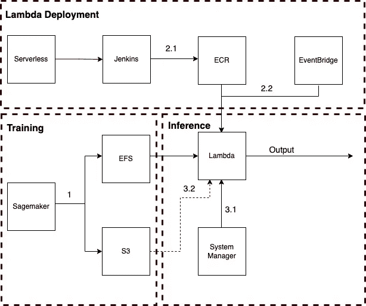
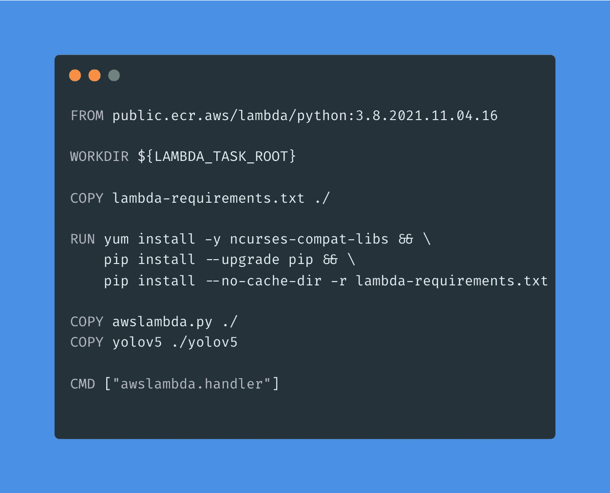
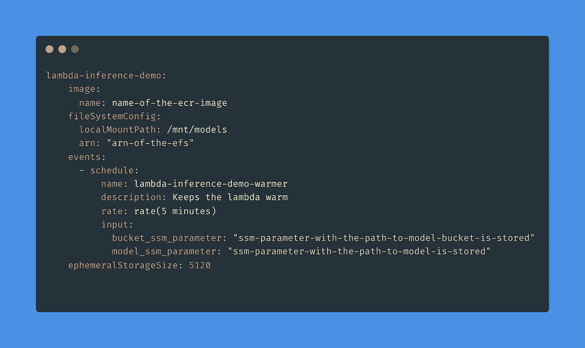
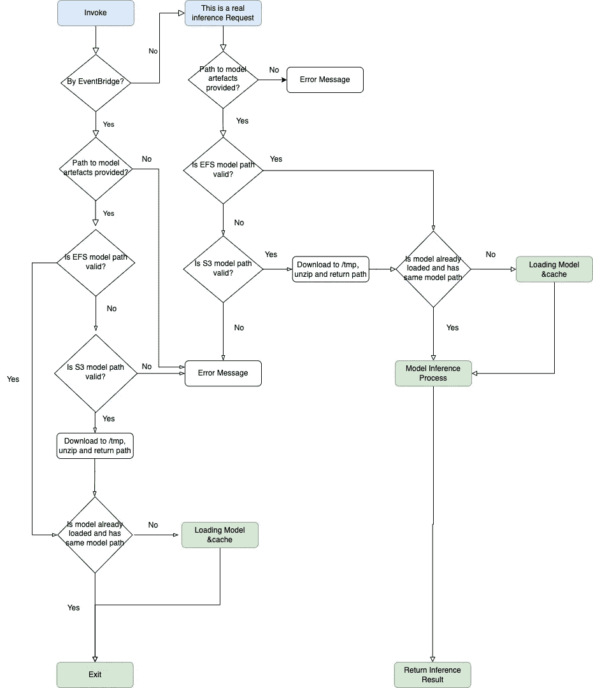
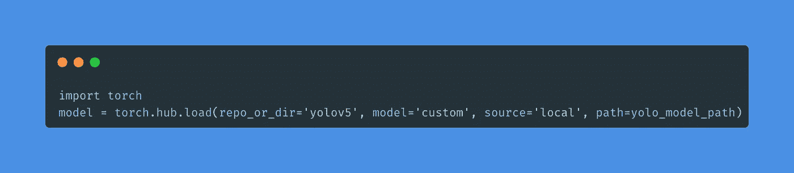

# 生产中经济高效且可扩展的 YOLOv5 模型推理

> 原文：<https://towardsdatascience.com/cost-efficient-scalabel-yolov5-model-inference-in-production-ebe814d44f75>

## 不仅仅是 AWS Lambda

克拉克·蒂布斯在 [Unsplash](https://unsplash.com?utm_source=medium&utm_medium=referral) 上拍摄的照片

推理成本可能占计算成本的很大一部分，为了解决这一问题并降低高昂的推理成本，AWS 已经为各种场景提供了几种模型推理解决方案:

*   [实时推断](https://docs.aws.amazon.com/sagemaker/latest/dg/realtime-endpoints.html)
*   [批量转换](https://docs.aws.amazon.com/sagemaker/latest/dg/batch-transform.html)
*   [异步推理](https://docs.aws.amazon.com/sagemaker/latest/dg/async-inference.html)
*   [无服务器推断](https://docs.aws.amazon.com/sagemaker/latest/dg/serverless-endpoints.html)

但是，如果您正在寻找一个更加灵活、可定制、成本更低的无服务器解决方案，该怎么办呢？最重要的是，如果您的组织正在处理多云基础架构，它可能会被“提升并转移”到其他云平台。或者担心解决方案被某个特定提供商锁定？

欢迎来到 BGL 关于如何实现 AWS Lambda 作为模型推理服务来处理生产中大量推理请求的故事。

## ***上下文***

我们的工程团队正在构建一个人工智能产品，以自动化几个业务流程。[拥抱人脸转换器](https://huggingface.co/docs/transformers/index)(用于 NLP 任务)和[约洛夫 5](https://github.com/ultralytics/yolov5) (用于对象检测任务)框架都被集成，并且已经基于商业案例和数据集训练了几个模型。推理 API 与现有的业务工作流相集成，以实现流程的自动化，因此组织可以将资源从繁琐和低价值的工作中抽离出来，并降低运营成本。

目前的系统每天处理 1000 多个推理请求，在不久的将来，数量将增长 50 倍。一旦候选模型被部署到生产环境并稳定下来，主要的成本就在模型推理上了。

## ***方案设计***

作者图片

该解决方案利用几个 AWS 服务来实现以下目的(在该解决方案的上下文中):

*   Sagemaker:培训定制模型
*   EFS:存储已训练模型的工件，作为主要的模型加载源
*   S3:存储已训练模型的工件，作为第二个模型加载源
*   ECR:托管 Lambda docker 映像
*   EventBridge:调用 Lambda 的“调度程序”
*   系统管理器:在参数存储中存储模型路径

***训练***

1.  Sagemaker 通常会将模型工件压缩并输出到 S3。此外，在这种情况下，通过添加额外的 Sagemaker 通道名称，还将一个副本保存到 EFS(在 3.2 中解释)。

***λ部署***

2.1 [无服务器框架](https://www.serverless.com/)用于管理 Lambda 配置，通过 Jenkins 和 docker 将所有必需的包和 Lambda 脚本构建到 Docker 映像中，并进一步推送到 ECR。

注意:模型人工制品并没有嵌入到这幅图像中，它们留在了 S3 和 EFS。

下面是一个用于构建 Lambda 映像的 docker 文件示例:

*   来自 AWS(public.ecr.aws/lambda/python:3.8.2021.11.04.16)的公共 lambda 基本图像
*   复制用 awslambda.py 编写的 Lambda 逻辑
*   复制 YOLOv5 项目(最初克隆自 [YOLOv5](https://github.com/ultralytics/yolov5) )作为在 Lambda 中本地加载 YOLOv5 训练模型将需要它
*   所有需要的包都在一个单独的文件中定义，这个文件叫做 lambda-requirements.txt，在同一个目录下

作者图片

2.2 每个 Lambda 都配置了一个关联的 EventBridge 规则(在无服务器 YAML 文件中)。EventBridge 每 5 分钟调用一次 Lambda，有两个重要目的:

*   保持 Lambda 温暖以避免冷启动而不触发实际的推理请求
*   在第一个预热请求中预加载期望的模型，然后缓存它(通过全局变量)，这将显著减少由后续实际推理请求的模型加载所导致的推理提前期

作者图片

上面的代码片段显示了无服务器 YAML 文件中使用的 Lambda 配置的结构。详情请参考[无服务器框架文档](https://medium.com/@grdustin/cost-efficient-yolov5-model-inference-in-production-ebe814d44f75)，要点如下:

*   ephemeralStorageSize 5120 会将 Lambda 的“/tmp”文件夹的大小配置为 5120MB(在 3.2 中解释)
*   模型桶和路径作为 EventBridge 调用的输入参数(在 3.1 中解释)

***推论***

下图解释了 Lambda 处理逻辑，背后的原理是检查调用是否被触发:

*   通过 lambda warming 请求(通过 EventBridge) ->加载模式(第一次)& cache-->不处理推理返回，**或**
*   由实际推理请求->过程推理->返回推理结果

作者图片

3.1 S3 桶和相应的模型路径保存在系统管理器参数存储中，因此这与 Lambda 部署是分离的。工程师可以通过更改参数将 Lambda 指向任何所需的模型，而无需重新部署该 Lambda。

3.2 EFS 是一个文件系统，所以直接从 EFS 挂载和加载模型要快得多(请密切关注 EFS 的带宽成本)。如果 EFS 加载失败(路径无效、带宽受限等)，Lambda 会将模型工件从 S3 下载到本地的'/tmp '目录，并从那里加载模型。确保 Lambda 有足够的存储空间用于“/tmp”(在我们的例子中，ephemeralStorageSize 参数被设置为 5120MB)是很重要的！

在 Lambda 中本地加载 YOLOv5 模型非常简单:

作者图片

*   确保您复制了 yolov5 项目目录(在 2.1 中提到)并将目录的路径设置为 repo_or_dir
*   使用模型=“自定义”和来源=“本地”
*   该路径指向有效的*。pt YOLOv5 训练模型。

## 限制

> 所有的模型都是错的，但有些是有用的——乔治·博克斯
> 
> 所有的解决方案都是错的，但有些是有用的——本文作者:)

没有完美的解决方案，所有解决方案都有权衡和限制，建议的解决方案的一些限制包括:

*   Lambda 推理不是为要求实时处理和极低延迟的实时推理而设置的
*   Lambda 有 15 分钟的运行时间限制，如果推理时间太长，就会失败
*   EFS 带宽费用是额外的费用，但是你可以切换到 S3 下载和加载作为主要方法，EFS 安装和加载作为次要方法。它速度较慢，但成本较低，并且批量推断通常对延迟不敏感

## 潜在提升和转移

该解决方案的一些功能/设计模式可能会被提升并转移到其他云平台(例如 Azure、GCP ),因为它们提供与 AWS 类似的服务，其中两个有价值的服务是:

*   使用低成本的无服务器计算机服务(Azure 函数、GCP 函数)来服务模型批量推理，并与“调度程序”集成以保持服务“温暖”
*   设计预加载和缓存模型的逻辑，以减少推理处理时间

## **总结**

感谢您的阅读，希望您喜欢这篇文章，以下是一些要点:

*   AWS Lambda、EFS 和 S3 可以组合成一个经济高效、可扩展且健壮的服务，用于模型批量推理(最多 15 分钟)
*   正确实现 AWS EventBridge Lambda 触发器有助于最小化 Lambda 冷启动
*   在 Lambda 中实现模型预加载和缓存逻辑将有助于减少模型推理的交付时间
*   将模型路径作为系统参数传递，而不是将模型嵌入到 Lambda 图像中，这样可以获得更大的灵活性(解耦)
*   在其他云平台上应用类似的概念有潜在的提升和转变机会