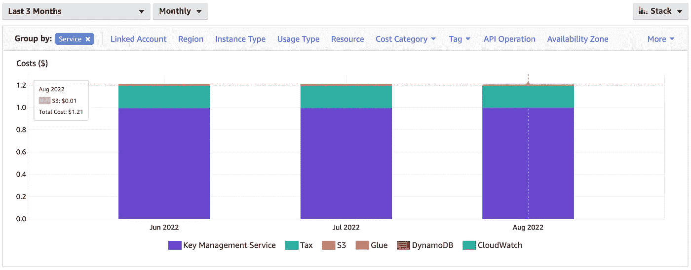
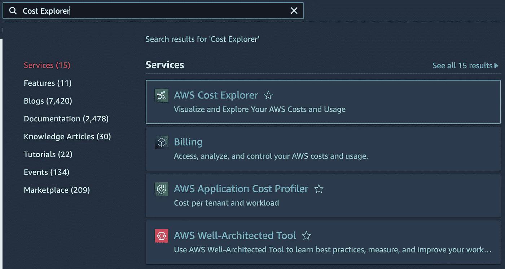
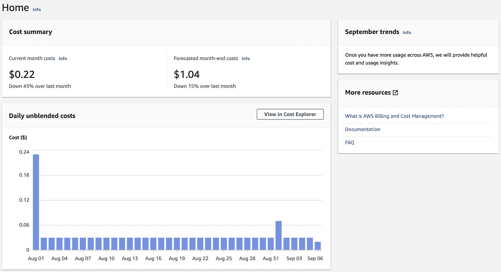
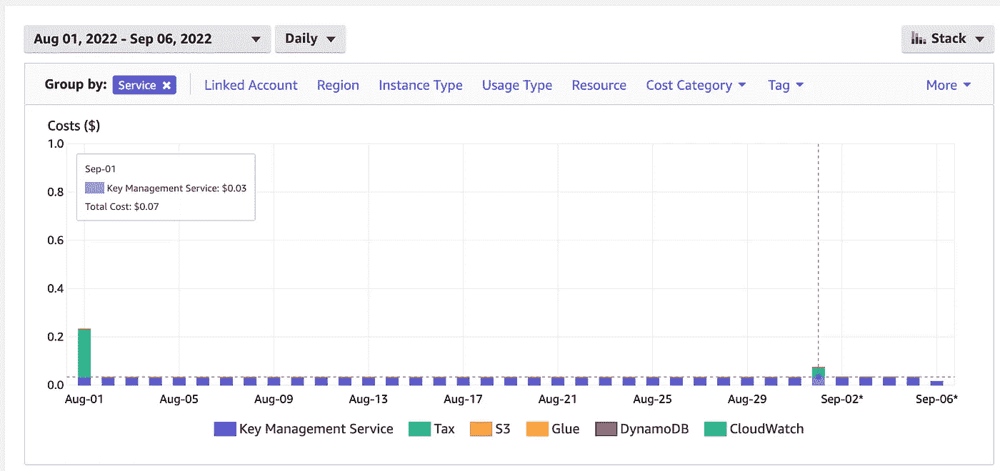
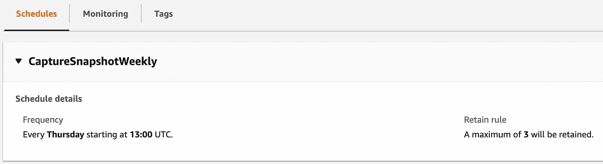
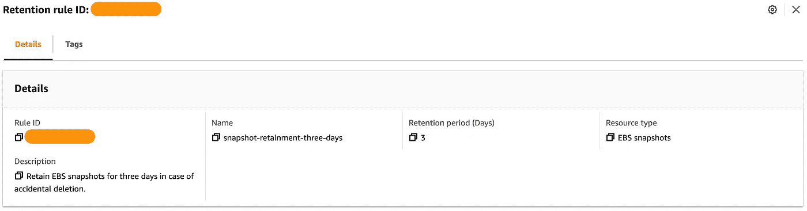
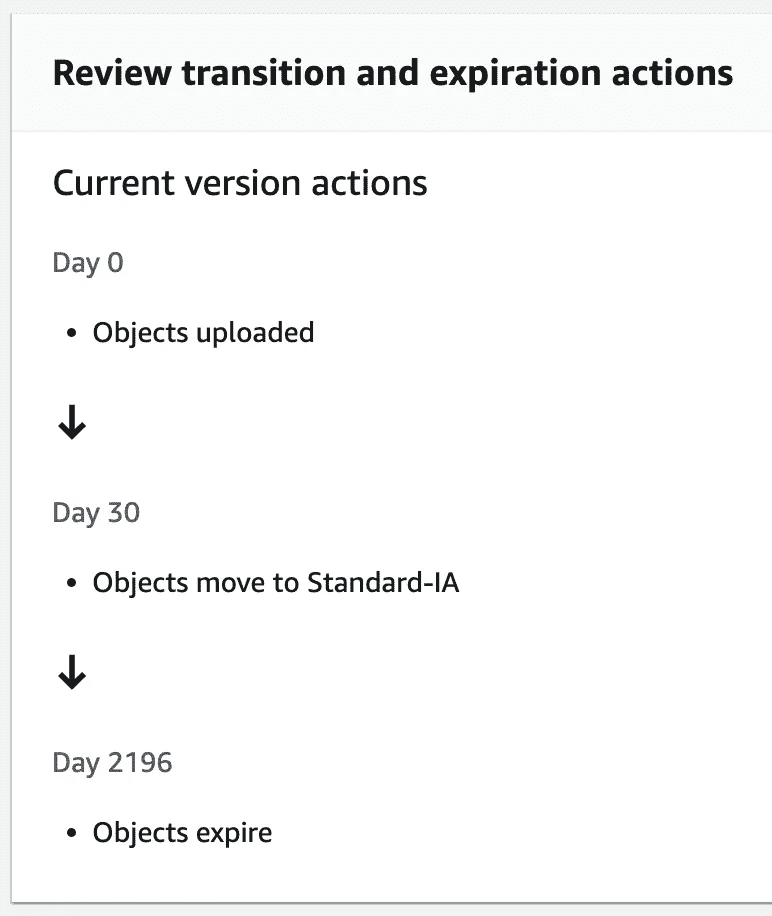

# AWS 中的成本优化策略

> 原文：<https://towardsdatascience.com/cost-optimisations-within-aws-72a9149c92e5>

## 考虑减少 EC2、Lambda 和 S3 的经常性费用

在过去的四年里，我与亚马逊网络服务公司(Amazon Web Services)进行了广泛的合作，在我的圈子里经常出现的一个话题是在云中运行应用程序和数据库的成本。无论是在[简单存储服务](https://aws.amazon.com/s3/) (S3)中存储数据的价格，保留[弹性块存储](https://aws.amazon.com/ebs/) (EBS)卷的快照的价格，还是运行[弹性云计算](https://aws.amazon.com/ec2/) (EC2)实例的价格，费用很容易累积，并在我们审查即将到来的账单时引起我们的注意。

思考最近我在 EC2、 [Lambda](https://aws.amazon.com/lambda/) 和 S3 工作中应用的成本优化，让我们探索如何分析我们的费用并利用 AWS 的功能来减少我们的账单。这绝不是一篇独特的博文 AWS 和其他贡献者提供了大量的材料——但我希望它能成为未来参考的有用补充。

来源:作者成本浏览器截图

# 成本浏览器

在 AWS 控制台中，我们可以导航到[成本浏览器](https://aws.amazon.com/aws-cost-management/aws-cost-explorer/)以了解我们现有的费用和预测的未来账单。

来源:作者的 AWS 搜索截图

这将引导我们进入成本管理主页，在这里我们可以查看到目前为止 AWS 成本的高级图表。谢天谢地，我的个人账单看起来很健康，但商业账户可能会有明显更高的数字。

来源:作者的成本管理截图

选择条形图上方的“在成本浏览器中查看”,我们将自己重定向到一个更复杂的图表，该图表具有分解费用的过滤器。按服务对成本进行分组，我们看到在我的案例中，税收对我的成本的贡献最大，其次是[关键管理服务](https://aws.amazon.com/kms/) (KMS)。

来源:作者成本浏览器截图

另一个可能证明特别有价值的分组是标签。通过应用于不同 AWS 资源的定义良好的标签键和值框架，按标签进行的计费细分对于更深入地了解 AWS 费用的来源非常有用——特别是如果资源是按部门、团队或不同的组织粒度层进行标记的话。

对我们的成本来源有了更好的理解，让我们从 EC2 开始，探索 AWS 在其几个最受欢迎的服务中提供了哪些功能来帮助我们减少账单。

# 弹性云计算(EC2)

EC2 覆盖了各种不同的资源，是一种伞式服务，用于服务器实例、[流量负载平衡器](https://aws.amazon.com/elasticloadbalancing/)和[弹性网络接口](https://docs.aws.amazon.com/AWSEC2/latest/UserGuide/using-eni.html)以及其他基础设施。实例可能需要持久存储，采用 EBS 卷的形式。此外，我们可能希望使用[机器映像](https://docs.aws.amazon.com/AWSEC2/latest/UserGuide/AMIs.html)轻松启动与现有配置匹配的副本实例，或者我们可能希望使用快照保留 [EBS 卷的备份。](https://docs.aws.amazon.com/AWSEC2/latest/UserGuide/EBSSnapshots.html)

这些不同的资源和策略的成本很容易攀升。首先从 EC2 实例开始，我们可以采用 [EC2 实例节省计划](https://aws.amazon.com/savingsplans/compute-pricing/)来降低特定实例类型和 AWS 区域的计算费用，或者探索[计算节省计划](https://aws.amazon.com/savingsplans/compute-pricing/)来降低计算成本，而不考虑类型和区域。前者在编写时节省高达 72%，而后者节省高达 66%，并扩展到 [ECS Fargate](https://aws.amazon.com/fargate/) 和 Lambda 函数。

EC2 还提供[不同的购买选项](https://docs.aws.amazon.com/AWSEC2/latest/UserGuide/instance-purchasing-options.html)以供举例。这包括[保留实例](https://docs.aws.amazon.com/AWSEC2/latest/UserGuide/ec2-reserved-instances.html)，在这种情况下，我们可能会以较低的成本承诺一年或三年的特定配置，以及[现场实例](https://docs.aws.amazon.com/AWSEC2/latest/UserGuide/using-spot-instances.html)，在这种情况下，如果我们乐意应用程序被中断，我们可能会支付明显较低的成本。

考虑了实例购买和计算计划之后，我们可以将注意力转向 EBS 支持的机器映像和卷快照。[数据生命周期管理器](https://docs.aws.amazon.com/AWSEC2/latest/UserGuide/snapshot-lifecycle.html)对于自动化这些资源的创建、保留和删除非常有用。但是，这不会管理通过其他方式创建的映像和快照，也不包括实例存储支持的映像。

来源:作者的数据生命周期管理器截图

虽然对降低成本没有帮助，但另一个值得强调的功能是 EC2 [回收站](https://docs.aws.amazon.com/AWSEC2/latest/UserGuide/recycle-bin.html)。如果我们手动删除图像和快照，或者依靠数据生命周期管理器，回收站可以作为一个安全网来避免意外删除资源—在可配置的时间内保留图像和快照，我们可以在它们被永久删除之前恢复它们。

来源:作者 EC2 回收站截图

# λ函数

在讨论了 EC2 实例之后，让我们考虑一下前面提到的 Lambda 服务。与 EC2 不同，Lambda 函数是无服务器的，因此主要考虑资源使用和配置，而不是供应成本。

首先，让我们探索一下[指令集架构](https://docs.aws.amazon.com/lambda/latest/dg/foundation-arch.html)的功能。2021 年 9 月，AWS [推出了 Arm/Graviton2 处理器](https://aws.amazon.com/blogs/aws/aws-lambda-functions-powered-by-aws-graviton2-processor-run-your-functions-on-arm-and-get-up-to-34-better-price-performance/)，用于全面上市，作为当前运行 x86 处理器的功能的更便宜、更高性能的替代品。AWS 文档[建议了从 x86 切换到 Graviton2 的迁移步骤](https://docs.aws.amazon.com/lambda/latest/dg/foundation-arch.html#foundation-arch-steps)，这对于节省初始成本是明智的。

一个更微妙的成本将我们的注意力转移到了 [CloudWatch](https://aws.amazon.com/cloudwatch/) 中 Lambda 的日志配置。默认情况下，Lambda 会自动为其函数创建日志组，除非已经存在一个与名称`/aws/lambda/{functionName}`匹配的组。这些默认组不配置日志保留期，让日志无限累积，增加了 CloudWatch 的成本。考虑使用匹配的名称和保留策略显式配置组，以维护可管理的日志量。

最后，同样重要的是，考虑 Lambda 函数的内存容量。Lambda [根据以 GB 秒为单位的计算时间](https://aws.amazon.com/lambda/pricing/)收费，其中以秒为单位的持续时间是从函数代码执行时开始计算，直到它返回或终止，四舍五入到最接近的毫秒。为了减少这些时间，我们需要最佳的内存配置。 [AWS Lambda 功率调谐](https://docs.aws.amazon.com/lambda/latest/operatorguide/profile-functions.html)可以帮助识别这些优化，尽管考虑到底层使用 [AWS 阶跃函数](https://aws.amazon.com/step-functions/)会有显著的初始成本。

# 简单存储服务(S3)

离开处理服务，让我们现在考虑 S3 境内的数据存储。持久化高达 5TB 的对象，S3 使用“桶”来存储理论上无限数量的对象。没有默认的对象保留策略，因此存储桶大小可能会快速增长，从而增加我们的 AWS 账单。我们不仅要为我们存储的数据量付费，还要为我们使用的[S3 存储类别](https://aws.amazon.com/s3/storage-classes/)付费。

有几种价格不同的课程可供选择。标准(默认)类是最昂贵的，允许对具有高可用性和短访问时间的对象进行常规访问。非频繁访问(IA)类降低了需要有限访问(通常每月一次)的数据的成本，而通过 [Glacier](https://aws.amazon.com/s3/storage-classes/glacier/) 的归档选项进一步降低了成本。

为了管理存储类别和数据保留时间，我们可以关注一下 [S3 生命周期配置](https://docs.aws.amazon.com/AmazonS3/latest/userguide/object-lifecycle-mgmt.html)规则。应用这些规则，我们可以自动将数据转移到不同的存储类别，然后分别在数据创建后的 X 天和 Y 天将其永久删除。

来源:作者提供的 S3 生命周期配置规则的屏幕截图

# 结论

这篇博客文章只涵盖了 AWS 众多不同服务中的一小部分，希望能为 EC2、Lambda 和 S3 的成本优化考虑提供有用的参考。账单和费用是一个经常性的话题——毫无疑问，我们中的很多人都会遵循这里提到的策略，但我相信还有很多其他的选择和想法值得分享。请告诉我们你是否采取了不同的方法来减少你的账单，以及这些方法被证明有多有效。