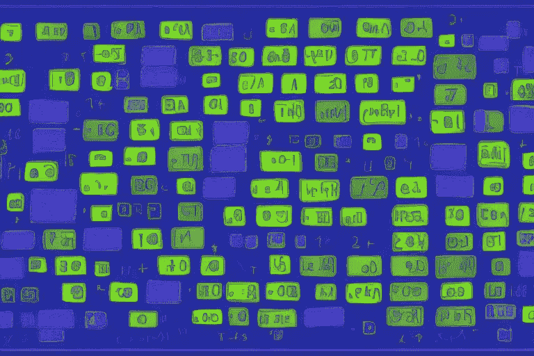
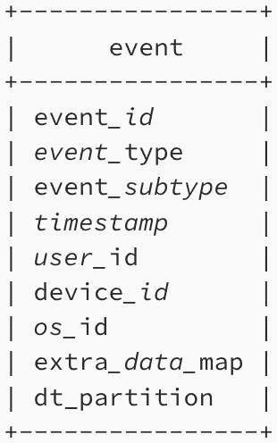
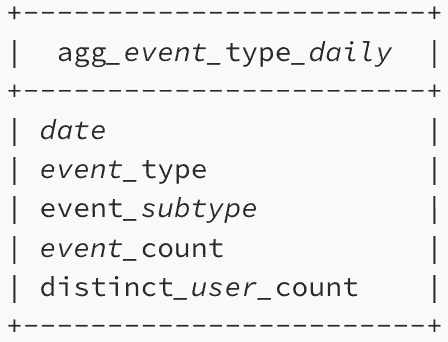
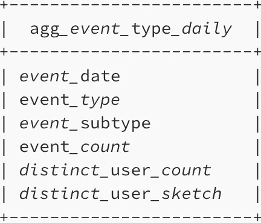

# 大规模统计不同的指标

> 原文：<https://towardsdatascience.com/count-distinct-metrics-at-scale-95a394c03f1>

## 如何加速不同查询的计数并设计高效的聚集表



由 [DreamStudio](https://beta.dreamstudio.ai/) 生成的图像

一种复杂的算法，[超对数对数(HLL)](https://en.wikipedia.org/wiki/HyperLogLog) 可以用来估计多重集中的不同元素。本文讨论了使用 HLL 大规模处理 count distinct 指标的实用方法。然而，这篇文章并没有探究 HLL 的内部运作。

数据分析中最常见的度量之一是某些实体的计数差异。例如，您可能对有多少不同的用户感兴趣，或者对有多少不同的用户执行某个操作感兴趣，或者对有多少不同的设备访问了您的网站感兴趣。从概念上讲，count distinct 是一个简单的操作。例如，您可以编写以下 SQL 查询来从用户表中获取不同的用户-

```
SELECT
  count(distinct user_id) as unique_users
FROM
  user
```

但是，在处理大规模数据时，您可能会遇到两个计数不同的问题

1.  高基数
2.  添加

# **高基数**

高基数指的是大量不同的值，想想具有数千万或数亿个唯一值的列。如果您正在大规模处理数据，您可能会经常遇到这些情况。例如，考虑下面的场景。

你有一个非常受欢迎的消息应用程序，该应用程序记录用户活动的事件。记录的事件示例有 app_start、start_message、read_message、sent_message 等。在任何一天，你都有大约一千万的独立用户和几亿的总事件。事件表是具有以下模式的日期分区表



要获得该应用在任何给定日期的 DAU(每日活跃用户),您可以编写以下查询

```
SELECT
  count(distinct user_id)
FROM
  event
WHERE
  dt_partition = '2022-12-17'
```

但是由于表的大小(一个 dt 分区有 100 万个事件)和 user_id 的基数(1000 万个唯一的 user _ id)，这个查询会非常慢，而且需要大量资源。为了计算非重复计数，SQL 引擎必须检查所有的值，同时在内存中维护所有的唯一值。SQL 引擎将增加一些优化来加快速度，但在它的核心，这是一个非常资源密集型的计算。为了加快计算速度，可以使用近似相异操作。大多数 SQL 引擎都包含 count distinct 的近似版本，下面是一些来自 [Presto](https://prestodb.io/docs/current/functions/aggregate.html#id6) 、 [Spark-SQL](https://spark.apache.org/docs/latest/api/sql/index.html#approx_count_distinct) 、[红移](https://docs.aws.amazon.com/redshift/latest/dg/r_COUNT.html)、 [BigQuery](https://cloud.google.com/bigquery/docs/reference/standard-sql/approximate_aggregate_functions#approx_count_distinct) 的例子。使用近似不同的函数，您可以设置标准误差的上限。下面是使用近似函数和标准误差上限 0.005 时查询的样子。

```
SELECT
  approx_distinct(user_id, 0.005)
FROM
  event
WHERE
  dt_partition = '2022-12-17'
```

近似相异函数功能强大且有弹性，但仅在数据规模允许且用例对答案中的小错误稳健时使用。例如，近似不同函数对于财务会计用例来说不是一个好主意。超对数算法支持近似计数不同函数。超对数算法是一种概率数据结构，可用于估算数据集中不同元素的数量。它基于将输入数据映射到一组桶，然后使用空桶的数量来估计输入数据的基数(即不同元素的数量)的思想。

# **相加性**

计算不同指标的另一个问题是它们不能在不同的维度上相加。让我们更深入地探讨一下这个问题。

让我们使用以下模式为日期-事件类型-事件子类型粒度上的事件构建一个聚合表



可以使用以下查询来构建该表

```
SELECT
  dt_partition as event_date,
  event_type,
  event_subtype,
  count(*) as event_count,
  approx_distinct(user_id, 0.005) as distinct_user_count
FROM
  event
GROUP BY
  1, 2, 3
```

在实践中，数据分析师、数据科学家和 ML 工程师广泛使用这种聚合表来执行探索性分析、进行实验、为 ML 创建数据集以及为仪表板提供动力。聚合表具有预计算的指标，可以进一步聚合到任何所需的粒度。例如，从 *agg_event_type_daily* 表中，我们可以简单地通过按 *event_date* 分组并对 *event_count* 求和来获得所有 event_type 的每日事件计数。

```
SELECT
  event_date,
  sum(event_count) as daily_event_count
FROM
  agg_event_type_daily
GROUP BY
  1
```

聚集表中的计数不同指标无法进一步聚集，我们无法从 agg_event_type_daily 表中获取所有 event_type 的每日不同用户。为了解决这个问题，我们可以利用近似相异计数函数使用的数据结构，即 HLL 草图(超对数草图)。HLL 草图是一种概率数据结构，用于估计数据集中唯一元素的数量。不同底层集合的 HLL 草图可以被合并，得到的 HLL 草图可以用来得到底层集合的并集的唯一元素。让我们看看如何将 HLL 草图合并到一个汇总表中。 *agg_event_type_daily* 表的更新模式如下所示



对该表的查询如下

```
SELECT
  dt_partition as event_date,
  event_type,
  event_subtype,
  count(*) as event_count,
  approx_distinct(user_id, 0.005) as distinct_user_count,
  approx_set(user_id, 0.005) as distinct_user_sketch
FROM
  event
GROUP BY
  1, 2, 3
```

新的 *agg_event_type_daily* 表让我们可以在不同的粒度上聚合不同的用户计数。例如，我们现在可以获得如下的每日不同用户计数

```
SELECT
  event_date,
  cardinality(merge(distinct_user_sketch)) as daily_distinct_user_count
FROM
  agg_event_type_daily
GROUP BY
  1
```

本例中使用的 HLL 函数是 Presto 特有的，但类似的函数也存在于其他查询引擎中，如 [Spark](https://github.com/swoop-inc/spark-alchemy/wiki/Spark-HyperLogLog-Functions) 、 [Redshift](https://docs.aws.amazon.com/redshift/latest/dg/hyperloglog-functions.html) 、 [BigQuery](https://cloud.google.com/bigquery/docs/reference/standard-sql/hll_functions) 。

# 结论

当您在大规模计算不同的度量时，并且您在准确性方面有一些余地，您应该

*   使用 *approx_distinct* 函数来加速查询
*   将 *HLL 地图*合并到聚合表中，以实现进一步聚合