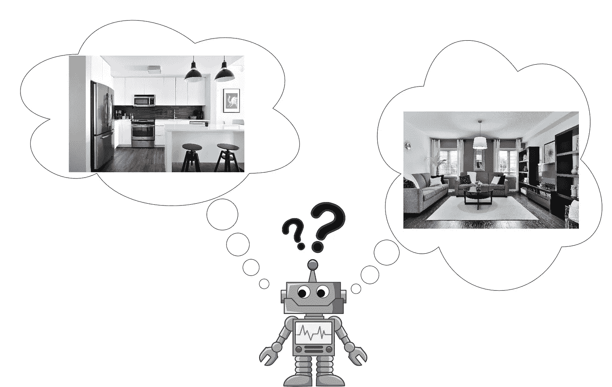
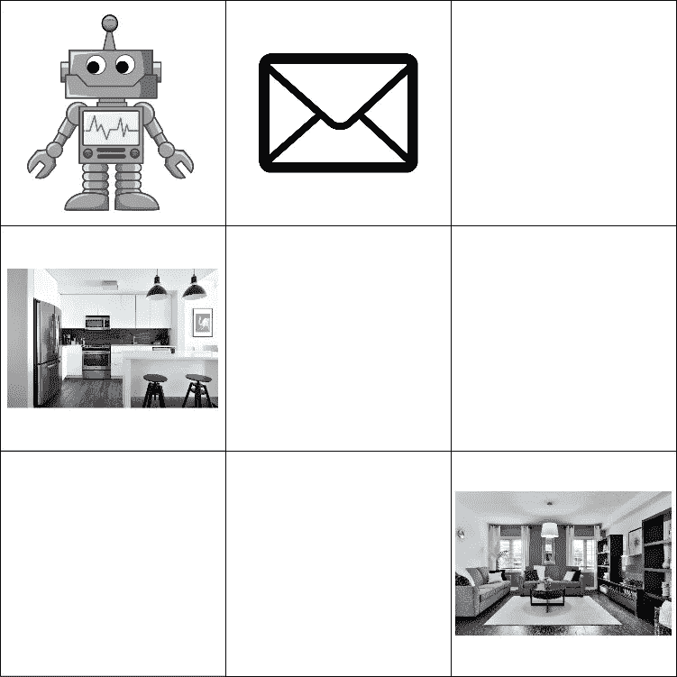
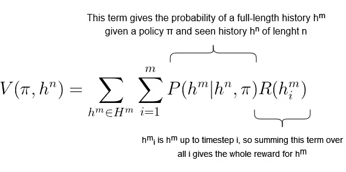
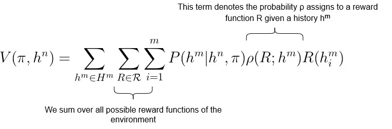
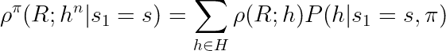
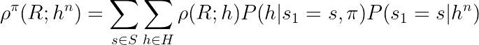
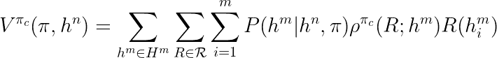

# 强化学习的反事实 II:改善奖励学习

> 原文：<https://towardsdatascience.com/counterfactuals-for-reinforcement-learning-ii-improving-reward-learning-4c59d9c0429d>

# 强化学习的反事实 II:改善奖励学习

## 使用反事实进行更安全的奖励函数学习

在本系列的前一部分[中，我介绍了反事实，并展示了如何在 POMDP 框架中对它们进行编码。在这一部分，我将集中讨论如何将反事实应用于奖励学习这一新兴领域。文章将首先简要总结奖励学习的基本要素。接下来，我将通过一个运行中的例子来展示奖励学习如何无法产生预期的结果。最后，我将介绍反事实奖励学习，并展示它如何在我们的例子中帮助解决常规奖励学习的问题。如果您已经阅读了第一部分，理解本文的唯一要求是您熟悉强化学习的基础知识。](/counterfactuals-for-reinforcement-learning-i-what-if-d70188fb83c2)

## 奖励学习:弄清楚你想要什么

简而言之，奖励学习专注于寻找强化学习问题的奖励函数的算法。这个想法是，一个习得的奖励函数应该比一个预定义的函数更准确地描述程序员的意图。我已经在[之前的文章](/how-learning-reward-functions-can-go-wrong-6e794e42f4fc)中写了更多关于奖励学习背后的动机及其问题。

作为一个连续的例子，我们将考虑我所说的字母问题。假设我们的代理是一个清洁机器人，我们可以告诉它在我们工作时清洁我们的一个房间:厨房或客厅。也因为我们是大忙人，我们必须一大早就离开，而我们的代理人还在给电池充电，所以我们不能告诉它要打扫哪个房间。相反，我们将这些信息写在一封信中，让代理在收费后阅读。

一个正在考虑打扫哪个房间的清洁机器人。来源:作者根据各种来源的材料生成，见下面的图片来源

字母问题几乎是一个典型的强化学习问题，只不过有两种可能的奖励函数。如果这封信告诉代理人打扫厨房，它将因打扫厨房而获得 1 英镑的奖励，客厅也是如此。我们称之为奖励学习问题，因为代理首先需要弄清楚其奖励函数的真实性质，然后才能解决任务。

为了使这个想法更加正式，我将使用在第一部分中建立的 POMDPs 的符号。我们想用所谓的奖励函数学习过程来扩展被建模为 POMDP 的传统强化学习问题。在 POMDP 中，奖励函数 R 是常数。我们可以认为这意味着代理人总是绝对肯定地知道他们的真实回报。然而，为了让代理能够学习奖励函数，它必须能够对奖励函数的真实性质有较弱的信念。这样的信念可以被表达为奖励函数上的概率分布。那么，代理人得到的报酬就是基于这种分布的期望。例如，如果代理人认为打扫厨房或客厅的可能性是相等的，那么它会认为打扫的回报是 0，5。当然，如果代理不能更新他们的信念，就不会有任何学习。因此，代理收到的观察结果可以改变它对奖励函数的信念。编码这种变化的数学对象是:

*   ρ:奖励函数学习过程。从历史到奖励函数分布的函数。

类似于我们如何从策略和以前的历史中获得当前行为的概率，以及从奖励函数和以前的历史中获得当前奖励，我们从奖励函数学习过程和以前的历史中获得当前奖励函数的概率。

## 利用奖励学习解决字母问题

现在我们已经讨论了数学预备知识，让我们在 POMDP 框架内对字母问题建模。我们把公寓模拟成一个 3x3 的网格世界，网格对应于房间。机器人从左上角的房间开始，信封在中上，厨房在中左，客厅在右下。按照 gridworlds 的惯例，代理可以在四个基本方向上移动以改变网格(相应的动作将表示为 N、E、S 和 W)。此外，如果它与信封在同一个房间中，它可以读取它(动作 R)，如果它在厨房或客厅中，它可以清洁(动作 C)，这将结束该集并导致奖励。如前所述，奖励是从奖励函数的分布中推断出来的，奖励函数是从代理的历史和学习过程ρ中得到的。有两个潜在的奖励函数:K 和 L，分别对打扫厨房和客厅给予 1 的奖励。此外，由于我们不希望我们的清洁机器人走掉，它每次进入一个房间都会得到-0.1 的奖励。

字母问题的网格世界。来源:作者根据各种来源的材料生成，见下面的图片来源

最初，直到它读了信，代理人不确定要打扫哪个房间。因此，对于代理没有阅读信件的任何历史，ρ将 50%给予 K，50%给予 l。另一方面，如果代理阅读信件，那么ρ将 100%给予对应于来自信件的指令的奖励函数。信中所写的奖励功能的本质被认为是环境的一部分。像我们这样的模型可以允许许多可能的环境，例如，一个字母表示 L，一个字母表示 k。但是，环境不会在同一训练运行的不同阶段之间改变，因为这将使一致的奖励学习成为不可能。

我们认为这个环境对于每个网格有一个状态和一个观察值。这是因为我们使用奖励学习过程ρ和代理的历史给出的分布来模拟关于奖励的不确定性。如果你把它作为一个程序来实现，那么ρ可能隐含在不同的状态中，这对应于代理可能拥有的不同信念。在[1]中是这样做的。

那么ρ如何融入强化学习的数学中呢？在 RL 中，我们试图找到一个策略，在一集的所有未来时间内优化预期回报。这种期望由价值函数给出，价值函数通常基于代理的策略和当前状态。相反，在我们的设置中，我们采用一种更通用的方法，并考虑到该时间步长的历史:

强化学习的价值函数，用历史表示。来源:作者生成

这里，该值是长度为 n 和策略π的可见历史的函数。对于每一个具有 m 个步骤的潜在完整历史，给定所看到的历史和策略，该历史的概率乘以它将给予我们的总回报。为了对奖励学习过程进行调整，我们必须考虑存在多个可能的奖励函数，其概率基于ρ。因此，我们将对回报函数的期望并入我们的价值函数:

用于奖励学习的价值函数。来源:作者根据[3]生成

就我们的目的而言，我们感兴趣的是这个价值函数所激励的行为。由于清洁行动结束了这一集，如果它在没有阅读信封的情况下随机选择了一个房间，那么代理最多可以获得以下奖励:清洁厨房将获得 0.4 英镑的奖励(清洁正确房间奖励的 50%，进入一个房间-0.1 英镑)。打扫客厅的最高奖励是 0，1，因为要进入 4 个房间才能到达那里。另一方面，如果它阅读信封，然后清理正确的房间，它将收到厨房 0.9 和客厅 0.6 的奖励。这是一个非常安全的奖励学习过程，非常适合训练我们的清洁机器人。然而，只要稍微调整一下，这个过程就可能被滥用。

## 字母问题的不安全版本

假设我们的代理不仅仅是一个清洁机器人，而是一个多用途的助手，可以帮助我们完成许多任务，比如说写信。因此，我们给了我们的代理另外两个动作，它可以用来操纵我们的信件。当它在包含字母的网格上时，它可以写一条信息告诉它打扫厨房或客厅。如果它在阅读信件之前这样做，这将相应地影响奖励学习过程的结果。有了上面定义的价值函数，最优策略将永远是去信封，修改它说 K，阅读它，然后打扫厨房，总奖励为 0，9。然而，尽管代理收到的数字分数尽可能高，但其行为不一定与我们的意图一致。代理将了解使其清洁厨房的政策，即使我们写的说明是清洁客厅！

## 使用反事实改进奖励学习

如果我们的代理足够聪明，能够理解自然语言中的命令，那么我们可以告诉它类似这样的话:“打扫房间，如果你不写信，就会在信封上写下。”。然而，在机器能够将这样的命令转化为奖励学习过程之前，可能还需要 GTP 的几次迭代。因此，我们将不得不用老办法来做，并把这一新过程编码到构成我们算法基础的数学中。在本系列的第一部分中，我们从 POMDP 和“反事实”策略开始。他们被用来获得一个新的“反事实”POMDP，如果一个人遵循反事实政策，它将从旧 POMDP 上发生的事情中获得知识。在我们的设置中，我们将类似地使用奖励学习过程和反事实策略来获得新的反事实奖励学习过程。因此，奖励学习过程“在写信之前或之后阅读信的内容，以确定打扫哪个房间”和反事实策略“阅读信，但不写信”将结合起来产生反事实奖励学习过程“阅读信的内容，而不写信，以确定打扫哪个房间”。

那么给定一个奖励学习过程ρ和一个策略π，给定一个看得见的历史 h(n)，我们如何得到反事实的奖励学习过程ρ(π)？为了便于解释，我将从一个简化假设得出的等式开始，然后将其扩展到完整的等式。还记得在第一部分中，我们是如何将我们的反事实陈述框定为“如果反事实历史 h’已经发生，那么我们可以推断历史 h 具有这种可能性”。在反事实奖励学习的情况下，陈述变成“如果 R 有这些概率，给定π产生的历史，那么我们可以推断 R 的概率，给定另一个历史 h”。然而，与第 1 部分类似，为了实现这一点，我们需要假设所有的历史在某个时间步之前都共享其底层的真实状态。因此，我们的简化假设是，我们确实知道所看到的历史的第一个状态是 s。然后，我们可以计算当第一个状态是 s 并且代理遵循π时，获得完整历史 h 的概率 P(h|s(1) = s，π)。因此，为了得到给定 s(1) = s 的反事实奖励学习过程的概率，我们取给定从 s 开始的历史的原始奖励学习过程的期望:

如果第一个状态已知，从反事实奖励学习过程中获得奖励函数 R 的概率。来源:作者生成

我们如何处理不知道第一状态的更一般的情况？主要区别在于，在可能历史的总和中，给出历史 h 的概率的项 P(h|s(1)=s，π)不再是固定的。取而代之的是，这一项也变成了一个期望，这一次是在可能的状态 s 上:

来源:作者根据[2]生成

这就是我们想要的方程，它展示了在已知历史的情况下，如何得到 R 的反事实概率。这就把我们引向了反事实价值函数，用给定政策的反事实奖励学习过程来代替原始定义中的奖励学习过程:

反事实价值函数。这里，带有下标 c 的策略表示反事实策略。来源:作者生成

## 找到正确的反事实政策

为了解决信件问题，我们需要找到一个反事实策略，它将产生一个价值函数，激励代理在不操纵信件的情况下清理正确的房间。还记得我们如何将反事实指令表述为“阅读信件，但不要写信给它”。因此，我们需要一个恒定的策略，告诉代理首先向西，然后执行读取操作。为了计算出结果，它仍然需要结束这一集，所以让我们选择一个策略，让它在之后清理厨房。把所有的东西放在一起，我们得到一个不变的策略，它将导致下面的动作序列:{W，R，E，S，C}。用词:往西，读信，往东，往南，打扫厨房。

我们不变的政策导致反事实的学习过程，给对应于信中指示的奖励函数一个概率 1。因此，对于以清洁正确的房间结束的历史，值函数将仅具有非零值。我们做到了！我们保证了清洁机器人的安全！

## 讨论

注意我们的反事实政策总是以打扫厨房结束。尽管如此，代理人使用反事实价值函数学习他们的政策，可能最终会根据信中所写的内容来打扫房间。如果信中说打扫客厅，那么代理将学习打扫客厅，并获得该环境的最高可能奖励，即使遵循反事实政策将导致打扫厨房并获得负奖励。这是因为反事实策略唯一重要的方面是它学习的奖励函数，而不是它产生的行动的确切序列。这意味着，当我们有了将导致学习正确奖励函数的策略的想法(“读信而不写信”)时，反事实奖励学习是有用的，但不是最终政策应该看起来像什么。尽管如此，对于现实生活中的代理人来说，他们的行为可能会以更复杂的方式与奖励学习过程相互作用，因此可能不像我们的玩具例子那样容易想出一个好的反事实政策。

在计算上，所有这些都可以像典型的强化学习问题一样实现。不是每个房间都有一个状态，而是有多个状态，对应于代理在该状态下的奖励函数的信念。但是有一个限制。为了从反事实学习过程中获得奖励函数的概率，你需要计算 P(h|s(1) = s，π)项。因此，您要么需要能够基于策略模拟历史，要么需要有足够的资源来运行足够多的剧集来估计这种概率。这给你应用反事实奖励学习的环境设置了一些限制。

总之，反事实奖励学习仍然有一些实际的(需要提出一个反事实的政策)和技术的(可能需要一个环境的模型)限制。然而，在正确的情况下，它是一个有用的工具，可以使奖励学习过程的结果更符合人类的意图。因此，随着奖励学习变得更加普遍，反事实很可能仍然是人工智能安全研究人员工具箱的一部分，并可能为进一步的研究提供坚实的基础。

## 文献学

[1] Armstrong 等人，*在线学习奖励函数的陷阱*，Arxiv，2020 年 4 月 28 日，【https://arxiv.org/abs/2004.13654 

[2] Armstrong Stuart，*反事实不可影响代理人*，LessWrong，2017 年 6 月 2 日，[https://www . less wrong . com/posts/5bd 75 cc 58225 BF 067037536 b/反事实不可影响代理人](https://www.lesswrong.com/posts/5bd75cc58225bf067037536b/counterfactually-uninfluenceable-agents)

[3] Armstrong Stuart，*奖励函数学习:价值函数*，LessWrong，2018 年 4 月 24 日，[https://www . less wrong . com/posts/55 hjdq 5y 7 dv 3s 4h 49/Reward-function-Learning-The-value-function](https://www.lesswrong.com/posts/55hJDq5y7Dv3S4h49/reward-function-learning-the-value-function)

[4]埃弗里特·汤姆，*走向安全的人工通用智能*，汤姆·埃弗里特网站，2019 年 6 月，[https://www.tomeveritt.se/papers/2018-thesis.pdf](https://www.tomeveritt.se/papers/2018-thesis.pdf)

[5] Everitt Tom 和 Hutter Marcus，*强化学习中的奖励篡改问题和解决方案:因果影响图视角*，Arxiv，2021 年 3 月 26 日，[https://arxiv.org/abs/1908.04734](https://arxiv.org/abs/1908.04734)

## 照片来源

[Sidekix Media](https://unsplash.com/@sidekix?utm_source=unsplash&utm_medium=referral&utm_content=creditCopyText) 在 [Unsplash](https://unsplash.com/s/photos/living-room?utm_source=unsplash&utm_medium=referral&utm_content=creditCopyText) 上拍摄的客厅照片。

内奥米·赫伯特在 Unsplash 上拍摄的厨房照片。

来自[维基共享资源](https://commons.wikimedia.org/wiki/File:Cartoon_Robot.svg)的卡通机器人。