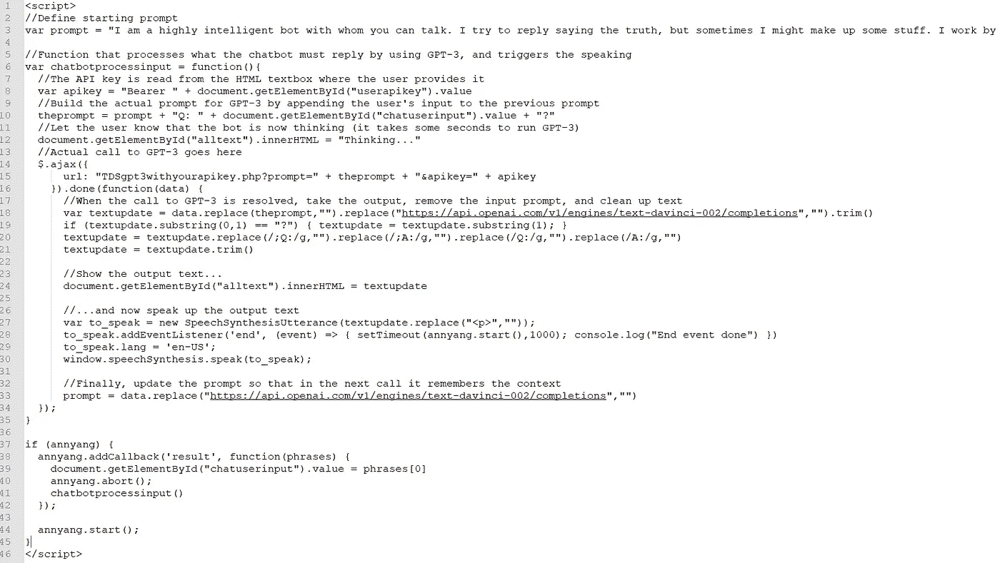
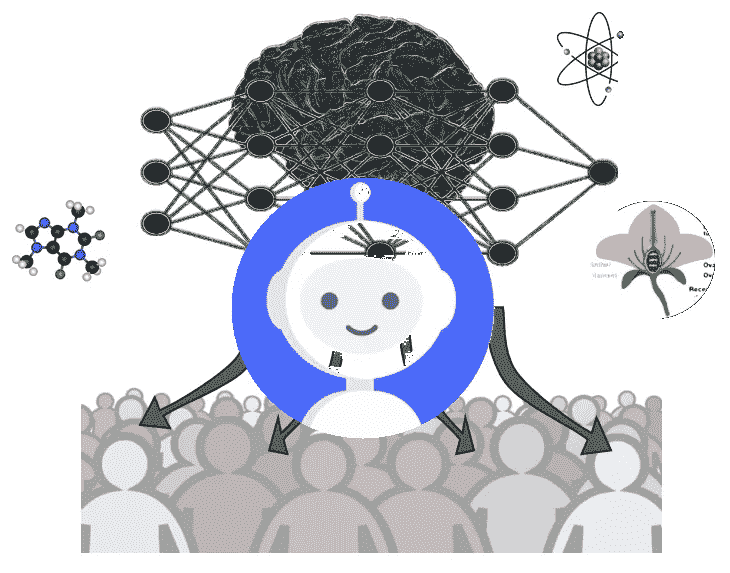

# 将 GPT-3 与语音识别和合成结合起来，实现一个可以在网络浏览器中运行的完全会说话的聊天机器人

> 原文：<https://towardsdatascience.com/coupling-gpt-3-with-speech-recognition-and-synthesis-to-achieve-a-fully-talking-chatbot-that-runs-abfcb7bf580>

## 我是如何创建这个网络应用程序的，通过它你可以和 GPT 3 号自然地谈论任何你想谈论的话题，所有这些都是基于你的笔记本电脑、智能手机或平板电脑的。

我刚刚创建了一个基于网页的聊天机器人，它可以理解你说的话，然后非常智能地回复。我有几篇文章展示了它的作用，这里你有一个 49 秒的预览(查看我最近的文章获得更多的例子)。

您可以在以下位置尝试使用该聊天机器人(即自然交谈):

[**https://lucianoabriata . alter vista . org/tests/GPT-3/tdsgpt 3-speech rec-speech synth . html**](https://lucianoabriata.altervista.org/tests/gpt-3/TDSgpt3-speechrec-speechsynth.html)

> 但本文的重点是理解这个应用程序是如何工作的——这是一个很好的例子，说明不同的库、浏览器 API 和通过 API 调用可访问的外部服务如何协同工作来实现很酷的应用程序。

# 这个“自然对话聊天机器人”的组成部分

我在以前的文章中肤浅地说过，这个网络聊天机器人建立在三个适用于网络浏览器的伟大工具之上。让我们在这里更详细地看看这些组件。

## **1。语音识别的 ann yang**

(或者你可以直接使用 Web Speech API 的 SpeechRecognition 服务)

[](https://www.talater.com/annyang/)  

Annyang 是一个小型的语音识别 JavaScript 库，它允许程序员轻松地将语音命令和语音听写集成到他们的 web 应用程序中。它没有依赖性，非常轻，在 MIT 许可下可以自由使用和修改。

为了实现语音识别，Annyang 使用了 [Web Speech API](https://developer.mozilla.org/en-US/docs/Web/API/Web_Speech_API) 的 [SpeechRecognition 服务](https://developer.mozilla.org/en-US/docs/Web/API/SpeechRecognition)——它还包括下面第 3 点中描述的 [SpeechSynthesis 服务](https://developer.mozilla.org/en-US/docs/Web/API/SpeechSynthesis)，以允许聊天机器人说话。

Annyang library 在 Chrome 中在电脑、笔记本电脑、平板电脑和智能手机上运行得非常好，只需要 web 应用程序托管在 *https* 下，并且用户接受麦克风的使用(默认情况下，只有在给定域下第一次加载库时才会请求)。在我的测试中，Annyang 在装有 Windows 操作系统的电脑上也能很好地运行 Firefox。

Annyang 非常容易使用，作为一名程序员，您只需输入以下几行代码就可以插入口头命令:

```
<script src="//cdnjs.cloudflare.com/ajax/libs/annyang/2.6.1/annyang.min.js"></script><script>
if (annyang) {
  const commands = {
    'hello': () => { alert('Hello world!'); }
  };

  // Add our commands to annyang
  annyang.addCommands(commands);

  // Start listening.
  annyang.start();
}
</script>
```

## **2。GPT-3 作为大脑“理解”你说的话，并产生一个可能的答复**

GPT-3 是一个最先进的语言处理模型，这是一个深度神经网络，可以读入一些文本，并从生成统计模型中产生新的文本。输出可以是对输入中提出的问题的回答，或者是输入文本的摘要，或者是它的扩展；也可以是表格的文本形式，或者是输入中几个指示后写的一段代码等。

对于真正的应用程序，你可能不会完全按照原样使用 GPT-3，而是根据你的需要进行调整。特别是，您可以使用特定的输入/输出对来微调模型，还可以以提示的形式提供少量的学习，该提示包含您期望的文本输入和输出类型的基本布局。

我已经写了几篇关于 GPT-3 的文章来说明上述特征。以下是最重要的几个:

[](/custom-informed-gpt-3-models-for-your-website-with-very-simple-code-47134b25620b)  [](/web-based-chatbot-project-module-2-gpt-3-generated-responses-assisted-with-a-database-for-1ee2a0f4aad4)  [](/gpt-3-like-models-with-extended-training-could-be-the-future-24-7-tutors-for-biology-students-904d2ae7986a)  

与本文最相关的是，注意我使用了对 OpenAI 的 API 的基于 PHP 的调用。我在上面列出的三篇文章的第一篇中解释了如何实现这一点。

此外，我在调用 GPT-3 时使用了一些少量的学习，让它“理解”它必须处理模拟两个人对话的信息交换(我稍后会向您展示更多)。

## **3。语音合成 API 大声朗读 GPT-3** 制作的文本

Web Speech API 的 [SpeechSynthesis service](https://developer.mozilla.org/en-US/docs/Web/API/SpeechSynthesis) (为了使用更简单，它还包括由 Annyang 包装的 [SpeechRecognition service](https://developer.mozilla.org/en-US/docs/Web/API/SpeechRecognition) )允许您相当容易地从文本提示合成音频。

我没有使用包装器(比如语音识别的 Annyang ),而是马上使用了语音合成服务，“香草模式”。

例如，我可以制作一个网页，上面写着“你好，世界，在这里说话！”用这段简单的代码:

```
var to_speak = new SpeechSynthesisUtterance("Hello world, speaking up here!");to_speak.lang = ‘en-US’;window.speechSynthesis.speak(to_speak);
```

## 完成组件后，

> 现在是时候看看这一切是如何真正一起工作来创建一个自然的语音聊天机器人了。

# 聊天机器人实际上是如何工作的

将上述元素放在一起会产生一个聊天机器人，就像你在我的视频中看到的那样，这听起来可能很琐碎。然而，当你简单地把三个部分放在一起时，你就开始有问题了。

## 避免聊天机器人最终“自言自语”

在我的第一次尝试中，最重要的问题是 Annyang 在 speech API 说话时一直在听，因此创建了一个无限循环，机器人只是在与自己说话。并不是以一种有趣的方式，而是一遍又一遍地重复“是的，我说过了”这样的短语。起初很有趣，但最终解决了一个痛苦。

幸运的是，事实证明你可以打开和关闭 Annyang。虽然命令应该是*暂停*和*恢复*，但它们并没有真正起作用——而且不是我，因为我确实[在网上找到了一些关于这个问题的笔记](https://github.com/TalAter/annyang/issues/193)。

所以，我不得不使用另一种方法:不是*暂停*，而是实际上*在一个短语被发送到 GPT-3 进行分析时立即中止*；然后当 GPT-3 产生的输出准备好被读取时*开始*而不是*恢复*。

但即使这样也不是完美的:有时 Annyang 在 speech API 的讲话结束之前开始再次收听，所以它抓住了最后的话，并再次试图回复这些最后的话。我可以非常简单地解决这个问题，只需加入一个超时功能，在通话结束后等待 1 秒钟，然后激活 Annyang:

```
var to_speak = new SpeechSynthesisUtterance(textupdate.replace(“<p>”,””)); to_speak.addEventListener(‘end’, (event) => { setTimeout(annyang.start(),1000); console.log(“End event done”) }) to_speak.lang = ‘en-US’; window.speechSynthesis.speak(to_speak);
```

## “解释”GPT-3，它必须跟随对话，提供问题的答案或合理延续人类所说的话，并记住上下文

关键在于 GPT-3 的少量学习能力。这实质上是在塑造发送给 GPT 3 号的提示，指示它跟随对话。

当我的程序开始时，提示只是下面的问题，其中包含一些聊天机器人应该知道但不知道的背景信息，如其本身的性质，其本身如何工作，我作为开发人员的姓名等。开始提示也遵循输入和回答应该如何相互跟随的模型，这里用字母 Q 和 A 标记，因为它们类似于问题和回答(尽管它们不一定必须是问题和回答，例如当你问“你好，早上好”时)机器人会回复类似“你好”的话

以下是我的应用程序使用的确切提示:

```
var prompt = “I am a highly intelligent bot with whom you can talk. I try to reply saying the truth, but sometimes I might make up some stuff. I work by integrating GPT-3 as a brain with web APIs for speech recognition and speech synthesis.;Q: What is human life expectancy in the United States?;A: Human life expectancy in the United States is 78 years.;Q: Who was president of the United States in 1955?;A: Dwight D. Eisenhower was president of the United States in 1955.;Q: Which party did he belong to?;A: He belonged to the Republican Party.;Q: How does a telescope work?;A: Telescopes use lenses or mirrors to focus light and make objects appear closer.;Q: Where were the 1992 Olympics held?;A: The 1992 Olympics were held in Barcelona, Spain.;Q: Who developed you?;A: I was developed by Luciano Abriata.”
```

现在，当 Annyang 第一次理解对它说的一些文本时，应用程序会将这些文本附加到提示中，并将整个新的提示发送到 GPT 3 号。举个例子，如果安扬听到的第一句话是“你好，你好吗？”那么发送给 GPT-3 的提示将类似于:

```
I am a highly intelligent bot with whom you can talk. I try to reply saying the truth, but sometimes I might make up some stuff. I work by integrating GPT-3 as a brain with web APIs for speech recognition and speech synthesis.;Q: What is human life expectancy in the United States?;A: Human life expectancy in the United States is 78 years.;Q: Who was president of the United States in 1955?;A: Dwight D. Eisenhower was president of the United States in 1955.;Q: Which party did he belong to?;A: He belonged to the Republican Party.;Q: How does a telescope work?;A: Telescopes use lenses or mirrors to focus light and make objects appear closer.;Q: Where were the 1992 Olympics held?;A: The 1992 Olympics were held in Barcelona, Spain.;Q: Who developed you?;A: I was developed by Luciano Abriata.**;Q: Hello, how are you doing?"**
```

(我用粗体显示了添加到启动提示中的内容)

GPT-3 的输出将由这个相同的提示加上它的附加内容组成。例如:

```
I am a highly intelligent bot with whom you can talk. I try to reply saying the truth, but sometimes I might make up some stuff. I work by integrating GPT-3 as a brain with web APIs for speech recognition and speech synthesis.;Q: What is human life expectancy in the United States?;A: Human life expectancy in the United States is 78 years.;Q: Who was president of the United States in 1955?;A: Dwight D. Eisenhower was president of the United States in 1955.;Q: Which party did he belong to?;A: He belonged to the Republican Party.;Q: How does a telescope work?;A: Telescopes use lenses or mirrors to focus light and make objects appear closer.;Q: Where were the 1992 Olympics held?;A: The 1992 Olympics were held in Barcelona, Spain.;Q: Who developed you?;A: I was developed by Luciano Abriata.**;Q: Hello, how are you doing?; A: I am doing fine, thanks."**
```

当听到下一个语音文本时，它被附加到最后一个提示，并再次发送到 GPT-3。然后，提示符会返回并添加新的响应。诸如此类。

这不仅有助于提供聊天机器人不知道的信息(在提示的第一部分)，而且有助于聊天的连续性，因为之前的交流仍然存在。这就是为什么 GPT-3 的少击学习能力如此强大。不幸的是，它有一个限制，最多 2048 个令牌，所以在某些时候，API 会因为提示太长而抛出一个错误。可能有一些方法可以改善这一点，也许你可以尝试一下。

## 清理短语中的字符以输入 GPT-3 并从中获取

正如您在上面展示语音合成如何工作的代码片段中看到的，需要对字符串进行一些清理。例如，我们不希望机器人说出整个提示，所以我们必须删除输入。我们还想删除那些 q 和以及任何 HTML 标签，奇怪的问号等。为此，我在字符串中使用了许多 replace()函数(当我使用 replace(//g)时，这意味着 JavaScript 中的“替换所有实例”。

```
$.ajax({ url: “TDSgpt3withyourapikey.php?prompt=” + theprompt + “&apikey=” + apikey }).done(function(data) { var textupdate = data.replace(theprompt,””).replace(“https://api.openai.com/v1/engines/text-davinci-002/completions","").trim() if (textupdate.substring(0,1) == “?”) { textupdate = textupdate.substring(1); } textupdate = textupdate.replace(/;Q:/g,””).replace(/;A:/g,””).replace(/Q:/g,””).replace(/A:/g,””) textupdate = textupdate.trim() console.log(textupdate)
```

## 对整个代码的全局观察

下面是所有代码，注释简要描述了正在做的事情(上面给出的所有细节的总结)



作者截图，他自己的代码。



作者创作的人物。

# 如果你觉得这很有趣或者喜欢为网络编程很酷的东西

  [](https://medium.com/technology-hits/a-web-tool-to-view-and-analyze-cryptocurrency-data-in-full-detail-free-access-in-this-article-73e4c1dea911)  [](https://medium.com/age-of-awareness/metaverse-not-sure-but-webxr-hell-yes-12af5b302e08)  [](/exquisite-hand-and-finger-tracking-in-web-browsers-with-mediapipes-machine-learning-models-2c4c2beee5df)  

www.lucianoabriata.com*我写作并拍摄我广泛兴趣范围内的一切事物:自然、科学、技术、编程等等。* [***成为媒介会员***](https://lucianosphere.medium.com/membership) *访问其所有故事(我免费获得小额收入的平台的附属链接)和* [***订阅获取我的新故事***](https://lucianosphere.medium.com/subscribe) ***通过电子邮件*** *。到* ***咨询关于小职位*** *查看我的* [***服务页面这里***](https://lucianoabriata.altervista.org/services/index.html) *。你可以* [***这里联系我***](https://lucianoabriata.altervista.org/office/contact.html) ***。***