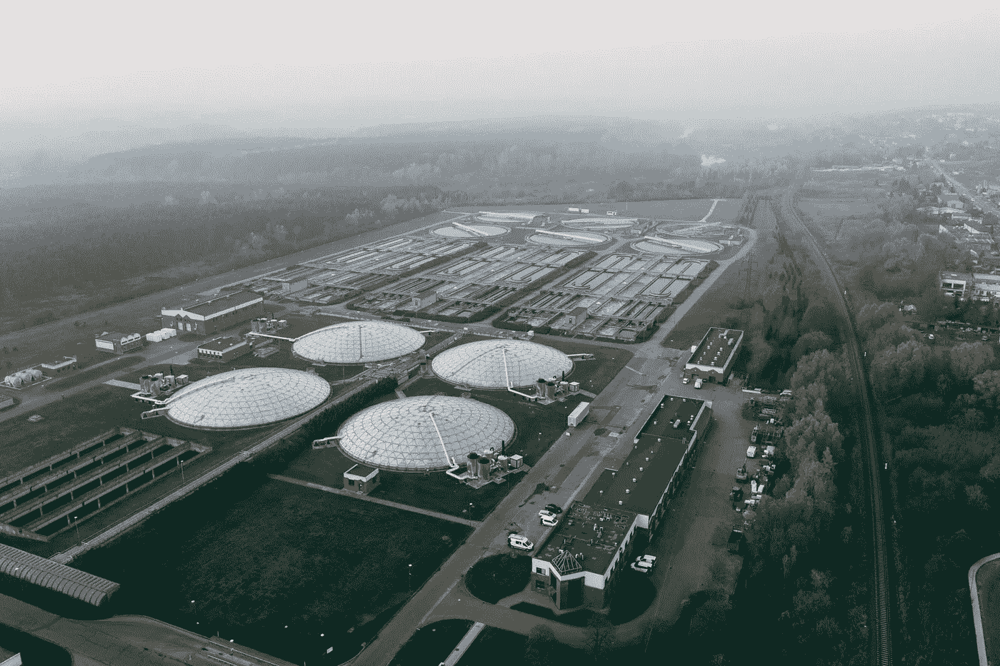

# 废水的新冠肺炎结果预测

> 原文：<https://towardsdatascience.com/covid-19-outcome-predictions-from-wastewater-fcc19400e144>

## 用 CDC 的废水数据预测病例、住院和死亡。使用 pandas 窗口和相关性。



[Marcin Jozwiak](https://unsplash.com/@marcinjozwiak?utm_source=unsplash&utm_medium=referral&utm_content=creditCopyText) 在 [Unsplash](https://unsplash.com/s/photos/sewage?utm_source=unsplash&utm_medium=referral&utm_content=creditCopyText) 上拍摄的照片

# 摘要

全美 50，000 多项废水测试与来自同一地点和同一时间段的新冠肺炎结果(病例、住院、死亡)相匹配。分析所得数据集的新型冠状病毒 RNA 水平和结果之间的相关性，显示与所有三项指标呈正相关。

# 背景

在之前的数据工程项目中，我[增强了](/sars-cov-2-wastewater-data-enhanced-9717d8197f98)CDC[国家废水监测系统](https://www.cdc.gov/healthywater/surveillance/wastewater-surveillance/wastewater-surveillance.html)的废水测试。该项目的目标是将新冠肺炎疫苗接种和疾病结果信息添加到每个废水测试中，以便特定测量的新型冠状病毒 RNA 水平可以与该时间范围内该位置的疾病结果相关联。

例如，考虑 2021 年 1 月 19 日在密苏里州斯科特县的处理厂进行的水测试，发现每毫升 390.0 份来自新型冠状病毒的 N2 基因。(这基本上是完整的 NWSS 数据集包含的信息，每天和每个提交数据的水处理厂都会重复多次。)

我增强了 NWSS 数据集，在该行中添加了 1 月 9 日该县的疫苗接种率(因为疫苗至少需要 10 天才能发挥作用)、1 月 26 日的已知病例率(水试验后 7 天)、2 月 9 日新冠肺炎患者的医院和 ICU 利用率(水样本后 14 天)以及 2 月 16 日的新增新冠肺炎死亡人数(21 天后)。

该数据工程项目是成功的，下一步是使用增强的 NWSS 数据进行分析。例如，废水新型冠状病毒核糖核酸的水平能预测 14 天后新冠肺炎医院的入院人数吗？如果是，这种相关性有多强？我目前的项目，在这里报告，开始了这种分析。

注意:这项分析，以及我之前的项目，即[增强了](/sars-cov-2-wastewater-data-enhanced-9717d8197f98)NWSS 数据集，是建立在详细的废水测试结果之上的，这些结果可以通过签署数据使用协议从 CDC 获得。要获取该受限数据集，请联系列在[公共数据](https://data.cdc.gov/Public-Health-Surveillance/NWSS-Public-SARS-CoV-2-Wastewater-Metric-Data/2ew6-ywp6)页面上的数据所有者。

# 缺失的医院价值观

这项工作的第一步是解决医院信息的一个问题。我从 CovidActNow.org 的[获得医院数据，但是同样的问题在许多医院数据来源中是常见的。医院通常每周只报告一次入院人数、床位数和 ICU 使用率。其他六天，这些值为空。当然，在缺少数据的日子里，仍然有人在医院，所以 null/NaN 不能解释为零。解决方案是使用可用数据来估计每周报告之间的住院数据。](https://covidactnow.org/)

熊猫窗口功能实现了这个功能:

```
# Sort by county then date.CovidDF = CovidDF.sort_values(["fips", "covid_facts_date"], ascending=[True, True])# Create new columns for ICU, beds and admits with the rolling average over 10 days.CovidDF["metrics.icuCapacityRatioRolling10"] = CovidDF["metrics.icuCapacityRatio"].rolling(10, min_periods=1, center=True, closed='both').mean()CovidDF["metrics.bedsWithCovidPatientsRatioRolling10"] = CovidDF["metrics.bedsWithCovidPatientsRatio"].rolling(10, min_periods=1, center=True, closed='both').mean()CovidDF["metrics.weeklyCovidAdmissionsPer100kRolling10"] = CovidDF["metrics.weeklyCovidAdmissionsPer100k"].rolling(10, min_periods=1, center=True, closed='both').mean()
```

# 早期疫苗接种值

CovidActNow 数据还有另一项需要清理。(对于所有的数据源来说，需要各种清理和修复是很常见的。)许多早期日期的疫苗接种字段是空的。但在这种情况下，与住院治疗不同，缺失值是已知的——它们为零，因为疫苗在那些日期不存在。

熊猫。DataFrame.loc()通过明确地将疫苗出现在美国之前的所有日子的所有疫苗计数设置为零来解决这个问题。

```
# First vaccines on 14 December 2020.CovidDF.loc[CovidDF["covid_facts_date"] <= "2020-12-13", "actuals.vaccinationsInitiated"] = 0.0
CovidDF.loc[CovidDF["covid_facts_date"] <= "2020-12-13", "actuals.vaccinationsCompleted"] = 0.0
CovidDF.loc[CovidDF["covid_facts_date"] <= "2020-12-13", "metrics.vaccinationsInitiatedRatio"] = 0.0
CovidDF.loc[CovidDF["covid_facts_date"] <= "2020-12-13", "metrics.vaccinationsCompletedRatio"] = 0.0# First boosters on 16 August 2021.CovidDF.loc[CovidDF["covid_facts_date"] <= "2021-08-15", "actuals.vaccinationsAdditionalDose"] = 0.0
CovidDF.loc[CovidDF["covid_facts_date"] <= "2021-08-15", "metrics.vaccinationsAdditionalDoseRatio"] = 0.0
```

# 一致性测试类型

NWSS 数据集包含各种废水处理厂提交的水质检测报告。大多数，但不是全部，在原始废水中寻找新型冠状病毒的 N1 或 N2 基因。我排除了不支持这种测试的行。

```
RawDF = RawDF.query("pcr_target == 'sars-cov-2' ")
RawDF = RawDF.query("pcr_gene_target == 'n1' or pcr_gene_target == 'n2' or pcr_gene_target == 'n1 and n2 combined'  ")
RawDF = RawDF.query("sample_matrix == 'raw wastewater' ")
```

# 一致的 RNA 检测单位

一个稍微棘手的问题是，检测到的基因拷贝数以三种不同的方式报告:每升拷贝数、每毫升拷贝数和每升拷贝数的对数基数 10。我创建了两个新列:一列表示标准化的一致单位(每毫升的拷贝数)，另一列根据需要转换标准化的基因计数。

```
RawDF["pcr_target_units_norm"] = "copies/ml wastewater"RawDF.loc[RawDF["pcr_target_units"] == "copies/l wastewater", "pcr_target_avg_conc_norm"] = (RawDF["pcr_target_avg_conc"] / 1000)RawDF.loc[RawDF["pcr_target_units"] == "log10 copies/l wastewater", "pcr_target_avg_conc_norm"] = ((10 ** RawDF["pcr_target_avg_conc"]) / 1000)
```

# 完成的数据集

初始 NWSS 数据集中有 61，526 行(将 FIPS 县扩展为每行一行后)。仅选择原废水中的 N1 或 N2 基因测试后有 53，521 行，仅选择具有有效基因计数(非 NaN，非负)的行后有 53，503 行。与初始数据集行相比，具有可用数据的行的比例相当高。

废水样本中的 RNA 浓度因多种原因而异——使用下水道系统的人数、当时雨水对废水的稀释、使用的采样方法以及该地区有多少人患有新冠肺炎。一项测试显示 X 个 RNA 基因拷贝，而另一项测试显示 2X 个拷贝，这一事实并不意味着第二项测试一定会发现更多的疾病。然而，NWSS 数据集包含了在多个地点、多个月内进行的多次水质测试，因此这些变化往往会随着时间和地理位置的变化而变得平缓。

# 结果

我使用简单的 Spearman 等级相关进行分析。如果两个变量作为有序对精确地相互跟踪，则它们的相关性为 1.0。在这种情况下，1.0 的相关性意味着所有水样中 RNA 水平的有序列表完美地预测了其他变量的有序列表，例如住院治疗。

以下是斯皮尔曼相关性:

*   新型冠状病毒基因拷贝数和新冠肺炎试验阳性率(7 天后)= 0.491。
*   人均基因拷贝数和新冠肺炎病例密度(7 天后)= 0.541。
*   基因拷贝和人均新冠肺炎医院入院人数(14 天后)n= 0.377。
*   新冠肺炎患者的基因拷贝数与医院床位的比率(14 天后)= 0.490。
*   基因拷贝数和人均新冠肺炎死亡数(21 天后)= 0.282。

在废水中检测到的新型冠状病毒和该地理区域中新冠肺炎病流行的多种测量之间存在一致的正相关。

对于所有的相关数，95%的置信值非常接近，因为样本量很大。例如，入院相关系数为 0.377，95%置信区间为 0.3695 至 0.3845。

# 未来的工作

最新的完整 NWSS 数据集来自 2022 年 2 月初。此时(5 月初)，数据集中缺少三个月的数据，因此分析中也缺少这些数据。一旦 NWSS 发布了新的数据集，这里显示的软件应该重新运行，结果得到验证——也许会加强或削弱相关性。

我计算了上述变量之间的标准等级相关性。增强的数据集还可以接受更高级的统计分析，可能是[近似贝叶斯计算](https://en.wikipedia.org/wiki/Approximate_Bayesian_computation)或考虑大规模(50，000+)样本集和多种结果测量的测试。

我的熊猫源代码允许轻松调整“前瞻”值。例如，可以对 21 天后的住院和 28 天后的死亡进行相同的分析。有趣的是用不同的前瞻间隔进行实验，看看哪个在废水 RNA 和新冠肺炎结果之间产生最强的相关性。

# 了解更多信息

[https://covid . CDC . gov/covid-data-tracker/#废水监控](https://covid.cdc.gov/covid-data-tracker/#wastewater-surveillance) (NWSS 仪表板)

https://data.cdc.gov/browse(所有 CDC 数据集的主页)

https://en.wikipedia.org/wiki/Correlation[(斯皮尔曼和皮尔逊相关)](https://en.wikipedia.org/wiki/Correlation)