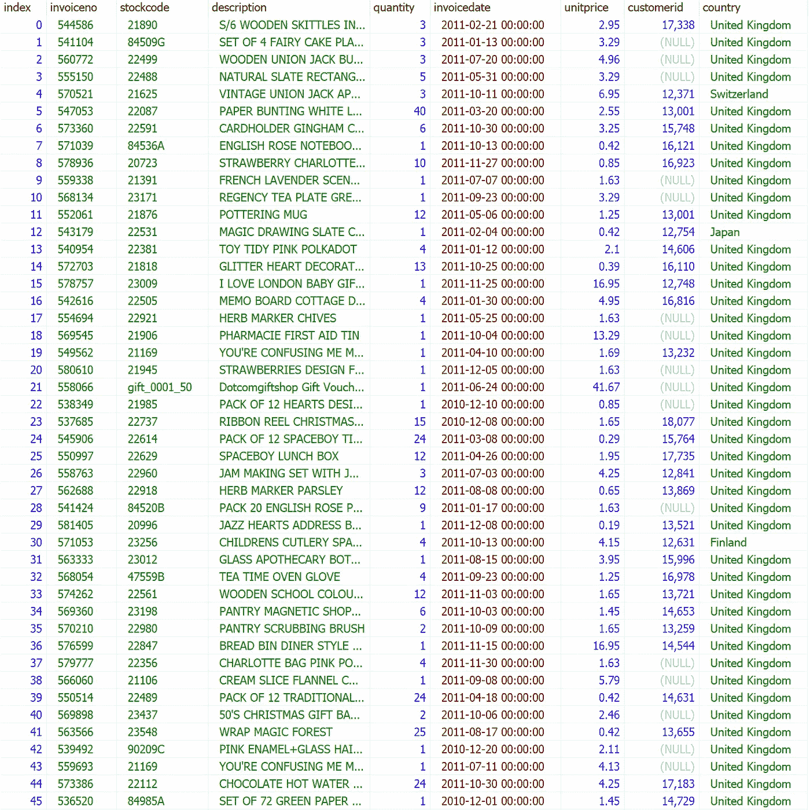
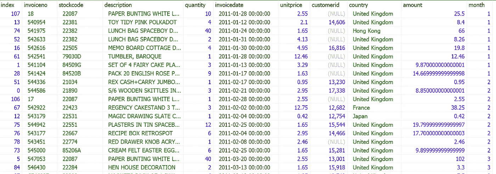
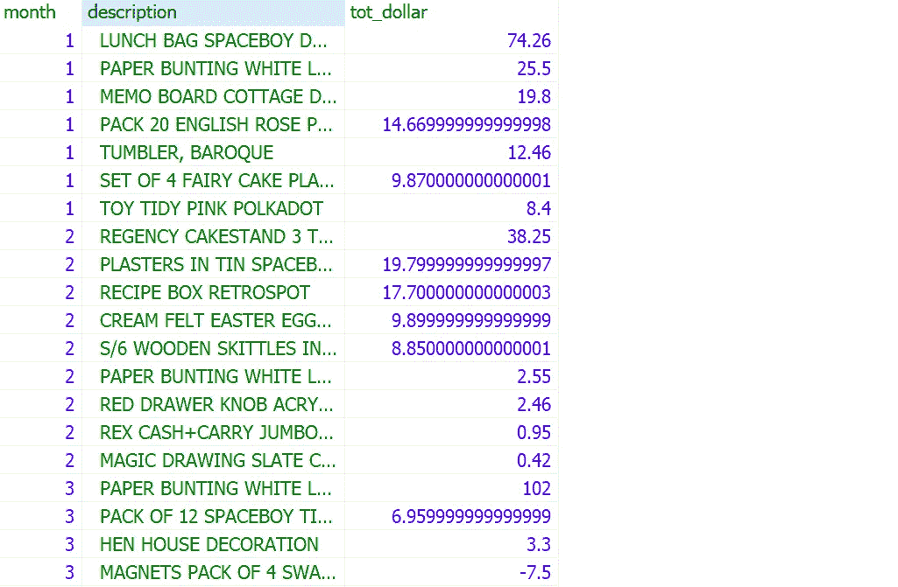
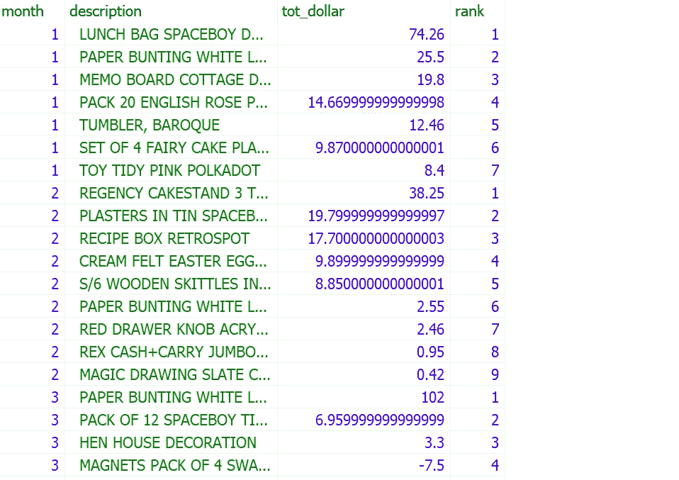
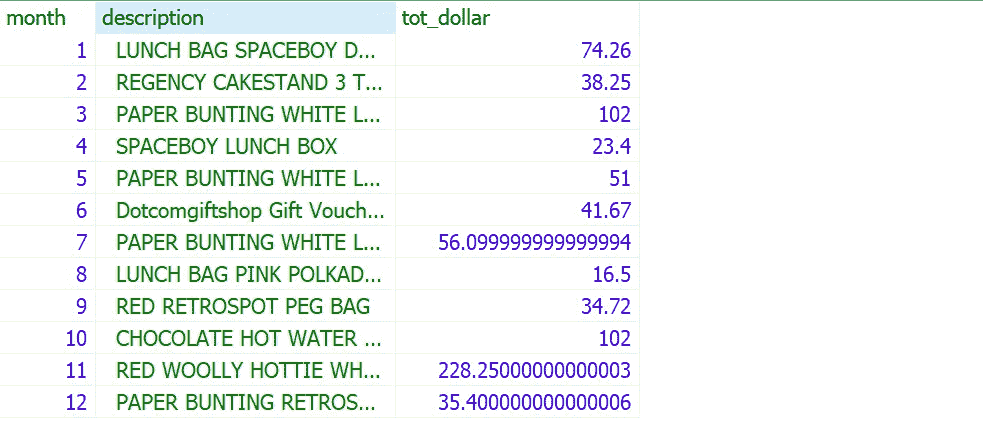

# 破解 SQL 面试问题:Date_Part 函数

> 原文：<https://towardsdatascience.com/crack-sql-interview-question-date-part-function-aff0b15478d9>

## 用有用的程序解决 SQL 问题


艾米·桑布伦在 Unsplash[上的照片](https://unsplash.com?utm_source=medium&utm_medium=referral)

在本文中，我们将回顾亚马逊数据科学访谈中的一个 SQL 问题。希望本文中解释的过程能够帮助您更有效地编写 SQL 查询。

SQL 问题:

```
**Best Selling Item**Find the best-selling item for each month (no need to separate months by year) where the biggest total invoice was paid. The best-selling item is calculated using the formula (unitprice * quantity). Output the description of the item along with the amount paid.
```

表格:在线零售



作者图片

**第一步**:先看看原始数据。

*   invoiceno:该字段包括可以唯一标识一笔交易的发票 ID。
*   stockcode:该字段包括可以唯一标识产品的产品 ID。
*   描述:此字段包括产品描述，它也可以唯一地标识产品
*   invoicedate:该字段包括交易的日期。我们需要这个字段来创建月份变量。
*   quantity、unitprice:这些字段包括给定交易中销售产品的数量和单价。
*   customerid，country:这些字段是客户 id 和国家信息，与这个问题无关。

**第二步**:大家集思广益，如何解决问题。

最终我们需要返回每个月最畅销的产品。首先，我们需要创建两个新变量，

*   金额:按照指示，交易的美元金额可以计算为(单价*数量)
*   月份:我们需要从交易日期中提取月份信息

接下来，我们可以计算每个产品在给定月份的总交易金额，然后根据每个月的交易金额对它们进行排名。最后，我们返回每个月最畅销的产品。

**第三步**:让我们准备好数据，准备好分析。在这个练习中，我们需要通过几个小步骤来准备数据。

我们可以使用下面的代码创建我们在步骤 2 中确定的两个新变量。

```
SELECT *,quantity * unitprice AS amount,DATE_PART('month', invoicedate) AS monthFROM online_retailORDER BY DATE_PART('month', invoicedate), stockcode
```

让我们详细了解一下代码:

`**DATE_PART**` :此功能允许我们从日期或时间戳值中提取时间信息，如年、月、日、时、分、秒。查看更多示例，

```
SELECTDATE_PART('year', '2014-04-01 06:16:36'::TIMESTAMP), -- returns 2014DATE_PART('month', '2014-04-01 06:16:36'::TIMESTAMP), -- returns 4DATE_PART('day', '2014-04-01 06:16:36'::TIMESTAMP), -- returns 1DATE_PART('hour', '2014-04-01 06:16:36'::TIMESTAMP), -- returns 6DATE_PART('minute', '2014-04-01 06:16:36'::TIMESTAMP), -- returns 16DATE_PART('second', '2014-04-01 06:16:36'::TIMESTAMP), -- returns 36DATE_PART('year', '2014-04-01'::DATE), -- returns 2014DATE_PART('month', '2014-04-01'::DATE), -- returns 4DATE_PART('day', '2014-04-01'::DATE), -- returns 1DATE_PART('hour', '2014-04-01'::DATE), -- returns 0 based on 00:00:00DATE_PART('minute', '2014-04-01'::DATE), -- returns 0DATE_PART('second', '2014-04-01'::DATE) -- returns 0
```

当我们运行上面的代码时，我们可以生成如下的表格。



作者图片

接下来，我们可以使用聚合函数`**SUM()**` 通过`**GROUP BY month, description**` 计算每个产品在给定月份的总交易金额。由于我们要分几个步骤准备数据，建议使用`**WITH**` 语句创建临时表。

```
WITH cte AS(SELECT *,quantity * unitprice AS amount,DATE_PART('month', invoicedate) AS monthFROM online_retail)SELECT month, description, SUM(amount) AS tot_dollarFROM cteGROUP BY month, descriptionORDER BY month, tot_dollar DESC
```

当我们运行上面的代码时，我们可以生成如下的表格。



作者图片

然后，我们根据每个月的总交易金额对产品进行排名。我们可以用[窗口中的](/crack-sql-interview-question-window-functions-with-partition-by-599d792c07c3) `**RANK()**` 功能将每个分区(即月份)用`**OVER(PARTITION BY month ORDER BY tot_dollar DESC)**`与**隔开。**

*   `**OVER**` :表示我们这里使用的函数是窗口函数，而不是[聚合函数](/data-manipulation-sql-vs-pandas-116bb33a9abf)。
*   `**PARTITION BY**` :对数据表中的行进行分区，这样我们就可以定义窗口函数将应用于哪些行。在本练习中，我们根据月份变量定义一个分区。
*   `**ORDER BY**` 用于对每个分区内的观测值进行排序。在本练习中，我们将对每个分区中的总交易金额进行排序。`**DESC**` 将确保我们从最高值到最低值对行进行排序。

```
WITH cte AS(SELECT *,quantity * unitprice AS amount,DATE_PART('month', invoicedate) AS monthFROM online_retail),monthly_total_by_product AS(SELECT month, description, SUM(amount) AS tot_dollarFROM cteGROUP BY month, description)SELECT month, description, tot_dollar,RANK() OVER(PARTITION BY month ORDER BY tot_dollar DESC) AS rankFROM monthly_total_by_product
```

当我们运行上面的代码时，我们可以生成如下的表格。



作者图片

**第四步**:第三步准备好数据后，使用`**WHERE RANK = 1**` **保存每个月最畅销的产品就变得简单了。**

**最终解决方案:**

```
WITH cte AS(SELECT *,quantity * unitprice AS amount,DATE_PART('month', invoicedate) AS monthFROM online_retail),monthly_total_by_product AS(SELECT month, description, SUM(amount) AS tot_dollarFROM cteGROUP BY month, description),monthly_ranking AS (SELECT month, description, tot_dollar,RANK() OVER(PARTITION BY month ORDER BY tot_dollar DESC) AS rankFROM monthly_total_by_product)SELECT month, description, tot_dollarFROM monthly_rankingWHERE rank = 1ORDER BY MONTH
```

**回答**:



作者图片

如果你想探索更多的 **SQL 面试问题**，请查看我的文章:

*   [**综合 SQL 备忘单**](https://medium.com/geekculture/comprehensive-sql-cheat-sheet-f821c5abf85a)
*   [**用有用的程序破解 SQL 面试问题**](/practical-sql-questions-for-data-science-interview-3b5c9d726baa)
*   [**破解 SQL 面试问题:子查询 vs CTE**](/sql-for-data-analysis-subquery-vs-cte-699ef629d9eb)
*   [**破解 SQL 面试问题:Join vs Case-When 语句**](/crack-sql-interview-question-join-vs-case-when-statement-116d40a361f0)
*   [**破解 SQL 面试题:带分区的窗口函数-By**](/crack-sql-interview-question-window-functions-with-partition-by-599d792c07c3)
*   [**破解 SQL 面试问题:Date_Part 函数**](/crack-sql-interview-question-date-part-function-aff0b15478d9)
*   [**破解 SQL 面试题:ROW_NUMBER，RANK and DENSE_RANK**](https://medium.com/geekculture/crack-sql-interview-questions-row-number-rank-and-dense-rank-ef439749f3ff)
*   [**破解 SQL 面试问题:UNNEST，STRING_TO_ARRAY**](https://python.plainenglish.io/crack-sql-interview-question-unnest-string-to-array-1b75578cbe75)
*   [**破解 SQL 面试问题:GENERATE_SERIES，STRING_AGG，SPLIT_PART**](https://medium.com/geekculture/crack-sql-interview-question-generate-series-string-agg-split-part-fbc0e5e42d7d)
*   [**破解 SQL 面试问题:自连接和非等同连接**](https://medium.com/geekculture/crack-sql-interview-question-self-join-and-non-equi-join-1cb2a181104a)
*   [**破解 SQL 面试问题:任意运算符**](https://medium.com/geekculture/crack-sql-interview-question-any-operator-d39e07e0e224)
*   [**破解 SQL 面试问题:子查询**](https://medium.com/geekculture/crack-sql-interview-question-subquery-d9db4763eef4)

# 感谢您的阅读！！！

如果你喜欢这篇文章，并且想**请我喝杯咖啡，请[点击这里](https://ko-fi.com/aaronzhu)。**

您可以注册一个 [**会员**](https://aaron-zhu.medium.com/membership) 来解锁我的文章的全部访问权限，并且可以无限制地访问介质上的所有内容。如果你想在我发表新文章时收到电子邮件通知，请 [**订阅**](https://aaron-zhu.medium.com/subscribe) 。