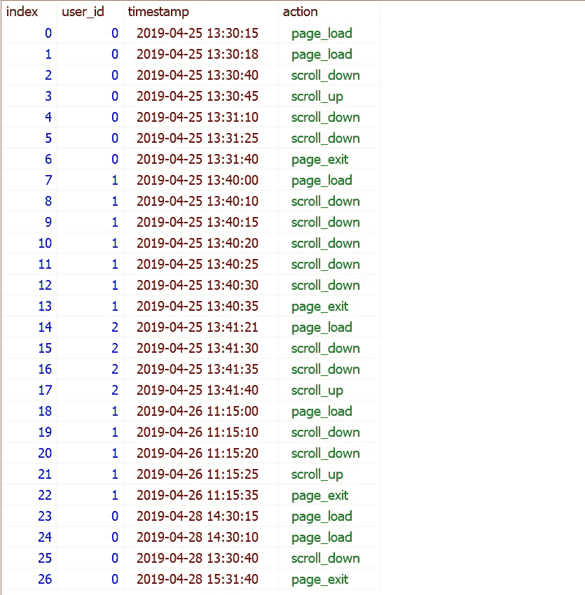
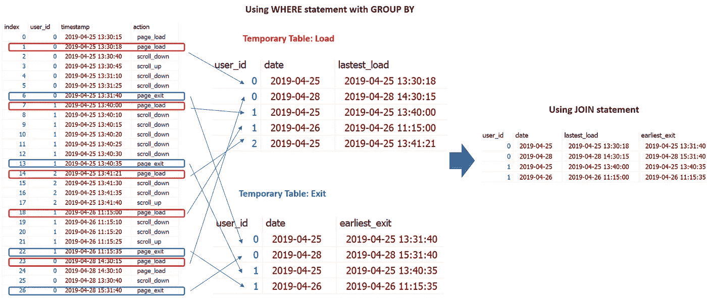
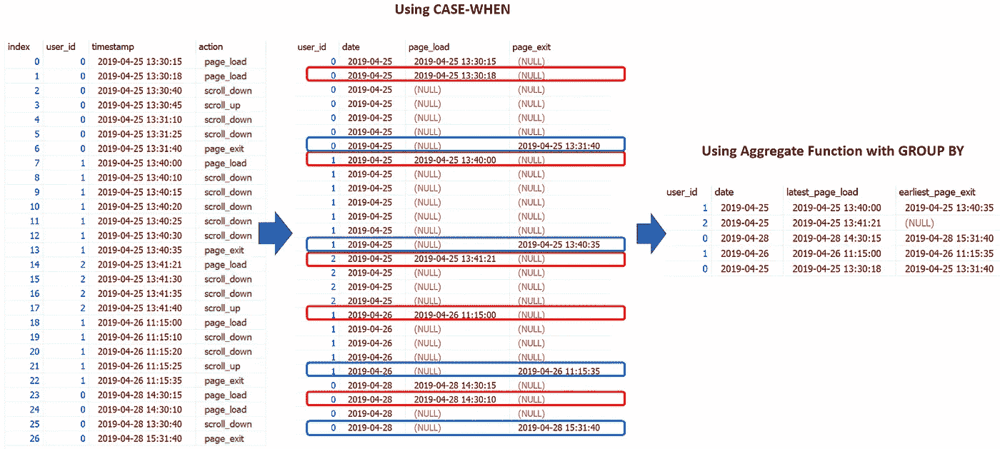
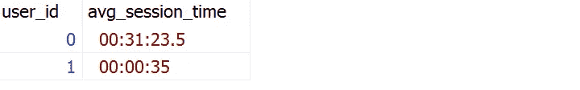

# 破解 SQL 面试问题:Join vs Case-When 语句

> 原文：<https://towardsdatascience.com/crack-sql-interview-question-join-vs-case-when-statement-116d40a361f0>

## 用有用的程序解决 SQL 问题


照片由 [LinkedIn 销售解决方案](https://unsplash.com/es/@linkedinsalesnavigator?utm_source=medium&utm_medium=referral)在 [Unsplash](https://unsplash.com?utm_source=medium&utm_medium=referral) 上拍摄

在本文中，我们将回顾脸书数据科学采访中的一个 SQL 问题。希望本文中解释的过程能够帮助您更有效地编写 SQL 查询。

SQL 问题:

```
**Users By Average Session Time**Calculate each user's average session time. A session is defined as the time difference between a page_load and page_exit. For simplicity, assume a user has only 1 session per day and if there are multiple of the same events on that day, consider only the latest page_load and earliest page_exit. Output the user_id and their average session time.Source: [stratascratch.com](https://platform.stratascratch.com/coding/10352-users-by-avg-session-time?code_type=1)
```

表格:facebook_web_log



作者图片

**第一步**:我们先看看原始数据。该表包括一系列动作，例如对于给定的用户 id，带有时间戳的“页面加载”、“向下滚动”、“向上滚动”、“页面退出”。我们被指派计算每个用户的平均会话时间。让我们澄清几件事。举个例子，

*   会话是如何定义的？根据这个问题，会话被定义为“页面加载”和“页面退出”之间的时间差。如果在给定的一天中有多个相同的事件，例如“page_load”和“page_exit”，那么考虑只使用**最新的 page_load** 和**最早的 page_exit** 。
*   如果用户在给定的一天中只有两个事件中的一个，即“页面加载”和“页面退出”。比如 2019 年 4 月 25 日，user_id 2 只有“page_load”事件，没有找到“page_exit”。我们应该如何处理这种情况？
*   同样在给定的一天中，对于用户来说，最新的 page_load 可能晚于最早的 page_exit。如果是这样，应该怎么处理？
*   这些是我们需要从面试官那里得到澄清的问题。在本练习中，如果两个事件中只有一个事件或者最晚的 page_load 比最早的 page_exit 晚，我们将排除这些记录。

**步骤 2** :我们需要确定解决问题所需的相关信息。举个例子，

*   我们只需要在“action”字段中使用值为“page_load”和“page_exit”的行，因为这就是会话时间的定义方式。
*   我们需要从时间戳变量中提取日期变量，因为这是会话时间的来源。

**步骤 3** :我们将准备数据并创建我们在步骤 2 中确定的变量。在这一步，我将使用两种不同的方法。

**方法 1:连接两个临时表，加载并退出**

*   要创建只包含“page_load”动作的加载表，我们可以使用`WHERE action = ‘page_load’`。如果一个用户在给定的日期有多个“page_load”操作，我们将只保留最新的一个。因此，我们使用`timestamp::DATE`来创建日期变量，并使用聚合函数`MAX(timestamp)`和`GROUP BY user_id, timestamp::DATE`来保存给定日期内最新的“page_load”操作。
*   为了创建只包含“page_exit”动作的退出表，我们使用了`WHERE action = ‘page_exit’`。然后我们使用聚合函数`MIN(timestamp)`和`GROUP BY user_id, timestamp::DATE`来保持给定日期内最早的“page_exit”动作。
*   一旦使用`WITH`语句创建了加载和退出表，我们就可以基于“user_id”和“date”将这两个表连接在一起。这里我们将使用`INNER JOIN`,因为我们需要在给定的一天为用户提供“page_load”和“page_event”。

```
WITH load AS(SELECT user_id,timestamp::DATE AS date,MAX(timestamp) AS lastest_loadFROM facebook_web_log**WHERE** action = 'page_load'**GROUP BY** user_id, timestamp::DATE),-- Create Exit tableexit AS(SELECT user_id,timestamp::DATE AS date,MIN(timestamp) AS earliest_exitFROM facebook_web_log**WHERE** action = 'page_exit'**GROUP BY** user_id, timestamp::DATE)SELECT a.user_id,a.date,a.lastest_load,b.earliest_exitFROM LOAD a**INNER JOIN** exit bON a.user_id = b.user_id ANDa.date = b.date
```

当我们运行上面的代码时，我们可以生成如下所示的表格:



作者图片

**方法 2:使用 CASE-WHEN 语句创建两个新列 Load 和 Exit**

*   我们可以使用`CASE-WHEN`语句，而不是使用 WHERE 语句来保持“page_load”和“page_exit”动作。代码`CASE WHEN action = ‘page_load’ THEN timestamp ELSE NULL END`可以创建一个只包含“page_load”动作时间戳的新列，并为其他动作将其设置为 NULL。我们将为“page_exit”操作编写类似的代码。
*   一旦我们有了这两个新列，我们就可以使用聚合函数`MAX()`和`MIN()`为具有`GROUP BY user_id, timestamp::DATE`的用户计算给定日期的“page_load”动作的最新时间戳和“page_exit”动作的最早时间戳。

```
SELECT user_id,timestamp::DATE AS date,**MAX**(**CASE WHEN** action = 'page_load' **THEN** timestamp **ELSE** NULL END) AS latest_page_load,MIN(CASE WHEN action = 'page_exit' THEN timestamp ELSE NULL END) AS earliest_page_exitFROM facebook_web_log**GROUP BY** user_id, timestamp::DATE
```

当我们运行上面的代码时，我们可以生成如下的表格。您将注意到此输出的不同之处——我们在 2019 年 4 月 25 日为 user_id 2 多了一条记录，因为我们使用了`INNER JOIN`来仅保留方法 1 中的匹配记录，而我们在此仅保留“page_load”和“page_exit”的所有可用记录。



作者图片

**步骤 4** :在步骤 3 中准备好数据后，计算每个 user_id 的平均会话时间应该很简单。我们只需要使用聚合函数`AVG()`和`GROUP BY user_id`。

**使用方法 1 的最终解决方案:连接两个临时表，加载并退出**

我将代码`WHERE b.earliest_exit ≥ a.lastest_load`放在最后，因为我们希望避免最新的 page_load 比最早的 page_exit 晚的情况。

```
WITH load AS(SELECT user_id,timestamp::DATE AS date,MAX(timestamp) AS lastest_loadFROM facebook_web_logWHERE action = 'page_load'GROUP BY user_id, timestamp::DATE),-- Create Exit tableexit AS(SELECT user_id,timestamp::DATE AS date,MIN(timestamp) AS earliest_exitFROM facebook_web_logWHERE action = 'page_exit'GROUP BY user_id, timestamp::DATE)SELECT a.user_id,AVG(b.earliest_exit - a.lastest_load) AS avg_session_timeFROM LOAD aINNER JOIN exit bON a.user_id = b.user_id ANDa.date = b.dateWHERE b.earliest_exit >= a.lastest_loadGROUP BY a.user_id
```

**使用方法 2 的最终解决方案:使用 CASE-WHEN 语句创建两个新列 Load 和 Exit】**

对于这个方法，我在代码中包含了,`WHERE (earliest_page_exit-latest_page_load) IS NOT NULL`,因为我们希望在 2019 年 4 月 25 日删除 user_id 2 的额外记录。

```
WITH CTE AS(SELECT user_id,timestamp::DATE AS date,MAX(CASE WHEN action = 'page_load' THEN timestamp ELSE NULL END) AS latest_page_load,MIN(CASE WHEN action = 'page_exit' THEN timestamp ELSE NULL END) AS earliest_page_exitFROM facebook_web_logGROUP BY user_id, timestamp::DATE)SELECT user_id,AVG(earliest_page_exit-latest_page_load) AS avg_session_timeFROM CTEWHERE (earliest_page_exit-latest_page_load) IS NOT NULL ANDearliest_page_exit >= latest_page_loadGROUP BY user_id
```

回答:



如果你想探索更多的 **SQL 面试问题**，请查看我的文章:

*   [**综合 SQL 备忘单**](https://medium.com/geekculture/comprehensive-sql-cheat-sheet-f821c5abf85a)
*   [**用有用的程序破解 SQL 面试问题**](/practical-sql-questions-for-data-science-interview-3b5c9d726baa)
*   [**破解 SQL 面试问题:子查询 vs CTE**](/sql-for-data-analysis-subquery-vs-cte-699ef629d9eb)
*   [**破解 SQL 面试问题:Join vs Case-When 语句**](/crack-sql-interview-question-join-vs-case-when-statement-116d40a361f0)
*   [**破解 SQL 面试题:带分区的窗口函数——By**](/crack-sql-interview-question-window-functions-with-partition-by-599d792c07c3)
*   [**破解 SQL 面试问题:Date_Part 函数**](/crack-sql-interview-question-date-part-function-aff0b15478d9)
*   [**破解 SQL 面试题:ROW_NUMBER、RANK 和 DENSE_RANK**](https://medium.com/geekculture/crack-sql-interview-questions-row-number-rank-and-dense-rank-ef439749f3ff)
*   [**破解 SQL 面试问题:UNNEST，STRING_TO_ARRAY**](https://python.plainenglish.io/crack-sql-interview-question-unnest-string-to-array-1b75578cbe75)
*   [**破解 SQL 面试问题:GENERATE_SERIES，STRING_AGG，SPLIT_PART**](https://medium.com/geekculture/crack-sql-interview-question-generate-series-string-agg-split-part-fbc0e5e42d7d)
*   [**破解 SQL 面试问题:自连接和非等价连接**](https://medium.com/geekculture/crack-sql-interview-question-self-join-and-non-equi-join-1cb2a181104a)
*   [**破解 SQL 面试问题:任意运算符**](https://medium.com/geekculture/crack-sql-interview-question-any-operator-d39e07e0e224)
*   [**破解 SQL 面试问题:子查询**](https://medium.com/geekculture/crack-sql-interview-question-subquery-d9db4763eef4)

## 感谢您的阅读！！！

如果你喜欢这篇文章，并且想**请我喝杯咖啡，**请[点击这里](https://ko-fi.com/aaronzhu)。

您可以注册一个 [**会员**](https://aaron-zhu.medium.com/membership) 来解锁我的文章的全部访问权限，并且可以无限制地访问介质上的所有内容。如果你想在我发表新文章时收到电子邮件通知，请订阅。