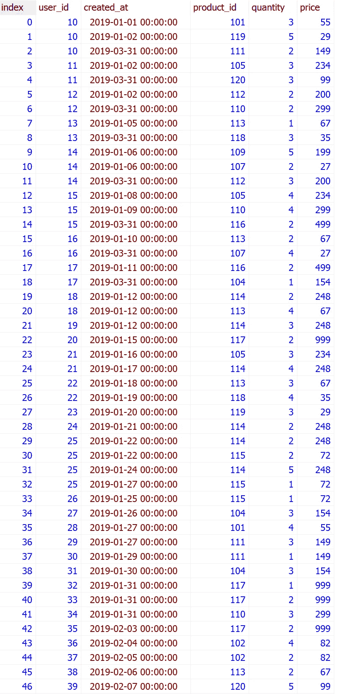
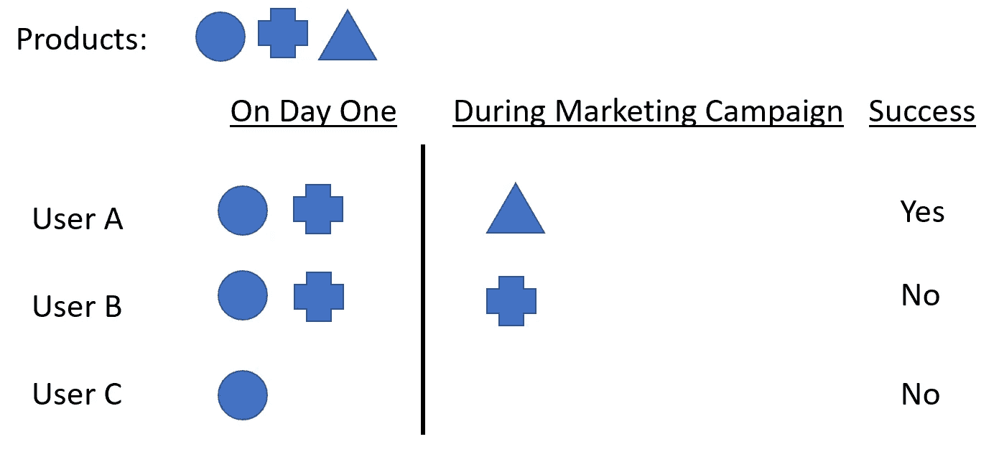
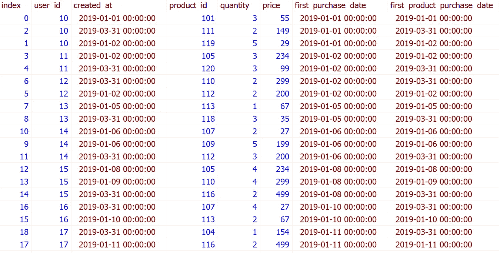
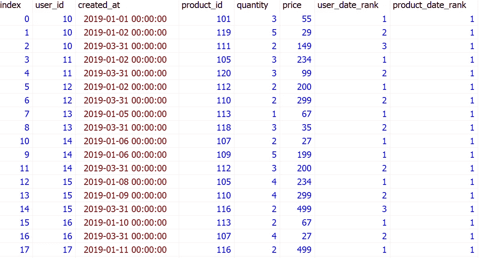

# 破解 SQL 面试问题:带分区的窗口函数

> 原文：<https://towardsdatascience.com/crack-sql-interview-question-window-functions-with-partition-by-599d792c07c3>

## 用有用的程序解决 SQL 问题


由[马文·迈耶](https://unsplash.com/@marvelous?utm_source=medium&utm_medium=referral)在 [Unsplash](https://unsplash.com?utm_source=medium&utm_medium=referral) 上拍摄的照片

在本文中，我们将回顾亚马逊数据科学访谈中的一个 SQL 问题。希望本文中解释的过程能够帮助您更有效地编写 SQL 查询。

SQL 问题:

```
**Marketing Campaign Success**You have a table of in-app purchases by user. Users that make their first in-app purchase are placed in a marketing campaign where they see call-to-actions for more in-app purchases. Find the number of users that made additional in-app purchases due to the success of the marketing campaign.The marketing campaign doesn't start until one day after the initial in-app purchase so users that only made one or multiple purchases on the first day do not count, nor do we count users that over time purchase only the products they purchased on the first day.Source: [stratascratch.com](https://platform.stratascratch.com/coding/514-marketing-campaign-success-advanced?code_type=1)
```

表格:营销活动



作者图片

第一步:让我们先检查一下原始数据。

*   user_id:该字段标识一个唯一的用户。我们确实需要这个字段来计算不同用户的数量。
*   created_at:该字段指示进行交易的日期。这可用于识别给定交易是在第一天(首次应用内购买时)还是在营销活动期间(首次应用内购买后一天开始)进行的
*   product_id:该字段标识唯一的产品。与 created_at 结合使用，它们可以用来识别给定的产品是在第一天购买的还是在营销活动期间购买的，或者两者都有。
*   数量和价格:这两个字段表示与给定交易相关的数量和价格。他们与这个问题无关。

**第二步**:大家集思广益，如何解决问题。

这个练习最重要的任务是找出如何识别

*   在营销活动期间购买新产品的用户(即成功)
*   在营销活动的第一天购买了相同产品的用户(即失败)
*   在营销活动中没有购买任何产品的用户(即失败)



作者图片

一旦我们将用户分类到正确的类别中，我们就可以很容易地统计出由于营销活动的成功而购买新产品的不同用户的数量。

**第三步**:让我们准备好数据，准备好分析。

**方法一:利用窗口功能，** `**MIN()**` **配合** `**OVER-PARTITION-BY**`

我们需要构造两个新的变量

*   first_purchase_date:这个字段将给出给定用户进行应用内购买的第一天。
*   first_product_purchase_date:该字段将给出用户购买给定产品的第一天

可以运行以下脚本来产生这两个变量。

```
SELECT *,MIN(created_at) OVER (PARTITION BY user_id) AS first_purchase_date,MIN(created_at) OVER (PARTITION BY user_id, product_id) AS first_product_purchase_dateFROM marketing_campaign
```

让我们详细了解一下代码:

*   `**MIN()**` :这是我们用来计算每个分区中最早购买日期的窗口函数。还有其他的窗口函数，比如 max，sum，行号，rank 等。
*   `**OVER**` :表示我们这里使用的函数是窗口函数，不是[聚合函数](/data-manipulation-sql-vs-pandas-116bb33a9abf)。
*   `**PARTITION BY**` :对数据表中的行进行分区，这样我们就可以定义窗口函数将应用于哪些行。在本练习中，“first_purchase_date”是在 user_id 分区上计算的，而“first_product_purchase_date”是在 user_id 和 product_id 分区上计算的。

当我们运行上面的代码时，我们可以生成如下的表格。让我们检查一下新变量是否有意义。例如，user_id 10 在 2019 年 1 月 1 日进行了第一次应用内购买。该用户购买了三种不同的产品，101、111 和 119，最早购买日期分别为 2019 年 1 月 1 日、2019 年 3 月 31 日和 2019 年 1 月 2 日。有了这两个变量，我们很容易得出结论，user_id 10 在营销活动中购买了两个新产品。



作者图片

创建这两个新变量后，我们可以使用`WHERE first_purchase_date < first_product_purchase_date`标记营销活动期间(从首次应用内购买日期后一天开始)购买的新产品用户。

**方法二:利用窗口功能，** `**DENSE_RANK()**` **配合** `**OVER-PARTITION-BY**`

类似地，我们需要构造两个新变量。

*   user_date_rank:该字段将为我们提供给定用户的购买日期顺序。例如，`user_date_rank = 1`代表给定用户进行应用内购买的第一天。`user_date_rank = 2`代表第二早的日期，以此类推。因此，`user_date_rank > 1` 代表营销活动期间的购买记录。
*   product_date_rank:该字段将给出给定用户和产品的购买日期顺序。例如，`product_date_rank = 1` 表示用户购买给定产品的第一天。

可以运行以下脚本来产生这两个变量。

```
SELECT  *,DENSE_RANK() OVER (PARTITION BY user_id ORDER BY created_at) AS user_date_rank,DENSE_RANK() OVER (PARTITION BY user_id, product_id ORDER BY created_at) AS product_date_rankFROM marketing_campaign
```

让我们详细了解一下代码:

*   `**DENSE_RANK**`:这是一个常用的窗口功能。此函数给出每个分区中每行的排名，即使出现平局，也有连续的排名值。比如 1，2，2，3，…`**RANK**` 是一个交替排序函数。不同的是，如果出现平局，后者会在排名值上产生差距。例如，1、2、2、4……对于这个练习，`**DENSE_RANK**`用起来更合适。
*   `**ORDER BY**` 用于对每个分区内的观测值进行排序。在本练习中，我们将对每个分区中的购买日期进行排序。

当我们运行上面的代码时，我们可以生成如下的表格。让我们检查这些新变量。例如，user_id 10 在 2019 年 1 月 1 日、2019 年 1 月 2 日和 2019 年 3 月 31 日这三个不同的日期进行了购买，这些日期从最早到最晚分别以订单号(即，“user _ date _ rank”)1、2、3 排序。该用户购买了三种不同的产品，101、119 和 111。“product_date_rank”中的订单编号 1、1 和 1 表示该用户只购买了这三种产品一次。



作者图片

在我们创建这两个新变量之后，我们可以使用`WHERE user_date_rank > 1`来检查在营销活动期间是否进行了购买。我们还可以使用`WHERE product_date_rank = 1`检查给定产品是否是第一次购买。结合这两个条件，我们可以标记给定用户在营销活动中购买的新产品的记录。

**步骤 4** :一旦在步骤 3 中准备好数据，我们就可以计算在营销活动中购买新产品的不同用户的数量。我们只需要使用聚合函数`COUNT(DISTINCT)`和`WHERE` 语句来保存符合标准的记录。

**最终解决使用方法 1:使用窗口功能，** `**MIN()**` **与** `**OVER-PARTITION-BY**`

```
WITH cte AS (SELECTuser_id,MIN(created_at) OVER (PARTITION BY user_id) AS first_purchase_date,MIN(created_at) OVER (PARTITION BY user_id, product_id) AS first_product_purchase_dateFROM marketing_campaign)SELECT COUNT(DISTINCT(user_id))FROM cteWHERE first_purchase_date < first_product_purchase_date;
```

**最终解决使用方法二:使用窗口功能，** `**DENSE_RANK()**` **与** `**OVER-PARTITION-BY**`

```
WITH cte AS (SELECTuser_id,DENSE_RANK() OVER (PARTITION BY user_id ORDER BY created_at) AS user_date_rank,DENSE_RANK() OVER (PARTITION BY user_id, product_id ORDER BY created_at) AS product_date_rankFROM marketing_campaign)SELECT COUNT(DISTINCT user_id)FROM cteWHERE user_date_rank > 1 AND product_date_rank = 1;
```

**答案:23**

如果你想探索更多的 **SQL 面试问题**，请查看我的文章:

*   [**综合 SQL 备忘单**](https://medium.com/geekculture/comprehensive-sql-cheat-sheet-f821c5abf85a)
*   [**破解 SQL 面试问题有用程序**](/practical-sql-questions-for-data-science-interview-3b5c9d726baa)
*   [**破解 SQL 面试问题:子查询 vs CTE**](/sql-for-data-analysis-subquery-vs-cte-699ef629d9eb)
*   [**破解 SQL 面试问题:Join vs Case-When 语句**](/crack-sql-interview-question-join-vs-case-when-statement-116d40a361f0)
*   [**破解 SQL 面试题:带分区的窗口函数-By**](/crack-sql-interview-question-window-functions-with-partition-by-599d792c07c3)
*   [**破解 SQL 面试问题:Date_Part 函数**](/crack-sql-interview-question-date-part-function-aff0b15478d9)
*   [**破解 SQL 面试题:ROW_NUMBER、RANK 和 DENSE_RANK**](https://medium.com/geekculture/crack-sql-interview-questions-row-number-rank-and-dense-rank-ef439749f3ff)
*   [**破解 SQL 面试问题:UNNEST，STRING_TO_ARRAY**](https://python.plainenglish.io/crack-sql-interview-question-unnest-string-to-array-1b75578cbe75)
*   [**破解 SQL 面试问题:GENERATE_SERIES，STRING_AGG，SPLIT_PART**](https://medium.com/geekculture/crack-sql-interview-question-generate-series-string-agg-split-part-fbc0e5e42d7d)
*   [**破解 SQL 面试问题:自连接和非等同连接**](https://medium.com/geekculture/crack-sql-interview-question-self-join-and-non-equi-join-1cb2a181104a)
*   [**破解 SQL 面试问题:任意运算符**](https://medium.com/geekculture/crack-sql-interview-question-any-operator-d39e07e0e224)
*   [**破解 SQL 面试问题:子查询**](https://medium.com/geekculture/crack-sql-interview-question-subquery-d9db4763eef4)

# 感谢您的阅读！！！

如果你喜欢这篇文章，并且想**请我喝杯咖啡，请[点击这里](https://ko-fi.com/aaronzhu)。**

您可以注册一个 [**会员**](https://aaron-zhu.medium.com/membership) 来解锁我的文章的全部访问权限，并且可以无限制地访问介质上的所有内容。如果你想在我发表新文章时收到电子邮件通知，请 [**订阅**](https://aaron-zhu.medium.com/subscribe) 。