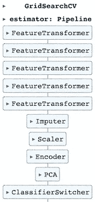
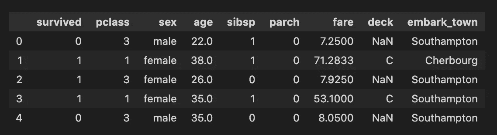
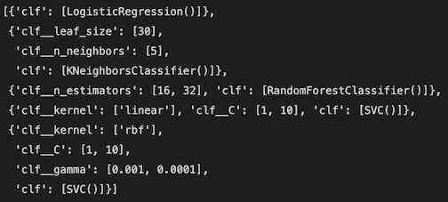
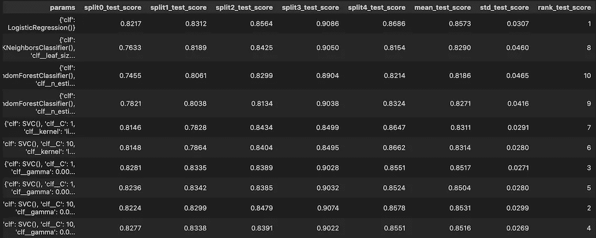
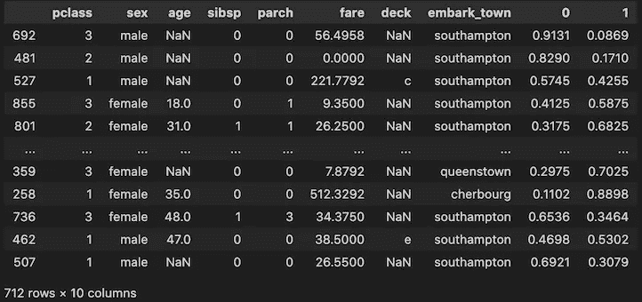

# 为机器学习步骤设计一个管道

> 原文：<https://towardsdatascience.com/crafting-one-pipeline-for-machine-learning-steps-373f03e44e1b>

## 使用 scikit-learn 从输入转换到网格搜索

“一条管道来统治他们，一条管道来寻找他们，一条管道来把他们都带来并在亮度上适合他们。

由[罗迪翁·库察耶夫](https://unsplash.com/es/@frostroomhead?utm_source=medium&utm_medium=referral)在 [Unsplash](https://unsplash.com?utm_source=medium&utm_medium=referral) 上拍摄的照片

当我们查看市面上一本机器学习书籍的“目录”(即[G*er*on，2019](#0195) )时，我们看到，在获取数据并将其可视化以获得洞察力之后，大致上有数据清洗、转换和处理数据属性、缩放特征、训练然后微调模型等步骤。数据科学家钟爱的模块 [scikit-learn](https://scikit-learn.org/stable/) ，有一个惊人的功能(类)以一种简化的方式处理这些步骤: [Pipeline](https://scikit-learn.org/stable/modules/generated/sklearn.pipeline.Pipeline.html) 。

在探索在线管道的最佳用途时，我遇到了一些很棒的实现。Luvsandorj 很好地解释了它们是什么(2020)，并展示了如何定制一个更简单的(2022)。[G*er*on](#0195)(2019，p . 71–72)举了一个例子，写了我们“自己的自定义转换器，用于自定义清理操作或组合特定属性等任务”。迈尔斯 (2021)展示了如何用一个分类器的流水线来运行网格搜索。另一方面， [Batista](#0195) (2018)提出了如何在没有管道的情况下在网格搜索中包括大量分类器。

# 介绍

在这篇文章中，我将把这些来源结合起来，提出一个最终的 ML 管道，它可以处理大多数 ML 任务，如(I)特征清理，(ii)处理缺失值，(iii)缩放和编码特征，(iv)降维，以及(v)运行许多具有不同参数组合的分类器(网格搜索)，如下图所示。

作者图片

# 目录

[**I-库和数据集**](#15c5)

[**II-设置类**](#a59b)

[**III-设置网格搜索参数**](#3134)

**四、建筑及安装管道**

**[**V——计算分数**](#190c)**

**[**结论**](#8381)**

# ****信息库和数据集****

**为了简单起见，让我们使用 Titanic 数据集，它可以很容易地从 [seaborn 库](#0195)加载。**

****

**作者图片**

# ****II-设置类别****

**我们需要为此流程创建以下类:**

*   **“FeatureTransformer”操作熊猫数据框，列。例如，虽然它对模型没有影响，但我添加了一个“strlowercase”参数，该参数可以应用于一列(的列表)来转换数据。*(受* [*启发 g 埃隆*](#0195)*)2019 年第 71–72 页***
*   **处理缺失值的“估算器”(类似于 sklearn 的[简单估算器类](https://scikit-learn.org/stable/modules/generated/sklearn.impute.SimpleImputer.html))**
*   **处理缺失值的“缩放器”(类似于 sklearn 的[标准缩放器类](https://scikit-learn.org/stable/modules/generated/sklearn.preprocessing.StandardScaler.html))**
*   **【编码器】对(分类的或顺序的)特性进行编码*(受*[*Luvsandorj*](#0195)*，2022***
*   **“分类器开关”用于在网格搜索步骤中的分类器之间切换。*(灵感来自***，2021)****

# *****III-设置网格搜索参数*****

***我们创建两个字典*(灵感来自* [*巴蒂斯塔*](#0195) *，2018)* :***

***1- models_for_gridsearch =分类器名称作为关键字，分类器对象作为值***

***2- params_for_models =分类器名称作为关键字，分类器超参数作为:***

*   ***空字典(如 LogisticRegression 行含义分类器将与默认参数一起使用)或***
*   ***带列表的词典(KNeighboursClassifier 或 RandomForestClassifier 行)***
*   ***字典列表(如 SVC 行)***

****注意:为了简单起见，我注释掉了其他的分类器对象。****

***我们的目标是创建一个包含分类器和参数选择的字典列表，然后在网格搜索中使用它们。***

******

***作者图片***

# *****四-建筑和安装管道*****

***我们已经为我们的管道创建了我们需要的类。是时候按顺序使用它们并使其适合了。***

***我们有一条管道***

*   ***为我们的列分配数据类型，***
*   ***对一些列进行基本的数据转换***
*   ***估算数字列的缺失值，并对其进行缩放***
*   ***编码分类列，***
*   ***减少尺寸，***
*   ***进料后通过分类器。***

***在将数据分成训练集和测试集之后，我们将这个管道与网格搜索管道参数一起输入到 GridSearchCV 中，以找到最佳评分模型，并使其适合我们的训练集。***

***最佳参数:{'clf': LogisticRegression()}***

***最高分:0.8573***

******

***按作者排列图像的网格搜索模型***

# *****V-计算分数*****

***我们可以使用拟合的管道(pipeline_gridsearch)来计算分数或找到属于我们的目标状态的每个实例的概率。***

***训练 ROC-AUC: 0.8649***

***测试 ROC-AUC: 0.8281***

******

***作者图片***

***可以看出，由于我们的 FeatureTransformer 步骤，embark town 值是小写的。毕竟，这是为了证明我们可以在管道内转换我们的特性。***

# ***结论***

***定制 sklearn 类的方式可以(I)转换和预处理我们的特性，(ii)使多个 ML 模型适合各种超参数，有助于增加代码的可读性，并更好地控制 ML 步骤。尽管这种方法需要顺序计算(请参见下图),而多管道方法可以提供并行化，尽管边际时间损失，**单独构建一个管道**在我们需要循环通过许多条件、参数、预处理步骤来查看它们对模型的影响的环境中会更有益。***

******

***作者图片***

# ***参考***

*   ***g*er*on，A. (2019)。使用 Scikit-Learn、Keras 和 TensorFlow 进行机器学习:构建智能系统的概念、工具和技术。).奥赖利。***
*   ***Luvsandorj，Z 2020，“Pipeline，column transformer and feature union explained”，数据科学方向*，*9 月 29 日，2022 年 10 月 21 日访问，<[https://Towards Data Science . com/Pipeline-column transformer-and-feature union-explained-f 5491 f815 f](/pipeline-columntransformer-and-featureunion-explained-f5491f815f)>***
*   ***Luvsandorj，Z 2022，“从 ML 模型到 ML 管道”，走向数据科学*，*5 月 2 日，2022 年 10 月 21 日访问，<[https://towardsdatascience . com/From-ML-Model-to-ML-Pipeline-9f 95 c 32 c 6512](/from-ml-model-to-ml-pipeline-9f95c32c6512)>***
*   ***Miles，J . 2021，“充分利用 scikit-learn Pipelines”，走向数据科学*，*7 月 29 日，2022 年 10 月 21 日访问，<[https://Towards Data Science . com/Getting-the-Most-out-of-scikit-learn-Pipelines-C2 AFC 4410 f1a](/getting-the-most-out-of-scikit-learn-pipelines-c2afc4410f1a)>***
*   ***Batista，D . 2018，“scikit-learn 中跨多个模型的超参数优化”，个人博客，2 月 23 日，2022 年 10 月 21 日访问，<[https://www . davidsbatista . net/blog/2018/02/23/model _ optimization/](https://www.davidsbatista.net/blog/2018/02/23/model_optimization/)，***
*   ***瓦斯科姆，法学硕士，(2021 年)。seaborn:统计数据可视化。《开源软件杂志》，6 卷(60 期)，3021 页，【https://doi.org/10.21105/joss.03021 ***