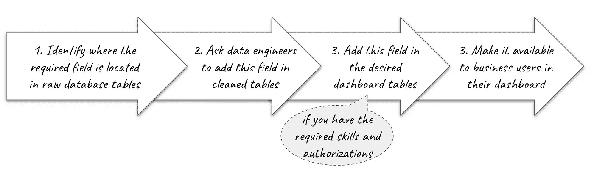
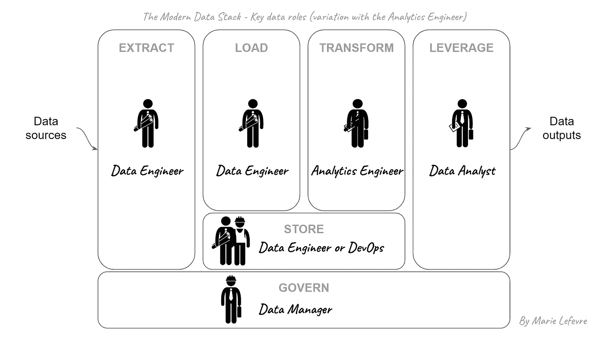
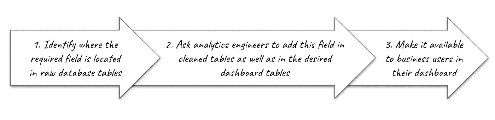

# 热潮还是潮流？解读分析工程师的角色

> 原文：<https://towardsdatascience.com/craze-or-trend-decoding-the-role-of-an-analytics-engineer-73ad0ed6555c>

## 数据作业

## 这个新角色在数据团队中处于什么位置？你为什么要关心它？

努力融入——照片由 [SHVETS 制作](https://www.pexels.com/photo/fresh-lemons-with-juicy-flesh-on-blue-background-7195055/)

几年来,“分析工程师”一词一直被用于数据科学领域来描述一个新的数据角色**。例如，在【2021 年 1 月发表的一篇文章中，Prukalpa Sankar 提到了分析工程师等新角色的出现。是不是说数据相关的工作范围还没定？绝对的。**我们是否应该认为分析工程师是*任何数据团队未来都需要的*下一个数据角色？**如果是，如何过渡到这个角色？这就是我想在这篇文章中讨论的。**

自从我转行到数据世界，我一直是一名数据分析师。当我与数据工程师一起工作时，我的一个挫折——我猜我不是唯一有这种感觉的人——是**依赖其他人**来访问原始数据库表中可用的一些字段，但这些字段在我们的数据架构的**转换层中还不可用。**

在我进入分析工程师角色的细节之前，让我详细说明一下这个具体的用例。一个来自营销业务用户的数据请求刚刚到达我的办公桌:他们想在他们的仪表板中添加一个特定的过滤器。这将是我作为数据分析师的工作，为他们在仪表板中添加这个新的过滤器。那么问题是什么呢？他们请求的字段确实在原始数据源中(例如，数据工程师从 Google Analytics 中提取的数据),但不在构建仪表板的清理过的表中。在这种情况下，我会遵循以下流程:

玛丽·勒费夫尔

这是一个漫长的过程，不是吗？对于数据工程师来说，这通常不是他们最喜欢的请求类型，因为没有战略思维:将这个字段从原始数据源添加到清理后的表中只是一个简单的操作。**这正是分析工程师能够满足这种需求的地方。**

# 什么是分析工程师？

正如 Claire Carroll 在这篇[分析工程介绍文章](https://www.getdbt.com/what-is-analytics-engineering/)中所说，分析工程师的工作可以总结如下:

> “分析工程师向终端用户提供干净的数据集，以一种让终端用户能够回答他们自己的问题的方式建模数据。”

在这方面，**分析工程师位于数据生命周期**中的数据工程师和数据分析师之间。数据工程师构建数据集成并维护数据平台，而分析工程师将版本控制、测试和持续集成应用于分析代码。数据分析师进行深度分析并为业务用户构建仪表盘，而分析工程师则提供可供分析的转换数据。

因此，如果我们看看现代数据堆栈的[不同数据角色](/data-unicorns-are-rare-so-hire-these-3-people-instead-80d3c3808af8)，分析工程师涵盖了数据工程师的部分工作和数据分析师的部分工作。这是我对现代数据堆栈框架内分析工程师角色的描述:

玛丽·勒费夫尔

# 为什么会出现这种情况，这种趋势会持续下去吗？

2021 年 7 月，这篇名为[“我们紫色的人”](https://www.getdbt.com/blog/we-the-purple-people/)的文章发表在 dbt 的博客上。对我来说，它为理解为什么分析工程师的工作会出现以及为什么它会一直存在打下了基础。最近(2022 年 8 月)，Reddit 上发布了一张图表，显示了 dbt 社区中数据职位发布的演变。确定的趋势之一是**自 2019 年以来，分析工程师**不可否认的出现。因此，毫无疑问，分析工程师的兴趣和工作岗位一直在增长。

为什么会这样呢？我发现的第一个原因是**数据管道越来越复杂**。随着您公司的数据在所有部门中结构化和丰富化，很难对每件事都保持关注。即使当数据团队设法协调他们自己并正确地共享信息时，当从数据分析师到数据工程师(可能反之亦然)的请求数量不断增加时，也会出现一些摩擦。

另一个原因是一些数据分析师愿意**更多地参与数据管道的上游**(换句话说:在转换步骤期间)以及一些数据工程师希望**更接近业务需求**。随着工作的发展，通常有两条路可以走:要么你专攻某一领域，成为专家；要么你保持全才，成为经理或团队领导。如果数据角色有第三种方式会怎样？这就是分析工程师的工作:在获得新技能的同时保持通才。

# 你应该成为一名分析工程师吗？

我认为**今天的分析工程师**来自数据堆栈的转换层的两个方面。由于数据分析师的就业市场比数据工程师的就业市场更广泛，竞争也更激烈，我可以想象更多的数据分析师将成为分析工程师。至于**未来**的分析工程师(换句话说:就业市场的新人)，我已经在网上看到了分析工程训练营和其他培训。

如果你是一名数据分析师，对数据在分析之前是如何转换的感到好奇，那么成为一名分析工程师**会教你如何根据业务用户的需求对数据建模**。如果你是一名数据工程师，却错过了工作中的一些业务方面，那么成为一名分析工程师会让你更接近业务用户。

如果你已经有一些技术背景，或者你已经是一名数据分析师或数据工程师，过渡到分析工程师职位的最佳方式可能是完善你自己的技能。通过查看在线资源，你可以建立一个对你最有益的“定制”培训。例如，我看到了 Madison Mae 写的一本[“入门”指南](https://madisonmae.substack.com/p/aspiring-analytics-engineers-start)，她详细描述了任何分析工程师都应该具备的基础。

# 结论

回到我的介绍性例子，让我们想象一下，我现在可以**依靠分析工程师**，而我仍然是营销团队的数据分析师。在这种情况下，在从源到仪表板的数据管道中添加新字段将遵循以下过程:

玛丽·勒费夫尔

会不会更有效率？我认为确实如此，因为它减少了中间环节的数量，而分析工程师专门负责对数据建模，并确保数据生命周期中的数据质量。

你喜欢阅读这篇文章吗？ [*成为会员*](https://marie-lefevre.medium.com/membership) *加入一个不断成长的充满好奇心的社区吧！*

 