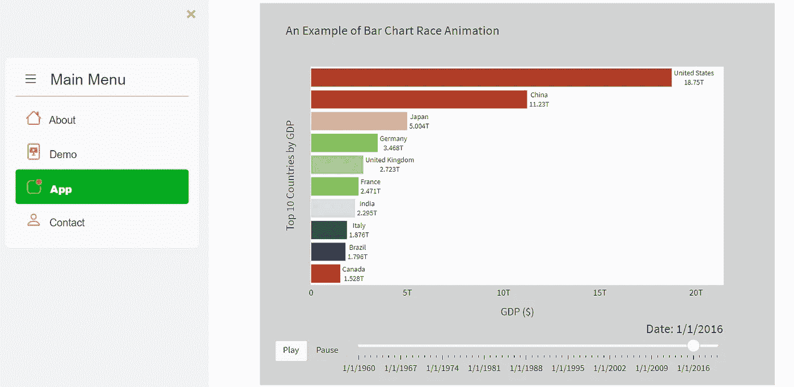
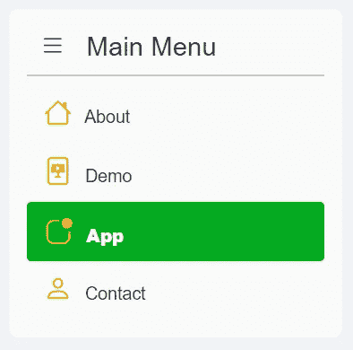
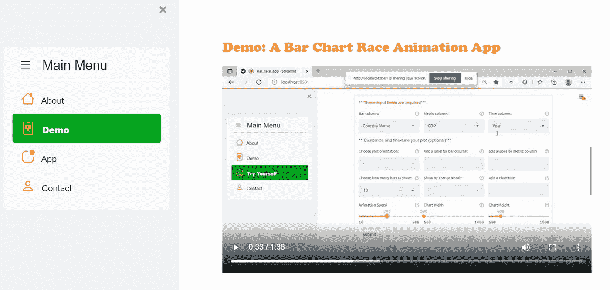
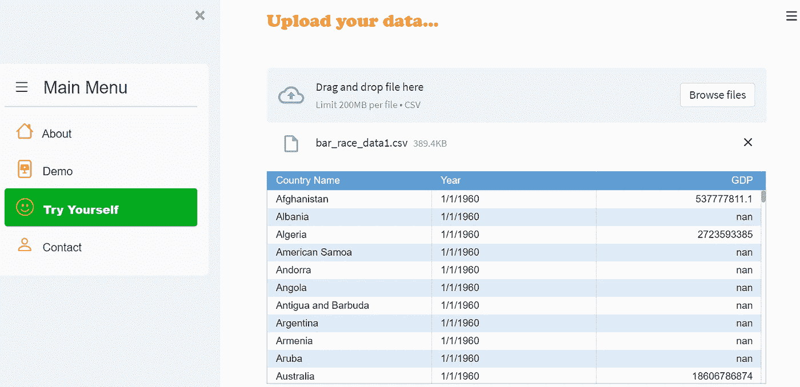
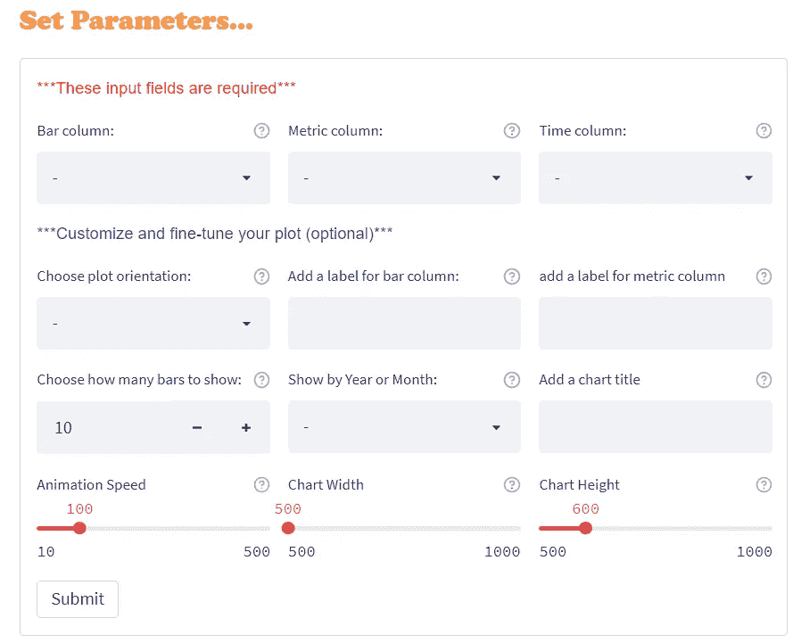
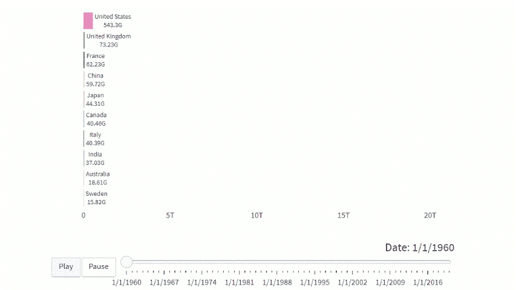
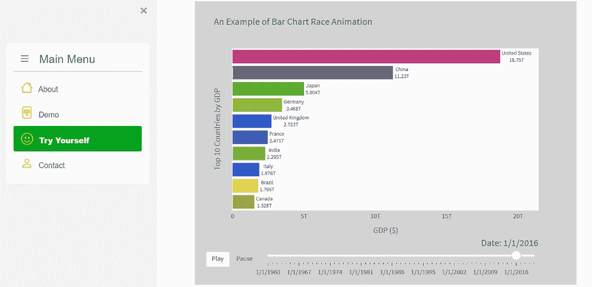

# 使用 Streamlit 和 Raceplotly 创建一个条形图比赛动画应用程序

> 原文：<https://towardsdatascience.com/create-a-bar-chart-race-animation-app-using-streamlit-and-raceplotly-e44495249f11>

## 了解如何使用 Streamlit 构建一个无需编码即可在几秒钟内生成条形图比赛动画的应用程序


图片由[皮克斯拜](https://pixabay.com/photos/up-growth-success-arrow-graphic-2081170/)(作者修改)

# 介绍

条形图竞赛是一个有趣的数据可视化，显示随着时间的推移，随着条形图的演变而变化的数据。它被广泛有效地用作一种可视化类型，以显示和评估一组实体在定义的时间范围内的排名。

在过去，用 Python(例如`Plotly`)创建条形图竞赛并不是一件容易的事情，需要大量的编码。幸运的是，我找到了这个名为`raceplotly`的包，它是专门为用几行简单的 python 代码创建这样一个图形而编写的。当我需要创建一个条形图比赛动画时，它确实节省了我很多时间和头痛。

然后，我进一步思考:我们创建一个应用程序，让用户快速轻松地创建条形图比赛动画，而无需编写任何代码或了解 python，如何？这可能是一个很酷的动手项目，以提高我的 Streamlit 技能！你感兴趣吗？

所以，没有进一步的拖延，让我们开始建立这个应用程序。我们将要创建的应用程序如下所示(2 分钟的 YouTube 视频演示):

作者的 YouTube 视频



作者图片

# 先决条件

**安装 Streamlit:**

可以参考下面的[文章](/streamlit-hands-on-from-zero-to-your-first-awesome-web-app-2c28f9f4e214)，按照说明安装 Streamlit，学习基础知识。

</streamlit-hands-on-from-zero-to-your-first-awesome-web-app-2c28f9f4e214>  

## 安装以下软件包:

```
pip install raceplotlypip install streamlit-aggridpip install streamlit-option-menu
```

# 导入库

# 应用程序设计概述

先简单说一下 app 的整体布局和设计。在我之前的[文章](https://medium.com/codex/create-a-multi-page-app-with-the-new-streamlit-option-menu-component-3e3edaf7e7ad)中，我们谈到了如何使用`streamlit-option-menu`来创建一个漂亮的、专业外观的导航菜单。

<https://medium.com/codex/create-a-multi-page-app-with-the-new-streamlit-option-menu-component-3e3edaf7e7ad>  

我们可以对这个应用程序做同样的事情。我们将创建一个多页应用程序，包括:

*   “关于”页面:介绍应用程序或应用程序创建者
*   “演示”页面:显示了该应用程序的简短视频演示
*   应用程序页面:允许用户上传一个 csv 文件，并立即生成一个条形图比赛动画
*   “联系人”页面:显示供用户填写的联系人表单

在本帖中，我们将主要关注“应用”页面，因为我们已经在前述[文章](https://medium.com/codex/create-a-multi-page-app-with-the-new-streamlit-option-menu-component-3e3edaf7e7ad)中讨论了如何使用`streamlit-option-menu`创建多页面应用。对于“应用”页面，我将详细解释代码，而对于其他页面，代码非常简单易懂。



作者图片

# 在边栏中创建菜单

首先，让我们使用`streamlit-option-menu`创建一个菜单，并使用下面的代码将其添加到侧边栏。

# 创建“关于”页面

接下来，让我们使用下面的代码创建“关于”页面:

# 创建“演示”页面

我们可以创建一个演示页面，显示一个简短的视频剪辑来演示应用程序。为此，您可以录制一个关于该应用程序的短视频，并将其保存为. mp4 媒体文件，路径与 python 文件相同。

在下面的代码中，第 6–7 行将视频文件读入 Streamlit，第 8 行使用`st.video()`显示视频播放器。从 Streamlit 的[文档](https://docs.streamlit.io/library/api-reference/media/st.video)来看，看起来你也可以通过直接指向 YouTube URLs 来显示 YouTube 视频，这非常好！



作者图片

# 创建“应用程序”页面:

## 步骤 1:添加文件上传程序

这是酒吧比赛生成器的应用程序页面，也是应用程序中最重要的页面。我们将在这里花大量的时间解释这个页面是如何创建的。

我们首先创建一个文件上传程序，允许用户上传一个 csv 文件，然后使用`st.aggrid()`将数据显示为一个格式良好的表格。你需要记住的一件重要的事情是，在我们使用`st.file_uploader()`创建一个文件上传程序(第 8 行)之后，我们需要将剩余的代码(第 10–21 行)放在`if uploaded_file is not None:`语句中。使用此语句可以确保当 csv 文件尚未上传时，应用程序不会因为找不到任何要导入和显示的文件而抛出任何错误消息。



作者图片

## 第二步:使用`Raceplotly`创建条形图比赛动画

在用户上传数据后，我们希望将该数据传递给幕后的 dataframe，并使用`raceplotly`生成 bar race 图。如果没有`raceplotly`，可以通过运行下面的命令行来安装:

```
pip install raceplotly
```

要使用`raceplotly`创建一个酒吧比赛图，您只需要两行带有几个参数的代码。下面是一个使用我们之前上传的样本数据创建条形图比赛动画的例子。

```
raceplot = barplot(df,  item_column='Country Name', value_column='GDP', time_column='Year')

raceplot.plot(item_label = 'Top 10 Countries', value_label = 'GDP ($)', frame_duration = 800)
```

这里最重要和必需的参数是:

*   `item_column`:表示要排名的项目/栏的列名(如国家、团队、公司等)。)
*   `value_column`:表示用于排名的数值/指标的列名(如国内生产总值、人口、分数等)。)
*   `time_column`:表示时间变量的列名(如年、月等)。).

其余的论点(如 `item_label`、`value_label`等)。)只是自定义和微调剧情的方法。如果你想了解更多关于这些参数的信息，你可以在这里阅读官方`raceplotly`文档[。](https://pypi.org/project/raceplotly/)

## 步骤 3:创建输入部件来接收用户输入

上面两行代码的问题是，当用户上传他们自己的数据时，数据很可能具有与上面的例子不同的列名。因此，除非用户明确告诉我们，否则我们不知道应该为`item_column`、`value_column`或`time_column`使用哪个列名。

因此，我们需要在应用程序中创建一些用户输入小部件，以接受用户对这些参数的输入。我们还可以添加一些小部件，允许用户对情节进行各种定制，以增强应用程序的用户体验。



作者图片

如上图所示，我们将创建 12 个输入参数，排列成 4 行 3 列。前三个参数是**必需的**字段，而其余的是可选的。让我们用下面的代码来看看如何做到这一点。确保在`if uploaded_file is not None:`语句中插入的代码具有正确的缩进。

让我们更详细地看看上面的代码:

第 3–5 行:创建一个包含用户上传数据中所有列名的列表。我还在列表的开头加了一个“-”。这是我用来在窗口小部件中允许默认选择为'-'的一个小技巧，这样对用户来说更明确，他们必须从列表中选择一些东西。

第 7–15 行:创建前 3 个参数，并使用`st.columns()`并排显示它们。注意，我们还可以通过在`st.selectbox()`小部件中包含`help=`来在小部件上显示一个小的帮助图标。

第 17–50 行:创建其余的参数。这些参数是可选的，允许用户定制或微调图，例如改变条的方向、调整动画速度、改变图的大小等。

第 6 行和第 52 行:我们使用`st.form()`和`st.form_submit_button()`来批量输入所有的小部件，这样用户就可以随心所欲地与小部件进行交互，而不会在每次更改小部件时触发应用程序的重新运行。

## 步骤 4:生成条形图比赛动画

在用户提交他们的输入部件选择后，我们将把他们的输入传递给`raceplotly`并生成条形图比赛动画。但在此之前，我们需要首先关注两件重要的事情:

1.  我们希望确保用户为前三个参数提供输入，因为它们是生成绘图所需的字段。如果用户没有完成必填字段，我们可以显示一条警告消息。
2.  `value_column`必须是数字，`time_column`必须是日期类型。用户上传的数据可能并不总是符合要求，因此我们需要确保在将 dataframe 传递给`raceplotly`之前，这两列被转换为正确的数据类型。

在下面的代码中，第 3–8 行处理了这两点。第 10–19 行接受用户输入并将参数传递给`barplot()`函数，生成一个动画条形图比赛图，并在应用程序中显示。请确保您在`if uploaded_file is not None:`语句中插入的代码块具有正确的缩进。



作者 Gif

你也可以给这个应用程序添加更多的功能，比如让用户能够将条形图比赛动画导出到 HTML，并与他人分享。我已经在另一篇关于如何在 Streamlit 中创建一个“导出”按钮的文章中介绍了这种技术，该按钮允许用户将`plotly`图表导出到 HTML。如果你有兴趣，你可以在这里阅读文章。

<https://medium.com/codex/create-a-simple-project-planning-app-using-streamlit-and-gantt-chart-6c6adf8f46dd>  

# 创建“联系人”页面

最后，让我们使用下面的代码创建一个联系页面:

万岁！我们已经使用 Streamlit 和`raceplotly`创建了一个快速简单的条形图比赛生成器！我总是喜欢动手项目，因为对我个人来说，这是学习新东西和提高编程技能的最有效方式。

感谢阅读。我希望你喜欢这篇文章，并准备将你所学到的应用到你的下一个新的令人兴奋的项目中！



作者图片

数据源:

应用程序演示中使用的数据集是从世界银行网站[https://data.worldbank.org/indicator/NY.下载的开放数据集(无需许可)GDP.MKTP.CD？name_desc=true](https://data.worldbank.org/indicator/NY.GDP.MKTP.CD?name_desc=true)

你可以通过这个[推荐链接](https://medium.com/@insightsbees/membership)注册 Medium 会员(每月 5 美元)来获得我的作品和 Medium 的其他内容。通过这个链接注册，我将收到你的会员费的一部分，不需要你额外付费。谢谢大家！