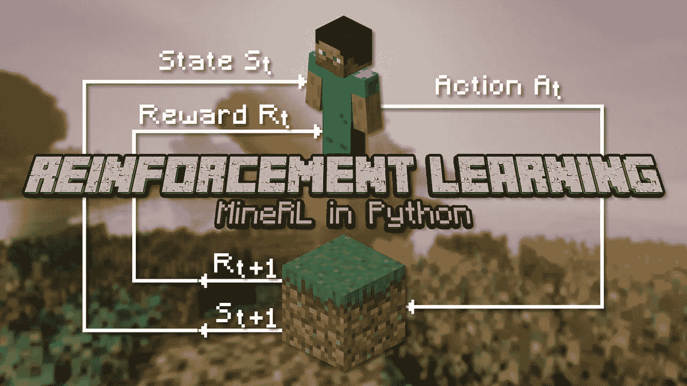
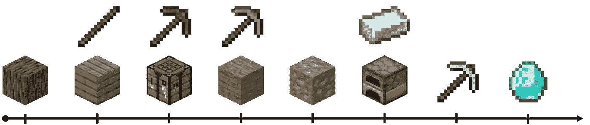
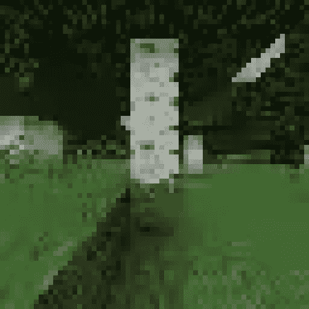
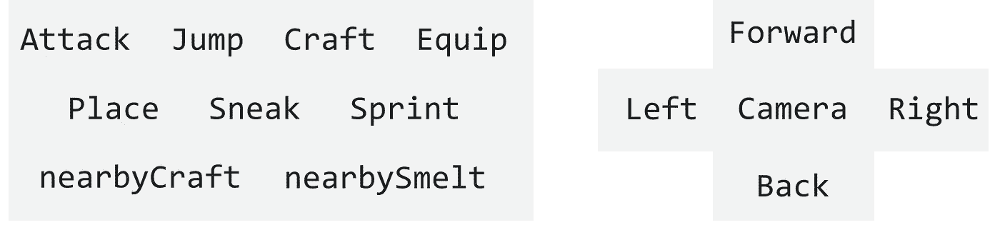
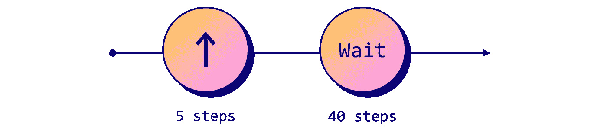
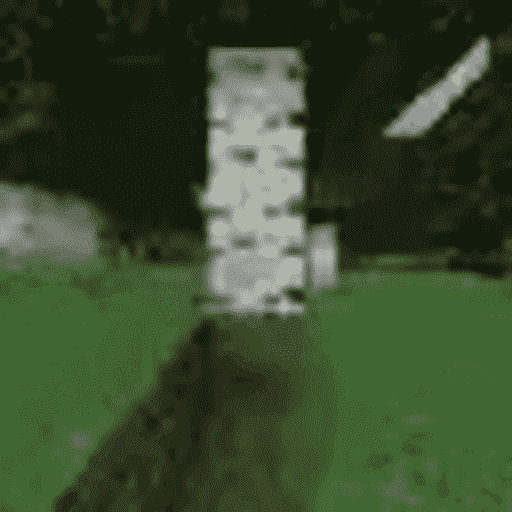
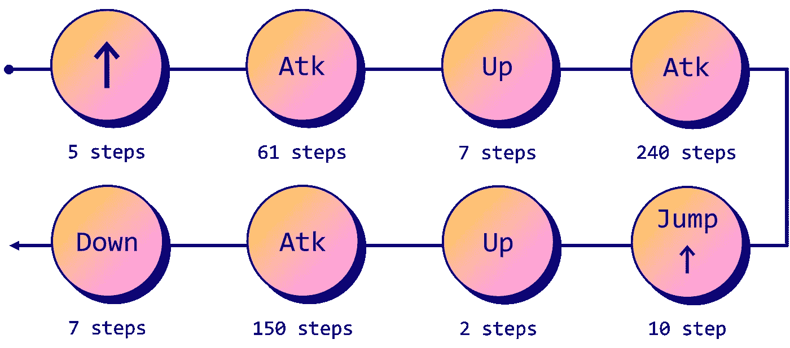
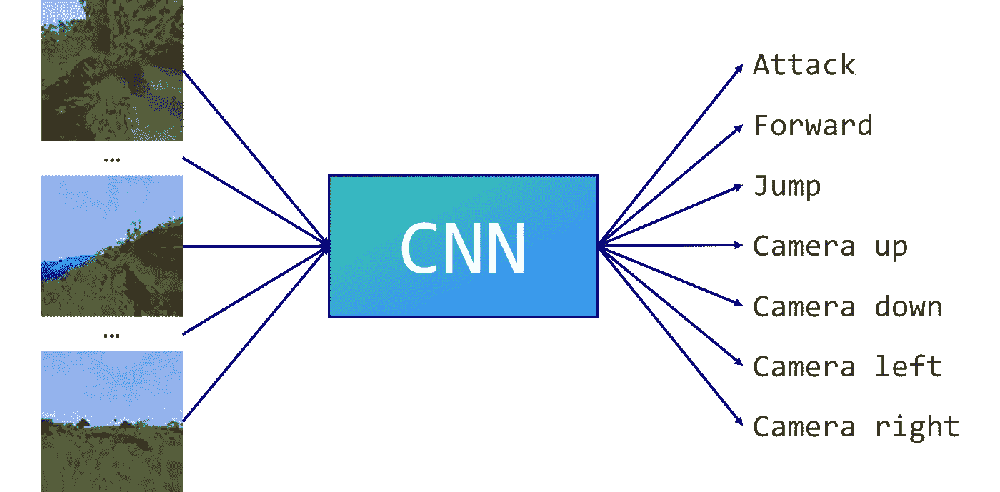
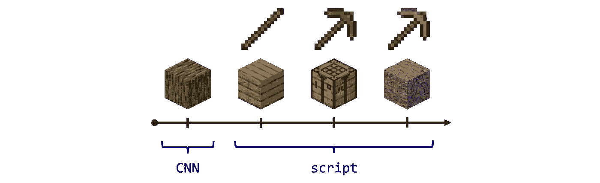

# 《我的世界》的强化学习:创造一个寻找钻石的机器人

> 原文：<https://towardsdatascience.com/create-a-bot-to-find-diamonds-in-minecraft-d836606a993a>

## 用 MineRL 实现 Python 中的强化学习和行为克隆



图片作者( [Mojang license](https://account.mojang.com/documents/minecraft_eula) )

《我的世界》是人工智能的下一个前沿。

这是一个巨大的游戏，有许多机制和复杂的动作序列。仅仅是教人类如何玩《我的世界》，就需要一个[超过 8000 页**的整个维基**](https://minecraft.fandom.com/wiki/Minecraft_Wiki)。那么人工智能能有多好呢？

这是我们将在本文中回答的问题。我们将设计一个机器人，并尝试完成《我的世界》最困难的挑战之一:从零开始寻找钻石。更糟糕的是，我们将在随机生成的世界中接受这一挑战，因此我们无法学习特定的种子。



寻找钻石的行动顺序，图片作者( [Mojang 许可证](https://account.mojang.com/documents/minecraft_eula))

我们要谈的不仅限于《我的世界》。可以应用于类似**的复杂环境**。更具体地说，我们将实现两种不同的技术，它们将成为我们智能代理的主干。

但是在我们训练代理人之前，我们需要了解如何与环境互动。让我们从一个脚本化的机器人开始熟悉语法。我们将使用 [MineRL](https://minerl.io/) ，一个奇妙的库来在《我的世界》构建人工智能应用程序。

本文中使用的代码可以在[的 Google Colab](https://colab.research.google.com/drive/1hRxR_UM72JAe32YveLxqoC6eX6Lqd9c2?usp=sharing) 上找到。它是由 [MineRL 2021 竞赛](https://github.com/KarolisRam/MineRL2021-Intro-baselines)(麻省理工学院许可)的组织者制作的优秀笔记本的简化和微调版本。

# 📜一.脚本机器人

MineRL 允许我们用 Python 启动《我的世界》，并与游戏互动。这是通过流行的`gym`库完成的。



作者图片

我们在一棵树前。如你所见，分辨率**相当低**。低分辨率意味着更少的像素，这加快了速度。对我们来说幸运的是，神经网络不需要 4K 的分辨率来理解屏幕上发生的事情。

现在，我们想让**和**在游戏中互动。我们的代理能做什么？以下是[可能采取的行动](https://minerl.io/docs/environments/#id14):



动作列表(图片由作者提供)

找到钻石的第一步是**获取木材**来制作一张工艺桌和一把木制鹤嘴锄。

让我们试着靠近那棵树。这意味着我们需要按住“前进”按钮不到一秒钟。使用 MineRL，每秒处理 **20 个动作**:我们不需要一整秒，所以让我们处理 5 次，然后再等待 40 个滴答。



作者图片



作者图片

太好了，让我们现在砍树吧。我们总共需要四项行动:

*   **前进**走在树的前面；
*   **攻击**砍树；
*   **摄像头**向上或向下看；
*   **跳**拿到最后一块木头。



作者图片

操作相机可能会很麻烦。为了简化语法，我们将使用来自 GitHub 库[的`str_to_act`函数](https://github.com/KarolisRam/MineRL2021-Intro-baselines) (MIT 许可证)。这是新脚本的样子:

代理人高效的砍下了**整棵树**。这是一个好的开始，但我们希望以更自动化的方式来完成它…

# 🧠二世。深度学习

我们的 bot 在固定环境下运行良好，但如果我们改变种子或其起点会发生什么？

一切都是按照**的剧本**进行的，所以代理人可能会试着砍一棵不存在的树。

这种方法对于我们的需求来说太静态了:我们需要能够适应新环境的东西。我们想要一个知道如何砍树的人工智能，而不是编写命令。自然，强化学习是训练这个代理的一个相关框架。更具体地说，deep RL 似乎是解决方案，因为我们正在处理图像以选择最佳行动。

有两种实现方式:

*   **纯深度 RL** :通过与环境的交互，从零开始训练智能体。它每砍一棵树都会得到奖励。
*   模仿学习:代理学习如何从数据集中砍树。在这种情况下，它是一个人砍树的一系列动作。

这两种方法具有相同的结果，但它们并不等同。据 [MineRL 2021 竞赛](https://github.com/KarolisRam/MineRL2021-Intro-baselines)的作者介绍，纯 RL 解决方案需要 **8 小时**，模仿学习代理需要 **15 分钟**才能达到相同的性能水平。

我们没有那么多时间可以花，所以我们选择模仿学习的解决方案。这种技术也叫**行为克隆**，是模仿的最简单形式。

注意模仿学习并不总是比 RL 更有效率。如果你想了解更多，Kumar 等人写了一篇关于这个话题的很棒的[博文](https://bair.berkeley.edu/blog/2022/04/25/rl-or-bc/)。



作者图片

该问题被简化为多类分类任务。我们的数据集由 mp4 视频组成，因此我们将使用一个[卷积神经网络](https://en.wikipedia.org/wiki/Convolutional_neural_network) (CNN)将这些图像转化为相关的动作。我们的目标也是**限制可以采取的行动**(类别)的数量，这样 CNN 就有更少的选择，这意味着它将得到更有效的训练。

本例中，我们手动定义 **7 个相关动作**:攻击、前进、跳跃、移动摄像机(左、右、上、下)。另一种流行的方法是应用 K-means 来自动检索人类采取的最相关的动作。在任何情况下，我们的目标都是抛弃最没用的行为来完成我们的目标，比如我们例子中的手工制作。

让我们在`MineRLTreechop-v0`数据集上训练我们的 CNN。其他数据集可以在[这个地址](https://minerl.io/docs/environments/index.html#basic-environments)找到。我们选择 0.0001 的学习率和 6 个时期，批量大小为 32。

```
Step  4000 | Training loss = 0.878
Step  8000 | Training loss = 0.826
Step 12000 | Training loss = 0.805
Step 16000 | Training loss = 0.773
Step 20000 | Training loss = 0.789
Step 24000 | Training loss = 0.816
Step 28000 | Training loss = 0.769
Step 32000 | Training loss = 0.777
Step 36000 | Training loss = 0.738
Step 40000 | Training loss = 0.751
Step 44000 | Training loss = 0.764
Step 48000 | Training loss = 0.732
Step 52000 | Training loss = 0.748
Step 56000 | Training loss = 0.765
Step 60000 | Training loss = 0.735
Step 64000 | Training loss = 0.716
Step 68000 | Training loss = 0.710
Step 72000 | Training loss = 0.693
Step 76000 | Training loss = 0.695
```

我们的模型是经过训练的。我们现在可以实例化一个环境，看看它的行为。如果训练成功，它应该疯狂地**砍掉视线内的所有树木**。

这一次，我们将使用`ActionShaping`包装器将通过`dataset_action_batch_to_actions`创建的数字数组映射到 MineRL 中的离散动作。

我们的模型需要正确格式的**视点观察**并输出逻辑。这些逻辑可以通过`softmax`函数转化为一组 7 个动作的概率分布。然后我们根据概率随机选择一个行动。多亏了`env.step(action)`，选定的动作在 MineRL 中被执行。

这个过程可以重复很多次。让我们做 1000 次，看看结果。

我们的代理人相当混乱，但它设法在这个新的、看不见的环境中砍树。现在，如何找到钻石？

# ⛏️三世。脚本+模仿学习

一个简单而强大的方法是将的脚本动作和人工智能结合起来。学习枯燥的东西，将知识编写成脚本。

在这个范例中，我们将使用 CNN 来获取适量的木材(3000 步)。然后，我们可以**编写一个序列**来制作木板、棍子、手工桌、木镐，并开始开采石头(它应该在我们的脚下)。这种石头可以用来制作一个可以开采铁矿石的石镐。



CNN +脚本方式，图片由作者( [Mojang license](https://account.mojang.com/documents/minecraft_eula) )

这就是事情变得复杂的时候:铁矿石非常稀有，所以我们需要运行一段时间来寻找矿藏。然后，我们将不得不制造一个熔炉，熔化它来得到铁镐。最后，我们必须进入更深的地方，更加幸运地在不掉进岩浆的情况下获得钻石。

如你所见，这是可行的，但结果是随机的。我们可以训练另一个代理人去[寻找钻石](https://minerl.readthedocs.io/en/latest/environments/index.html#minerlobtaindiamond-v0)，甚至训练第三个代理人去[制造铁镐](https://minerl.readthedocs.io/en/latest/environments/index.html#minerlobtainironpickaxe-v0)。如果你对更复杂的方法感兴趣，你可以阅读 Kanervisto 等人的[minell Diamond 2021 竞赛](https://arxiv.org/abs/2202.10583)的结果。它描述了几种使用不同智能技术的解决方案，包括端到端深度学习架构。然而，这是一个复杂的问题，没有一个团队能够持续不断地找到钻石，如果有的话。

这就是为什么在下面的例子中我们将自己限制在获取一个石镐，但是您可以修改代码来做得更好。

我们可以看到我们的代理在最初的 3000 步中像疯子一样劈柴，然后我们的脚本接管并完成任务。这可能不明显，但是命令`print(obs.inventory)`显示了一个石镐。请注意，这是一个精选的例子:大多数运行都没有那么好的结局。

代理失败的原因有几个:它可以在恶劣的环境中繁殖(水，熔岩等)。)，在没有木头的区域，甚至会摔死。尝试不同的种子会让你很好地理解这个问题的复杂性，并且有希望获得构建更好的事件代理的想法。

# 结论

我希望你喜欢这个《我的世界》强化学习的小指南。除了其明显的受欢迎程度，《我的世界》还是一个尝试和测试 RL 代理的有趣环境。像 [NetHack](https://nethackchallenge.com/) 一样，它需要**对其机制有透彻的了解**才能在程序生成的世界中计划精确的行动顺序。在这篇文章中，

*   我们学会了如何使用**密涅尔**；
*   我们看到了**两种方法**(脚本和行为克隆)以及如何组合它们；
*   我们**用短视频把代理的动作可视化**。

该环境的主要缺点是它的**处理时间**慢。《我的世界》不是像 NetHack 或 Pong 那样的轻量级游戏，这就是为什么代理需要很长时间来训练。如果这对你来说是个问题，我会推荐像[健身房复古](https://openai.com/blog/gym-retro/)这样的轻松环境。

感谢您的关注！如果你对应用于电子游戏的人工智能感兴趣，请在 Twitter 上关注我。