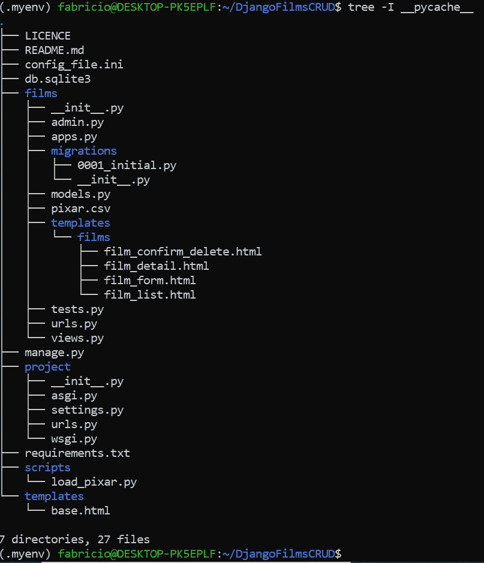

# 创建一个带有限制登录页面的 Django 应用程序

> 原文：<https://towardsdatascience.com/create-a-django-app-with-login-restricted-pages-31229cc48791>

## 现在，只有授权用户才能看到您的应用程序页面


照片由[丹·尼尔森](https://unsplash.com/@danny144?utm_source=unsplash&utm_medium=referral&utm_content=creditCopyText)在 [Unsplash](https://unsplash.com/s/photos/password?utm_source=unsplash&utm_medium=referral&utm_content=creditCopyText) 拍摄

**简介**

有时你可能想创建一个 Django 应用程序，它的页面可以被互联网上的任何人访问。其他时候，您需要保存敏感信息，因此只有经过身份验证的用户才能打开和查看部分或全部页面。Django 再一次用它的内置资源拯救了我们，这使得构建部分或全部受限于授权用户的应用程序变得更加容易。

在本教程中，我将通过使用我在之前的教程中创建的 [Films CRUD 应用程序](https://github.com/fabricius1/DjangoFilmsCRUD)向您展示如何做到这一点:

[](/build-a-django-crud-app-by-using-class-based-views-12bc69d36ab6)  

因此，我邀请你[克隆这个 GitHub 库](https://github.com/fabricius1/DjangoFilmsCRUD)并遵循它的`README.md`指令，这样你就可以在你的机器上安装并运行 Films CRUD 应用。在本地运行项目后，您的文件夹结构将如下所示(`__pycache__`文件夹不在此显示):



作者图片

我们将修改其中一些文件，使所有的应用程序页面在第一时间限制为授权用户；然后，我们将只对修改数据库的页面保留这种限制(通过创建、更新或删除电影)。

**第 1 部分:限制所有页面**

1.为你的电影应用创建一个超级用户，如果你还没有这么做的话。

```
python manage.py createsuperuser
```

如果您使用这个新的超级用户登录到管理区(`http://localhost:8000/admin`)，您可以访问用户模型(从`django.contrib.auth`默认应用程序)并通过在管理界面中选择正确的选项来创建其他用户。

您还可以通过编写代码来创建新用户，这些代码收集用户在注册页面上提供的信息，并执行函数视图或类视图来将这些数据保存到新的`django.contrib.auth.models.User`实例中。然而，这些步骤超出了本教程的范围。如果你对这个话题感兴趣，我在这里提到它们只是为了给你未来的研究提供一些方向。

2.在`project/urls.py`中，插入一条新的`accounts/`路线，如下图所示:

```
from django.contrib import admin
from django.urls import path, includeurlpatterns = [
    path('', include('films.urls')),
    path('admin/', admin.site.urls), # add this:
    path('accounts/', include('django.contrib.auth.urls')),
]
```

注意这条新路线是如何连接到已经在`django.contrib.auth.urls`可用的一些内置 Django 资源的。实际上，如果你打开你的虚拟环境文件夹，沿着路径`Lib/django/contrib/auth`，打开里面的`urls.py`文件，你会看到路径`login/`和`logout/`，调用它们各自定制的基于类的视图。这两条路线将在我们的项目中实现 Django 的认证魔法。

3.创建一个`templates/registration`文件夹:

```
mkdir templates/registration
```

4.创建以下文件，并用以下链接中的内容填充它们:

*   `templates/registration/login.html` ( [*内容此处*](https://raw.githubusercontent.com/fabricius1/DjangoLoginRestrictedApp/master/templates/registration/login.html))**；**
*   `templates/registration/logged_out.html` ( [*内容此处*](https://raw.githubusercontent.com/fabricius1/DjangoLoginRestrictedApp/master/templates/registration/logged_out.html) ) **。**

在模板上，请注意`next`查询参数的存在。事实上，当访问路线`accounts/login`和`accounts/logout`时，这个参数是必需的，因为它告诉 Django 在登录或退出后去哪里。

5.通过导入`LoginRequiredMixin`类并使`FilmsBaseView`继承它来修改`films/views.py`。这将使所有其他电影视图类也通过扩展继承`LoginRequiredMixin`。保持这里没有显示的其他代码行不变。

```
(...)# add this import:
from django.contrib.auth.mixins import LoginRequiredMixin# add LoginRequiredMixin to FilmBaseView
class FilmBaseView(LoginRequiredMixin, View):
    model = Film
    fields = '__all__'
    success_url = reverse_lazy('films:all')(...)
```

现在停止服务器，再次运行它，并尝试访问地址`http://localhost:8000/films/create`，这是创建新电影的路线。如果上面的所有代码都构建正确，您现在将无法访问该页面，但会被重定向到登录页面。还要注意查询参数`next`是如何在 URL 中设置的，它的值是`/films/create/`，表明 Django 将在成功登录后转到这个页面。

现在你只需要输入正确的登录信息。登录后，您将能够不受限制地再次浏览应用程序页面。

现在，如果您想注销，您应该在浏览器上访问`http://localhost:8000/accounts/logout`。然而，这不是一个非常实用的程序，如果在我们的应用程序中有一个链接可以更自然地完成这个操作就好了。因此，我们将在`templates/base.html`中的导航栏上添加一个新链接，它将使用`user.is_authenticated`方法运行一个条件语句，并检查用户是否登录。如果是这种情况，那么应用程序将显示一个注销链接。

6.将`templates/base.html`的内容改为这里提供的 [*HTML 代码*](https://raw.githubusercontent.com/fabricius1/DjangoLoginRestrictedApp/master/templates/base.html) 。注意导航条代码上新的``结构。必要时使用此新链接注销。

**第二部分:** **只让部分页面受限**

现在，我们将只对您可以更新、创建或删除电影的页面进行限制访问。实际上，这将是一个超级简单的修改:我们只需要从我们的`FilmBaseView`中移除`LoginRequiredMixin`，并将其放置在我们想要限制的视图中(最后三个)。

7.对`films/views.py`进行如下修改。下面是修改后的完整代码:

**重要**:让`LoginRequiredMixin`成为`FilmCreateView`、`FilmUpdateView`、`FilmDeleteView`继承的第一个类。

**结束语**

就是这样！正如我们可以注意到的，在我们准备好所有的登录/注销结构(在`registration`文件夹中有具体的路径和各自的模板)之后，我们只需要将`LoginRequiredMixin`类传递给我们希望限制为授权用户的类视图，Django 为我们做所有剩下的工作。

此外，在第二个场景中，只有一些页面有访问限制，我们可以让像*更新*和*删除*链接或*创建新的*按钮这样的资源只在当前用户登录时显示。如果您想做这些更改，只需将上面的链接和按钮放入带有``模板标签结构的条件语句中。现在只有经过认证的用户才能看到它们。

亲爱的读者，非常感谢你花时间和精力阅读我的文章。

*快乐编码！*