# 用 Python 从头开始创建正则化梯度下降算法

> 原文：<https://towardsdatascience.com/create-a-gradient-descent-algorithm-with-regularization-from-scratch-in-python-571cb1b46642>

## 通过自己实现来巩固你的梯度下降知识


安德烈·伯恩哈特在 [Unsplash](https://unsplash.com?utm_source=medium&utm_medium=referral) 上拍摄的照片

# 介绍

梯度下降是用于机器学习和优化问题的基本算法。因此，充分理解它的功能和局限性对于任何学习机器学习或数据科学的人来说都是至关重要的。本教程将实现一个从头开始的梯度下降算法，在一个简单的模型优化问题上测试它，最后进行调整以演示参数正则化。

# 背景

梯度下降试图通过调整模型参数找到**成本函数**的局部最小值。**成本函数**(或损失函数)将变量映射到一个代表“成本”或要最小化的值的实数上。

对于我们的模型优化，我们将执行**最小二乘优化**，其中我们寻求最小化我们的预测值和数据值之间的差异总和。**等式 1** 表示我们将使用的二次成本函数。

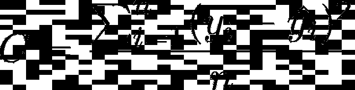

图片作者。

**等式 1:** *最小二乘优化代价函数。*

这里，yhat 是独立变量的模型预测。对于此分析，我们将使用一个通用多项式模型，如**等式 2** 所示。

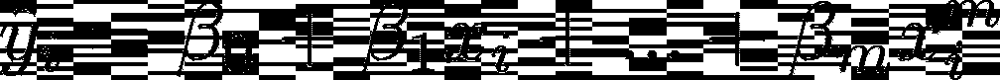

图片作者。

**方程 2:** *本次分析使用的一般多项式模型。*

为简单起见，我们将保持这些方程为矩阵形式。这样做在**等式 3** 中呈现了我们的新模型，在**等式 4** 中呈现了 X 矩阵结构。请注意，yhat 的大小为(n，)，beta 的大小为(m，)，X 的大小为(n，m)。

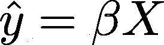

图片作者。

**方程 3:** *我们模型的矩阵形式。*

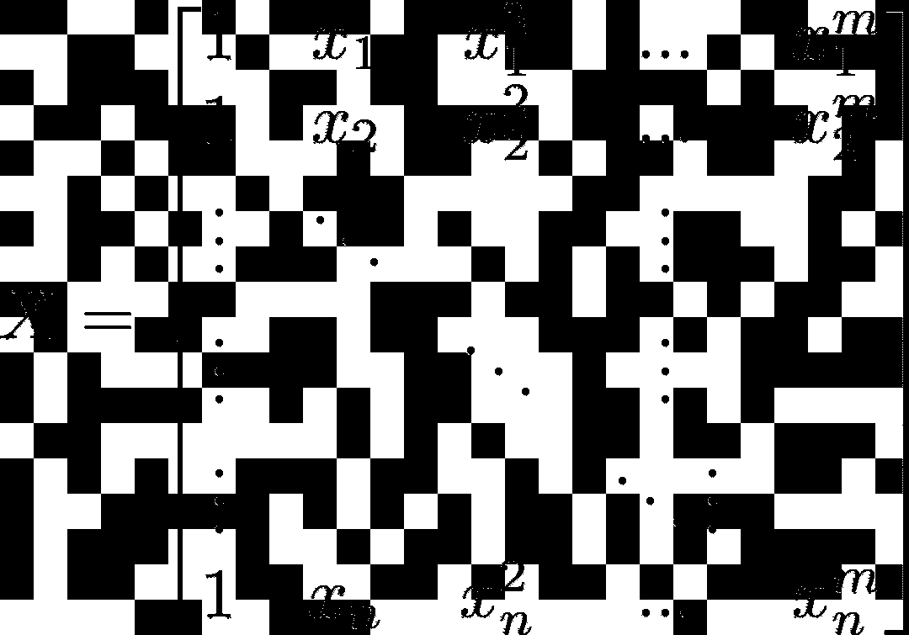

图片作者。

**方程 4:** *多项式矩阵，X.*

现在，有了成本函数和我们将要部署的模型的背景，我们终于可以开始研究梯度下降算法了。

# 算法

梯度下降的工作原理是计算成本的*梯度*，调整参数使*像斜坡一样下降*梯度。

链式法则(回想一下多变量微积分)为我们提供了一种方法来估算给定参数变化的成本变化。这种关系在**等式 5** 中给出。

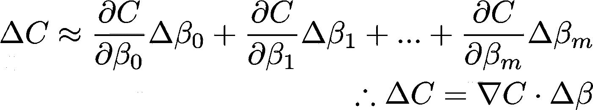

图片作者。

**方程式 5:** *应用链式法则来确定因参数变化而引起的成本变化。*

知道了这一点，我们可以定义一个与成本梯度成比例的参数变化，如**等式 6** 所示。学习率(eta)被选择为一个小的正数。

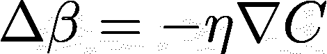

图片作者。

**方程式 6:** *参数更新规则。*

当这个更新参数的规则被插入**等式 5** 时，我们得到我们的证明，即所选择的参数更新规则将总是降低成本。

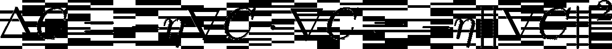

图片作者。

**等式 7:** *证明参数更新规则会降低成本。*

如果我们回忆一下线性代数，我们可以记住成本梯度向量的平方永远是正的。因此，假设学习率足够小，这种更新方法将*降低成本函数的梯度*。

现在，为了最终实现这个算法，我们需要一个数值计算梯度的方法。对于这个例子，我们可以拿着笔和纸做导数，但是我们希望我们的算法适用于任何模型和成本函数。**等式 8** 给出了我们这样做的方法，我们将通过一个小值调整每个参数，并观察成本的变化。

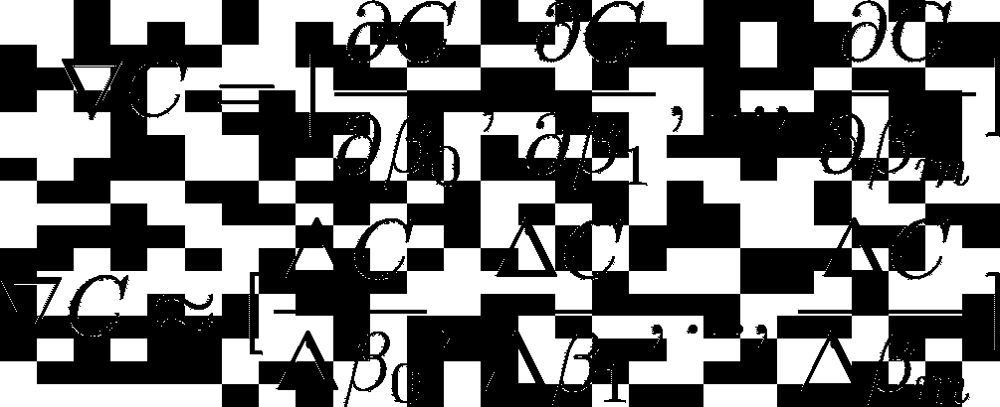

**方程式 8:** *计算成本梯度的数值方法。*

# 数据

我们将为这个项目生成自己的数据集。我们将简单地生成一个独立值的线性间隔向量，并根据这些向量计算因变量，同时引入一些噪声。我设置了一个随机种子，让你看看你是否得到同样的结果。

```
import numpy as np
import matplotlib.pyplot as plt
np.random.seed(1234)def polynomial_model(beta, x):
    '''
    A polynomial model.
    beta: numpy array of parameters of size (m,)
    x: numpy array of size (n,) return yhat: prediction of the model of size (n,)
    '''
    # Turn x (n,) to X (n, m) where m is the order of the polynomial
    # The second axis is the value of x**m
    X = x[:, np.newaxis] ** np.arange(0, len(beta)) # Perform model prediction
    yhat = np.sum(beta * X, axis=1) return yhat# Construct a dataset
x = np.arange(-2, 3)
beta_actual = [1, 2, 1]
y = polynomial_model(beta_actual, x) + np.random.normal(size=x.size, scale=1)
```

我选择实际的模型参数为[1，2，3]，噪声为标准偏差为 1 的正态分布。让我们看看下面的数据。

```
# Plot results
fig, ax = plt.subplots()
ax.plot(x, y, '.')
xplt = np.linspace(min(x), max(x), 100)
yplt = polynomial_model(beta_actual, xplt)
plt.plot(xplt, yplt, '-')ax.legend(['Data', 'Actual Relationship'])plt.show()
```

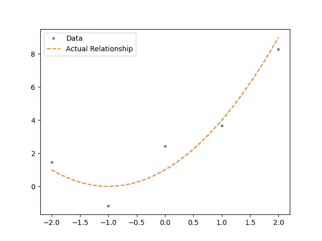

图片作者。

**图 1:** *我们的数据和实际模型。*

# 模型创建

# 功能

我们的成本函数定义如下。请注意，我们只将 beta 设为位置参数，其余的我们将通过关键字参数传递。这是为了提高最终梯度下降算法的可读性，我们将在后面看到。

```
def cost(beta, **kwargs):
    """
    Calculates the quadratic cost, with an optional regularization
    :param beta: Model Parameters
    :param kwargs:
    :return:
    """
    x = kwargs['x']
    y = kwargs['y']
    model = kwargs['model'] # Calculate predicted y given parameters
    yhat = model(beta, x) # Calculate the cost
    C = sum((y-yhat)**2) / len(y)
    return C
```

# 算法

我们的梯度下降类需要我们的模型、成本函数、初始参数猜测和我们的数据。我们还可以调整参数，如学习率或步进参数，以计算梯度，但对于这个分析，我将它们设置为足够小的数字，并没有优化它们的值。

```
class GradDescent: def __init__(self, model, C, beta0, x, y, dbeta=1E-8, eta=0.0001, ftol=1E-8):
        self.model = model
        self.C = C
        self.beta = beta0
        self.x = x
        self.y = y
        self.dbeta = dbeta
        self.eta = eta
        self.ftol = ftol
```

现在我们终于可以实现梯度下降算法了。我们将首先创建一个成本函数的输入字典，它不会因迭代而改变。

```
def descend(self):
        # This dict of cost parameters does not change between calls
        cost_inputs = {'x': self.x,
                       'y': self.y,
                       'model': self.model
                       }
```

接下来，我们将初始化一个成本列表，并开始迭代。

```
# Initialize a list of costs, with the indices being the iteration
        costs = [self.C(self.beta, **cost_inputs)] run_condition = True
```

对于每次迭代，我们必须:

1.  计算梯度
2.  更新参数
3.  计算新成本
4.  评估我们的运行状况

这一过程如下所示

```
while run_condition:
            # Get the gradient of the cost
            delC = [] for n, beta_n in enumerate(self.beta):
                # Create a temporary parameters vector, to change the nth parameter
                temp_beta = self.beta
                temp_beta[n] = beta_n + self.dbeta  # Adjusts the nth parameter by dbeta
                C_n = self.C(temp_beta, **cost_inputs)
                dC = C_n - costs[-1]
                delC.append(dC / self.dbeta) # Update the parameters
            self.beta = self.beta - self.eta * np.array(delC) # Re calc C
            costs.append(self.C(self.beta, **cost_inputs)) # Evaluate running condition
            run_condition = abs(costs[-1] - costs[-2]) > self.ftol
```

现在我们准备实现我们的模型。让我们初始化初始参数，创建一个梯度下降对象，优化我们的模型，并绘制结果。

```
# Initialize parameters, use a polynomial of order 5
beta0 = np.random.normal(size=(5,), scale=1)# Initialize a GradDescent object, perform descent and get parameters
gd = GradDescent(polynomial_model, cost, beta0, x, y)
gd.descend()beta = gd.beta# Make model prediction with parameters
yhat = polynomial_model(beta, x)# Plot results
fig, ax = plt.subplots()
ax.plot(x, y, '.')
ax.plot(x, yhat, 'x')
xplt = np.linspace(min(x), max(x), 100)
yplt = polynomial_model(beta_actual, xplt)
plt.plot(xplt, yplt, '-')
yplt = polynomial_model(beta, xplt)
plt.plot(xplt, yplt, '--')ax.legend(['Data', 'Predicted Values', 'Actual Relationship', 'Predicted Model'])plt.show()
```

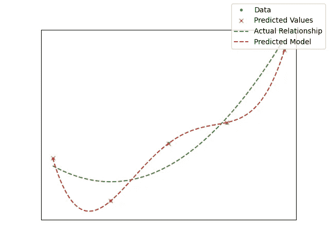

图片作者。

**图 2:** *我们数据的 4 阶多项式拟合。*

请注意，我们的模型是故意过度拟合的。我们有一个适合 5 个数据点的 4 阶多项式，回想一下，一个 n 阶多项式总是可以完美地预测 n+1 个数据点，而无需考虑任何基础模型。

让我们稍微修改我们的成本函数，以惩罚参数的大小。这个过程被称为**正则化**，正则化被定义为添加信息以解决不适定问题以防止过度拟合的过程。我们将执行两种类型的正则化， **L1** 或**套索回归**(最小绝对收缩和选择算子)和 **L2** 或**岭回归**。这些技术的修改成本函数在下面的**等式 9 & 10** 中给出。

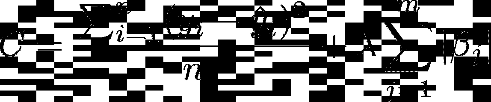

图片作者。

**方程 9:***L1 正则化的代价函数。*


图片作者。

**方程 10:***L2 正则化的代价函数。*

我们可以很容易地修改代码来处理这些正则化技术。唯一的变化将发生在成本函数和 GradDescent 对象中，如下所示。

```
class GradDescent: def __init__(self, model, C, beta0, x, y, reg=None, lmda=0, dbeta=1E-8, eta=0.0001, ftol=1E-8):
        self.model = model
        self.C = C
        self.beta = beta0
        self.x = x
        self.y = y
        self.reg = reg
        self.lmda = lmda
        self.dbeta = dbeta
        self.eta = eta
        self.ftol = ftol def descend(self):
        # This dict of cost parameters does not change between calls
        cost_inputs = {'x': self.x,
                       'y': self.y,
                       'reg': self.reg,
                       'lmda': self.lmda,
                       'model': self.model
                       }
        # Initialize a list of costs, with the indices being the iteration
        costs = [self.C(self.beta, **cost_inputs)] run_condition = True
        while run_condition: # Get the gradient of the cost
            delC = [] for n, beta_n in enumerate(self.beta):
                # Create a temporary parameters vector, to change the nth parameter
                temp_beta = self.beta
                temp_beta[n] = beta_n + self.dbeta  # Adjusts the nth parameter by dbeta
                C_n = self.C(temp_beta, **cost_inputs)
                dC = C_n - costs[-1]
                delC.append(dC / self.dbeta) # Update the parameters
            self.beta = self.beta - self.eta * np.array(delC) # Re calc C
            costs.append(self.C(self.beta, **cost_inputs)) # Evaluate running condition
            run_condition = abs(costs[-1] - costs[-2]) > self.ftoldef cost(beta, **kwargs):
    """
    Calculates the quadratic cost, with an optional regularization
    :param beta: Model Parameters
    :param kwargs:
    :return:
    """
    x = kwargs['x']
    y = kwargs['y']
    reg = kwargs['reg']
    lmda = kwargs['lmda']
    model = kwargs['model'] # Calculate predicted y given parameters
    yhat = model(beta, x) # Calculate the cost
    C = sum((y-yhat)**2) / len(y)
    if reg is not None:
        if reg == 'L1':  # For Lasso Regression (L1), add the magnitudes
            C += lmda * sum(abs(beta))
        elif reg == 'L2':  # For Ridge Regression (L2), add the squared magnitude
            C += lmda * sum(beta**2)
    return C
```

让我们做一点调整，看看这如何影响我们预测模型的偏差和方差。该代码如下所示，比较图见图 3**。**

```
fig, axs = plt.subplots(1, 3, figsize=(15, 5)) for i, (reg, lmda) in enumerate(zip([None, 'L1', 'L2'], [0, 1, 1])):
    # Initialize a GradDescent object, perform descent and get parameters
    gd = GradDescent(polynomial_model, cost, beta0, x, y, reg=reg, lmda=lmda)
    gd.descend() beta = gd.beta # Make model prediction with parameters
    yhat = polynomial_model(beta, x) axs[i].plot(x, y, '.')
    axs[i].plot(x, yhat, 'x')
    xplt = np.linspace(min(x), max(x), 100)
    yplt = polynomial_model(beta_actual, xplt)
    axs[i].plot(xplt, yplt, '--')
    yplt = polynomial_model(beta, xplt)
    axs[i].plot(xplt, yplt, '--') # Set title
    if reg is not None:
        axs[i].set_title(reg)
    else:
        axs[i].set_title("No Regularization") # Clean up the plots - remove x,y ticks and labels
    axs[i].axes.xaxis.set_ticklabels([])
    axs[i].axes.yaxis.set_ticklabels([])
    axs[i].axes.xaxis.set_visible(False)
    axs[i].axes.yaxis.set_visible(False) fig.legend(['Data', 'Predicted Values', 'Actual Relationship', 'Predicted Model'])plt.show()
```

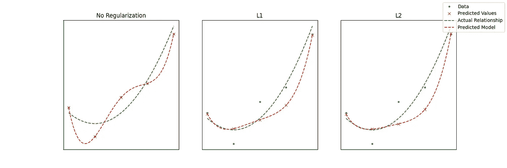

图片作者。

**图 3:** *正则化方法对比。*

我们可以定性地看到，调整我们的参数提高了我们的拟合度(即，使其更接近实际的基础模型。)尝试迭代参数权重，看看它对最终模型的影响。

# 结论

我们学习了梯度下降的基本原理，并用 Python 实现了一个简单的算法。这样做后，我们做了最小的改变，增加正则化方法到我们的算法，并了解了 L1 和 L2 正则化。我希望你喜欢。

[在 GitHub 上看到这个项目](https://github.com/turnerluke/ML-algos/blob/main/gradient_descent/GradDescent.py)
[在 LinkedIn 上与我联系](https://www.linkedin.com/in/turnermluke/)
[阅读我的一些其他数据科学文章](https://medium.com/@turnermluke)