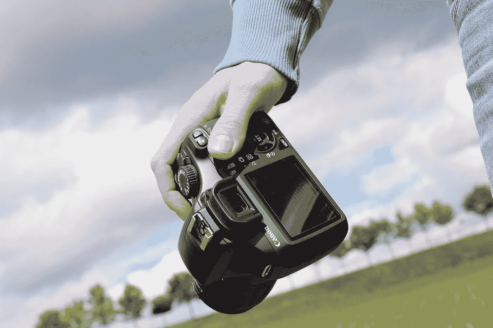
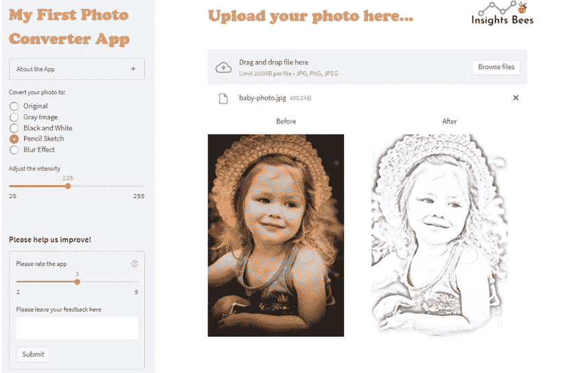
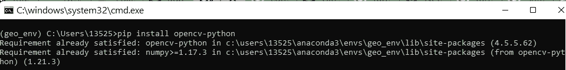
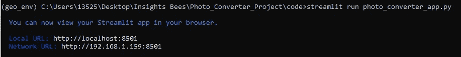
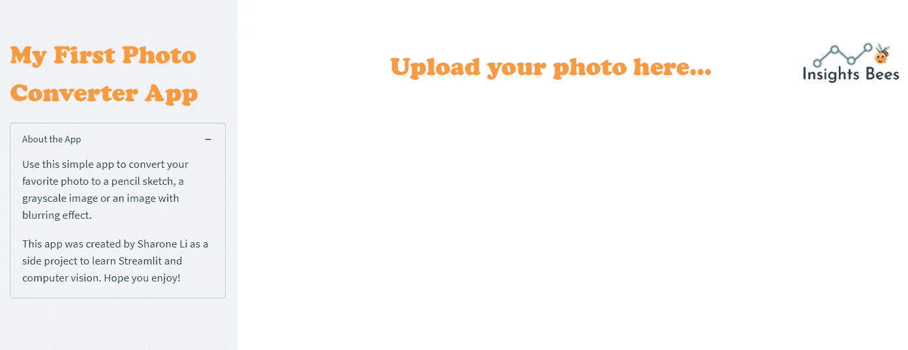
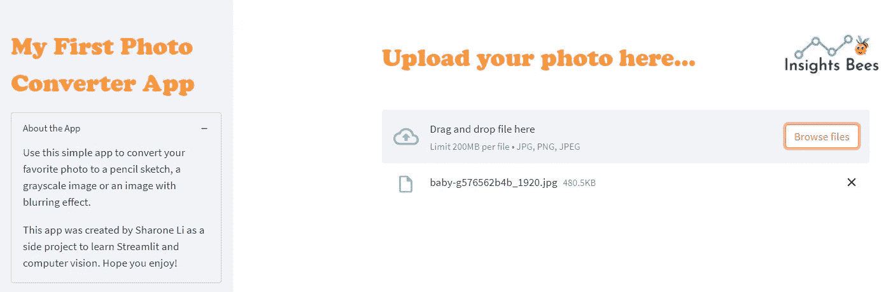
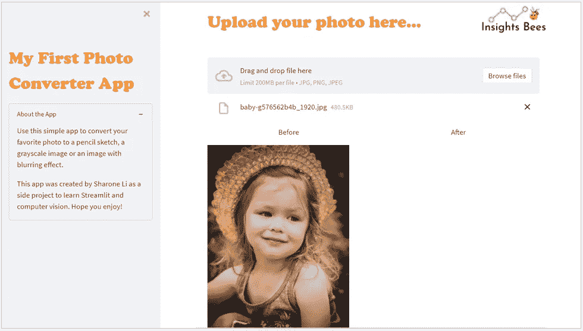
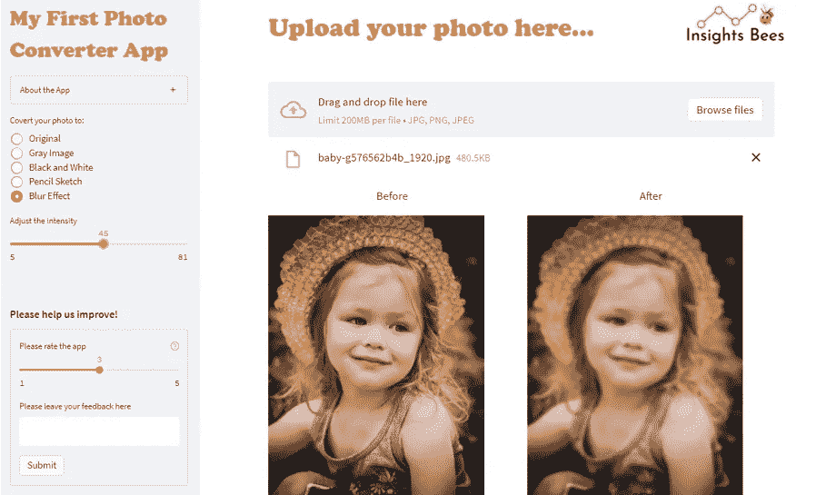
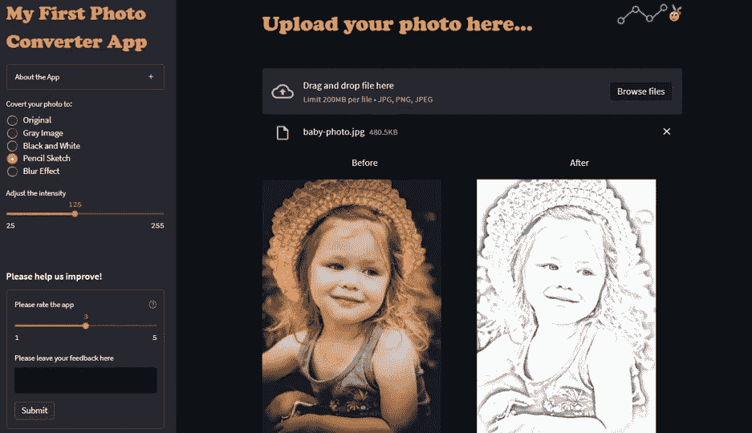

# 使用 Streamlit 创建一个照片编辑应用程序——出奇的简单和有趣

> 原文：<https://towardsdatascience.com/create-a-photo-converter-app-using-streamlit-surprisingly-easy-and-fun-db291b5010c6>

## 让我们享受 Streamlit 和计算机视觉的乐趣:初学者实用指南



图片来源: [Pixabay](https://pixabay.com/photos/photo-camera-photography-digital-351528/)

# 介绍

你是否曾经使用过这样的照片编辑应用程序，它允许你在线上传照片，并立即将其转换为黑白图像、酷酷的铅笔素描或具有漂亮模糊效果的图片？作为一名好奇的数据科学家，我总是有兴趣找出这些应用程序是如何在幕后创建的。但是，很长一段时间以来，我自己并没有真正投入过什么时间去学习和尝试。

最近，我在网上看到了几篇文章，讲述了如何使用 OpenCV(Python 中的一个实时优化的计算机视觉库)将一张照片变成草图，或灰度图像等。我真的很惊讶，使用 OpenCV 来开始计算机视觉世界中的一些简单任务是多么简单和直接。

与此同时，我也一直在探索和学习 Streamlit。这是一个免费的开源全 python 框架，使数据科学家能够快速构建数据和机器学习 web 应用程序，无需前端 web 开发经验。所以突然有了灵感——这可能是一个完美的动手 Streamlit 项目，让我用 OpenCV 构建自己的照片编辑应用程序！

在不到两个小时的时间里，只用了大约 60 行代码，我就能够使用 Streamlit 构建一个照片编辑应用程序，它对我来说看起来相当不错！我想与你分享我的项目工作，这样你也可以有一些学习建立自己的照片编辑应用程序的乐趣！我们将要构建的应用程序看起来是这样的(或者观看这个简短的 [YouTube 视频演示](https://www.youtube.com/watch?v=f7vRCQDsx2I)):



图片由作者提供(婴儿照片由 [Pixabay](https://pixabay.com/photos/baby-kids-beauty-cute-small-child-2953787/) 提供)

# 先决条件

如果您还没有这样做，您需要为这个项目在您的计算机上安装 Streamlit 和 OpenCV。

**#1:细流安装:**

可以参考下面的[文章](/streamlit-hands-on-from-zero-to-your-first-awesome-web-app-2c28f9f4e214)，按照说明安装 Streamlit，学习基础知识。

</streamlit-hands-on-from-zero-to-your-first-awesome-web-app-2c28f9f4e214>  

**#安装 OpenCV:**

您可以使用下面的命令来安装 OpenCV，或者参考它的文档页面来获得更多的细节:[https://pypi.org/project/opencv-python/](https://pypi.org/project/opencv-python/)

```
pip install opencv-python
```



作者图片

# 启动流线

让我们打开 VS 代码编辑器(或者您选择的任何文本编辑器)，创建一个新的空 python 文件，并在您的项目文件夹中将其保存为 photo_converter_app.py。然后我们可以从 Anaconda 终端窗口启动 Streamlit。一个空白的 Streamlit 应用程序应该会出现在您的本地 web 浏览器中。

```
streamlit run photo_converter_app.py
```



作者图片

# 导入库

让我们首先导入所有必需的库，开始我们的应用程序构建之旅:

# 向应用程序添加标题、品牌标志和侧栏

在应用程序的主界面中，我们希望使用 st.markdown()添加一个标题，以及一个可选的品牌徽标。我们选择 st.markdown()而不是 st.title()的原因是因为我们可以使用 CSS 对其进行样式化，使其更具吸引力。

让我们使用下面的代码在侧边栏中添加一个标题和扩展器，以提供关于该应用程序的更多信息:



作者图片

# 添加文件上传程序，允许用户上传照片

在应用程序的主界面中，我们希望添加一个文件上传程序，以便用户可以通过拖放或浏览文件来上传他们的照片。我们可以使用 st.file_uploader()小部件来做到这一点，并指定应用程序中接受的图像类型(例如，JPG、PNG、JPEG 等。)



作者图片

# 添加空格符以显示之前和之后的图像

用户上传照片后，我们希望在应用程序中并排显示原始图像(之前)和转换后的图像(之后)。因此，让我们在文件上传程序下创建两个宽度相同的列，一个用于“之前”，另一个用于“之后”。如果 uploaded_file 不是 None: '语句，请确保将所有内容都放在“*语句中。使用这个语句可以确保当图像还没有上传时，应用程序不会因为找不到要转换的图像而抛出任何错误消息。*



作者图片

# 使用 OpenCV 转换照片

现在有趣的部分来了！在第二列 col 2(“after”图像的占位符)中，我们希望根据用户的输入显示转换后的图像。例如，如果用户想要将图像转换为黑白，我们将使用 OpenCV 将原始图像转换为黑白。如果用户想把它转换成铅笔素描，我们就用 OpenCV 把它转换成铅笔素描。我们如何实现这一目标？

## #1:创建一个接受用户输入的过滤器

我们首先需要创建一个过滤器或单选框，允许用户指定他们想要做什么。为了保持应用程序主界面的整洁，我们可以将这个过滤器添加到侧边栏中。在下面的代码中，第 12 行在侧栏中添加了过滤器。滤镜显示五个选项:原始、灰色图像、黑白、铅笔素描和模糊效果。我们使用 st.sidebar.radio()一次只允许单一选择。

请注意，如果 uploaded_file 不是 None: '代码块，我们将过滤器变量放在了“*内。通过这样做，过滤器将只在用户上传图像后出现。您也可以选择将过滤器变量放在代码块之外(即第 2 行之上)。这样，过滤器将始终显示在侧边栏中。真的只是个人对 app 设计的喜好。*

## #2:使用条件语句接受用户输入

您将看到单选按钮过滤器立即出现在侧栏中；然而，当你点击一个选项时，它不会触发应用程序中的任何内容来显示转换后的图像。这是因为我们没有告诉 Streamlit 将过滤器的值传递到哪里，以及用户的输入触发了什么操作。为此，我们需要在 col2 下添加一些条件语句。

在下面的代码中，从第 5 行到第 29 行，我们使用 if-else 条件语句将图像转换成不同的用户选择的格式。对于不同的用户选择，我们使用不同的 OpenCV 函数(例如 cv2.cvtColor、cv2.cv2.GaussianBlur、cv2.divide 等。)将图像转换为所需的格式，并使用 st.image()显示转换后的图像。

## # 3:OpenCV 如何转换图像

让我们更详细地检查上面的代码，并理解 OpenCV 如何将图像转换成不同的格式:

第 5–8 行:

使用 OpenCV 将图像转换成灰度图像非常简单。我们可以简单地使用 cvtColor()函数，并将颜色空间转换代码指定为 cv2。COLOR _ bgr 2 灰色。


作者图片

第 9–14 行:

将图像转换为黑白图像只需要在首先将其转换为灰色图像之后再执行一个额外步骤。我们需要定义一个阈值，然后对于灰度图像的每个像素，如果其值低于阈值，则我们将值 0(黑色)分配给该像素，如果其值高于阈值，则分配值 255(白色)。

请注意，在第 12 行，我们创建了一个 slider 小部件，允许用户选择一个阈值，第 13 行获取阈值并将灰色图像转换为黑白图像。


作者图片

第 15–22 行:

要将图像转换为铅笔素描，我们首先将其转换为灰色图像，然后基本上将其反转——使黑色调变成白色，反之亦然。

接下来，我们应用模糊过滤器使用高斯模糊函数(cv2。GaussianBlur)。在第 19 行，我们创建了一个 slider 小部件，允许用户选择高斯核的大小来调整模糊的强度。我们选择(125，125)作为内核大小参数([height width])的默认值。高度和宽度应该是奇数，可以有不同的值。

最后，我们使用 cv2.divide 函数将灰度图像中的像素与 255-blur_image 中的像素相除。这将返回一个看起来像铅笔画的图像。


作者图片

第 23–28 行:

要将图像转换为模糊图像，我们首先将图像转换为灰度图像，然后使用高斯模糊函数(cv2)添加模糊滤镜。GaussianBlur)。请注意，在第 25 行中，我们还添加了一个条件化的 Streamlit 小部件 st.siderbar.slider()，它仅在用户选择“模糊效果”选项时出现，并允许用户相应地调整模糊的强度。



作者图片

# 在侧边栏中添加用户反馈部分

最后，我们将在侧边栏中添加一个用户反馈部分，以收集评论评级和评论。我们使用 st.text_input()小部件允许用户提交评论，使用 st.slider()小部件允许用户选择 1-5 范围内的评级。然后，我们可以使用 st.form_submit_button()和 st.form()一起批量输入小部件，并单击一个按钮提交小部件值，这只会触发整个应用程序的一次重新运行！



以黑暗模式显示的应用程序(图片由作者提供)

这就是你第一个使用 Streamlit 的照片编辑应用程序！你还可以通过 [Streamlit Cloud](https://streamlit.io/cloud) 与他人分享你的应用，这是 Streamlit 最近推出的一项非常酷的功能。通过亲自动手做这样的项目，我能够提高我的 Streamlit 技能，并迈出进入计算机视觉世界的第一步。我真的很喜欢这个项目，希望你也玩得开心！快乐学习！

*这里有一小段 YouTube 视频来演示这个应用:*

作者的 YouTube 视频

# 参考资料和图像来源:

1.  OpenCV 文档:[OpenCV 中的图像处理](https://docs.opencv.org/4.x/d2/d96/tutorial_py_table_of_contents_imgproc.html)
2.  Rafael Messias Grecco 制作一个简单的照片编辑器
3.  [将您的照片转换成代码为](/turn-your-photos-into-artistic-sketches-with-code-6694522fa349)的艺术草图，由贝希克·居文设计
4.  图片来源:app 中使用的宝贝照片可以从 [Pixabay](https://pixabay.com/photos/baby-kids-beauty-cute-small-child-2953787/) 下载。这是免费的商业用途(不需要署名)。

你可以通过这个[推荐链接](https://medium.com/@insightsbees/membership)注册 Medium 会员(每月 5 美元)来获得我的作品和 Medium 的其他内容。通过这个链接注册，我将收到你的会员费的一部分，不需要你额外付费。谢谢大家！