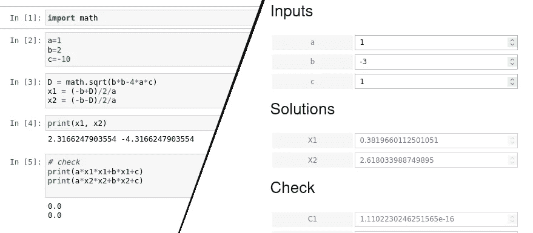

# 使用 Jupyter 笔记本快速创建一个简单的应用程序

> 原文：<https://towardsdatascience.com/create-a-simple-app-quickly-using-jupyter-notebook-312bdbb9d224>

## 数据科学家和其他希望将 Python 函数转化为交互式应用程序的人的指南。

从代码到应用——作者图片

我将演示一个健壮但易于使用的解决方案，除了 Python、Jupyter notebook 和 Ipywidgets 等众所周知的工具之外，它只需要很少的知识。

我们将构建一个交互式应用程序来解决一个二次方程。这是一个非常简单的例子，但足以演示该方法。我们不会直接跳到最终的解决方案，而是通过几个简单的步骤逐步实现。我将从最简单的基于笔记本的实现开始，以完全交互式的解决方案结束。

问题表述:

给定三个数字 a、b 和 c，找出满足以下条件的 x:

a x +b x +c = 0

众所周知，该方程的解由下式给出:

(-b + D)/2a 和(-b-D)/2a，其中 D = sqrt(b -4ac)

## 1.直接法

我们第一次尝试为这个问题创建一个笔记本，看起来像这样:

现在我们已经实现了功能。是时候重构我们的笔记本来使用功能了，而不是到处扔代码。

## 2.使用函数

通过创建这些功能，第一个直接的好处是可重用性。我们不需要每次想要使用该功能时都复制并粘贴代码。

但最重要的是它给出的结构:函数清楚地显示了它们的输入和输出。这也有助于在我们的大脑中构建问题，并分离解决方案的主要构件。

## 3.小工具

现在我们已经实现了主要函数，我们可以进行计算了。
然而，对于必须在代码单元格中输入值的用户来说，这不是很方便。通过为系数引入输入部件，我们可以做得更好。注意，最后几个没有变化的单元格被省略了。

现在它开始看起来像一个应用程序，用户不再需要修改代码，但仍然需要在每个单元格后按 Ctrl-Enter。此外，每次用户更改值时，都需要重新执行单元格#5。(注意，我们必须使用“.”来引用小部件的值。值”。)

## 4.瞧

如果你使用 Jupyter 笔记本，你很可能听说过“瞧”。它的作用是获取一个普通的 Jupyter 笔记本，保留输出单元格，隐藏代码单元格。这使得外观更加整洁。
瞧，安装起来超级容易。如果您的环境中尚未安装，您可以通过以下方式进行安装:

`pip install voila`

如果你现在重启 jupyter-notebook，你会在按钮栏看到一个“瞧”按钮。

然而，当你对你的笔记本进行可视化时，你将不得不得出结论，它不能工作，至少不能按照预期的方式工作:改变输入框中的值没有任何效果。
为什么？因为在用户有机会输入/修改值之前，voila 执行了所有的代码单元。所以不管初始值是什么，都将被使用。

为了让 voila 工作，您必须设置某种交互性:代码执行需要通过与小部件的交互来触发。您不再有手动执行代码单元的选项。

## 5.让我们增加互动性

有几种方法可以让你在部件状态改变时触发一些动作。您可以使用`interact`函数或`observe`方法。但是请注意，这些仅在单个小部件级别上运行。您可以设置一个在小部件改变时执行的动作，但是您无法控制它将触发的事件链:您可以很容易地触发`D`的重新计算，但是您真正需要的是`x1`和`x2`的重新计算。您可以手动跟踪整个依赖图，并在`c`改变时记得更新`x1`和`x2`。但是这不方便而且容易出错。假设您有一个稍微大一点的项目，有 20 或 30 个内部变量，它们以某种非平凡的方式相互依赖。手动跟踪要更新的变量将很快导致错误。

相反，我提出的解决方案是使用[自动计算](https://autocalc.readthedocs.io/en/latest/)包。这个包允许你在内部变量和用户公开变量之间建立依赖图。一旦建立了这个图(DAG ),您就不需要手动重新计算变量了。就像 Excel 的自动更新功能。

还有其他针对同一问题的包，autocalc 的优势在于它的简单性:你只需要学习一个名为`Var`的类来设置 DAG。所以让我们深入研究一下:

首先，您需要安装软件包

`pip install autocalc`

如果你现在打开你的笔记本，它会像预期的那样工作

注意事项:

*   查看[自动计算](https://autocalc.readthedocs.io/en/latest/index.html)的文档，了解高级特性，如“惰性”计算。
*   一些输出值(如数据帧)无法通过微件显示。在这种情况下，仍然可以自动更新输出。诀窍是设置一个虚拟变量，它取决于输出。分配给该变量的函数需要在值改变时执行必要的操作。这种技术在`autocalc.tools.PreviewAcc` helper 类中使用，这是一种现成的解决方案。

我希望这个小描述对你有用。如果你喜欢我的帖子，请鼓掌，关注，分享，评论。这鼓励我生产更多。

## 放弃

我是[自动计算](https://github.com/kefirbandi/autocalc)包的作者。