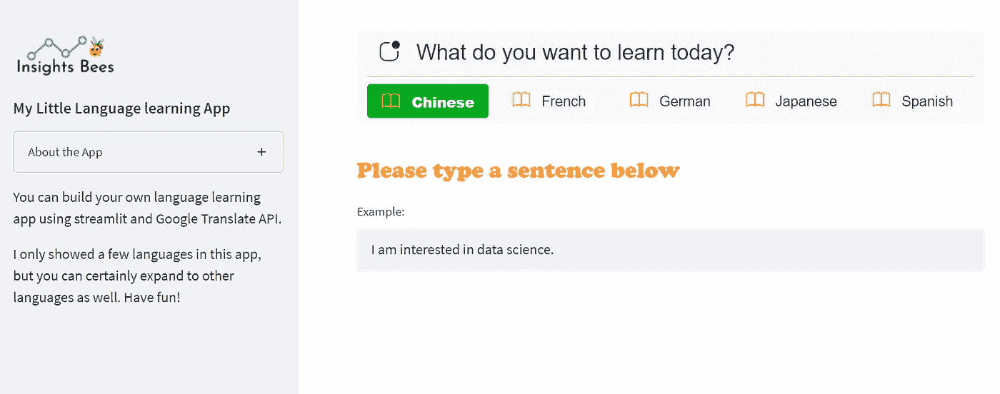
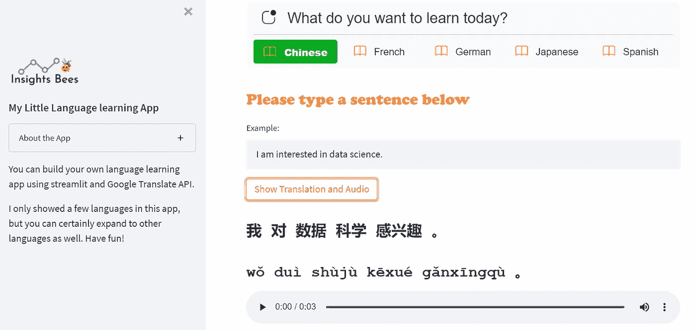
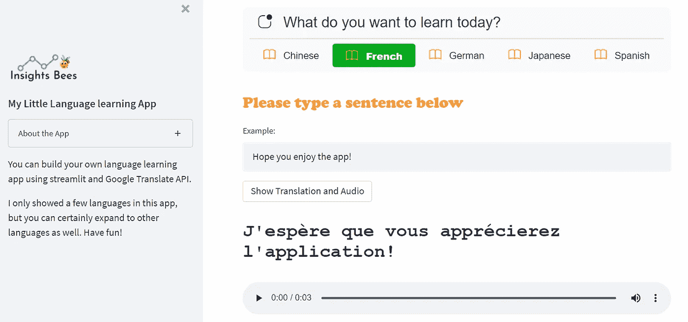

# 使用 Streamlit 创建简单的语言学习应用程序

> 原文：<https://towardsdatascience.com/create-a-simple-language-learning-app-using-streamlit-21d6ce1b68c>

## 如何使用 Streamlit 和 Googletrans 构建自己的语言翻译和学习应用程序


图片由 [Pixabay](https://pixabay.com/illustrations/welcome-words-greeting-language-905562/)

[Streamlit](https://streamlit.io/) 是一个免费、开源的全 python 框架，使数据科学家能够快速构建交互式数据和机器学习应用，无需前端 web 开发经验。如果你懂 python，那么你就可以在几小时内，而不是几周内，使用 Streamlit 创建和共享你的 web 应用。

我将 Streamlit 用于各种有趣的用例及应用，既出于娱乐，也出于学习和分享的目的。你可以在我的 [Medium 博客](https://medium.com/@insightsbees)中找到各类 app 实例的完整列表。在这篇文章中，我将向您展示如何使用 Streamlit 和 [Googletrans](https://py-googletrans.readthedocs.io/en/latest/) (一个实现了 Google Translate API 的免费且无限制的 python 库)创建一个简单的语言学习应用程序。我在构建这个小应用程序的过程中获得了很多乐趣，希望你也会喜欢它！

请注意，如果你是 Streamlit 的新手，我强烈建议你在阅读这篇文章的细节之前，先阅读下面这篇关于 Streamlit 的介绍性文章。

[](/streamlit-hands-on-from-zero-to-your-first-awesome-web-app-2c28f9f4e214)  

如果您已经对 Streamlit 有了一些基本的知识和经验，就可以开始了！因此，不再拖延，让我们开始构建应用程序。这是一个简短的 YouTube 视频，演示了我们将要建立的应用程序。

作者的 YouTube 视频

首先，让我们导入所有必要的库，并添加一个侧栏，其中包含该应用程序的一些基本信息。我们还将创建一个临时文件夹，用于保存和存储应用程序中生成的所有音频文件。我们使用`googletrans`来做翻译，你可以从 [PyPI](https://pypi.python.org/pypi/googletrans) 安装这个包。如果没有的话，您可能还需要安装`jieba`和`xpinyin`，它们将用于切分中文文本并将汉字翻译成拼音(mainland China 标准中文的官方罗马化系统)。

```
pip install googletrans
pip install jieba
pip install xpinyin
```

接下来，我们来搭建 app 的主界面。我们将首先添加一个水平菜单栏，允许用户选择他们想要学习的语言。在这个应用程序示例中，我只包含了五种语言；但是，如果您愿意，您可以包含更多内容。你可以在这里找到谷歌翻译 API [支持的语言的完整列表。](https://py-googletrans.readthedocs.io/en/latest/)

我们还将添加一个 streamlit 小部件，它接受用户输入的任何文本，并允许用户键入英语单词、句子或段落。我们将提供一个文本示例作为文本框中的默认条目。请注意，在第 14–17 行中，我们使用了`st.markdown()`和 CSS 样式来使说明文本在视觉上更具吸引力。



作者图片

让我们定义一个 python 函数，它将输入文本从英语翻译成用户选择的任何目标语言。该函数有三个参数:输入语言、输出语言和用户输入的文本。

我们还将为文本输入生成一个音频文件，并在应用程序的主界面上显示音频。音频文件将保存在我们在上一步中创建的 temp_folder 中。

现在让我们编写代码，如果用户在选项菜单中选择“中文”,就把英文翻译成中文。我们还将在应用程序中显示汉字的拼音(mainland China 标准汉语的官方罗马化系统)以及音频播放器。



作者图片

你可以对其他语言做同样的事情。下面是一个把英语翻译成法语的例子。该代码比英汉代码稍微简单一些，因为我们不需要显示拼音。



作者图片

这就对了。我们使用 Streamlit 和`Googletrans`创建了一个简单的语言学习应用程序。感谢阅读，我希望你喜欢这篇文章。如果您有兴趣了解更多有关 Streamlit 的信息，并享受创建应用程序的乐趣，下面是几个更多的 Streamlit 应用程序示例！

[](https://medium.com/codex/create-a-multi-page-app-with-the-new-streamlit-option-menu-component-3e3edaf7e7ad)  [](https://medium.com/codex/create-a-simple-project-planning-app-using-streamlit-and-gantt-chart-6c6adf8f46dd)  [](/create-a-photo-converter-app-using-streamlit-surprisingly-easy-and-fun-db291b5010c6)  [](https://medium.com/codex/create-a-data-profiling-app-using-pandas-profiling-and-streamlit-59300bc50af7)  

你可以通过这个[推荐链接](https://medium.com/@insightsbees/membership)注册 Medium 会员(每月 5 美元)来获得我的作品和 Medium 的其他内容。通过这个链接注册，我将收到你的会员费的一部分，不需要你额外付费。谢谢大家！