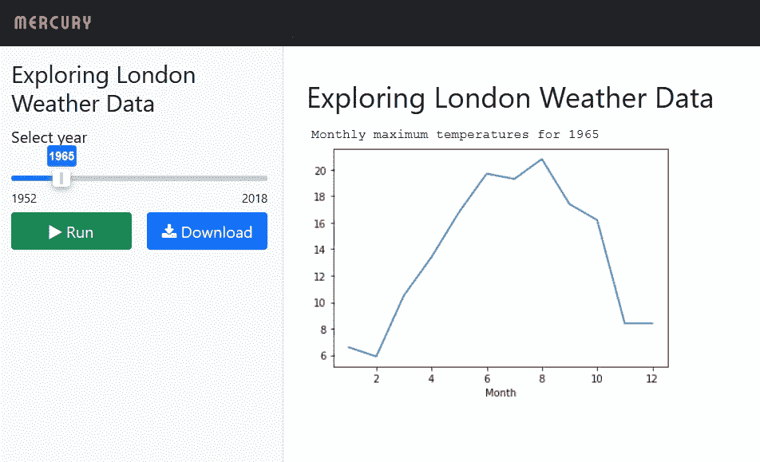
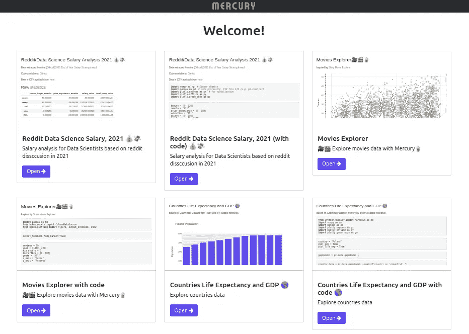
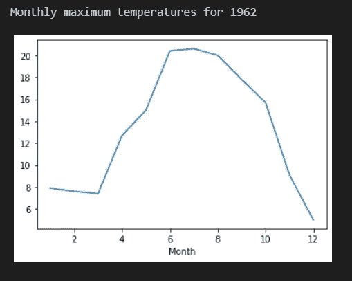
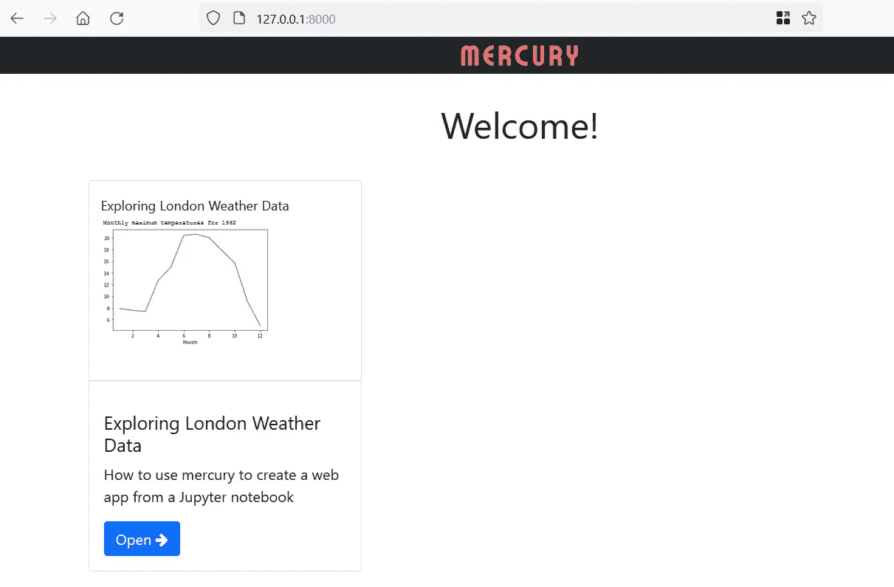

# 使用 Mercury 从您的 Jupyter 笔记本中创建一个 Web 应用程序

> 原文：<https://towardsdatascience.com/create-a-web-app-from-your-jupyter-notebook-with-mercury-21239b7abb37>

## 您可以将笔记本发布为交互式 web 应用程序，可以使用也可以不使用代码


我们都使用 Jupyter 笔记本来分析和创建数据的可视化，不是吗？这是一个很好的工具。

当然，您也可以通过简单地向您的同事发送一份副本来分享它们。但是对于那些不关心你的代码但对你的结果感兴趣的人来说，交互式应用可能是更好的工具。

这就是来自 *mljar* 的水星所承诺的。只需在笔记本的开头添加一个新的单元格，你就可以让 Mercury 将代码转换成可以部署到 AWS、Heroku 或任何地方的 web 应用程序。

它还允许你在你的笔记本中加入互动元素，比如滑块，下拉菜单。

下面是我在几分钟内创建的一个简单的 web 应用程序的截图。正如你所见，它包括一个互动滑块。这个应用程序非常简单:它加载一组天气数据，并绘制一个特定年份的月最高气温图表——滑块允许你选择年份。



作者截图

更复杂的应用可以在 [Mercury 网站](https://mljar.com/mercury/)上找到。以下是一些例子:



图片来自 Mercury Github repo —经 mljar 许可使用，AGPLv3 许可证

但是我将介绍如何创建我自己创建的简单 web 应用程序。它主要是一个非常简单的 Jupyter 笔记本，由六个电池组成。

## 恋恋笔记本

第一个是包含一些 YAML 代码的*原始*单元格，这些代码告诉 Mercury 要做什么以及要包含哪些交互。前三行定义了`title`、a `description`并将`show-code`设置为`False`。设置为 false 意味着单元格中的代码在最终的 web 应用程序中不可见。

```
---
title: Exploring London Weather Data
description: How to use mercury to create a web app
show-code: False
params:
   year:
      input: slider
      label: Select year
      value: 1952
      min: 1952
      max: 2018
---
```

最后几行定义了参数。`year`是一个将出现在笔记本中的变量，后面的几行定义了一个滑块，用于设置`year`的值。我认为它们是不言自明的。请注意，单元格以线`---.`开始和结束

第二个单元格定义了变量`year`并赋予它一个值。第一个单元格中引用的任何变量都必须像这样在一个单元格中一起定义。

```
year = 1962
```

下一个单元格是标记标题。

```
**# Exploring London Weather Data**
```

然后我们导入几个库。

```
import numpy as np
import pandas as pd
```

和一些数据。

```
weather=pd.read_csv('heathrowDataFiltered.csv')
```

然后我们绘制一个图表，根据`year`的值过滤数据。我们还打印了介绍图表的消息。

```
weather[weather['Year']==year].plot(y='Tmax', x='Month',    
   legend=False)print(f"Monthly maximum temperatures for {year}")
```



作者图片

运行笔记本将得到 1962 年的月最高温度图，这是我们在开始时设置的值。

但是我们将创建的 web 应用程序将允许我们选择我们感兴趣的年份。

那么，我们该怎么做呢？

## 汞

首先，您需要安装 mercury:

```
pip install mljar-mercury
```

然后，您需要“添加”您的笔记本:在命令行中键入:

```
mercury add <path_to_notebook>
```

最后，您运行它:

```
mercury runserver --runworker
```

这将启动一个服务器，您的应用程序将在 IP 地址 127.0.0.1:8000 上运行。在网络浏览器中打开它，您会看到类似这样的内容:



作者图片

如果您添加了多个笔记本，它们都会显示在此处。单击要运行的应用程序的打开按钮，您将看到基于笔记本的应用程序。


作者截图

当应用程序运行时，它会显示图表；然后，您可以调整滑块并再次运行它，以查看所选年份的图表。

这是一个非常快速的水星运行，只向你展示了它的一些能力。在 Mercury 网站和 Github repo 上有更多信息。例如，你可以包括一大堆输入控件，而不仅仅是滑块，Github README 文档详细介绍了你可以使用的所有 YAML 命令，以及如何将你的应用程序部署到云上。这远远超出了我在这里可以涵盖的范围，所以你真的需要去看看。

你可以在这里下载我的文件:[资料](https://raw.githubusercontent.com/alanjones2/Alan-Jones-article-code/master/mercury/heathrowDataFiltered.csv)，[笔记本](https://raw.githubusercontent.com/alanjones2/Alan-Jones-article-code/master/mercury/heathrowdataMercury.ipynb)。

一如既往地感谢阅读。如果你对围绕数据科学和可视化的编程思想感兴趣，我的[网页](http://alanjones2.github.io)上有更多的文章，或者你可以获得我偶尔的免费时事通讯，Substack 上的 [Technofile](https://technofile.substack.com/) 。