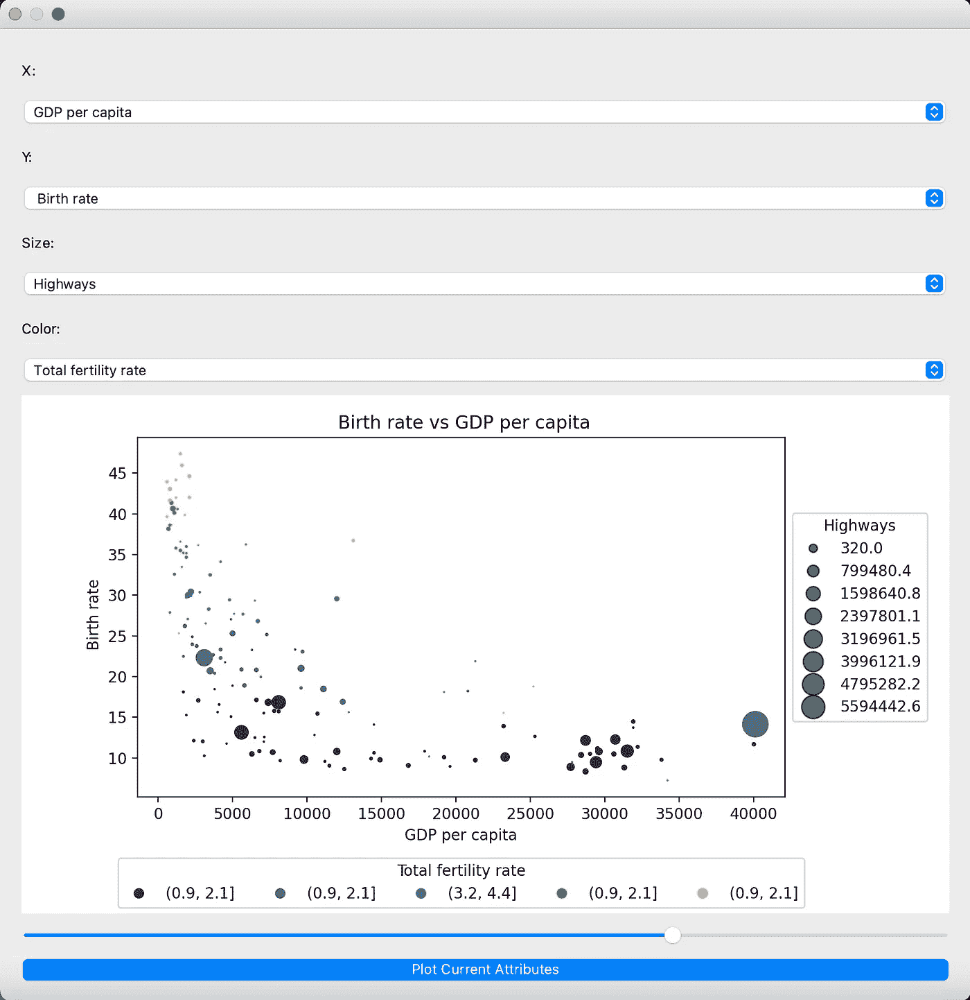
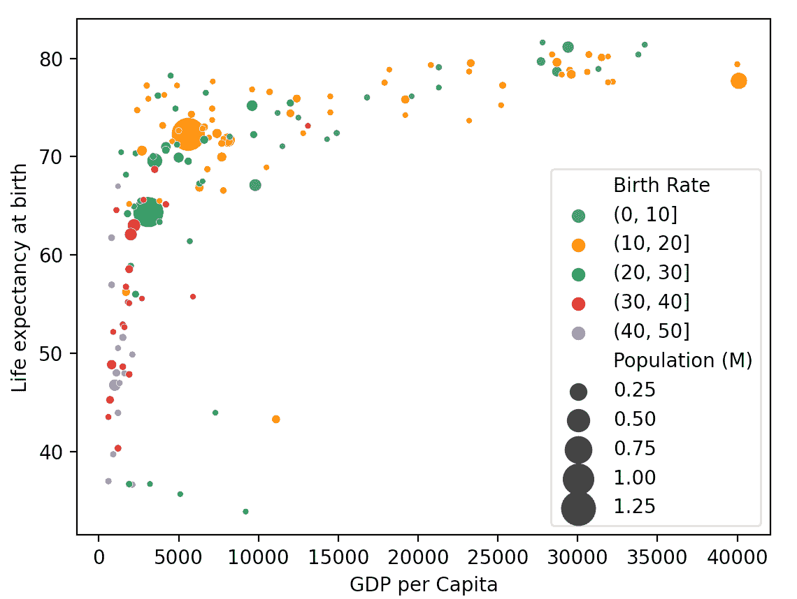
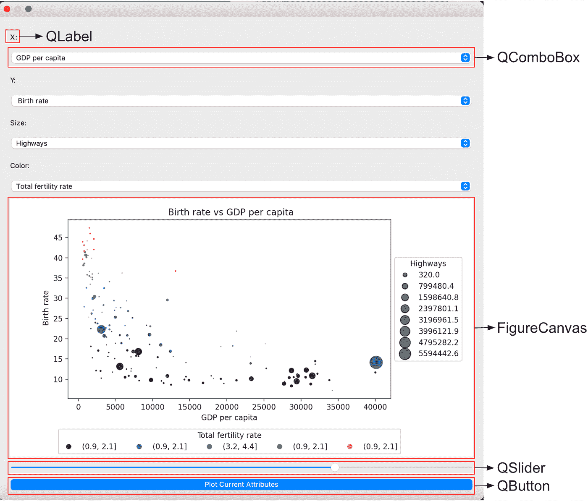

# 使用 PyQt5 创建交互式气泡图

> 原文：<https://towardsdatascience.com/create-an-interactive-bubble-plot-with-pyqt5-48a6e0c1d0f7>

## 使用 GUI 使 Matplotlib 图更吸引人



用 PyQt5 和 Matplotlib 创建的最终输出

**pyqt 5 简介**

Qt GUI 框架用于创建跨平台的用户界面。该框架是用 C++编写的，但是 PyQt5 库允许它被导入并直接在 Python 中使用。它的易用性使它成为用 Python 创建 GUI 的最流行的应用程序之一。

PyQt5 在 Python 的数据可视化中有许多用途，其中一个是在 matplotlib 中制作的交互式绘图。交互式绘图允许以有效的方式交流更复杂的数据。在这篇文章中，我将演示如何创建一个交互式气泡图，以便用户可以深入数据。

**系统需求**

我使用了 JupyterNotebook，但是也可以使用任何 IDE。如果版本是允许交互式绘图的 Matplotlib notebook，则 matplotlib 只能与 PyQt5 集成。

在 Jupyter Notebook 中，需要运行行%matplotlib notebook 来更改预设，因为%matplotlib inline 不允许交互式绘图。如果正在使用 IDE，matplotlib notebook 是自动设置。

**第一步:制作泡泡图**

我将使用的数据集是中情局每年出版的《2020 年世界概况》。该数据集包含世界上每个国家的人民、经济和政府的一般信息。

可以从这里下载:

[https://www . CIA . gov/the-world-factbook/about/archives/download/factbook-2020 . zip](https://www.cia.gov/the-world-factbook/about/archives/download/factbook-2020.zip)

该数据集中使用的变量有:

*   x:人均国内生产总值
*   y:预期寿命
*   色调:出生率
*   规模:人口

**导入库**

```
from matplotlib import pyplot as plt
import pandas as pd
import seaborn as sns
```

**数据清理**

在图表中使用每个变量之前，需要对其进行一些数据清理和数据扩充。

x 变量:人均 GDP 目前是一个包含逗号和美元符号的字符串，需要删除这两个符号才能将字符串转换为整数值。

```
df = pd.read_csv(“factbook.csv”)df[“GDP per Capita”] = df[“GDP per capita”].str.replace(‘,’,’’).str.replace(‘$’,’’).astype(float).astype(int)
```

y 变量:出生率目前是一个连续变量，但由于它用于色调，因此需要通过创建箱来将其变为离散变量。

```
bi = []
for i in range(0,60,10):
bi.append(i)
df[‘Birth Rate’] =(pd.cut(df[‘ Birth rate’], bins = bi)
```

Size 变量:Population 当前是一个由逗号组成的字符串，为了转换成整数，需要删除逗号。

```
df[‘Population (M)’]=(df[‘Population’].str.replace(‘,’,’’)).astype(int)
```

Seaborn 是一个基于 matplotlib 构建的数据可视化库，将用于制作这个气泡图。也可以使用传统的 matplotlib 库。

```
bubble = sns.scatterplot(data=df, x=”GDP per Capita”, y=”Life expectancy at birth”, size=”Population (M)”, hue=”Birth Rate”, legend= True, sizes=(10, 300))
```

添加尺寸和颜色的图例，并显示绘图。

```
bubble.legend()
plt.show()
```



锡伯恩地块

这个初始图表清楚地显示了四个变量之间的关系。试图添加额外的变量会使可视化变得混乱，但是，在这个数据集中仍然有五个其他的变量。通过使可视化具有交互性，用户可以通过查看不同变量之间如何相互作用来更深入地研究数据。

**第二步:设置 PyQt5**

使用下面的 import 语句下载 PyQt5 的所有库和依赖项。

```
from PyQt5.QtWidgets import QDialog, QApplication, QPushButton, QVBoxLayout, QLabel, QComboBox, QSlider
from PyQt5.QtCore import Qt
from matplotlib.backends.backend_qt5agg import FigureCanvasQTAgg as FigureCanvas
import math
import sys
import re
```

首先创建一个类和构造函数。然后设置弹出窗口的几何图形(指定几何图形是什么)。我选择 do (400，400，900，900 ),因为我认为这对于用户来说足够大，可以从图中捕捉细节。setGeometry 的参数是 x、y、宽度和高度。

```
class Window(QDialog):
# constructor
def __init__(self, parent=None):
    self.setGeometry(400, 400, 900, 900)
```

**第三步:在构造函数中添加小部件**

**Widget 1: FigureCanvas**

图形小部件用于在可视化中显示图形。

```
self.figure = plt.figure()
self.canvas = FigureCanvas(self.figure)
```

**Wiget 2: QComboBox**

在每个 ComboBox 的构造函数中添加代码。下面的代码是我命名为 xComboBox 的第一个代码，用于捕获 x 轴变量的用户输入。首先，初始化并命名 ComboBox。

```
self.xComboBox = QComboBox(self)
```

向 ComboBox 中添加项。addItems()用于包含选项的列表。在这种情况下，所有列名都作为选项添加到组合框中。

```
self.xComboBox.addItems([“Area”,”Death rate”, “ Birth rate”,”GDP per capita”,”Population”,”Electricity consumption”, “Highways”, “Total fertility rate”, “Life expectancy at birth”])
```

**Wiget 3: QLabel**

需要创建一个标签，以便让用户知道其他小部件的用途。在这种情况下，它将允许用户知道组合框中的值将用于什么。

```
self.xLabel = QLabel(“&X:”)
```

创建的标签需要链接到 ComboBox，以使其成为一个组合对象。

```
self.xLabel.setBuddy(self.xComboBox)
```

**Wiget 4: QSlider**

滑块用于允许用户调整可视化中的值。PyQt5 中的小部件是 QSlider，它有一个必需的方向参数，可以是 Qt。在这种情况下，水平方向在视觉上是最吸引人的。在这个可视化中，滑块将改变大小变量，以便用户可以增加或减少气泡，以确定可视性的最佳大小。(再看这个)

```
self.mySlider = QSlider(Qt.Horizontal, self)
```

滑块的几何形状需要调整，以最适合 GUI 窗口。setGeometry 的参数同上，x，y，width 和 height。

```
self.mySlider.setGeometry(30, 40, 200, 30)
```

需要将函数链接到滑块，以便在可视化中利用其值。首先，。需要使用 valueChanged[int]来获得基于滑块位置的当前值。用要使用的函数名连接()。下面的按钮小部件中也会用到所使用的函数，这将在一节中讨论。

```
self.mySlider.valueChanged[int].connect(self.changeValue)
```

**小工具 5:按钮**

使用 QPushButton 创建按钮小部件。这个函数中的参数是以字符串形式传入的按钮名称。按钮名为“绘制当前属性”,任何时候用户更改滑块值或组合框值时，都需要按下该按钮来更新图形。还需要有一个功能连接到按钮，以编程的行动时，按下执行。我创建了一个名为 changeValue 的函数，用于按钮和滑块。

```
button = QPushButton(“Plot Current Attributes”, self)
button.pressed.connect(self.changeValue)
```

**changeValue:滑块和按钮功能**

按钮和滑块小部件需要连接到一个函数，以便在可视化中使用它们的值。我创建的 changeValue 函数可用于按钮和滑块。这可以通过*args 参数实现，它允许传递任意数量的参数。对于按钮，调用函数时不会传递任何参数，但对于滑块，将传递位置值。这个函数在构造函数之外。

```
def changeValue(self, *args):
```

检索用于散点图的 comboBox 小工具的所有当前值。

```
# finding the content of current item in combo box
x = self.xComboBox.currentText()
y = self.yComboBox.currentText()
s = self.sComboBox.currentText()
c = self.cComboBox.currentText()
```

清除当前剧情并创建新的支线剧情。

```
#clear current figure
self.figure.clear()#create a subplot
ax = self.figure.add_subplot(111)
```

调整大小和颜色变量。尺寸变量需要标准化，这样气泡的大小才合适。

```
#normalize the size data
if len(args) == 0:
   df[“s_new”] = df[s]/df[s].abs().max()
   df[“s_new”] = df[“s_new”] * 4
else:
   df[“s_new”] = df[s] / df[s].abs().max()
   df[“s_new”] = df[“s_new”] * args * 4
```

颜色变量需要离散化。

```
df[‘new_c’] = (pd.cut(df[c], bins=5))
```

一旦用户从组合框中选择新的值，用滑块设置新的大小，并调整新的数据，就可以创建散点图。

```
#create scatter plot with new data
b = ax.scatter(x=df[x], y=df[y], s = df[“s_new”], c = df[“new_c”].cat.codes)#create labels and title
t = y + “ vs “ + x
ax.set(xlabel=x, ylabel =y, title=t )
```

为颜色和大小图例创建自定义标签。Matplotlib 自动添加标签，但是对于颜色变量，需要显示范围。自动标签将只标记从 1 到 n 的颜色，n 是颜色的数量。对于大小，我们对数据进行了标准化，以便自动标注会显示这些数据，并且我们希望图例中有真实的数据。这是一个可选的步骤，如果数据没有改变，没有必要这样做，因为自动标签将是正确的。

```
#create labels and title
t = y + “ vs “ + x
ax.set(xlabel=x, ylabel =y, title=t )#extract handles and labels for legend
handles, labels = b.legend_elements(prop=”sizes”, alpha=0.6)#create custom labels for size legend
num_labels = len(handles)
labels_new = list(np.arange((min(df[s])), (max(df[s])), ((max(df[s]) — min(df[s]))/(num_labels-1))))
labels_new = list(np.around(np.array(labels_new), 1))# create custom labels that show ranges for color legend
df[‘new_c’] = (pd.cut(df[c], bins=5))
num_labels_c = len(b.legend_elements()[0])
col_bins = pd.cut(df[c], bins=num_labels_c,precision=1)
```

添加带有自定义标签的图例并格式化图表。需要调整图表的大小，以使图例适合图表的外部。这是通过将高度和宽度减少 10%并将 y0 位置向上移动一点来实现的，这样颜色图例就可以在图形的底部，尺寸图例在右侧。

```
# get and adjust the position of the graph to fit the legends
box = ax.get_position()
ax.set_position([box.x0, box.y0 + box.height * 0.15, box.width * 0.9, box.height * 0.9])#color legend with custom labels
legend1 =ax.legend(b.legend_elements()[0],col_bins , title = c, loc=’upper center’, bbox_to_anchor=(0.5, -0.15), ncol = 5)
ax.add_artist(legend1)#size legend with custom labels
legend2 = ax.legend(handles, labels_new, loc = “center left”, title=s, bbox_to_anchor=(1, 0.5))
ax.set(xlabel=x, ylabel =y, title=t )
```

使用 figure 小部件绘制新图形。

```
#draw new graph
self.canvas.draw()
```

**第四步:格式化窗口小部件**

一旦创建了所有的小部件，就需要对它们进行格式化。PyQt5 有许多不同的布局，我选择使用 QVBoxLayout()。这将小部件排列在一个垂直框中。还有 QHBoxLayout()将小部件排列在一个水平框中，QGridLayout()以网格格式排列小部件，而 QFormLayout()将小部件排列在两列中。

每个小部件都可以一个接一个地添加到布局中，它们将堆叠在一起。最后，一旦所有的小部件都在布局中，它需要用 self.setLayout(LayoutName)设置。可以使用任何名称，但是这将初始化布局对象，并且需要调用它以便向特定布局添加小部件。

```
grid = QVBoxLayout()
grid.addWidget(self.xLabel)
grid.addWidget(self.xComboBox)
grid.addWidget(self.yLabel)
grid.addWidget(self.yComboBox)
grid.addWidget(self.sLabel)
grid.addWidget(self.sComboBox)
grid.addWidget(self.cLabel)
grid.addWidget(self.cComboBox)
grid.addWidget(self.canvas)
grid.addWidget(self.mySlider)
grid.addWidget(button)
self.setLayout(grid)
```

**第五步:主方法**

main 方法创建该类的一个实例，并无限循环以获取对可视化所做的任何更改。

```
if __name__ == ‘__main__’:
   # creating apyqt5 application
   app = QApplication(sys.argv) # creating a window object
   main = Window() # showing the window
   main.show() # loop
   sys.exit(app.exec_())
```

**最终输出**



最终图形用户界面

**总结**

结合以上所有步骤，获得您的交互式气泡图！当该函数运行时，GUI 应该在一个单独的窗口中弹出。完整的代码链接如下。虽然这是一个简单的例子，但是 PyQt5 可以集成到任何 matplotlib 可视化中。它允许创建添加深度和信息层的可视化，这是一般报告或静态可视化无法实现的。毕竟一图胜千言。

完整代码可以在这里找到:[https://github . com/kruthik 109/Data-Visualization/blob/main/Interactive-Bubble-Plot/widgets . py](https://github.com/kruthik109/Data-Visualization/blob/main/Interactive-Bubble-Plot/widgets.py)

**来源**

中央情报局。(2020 年 4 月 6 日)。*2020 年世界概况*。中央情报局。检索于 2022 年 2 月 22 日，来自[https://www.cia.gov/the-world-factbook/about/archives/](https://www.cia.gov/the-world-factbook/about/archives/)