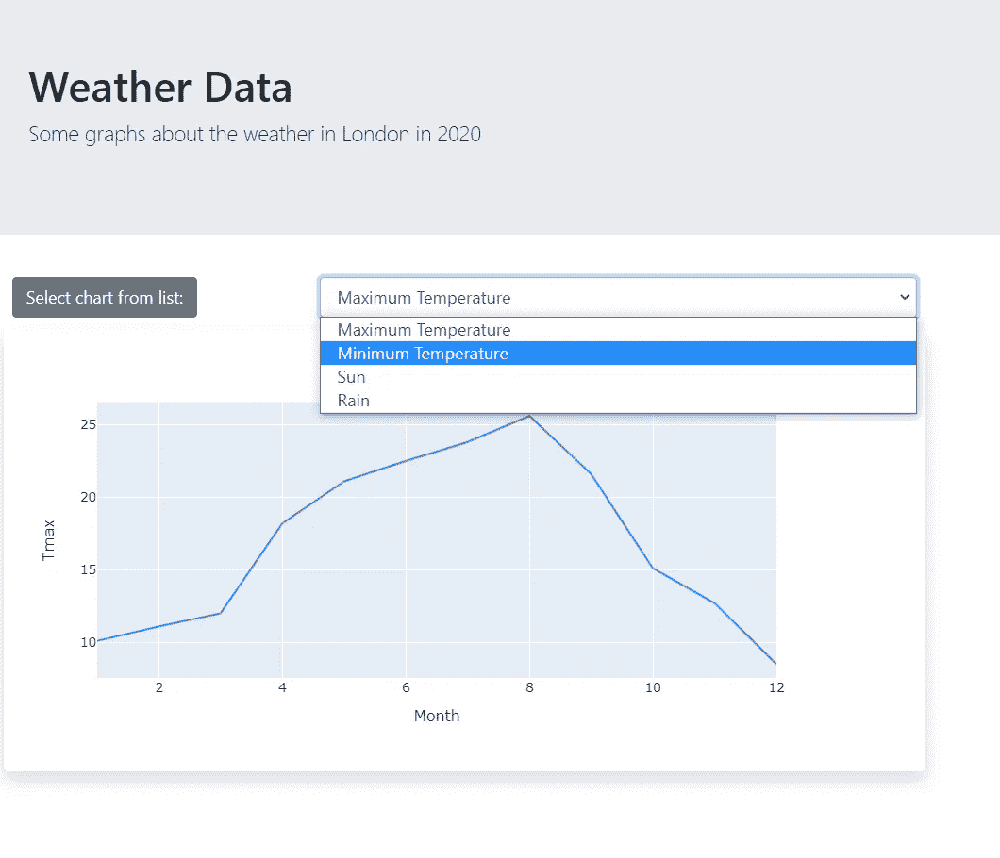

# 用 PyScript 和熊猫创建一个交互式 Web 应用程序

> 原文：<https://towardsdatascience.com/create-an-interactive-web-app-with-pyscript-and-pandas-3918ad2dada1>

## PyScript 允许我们用 HTML 和 Python 作为脚本语言创建一个无服务器的 web 应用程序



作者图片

PyScript 是 web 应用的未来吗？也许是，但可能还不是——我敢肯定，它仍然只是一个 alpha 版本，还有很多工作要做。

但是现在它有多大用处呢？

我们将创建一个交互式 web 应用程序，其中的逻辑完全是用 Python 编写的。

你可能听说过 PyScript，它是由 Anaconda 的首席执行官王蒙杰在 2022 年的 PyCon 大会上宣布的。用他们自己的[话说](https://anaconda.cloud/pyscript-python-in-the-browser)这是“一项闪亮的新技术……允许用户在浏览器中编写 Python，事实上还有许多语言”。

PyScript 的最大优势在于，您可以用 Python 编写 web 应用程序，而不需要服务器。这是通过使用用 WebAssembly 编写的 Pyodide Python 解释器来实现的，web assembly 是现代浏览器支持的较低级的 web 语言。

到目前为止，Python web 应用程序都是基于服务器的，并且使用 Django 或 Flask 等框架，其中前端是用 HTML 和 Javascript 创建的，而后端是在远程服务器上运行的 Python。

最近，Dash 和 Streamlit 试图通过提供纯 Python 框架来简化此类应用的构建，从而避免学习 HTML 和 Javascript。但是这些仍然是基于服务器的应用程序。

PyScript 是一种不同的方法。在 PyScript 中，用户界面仍然是用 HTML 构造的，但是 Javascript 被 Python 代替了(尽管如果您愿意，您仍然可以使用 Javascript，并且用两种脚本语言编写的函数可以相互通信)。

# 网络应用

我将运行一个用 PyScript 和 HTML 编写的简单应用程序，它从远程数据源读取数据，并显示一个简单的仪表板，用户可以在其中选择要在 Pandas 图表中显示的数据。

该应用程序的基本形式如下:

```
<html>
    <head>
        <link rel="stylesheet" 
            href="https://pyscript.net/alpha/pyscript.css" />
        <script defer 
            src="https://pyscript.net/alpha/pyscript.js">
        </script>
        <py-env>
            - libraries-that-will-be-used
        </py-env>
    </head>
    <body> <!-- HTML layout code goes here --> <py-script>
            # PyScript code goes here
        </py-script>
    </body>
</html>
```

正如你所看到的，它看起来像一个标准的 HTML 文件，事实上它就是一个。但是对于 PyScript app，我们需要在`<head>`部分包含到 PyScript 样式表和 Javascript 库的链接，以及包含我们稍后将看到的`<py-env>`块。

接下来在`<body>`中，我们有 HTML 布局内容，后面是包含 Python 代码的`<py-script>...</py-script>`标签。

我们现在将充实这些部分。

首先，我将使用 Bootstrap 框架来使整个应用程序看起来很漂亮。这意味着我们需要包含到引导 css 文件的链接。我们将使用 Matplotlib 和 Pandas 库，这些库需要在`<py-env>...</pt-env>`部分声明。`<head>...</head>`现在看起来像这样:

```
<head>
    <link rel="stylesheet" 
        href="https://pyscript.net/alpha/pyscript.css" />
    <script defer 
        src="https://pyscript.net/alpha/pyscript.js">
    </script>
    <link rel="stylesheet" 
        href="https://maxcdn.bootstrapcdn.com/bootstrap/4.3.1/css/bootstrap.min.css">
    <py-env>
        - matplotlib
        - pandas
    </py-env>
</head>
```

接下来要看的是网页的 HTML 代码。第一部分基本上是页面的标题。我们利用 Bootstrap 的*大屏幕*容器。这给了我们一个令人愉快的灰色背景的盒子和一些经典引导风格的介绍性文本。

```
<div class="jumbotron">
    <h1>Weather Data</h1>
    <p class="lead">
        Some graphs about the weather in London in 2020
    </p>
</div>
```

接下来是两行:第一行有一个按钮和一个下拉菜单，第二行包含要显示的图表。

这是第一行:

```
<div class="row">
    <div class="col-sm-2 p-2 ml-4 mb-1">
        <button type="button" class="btn btn-secondary">Select chart from list:</button>
    </div> <div class="col-sm-4 p-2 mr-4 mb-1">
        <select class="form-control" id="select">
            <option value="Tmax">Maximum Temperature</option>
            <option value="Tmin">Minimum Temperature</option>
            <option value="Sun">Sun</option>
            <option value="Rain">Rain</option>        
        </select>
    </div>
</div>
```

它由两列组成，一列用于按钮，另一列用于菜单(我在这里使用按钮只是为了美观，它实际上并没有按钮的功能)。下拉列表中的选项将用于显示四个不同图表中的一个。将使用的数据是 2020 年伦敦的天气状况表。表格中有 12 行代表每个月，表格中的列代表该月的最高温度*、最低温度*、日照时数*和降雨量*毫米*。***

**因此，菜单项代表这些选项，并将取值为“Tmax”、“Tmin”、“Sun”或“Rain”。**

**到目前为止，我们已经编写了网页代码，现在我们需要定义对用户输入做出反应的逻辑，并绘制图表。这在`<py-script>`一节中定义。我们接下来要处理的代码在这一节中。**

**先导入一些库。**

```
**# Import libraries
import pandas as pd
import matplotlib.pyplot as plt**
```

**当然是熊猫和 Matplotlib，但我们还需要以下内容:**

```
**from pyodide.http import open_url**
```

**这是 PyScript 提供的一个库，它允许我们从网上的资源中读取内容，我们是这样使用它的:**

```
**url = 'https://raw.githubusercontent.com/alanjones2/uk-historical-weather/main/data/Heathrow.csv'
url_content = open_url(url)df = pd.read_csv(url_content)**
```

**PyScript 实现 Pandas 函数`read_csv`不能直接打开 url，所以我们必须使用上面的技术。**

**正在下载的文件包含几十年的数据，但为了保持简单，我们将过滤它，只保存 2020 年的数据。**

```
**# filter the data for the year 2020
df = df[df['Year']==2020]**
```

**现在是我们之前看到的在 HTML `<div>`中绘制图表的函数。**

```
**# Function to plot the chart
def plot(chart):
    fig, ax = plt.subplots()
    df.plot(y=chart, x='Month', figsize=(8,4),ax=ax)
    pyscript.write("chart1",fig)**
```

**这是和熊猫一起策划的非常标准的东西。与“普通”Python 程序的主要区别在于它的呈现方式。`pyscript.write`函数获取 HTML 元素的 id，并将第二个参数的内容写入其中。**

**这依赖于 PyScript 实现中包含的呈现特定对象的方式——在本例中是 matplotlib 图表——这不一定适用于任何类型的对象。例如，如果我们想要显示一个 Plotly 图表，我们将不得不使用不同的技术，因为在 PyScript 中没有直接实现 Plotly 图形(到目前为止)。**

**接下来要做的是定义当用户从下拉菜单中选择一个新图表时调用`plot`函数的方法。**

**首先是更多的库——这些是作为 PyScript 的一部分提供的。**

```
**from js import document
from pyodide import create_proxy**
```

**`js`库允许 PyScript 访问 Javascript 函数，在这个例子中，我们引入了访问 DOM 的能力。Pyodide 的 create_proxy 则相反，允许 Javascript 直接调用 PyScript 函数。**

```
**def selectChange(event):
    choice = document.getElementById("select").value
    plot(choice)**
```

**当一个改变事件发生时，这个函数被调用。它读取选择的值，然后用该值调用先前定义的`plot`函数。**

**接下来，我们定义一个代理，它将允许 change 事件调用 PyScript 函数`selectChange`。**

```
**# set the proxy
def setup():
    # Create a JsProxy for the callback function
    change_proxy = create_proxy(selectChange) e = document.getElementById("select")
    e.addEventListener("change", change_proxy)**
```

**最后，当页面第一次加载时，我们需要调用`setup`函数并使用默认值(‘Tmax’)运行`plot`函数，以便在启动时显示图表。**

**这是实现一个简单的仪表板应用程序的全部代码，就像本文开头截图中的那个一样。这个代码和一个演示应用程序的链接将在最后的链接。**

# **PyScript 与现有的基于服务器的应用程序相比如何？**

**就难度而言，只要你熟悉 Python，构建 web 应用程序就相对简单，可能比构建 Django 或 Flask 应用程序更容易——我认为更像 Dash 的水平。**

**然而细流是一个不同的故事。Streamlit 在视觉设计方面更受限制，但它的优势是你不必学习 HTML。Streamlit 应用程序非常容易创建——我认为比 PyScript 更容易。**

**然而，PyScript 相对于所有竞争对手的优势在于它不依赖于服务器。这使得部署变得非常容易——我只需将您在这里看到的应用程序上传到 Github Pages 网站，它就可以正常工作了。**

**目前 PyScript 有点慢。因为所有的工作都是在浏览器中完成的，所以性能由运行浏览器的机器决定——如果你的硬件很弱，那么加载你的应用可能需要很长时间，尽管一旦它启动并运行，性能似乎就没问题了。**

**但是，随着硬件变得更加强大，PyScript 变得更加成熟，并且(希望)变得更加高效，性能只会变得更好。有一天，谁知道呢，也许我们会看到 PyScript 像今天的 Javascript 一样嵌入到浏览器中。**

*****更新:你可以在这里*** ***找到这个 app 用 Plotly 代替熊猫绘图的版本*** [***。***](https://medium.com/technofile/how-to-use-ploty-with-pyscript-578d3b287293)**

*****更新 2:***[***PyScript 新增功能***](https://alan-jones.medium.com/whats-new-in-pyscript-dfdf25538281) ***查看截至 2023 年初 PyScript 所做的一些重大更改。*****

**一如既往，感谢阅读。你可以在我的[网站](https://alanjones2.github.io/)上找到完整代码和演示网页的链接，在那里你还可以找到其他文章的链接。**

**[](https://alanjones2.github.io) [## AlanJones:编码、科学和技术

### 使用 Streamlit、Plotly、Python 和 Flask 为 web 构建数据可视化应用程序。适用于…的文章、教程和应用程序

alanjones2.github.io](https://alanjones2.github.io) 

如果你想跟上我写的东西，请考虑订阅我偶尔的[时事通讯](http://technofile.substack.com)或者点击下面的链接，当我在这里发表时，你会收到一封电子邮件。

[](https://technofile.substack.com) [## 技术文件

### 技术、科学、数据科学和编码。点击阅读阿兰·琼斯的技术文件，这是一个子堆栈出版物，包含…

technofile.substack.com](https://technofile.substack.com) 

# 笔记

1.  天气数据来自我的报告[英国历史天气](https://github.com/alanjones2/uk-historical-weather)，并来自英国气象局[历史气象站数据](https://www.metoffice.gov.uk/research/climate/maps-and-data/historic-station-data)。它是根据[英国开放政府许可证](https://www.nationalarchives.gov.uk/doc/open-government-licence/version/3/)发布的，可以在相同的条件下使用。

## 海生的

在回答“Seaborn 是否适用”这个问题时:

```
<html><head>
<link rel="stylesheet" href="https://pyscript.net/alpha/pyscript.css" />
<script defer src="https://pyscript.net/alpha/pyscript.js"></script><link rel="stylesheet" href="https://maxcdn.bootstrapcdn.com/bootstrap/4.3.1/css/bootstrap.min.css"><py-env>
   - matplotlib
   - pandas
   - seaborn
</py-env></head>
<body><div class="jumbotron"> <h1>Weather Data</h1>
   <p class="lead">
      Some graphs about the weather in London in 2020
   </p></div><div class="row">
   <div class="col-sm-2 p-2 ml-4 mb-1">
   <button type="button" class="btn btn-secondary">Select chart from list:</button>
   </div>
   <div class="col-sm-4 p-2 mr-4 mb-1">
      <select class="form-control" id="select">
         <option value="Tmax">Maximum Temperature</option>
         <option value="Tmin">Minimum Temperature</option>
         <option value="Sun">Sun</option> 
         <option value="Rain">Rain</option>
      </select>
   </div>
</div><div class="row">
   <div class="col-sm-6 p-2 shadow ml-4 mr-4 mb-4 bg-white rounded">
      <div id="chart1"></div>
   </div>
</div><py-script>
# Import libraries
import pandas as pd
import matplotlib.pyplot as plt
import seaborn as sns# Get the datafrom pyodide.http import open_urlurl = 'https://raw.githubusercontent.com/alanjones2/uk-historical-weather/main/data/Heathrow.csv'url_content = open_url(url)df = pd.read_csv(url_content)# filter the data for the year 2020df = df[df['Year']==2020]# Function to plot the chartdef plot(chart):
   fig, ax = plt.subplots()
   sns.lineplot(y=chart, x="Month", data=df, ax=ax)
   pyscript.write("chart1",fig)# Set up a proxy to be called when a 'change'# event occurs in the select controlfrom js import document
from pyodide import create_proxy# Read the value of the select control# and call 'plot'def selectChange(event):
   choice = document.getElementById("select").value
   plot(choice)# set the proxydef setup():
   # Create a JsProxy for the callback function
   change_proxy = create_proxy(selectChange)
   e = document.getElementById("select")
   e.addEventListener("change", change_proxy)setup()# Intitially call plot with 'Tmax'plot('Tmax')</py-script></body></html>
```