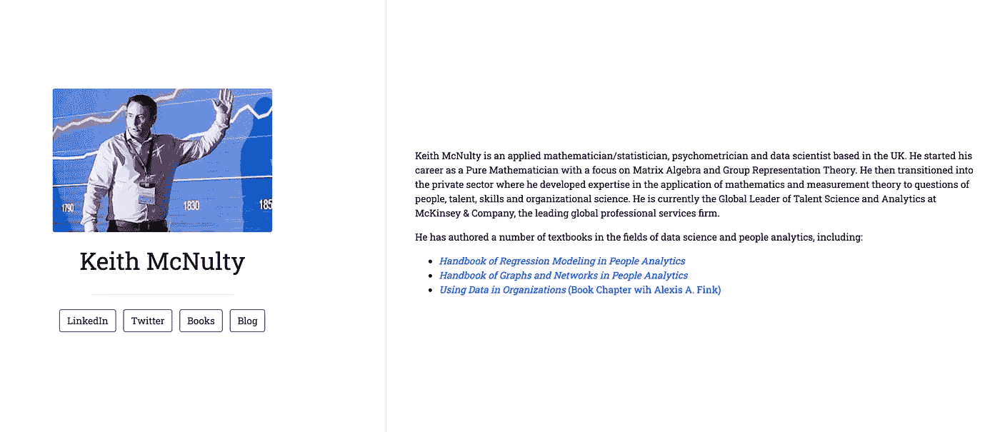
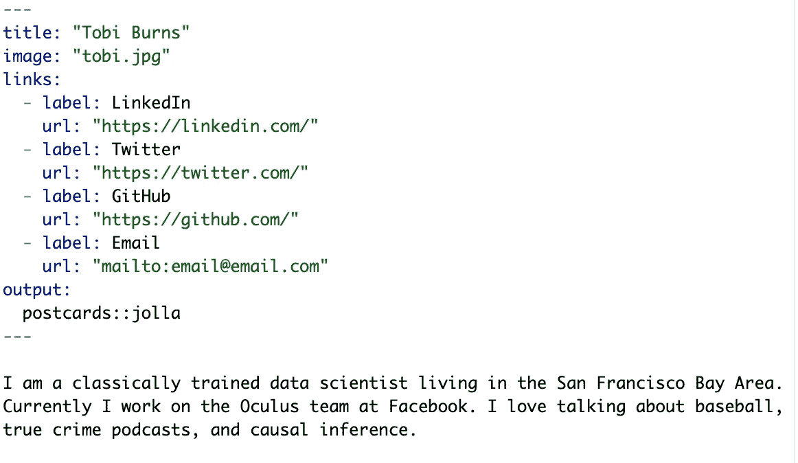
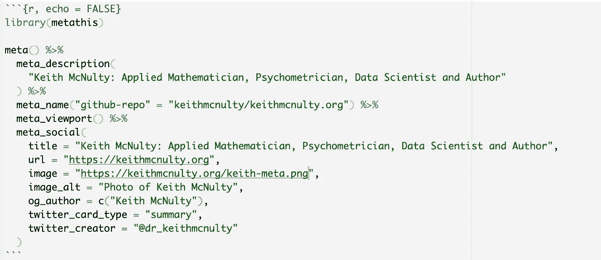

# 使用 R 在几分钟内创建并托管您的个人网站

> 原文：<https://towardsdatascience.com/create-and-host-your-personal-website-in-a-few-minutes-using-r-9c94e87e2942>

# 使用 R 在几分钟内创建并托管您的个人网站

## 在几分钟内建立和主持一个简单，干净，专业的个人网页，如果你喜欢，添加一些铃铛和口哨



我的简单网站的例子创建使用 R 和明信片在[keithmcnulty.org](https://keithmcnulty.org)

越来越多的数据科学家和其他技术专业人员因为他们的在线存在和开源活动而被认可，就像他们的职业历史一样。因此，我认为每个数据科学家都应该有自己的个人网页，向世界介绍一些他们自己和他们的工作。

这不必很复杂。我们都有 LinkedIn 个人资料，我们中的一些人还有其他在线存在，如媒体博客、YouTube 视频或 Twitter 账户。所以你的个人网页只需要提供一个链接的中心点，并提供一些关于你是谁和你做什么的基本信息。你想告诉人们多少关于你自己的事，这取决于你自己。

好消息是，你可以在不到一个小时的时间内免费完成这项工作。这是配料和要遵循的食谱。我还添加了一些可选的额外说明，以防你使用你自己的个人网站域名来托管你的网站(比如像我在[keithmcnulty.org](https://keithmcnulty.org)的网站)，如果你想添加社交媒体元数据，以便社交媒体上你的网站链接具有专业的外观。

在我开始之前，你可以在 github repo [这里](https://github.com/keithmcnulty/keithmcnulty.org)看到我网站上的所有代码，所以你可能希望以此为起点。

## 佐料

1.  r 和 RStudio
2.  安装的`RMarkdown`、`postcards`和`metathis` R 包
3.  Github 账户
4.  一个 AWS 帐户，如果你想购买和使用个人网站域名

真的是这样。这是一个相当简单的过程，如果你按照这个食谱做，你应该能很快完成。

## 创建网站的方法

*   为您的网站创建一个新的公共 github repo。
*   从这个 github repo 在 RStudio 中启动一个新项目(新建项目>版本控制)
*   将您想在网站上使用的照片添加到项目中(jpg 或 png 格式即可)。
*   确保您已经安装了`RMarkdown`和`postcards`包。如果还没有，现在安装它们并重启 r。
*   从模板开始一个新的 R Markdown 文档(新建文件> R Markdown >从模板)。选择弹出选项的`postcards`模板之一。任何一个应该都可以。如果你想的话，你可以随时改变。您将在弹出的模板文件中看到以下内容:



RMarkdown 基本明信片模板

*   现在，您只需对您的姓名、照片文件以及您希望从个人资料中提供的任何链接进行必要的编辑。你基本上可以把尽可能多的链接向前。`label`字段将是显示在链接框中的内容，而`url`字段将是继续点击的地址。
*   在底部的文本中，你可以写下任何你想告诉人们的关于你的事情。你可以在这里使用标准的 RMarkdown 格式，包括使用`#`或`##`或`###`的标题，或者你可以包括项目符号或其他资源或照片的链接。在本节中，如果您愿意，您甚至可以用原始 HTML 编码。如果你有很多后续链接，那么我会建议你保持一个像我这样的简单的简历。
*   完成后，将文件保存为`index.Rmd`(确保它在项目的根目录下)并继续编织它。这将创建网页并保存为`index.html`。如果您想尝试另一种设计，只需将`output`字段中的名称更改为另一种`postcards`格式，如`postcards::trestles`或其他格式。
*   完成后，提交新文件并将其推送到 github repo。

## 主办网站的食谱

我们将在 Github 上托管网站。这意味着每当你改变它，并推动这些变化，网站将自动更新。为您省去管理不同托管平台的麻烦。

*   将您的网站文件推送到 Github 后，返回 Github repo，选择设置，然后选择页面。
*   选择主分支和根目录，然后选择保存。
*   网站上线可能需要几分钟时间，但你最终会看到一个绿框，上面有你的新网址。它通常是`https://username.github.io/reponame`的形式。
*   恭喜，你有网站了。
*   现在，无论你何时对你的网站进行更改，提交和推送，几分钟后这些更改将在你的新网站地址生效。容易得很。

## 可选方法:添加社交媒体元数据

通常我们会想在社交媒体上分享我们网站的链接。如果我们将社交媒体元数据添加到`index.html`中，我们可以定制共享时我们网站的链接显示方式。例如，当我在这里分享时，看看我的网站是如何显示的。我已经定制了链接中共享的图像和文本。

[](https://keithmcnulty.org) [## 基思·麦纽提:应用数学家、心理计量学家、数据科学家和作家

### 基思·麦纽提是英国的应用数学家/统计学家、心理计量学家和数据科学家。他开始…

keithmcnulty.org](https://keithmcnulty.org) 

您可以使用`metathis` R 包轻松地将社交媒体元数据添加到您的`index.Rmd`文件中。就像这样添加一个 R 代码块:



添加社交媒体元数据

`meta_social()`功能包含了你想要你的链接如何出现在社交媒体上的所有必要定制。如果你想为你的社交媒体链接使用不同的图片，请确保将该图片上传到你网站的根目录下。请注意，不同的社交媒体平台对图像尺寸和大小有不同的规定，所以保持图像相对简单。300 像素乘 300 像素的正方形效果很好，但你也可以做一些简单的风景格式的照片。你可以随时尝试分享你的网站，直到你对它的外观满意为止。

## 可选方法:使用个人域名

购买和使用个人域名是个好主意。它有一个更专业的外观，更容易被人们记住，在许多情况下，它每年只需花费 12 美元，一旦你拥有它，你可以使用任何你想要的子域用于不同的目的(如 blog.domain.com 或 myproject.domain.com)。

你可以使用亚马逊 Route 53 使用[这些指令](https://docs.aws.amazon.com/Route53/latest/DeveloperGuide/domain-register.html#domain-register-procedure)注册并购买一个域名。大多数域名是可用的，本质上并不罕见，每年只需 12 美元。如果你已经通过另一个提供商购买了一个域名，那么如果你愿意，你也可以找到把它转移到 AWS 的说明。这样做通常更便宜，而且你通常有更大的灵活性。

一旦你购买了一个域名并拥有了它，你需要设置好让`yourdomain.com`和`www.yourdomain.com`链接到你创建的 Github 网站。你需要确保无论访问者在网址中使用`http`还是`https`都会发生这种情况。以下是方法。

*   首先，您需要在 AWS Route 53 上为您的域名创建一个托管区域。进入托管区域。选择创建托管区域，并输入您购买的基本域名(不带`www.`)。选择它作为公共托管区域，然后单击创建。现在，您将在您的托管区域列表中看到这一点，并创建了几条记录。
*   我们现在必须创建一个别名记录，将这个托管区域指向 Github。进入您的新托管区域，然后单击创建记录。然后简单路由。在下一页，单击“定义简单记录”。保持记录名称不变，并选择一个 under 记录类型。在值/将流量路由到下，选择 IP 地址，然后输入这些值，然后选择定义简单记录，然后选择创建记录。

```
185.199.108.153
185.199.109.153
185.199.110.153
185.199.111.153
```

*   现在对域的`www`版本做同样的事情，创建另一个简单的记录，这次使用记录名`[www.yourdomain.com](http://www.yourdomain.com)`。这一次，在记录类型下，选择 CNAME。在 Value/Route traffic to 下，输入您之前创建的 Github 网站的基本网址— `yourusername.github.io`。不要输入回购名称。定义并创建新记录。
*   最后，回到你的 github repo，回到设置>页面。在显示自定义域的地方，输入您的根域(不带`www.`)并点击保存。如果您正确地遵循了前面的步骤，您最终应该会看到一个绿色的勾号，并看到一个过程开始提供您的 TLS 证书。
*   这可能需要一点时间，但完成后，您可以选择“强制 HTTPS ”,这样就完成了。你可能需要一点耐心来完成这一切，但是一旦完成，访问你在`https://yourdomain.com`或`https://www.yourdomain.com`的新网站，希望你都准备好了。

仅此而已。只需要几分钟就可以设置好网站的基本版本。建议将其附加到自定义域，如果您遵循这些说明，应该不会太难。希望这些对你有帮助。