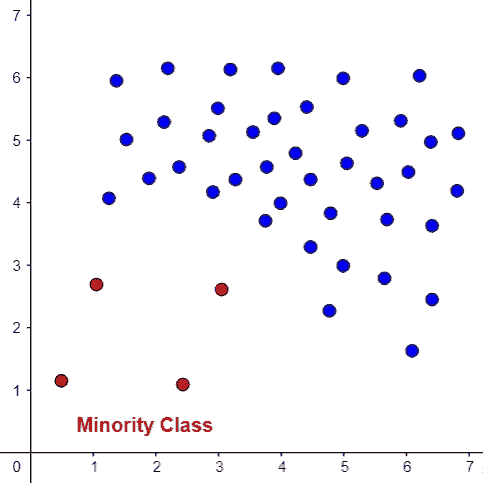
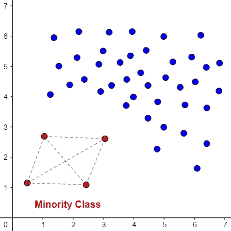
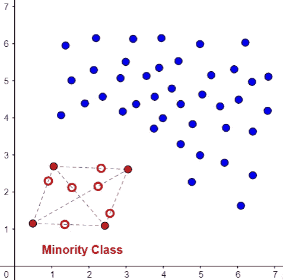
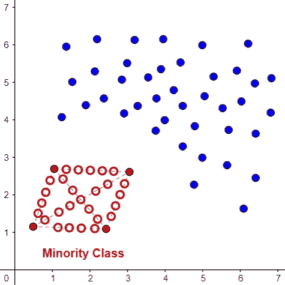
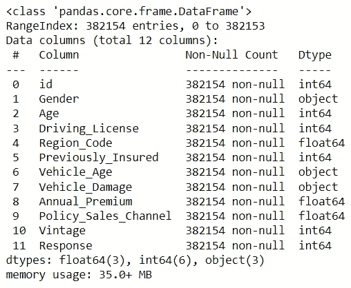
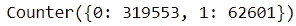
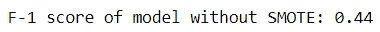
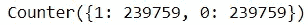
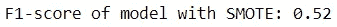

# 用 SMOTE 创建人工数据

> 原文：<https://towardsdatascience.com/create-artificial-data-with-smote-2a31ee855904>

# 用 SMOTE 创建人工数据

## 如何利用简单的算法来弥补数据的不足

布雷特·乔丹在 [Unsplash](https://unsplash.com?utm_source=medium&utm_medium=referral) 上的照片

数据不平衡在机器学习中普遍存在。真实数据很少平等地代表每个类。在疾病诊断、欺诈检测和垃圾邮件分类等应用程序中，一些类别将总是被低估。

这是许多机器学习相关工作的主要障碍。毕竟，如果您缺少特定结果的数据，您的模型将无法充分预测该结果。

值得庆幸的是，有办法绕过这个问题。如果你不能为少数民族阶层获取足够的数据，为什么不自己做一些呢？

这里，我们介绍合成少数过采样技术(SMOTE)，这是一种用于生成人工数据的流行算法。

## 为什么击打？

在介绍 SMOTE 的来龙去脉之前，让我们首先讨论一下对人工数据的需求。

当我们可以利用欠采样和过采样等采样技术时，为什么我们需要经历创建我们自己的数据的麻烦？

简而言之，这是因为这些方法存在重大缺陷。

**欠采样**需要通过从多数类中移除记录来均衡每个类的样本。这在理论上是明智的，但付诸实践就完全荒谬了。

数据是宝贵的。

为了进行后续的分析和建立依赖于这些数据的模型，企业需要付出相当大的努力来收集和存储数据。

试着告诉你的老板，为了“平衡”，你想丢弃你的数据工程师辛辛苦苦获得的 80%的数据。不会有好结果的。

**过采样**需要通过复制少数类样本来增加少数类大小，从而使每个类的样本均匀。这不是一个更好的选择，因为用这样的数据训练的模型容易过度拟合。

如果丢弃或复制样本无效，剩下的唯一选择就是创建自己的数据。

SMOTE 是用来实现这一点的最流行的算法之一。

## SMOTE 如何工作

SMOTE 的内部工作看似抽象，但相当简单。

为了理解 SMOTE 如何生成人工数据，最好认识到每个样本在特征空间中都有自己的表示。

我们用一个例子来演示一下 SMOTE。下面是一组由 2D 特征空间中的向量表示的虚构数据。红点代表少数阶级。

注意:大多数数据集通常有更高的维度。为了方便起见，我们使用了一个过于简化的 2D 特征空间。

2D 特征空间(由作者创建)

首先，SMOTE 识别来自少数类的数据点的 k 个最近邻(在这种情况下，k=3)。

2D 特征空间(由作者创建)

接下来，它在所有邻居之间的随机位置创建一个新点。这些新点表示属于少数类的人工数据。

2D 特征空间(由作者创建)

它将继续生成新数据，直到数据不平衡得到解决。

2D 特征空间(由作者创建)

## 缺点

SMOTE 补救不平衡的数据集，而不会带来欠采样或过采样带来的风险。然而，这种方法有其自身的局限性。

首先，当搜索少数类的邻居时，SMOTE 冒着包括其他类的风险。这将导致产生不能充分代表少数群体的数据。

其次，SMOTE 的算法用在高维数据上并不可靠。

自然，在大量的研究中已经解决了许多这些弱点，开发了 SMOTE 的不同变体。然而，这超出了本文的范围。

## 警告

照片由[吴礼仁](https://unsplash.com/@gohrhyyan?utm_source=medium&utm_medium=referral)在 [Unsplash](https://unsplash.com?utm_source=medium&utm_medium=referral) 上拍摄

SMOTE 应仅用于增加*训练*数据。您的测试数据集应该保持不变。对整个数据集应用 SMOTE 将导致数据泄漏。

这也意味着用于评估模型的测试数据将由人工数据组成。这听起来可能是显而易见的，但是您希望评估您的模型的数据是真实的。否则，任何报告的评估指标都没有任何意义。

## 个案研究

这一次，让我们看看在真实数据上使用 SMOTE 是如何工作的。在这个演示中，我们使用一个提供客户信息的数据集(无版权保护)来构建一个模型，以确定他们是否对车辆保险感兴趣。在这里可以访问[的原始数据。](https://www.kaggle.com/arashnic/imbalanced-data-practice)

下面，我们可以看到数据集中的变量。

代码输出(由作者创建)

目标标签是“响应”。

在任何模型建立之前，我们需要预处理原始数据。

快速计数显示了每个类中的记录数。

代码输出(由作者创建)

多数群体与少数群体的人数比例约为 5:1，这是数据不平衡的一个明显迹象。

首先，让我们建立一个随机森林模型，在没有 SMOTE 的情况下预测客户对车辆保险的兴趣。

我们将使用 f-1 评分标准评估该模型。

代码输出(由作者创建)

该模型的 f-1 分数为 0.44，有改进的余地。

接下来，我们将重复相同的过程，但是在添加人工数据之后。我们可以用 Python 中的 imblearn 模块的 [SMOTE](https://imbalanced-learn.org/stable/references/generated/imblearn.over_sampling.SMOTE.html) 来实现。

该模块允许我们在创建合成数据时具有一定的灵活性。你可以控制这样的事情:

*   多数类样本数与少数类样本数的比率
*   SMOTE 针对的类别
*   构建样本时要考虑的最近邻的数量

我们将坚持默认参数。这意味着该算法考虑 5 个最近的邻居，并将生成数据，直到少数样本的数量和多数样本的数量相同。

请注意 SMOTE 如何仅应用于*训练*组。如前所述，不要为测试集生成人工数据是非常重要的。

代码输出(由作者创建)

现在已经解决了训练数据中的数据不平衡问题。因此，让我们用这些数据构建一个随机森林分类器，看看它在测试集上的表现如何。

代码输出(由作者创建)

该模型的 f-1 得分为 0.52，证明与未经人工数据训练的模型相比，该模型能更好地预测客户对车辆保险的兴趣。

## 结论

照片由 [Prateek Katyal](https://unsplash.com/@prateekkatyal?utm_source=medium&utm_medium=referral) 在 [Unsplash](https://unsplash.com?utm_source=medium&utm_medium=referral) 上拍摄

总而言之，SMOTE 的这个简要概述应该可以帮助您熟悉人工数据生成背后的逻辑及其在机器学习应用程序中的使用。

SMOTE 虽然非常适用，但也有其局限性和弊端。即使是现在，大量的研究和投资正被投入到探索新的变种中。

如果你感兴趣，你可以看看 [smote-variants](https://pypi.org/project/smote-variants/) 包，它允许你实现 85 种不同的算法变体！

我祝你在数据科学的努力中好运！

## 参考

1.  莫比乌斯。(2022).从不平衡的保险数据中学习，第 4 版。2022 年 1 月 22 日从 https://www.kaggle.com/arashnic/imbalanced-data-practice.取回