# 使用这些 R 包轻松创建美丽的情节

> 原文：<https://towardsdatascience.com/create-beautiful-plots-easily-with-these-r-packages-bf2f278d479c>

## 不费吹灰之力就能制作出优雅而专业的图表

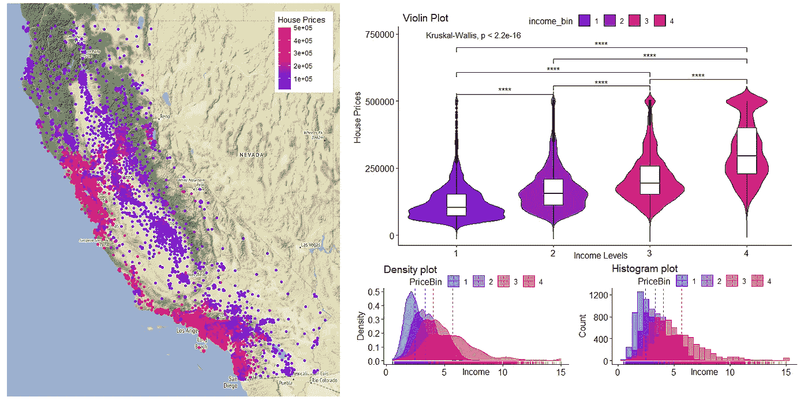

图片作者。

# 目录

1.  [简介](#c68d)
2.  [包](#98e5)
    2.1[gg map](#71d6)
    2.2[gg pubr](#1703)
    2.3[拼凑](#146b)
    2.4 [ggforce](#8e1e)
3.  [结论](#ffe2)
4.  [参考文献](#614b)

# 1.介绍

是一个强大的数据可视化 R 包。

遵循*图形*的语法，它将绘图定义为*数据*和:

*   *审美*:颜色或大小等属性。
*   *几何图形*:线条或条形物体。

该软件包以模块化的方式实现这些独立的组件，允许以优雅和灵活的方式创建几乎任何情节。

在本帖中，我们探索了四个 R 包，它们简化了基于`ggplot2`的高级绘图的生成。特别是:

*   `ggmap`为空间图形添加地理背景。
*   `ggpubr`生成用于发布的图表。
*   `patchwork`将独立的情节组合成相同的图形。
*   `ggforce`提供定制`ggplot2`图表和生成更专业的可视化的方法。

我们使用*加州房价*数据集，可以在 Kaggle 上免费获得(CC0⁴)。它包含了从 1990 年人口普查中得出的加州各区房价中值。

我们从导入所需的包开始:

```
library(tidyverse)
library(ggmap)
library(ggforce)
library(ggpubr)
library(patchwork)library(concaveman) # needed for hull geometry
```

它们可以通过在 R 控制台中键入`install.packages("package_name")`来安装。

`tidyverse`包含不同的包。其中，我们将使用:

*   `dplyr`和`tibble`用于数据操作。
*   `readr`加载 *csv* 文件。
*   `ggplot2`用于可视化。

让我们导入数据集，并对价格和收入变量应用简单的宁滨:

```
df <- 
  read_delim(file      = "C:/data/housing.csv",
    col_types = "dddddddddf",
    delim     = ",")# Create bins for income and house price
df <- df %>% 
  mutate(
    price_bin  = as.factor(ntile(median_house_value, 4)),
    income_bin = ntile(median_income, 4))
```

# 2.包装

## 2.1 ggmap

*作者:* [大卫·卡勒](https://github.com/dkahle)，[哈雷·威克姆](https://github.com/hadley)

当数据集包含空间信息时，观察地理环境中的变量会很有趣。

我们首先用`ggplot2`来表示`latitude`和`longitude`，并一瞥加州的形状:

```
df %>%
  ggplot(aes(x = longitude, y = latitude)) +
  geom_point()
```

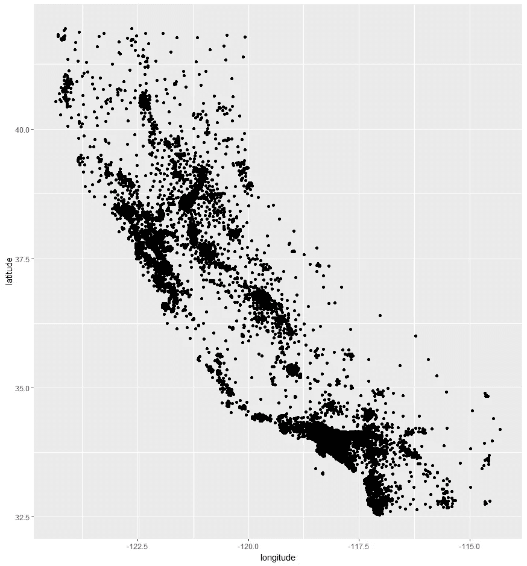

图片作者。

`ggmap` ⁵使用了与`ggplot2`相同的分层语法来给情节添加地理背景。它允许轻松地包含静态地图，例如来自*谷歌地图*、 *OpenStreetMap* 或 *Stamen 地图*的静态地图。

我们只需要将`Latitude`和`Longitude`信息传递给`qmplot` ⁶函数，如下所示

```
df %>%
  qmplot(x    = longitude, 
         y    = latitude, 
         data = .)
```

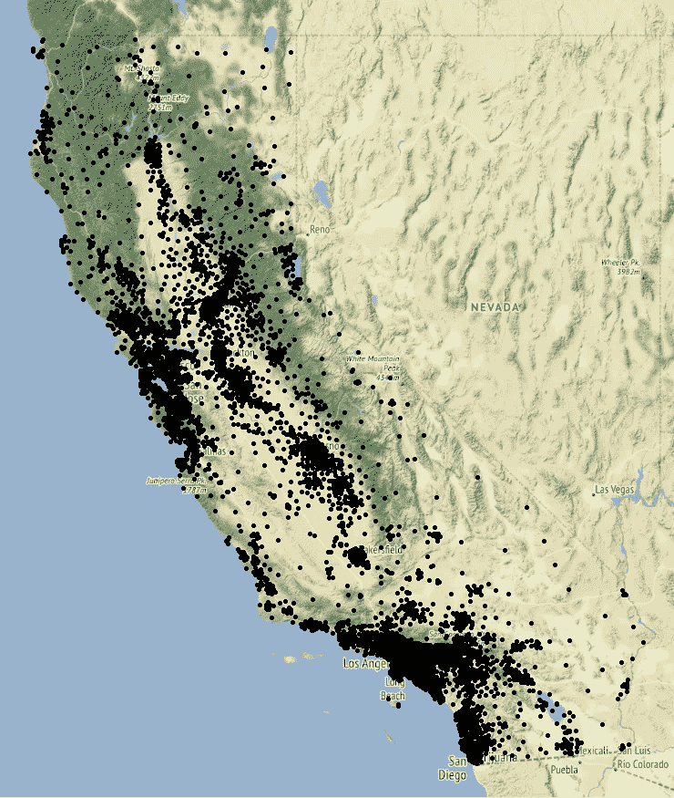

图片作者。

我们可以根据房价应用颜色渐变:

```
df %>% 
  qmplot(x      = longitude, 
         y      = latitude, 
         data   = ., 
         colour = median_house_value, 
         legend = "topright") +
  scale_color_gradient("House Prices", 
                       low  = "blue",
                       high = "red")
```

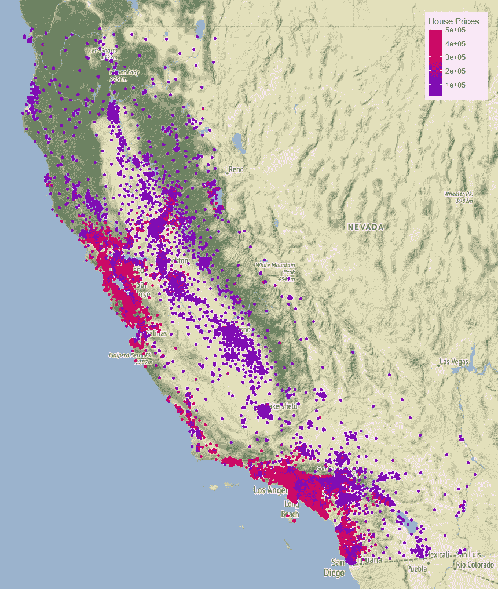

图片作者。

我们可以过滤我们的坐标来探索特定的区域。比如我们可以观察萨克拉门托周边的房价(纬度:38.575764，经度:-121.478851):

```
df %>% 
  filter(between(longitude, -121.6, -121.3), 
         between(latitude, 38.4, 38.7)) %>%
  qmplot(x      = longitude, 
         y      = latitude, 
         data   = ., 
         colour = median_house_value, 
         size   = I(7), 
         alpha  = I(0.8), 
         legend = "topright") +
  scale_color_gradient("House Prices", 
                       low  = "blue", 
                       high = "red")
```

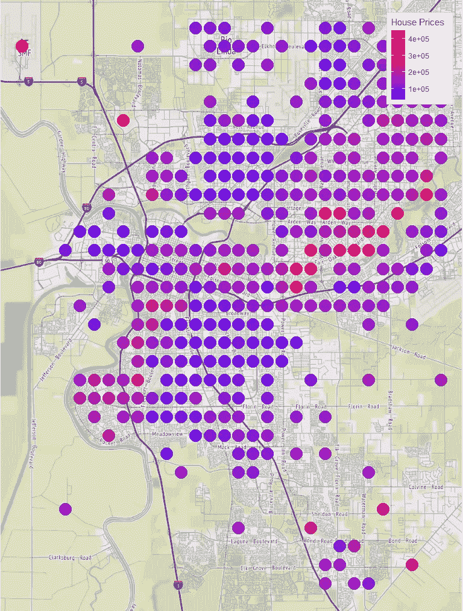

图片作者。

更多信息和例子可以在 here⁷.找到

## 2.2 ggpubr

*作者:* [*阿尔布卡德尔*](https://github.com/kassambara)

基本 ggplots 的定制和格式化需要更深入的语法知识和更高级的 R 技能。

⁸套餐有助于创造美丽的情节。它提供了易于使用的功能，为研究人员和 R 从业人员生成可供发布的图。简而言之，它是一个围绕着`ggplot2`的*包装器*，处理大部分复杂的情节定制。

例如，我们可以用一行代码生成一个格式良好的箱线图:

```
df %>%
 ggboxplot(x       = "income_bin", 
           y       = "median_house_value",
           fill    = "income_bin",
           palette = c("#2e00fa", "#a000bc", "#ca0086", "#e40058"))
```

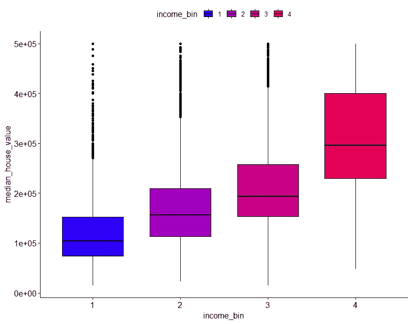

图片作者。

该软件包允许向图表添加 p 值和显著性水平。在这个例子中，我们使用`ggviolin` ⁹创建了一个小提琴图，并添加了与`stat_compare_means` ⁰:的平均值比较

```
# Comparison between the Income groups
bin_comparisons <- list( c("1", "2"), 
                         c("2", "3"), 
                         c("3", "4"),
                         c("1", "3"),
                         c("2", "4"),
                         c("1", "4"))df %>%
 ggviolin(x          = "income_bin", 
          y          = "median_house_value", 
          title      = "Violin Plot",
          xlab       = "Income Levels",
          ylab       = "House Prices",
          fill       = "income_bin",
          alpha      = 0.8,
          palette    = c("#2e00fa","#a000bc","#ca0086","#e40058"),
          add        = "boxplot", 
          add.params = list(fill = "white")) +
  stat_compare_means(comparisons = bin_comparisons, 
                     label       = "p.signif") +
  stat_compare_means(label.y = 9000)
```

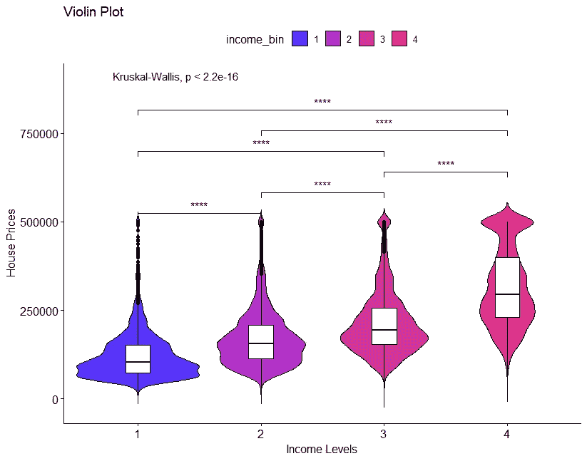

Violin 图类似于 box 图，只是它们也显示数据的核心概率密度。图片作者。

`ggpubr`提供几个函数，可轻松生成格式良好的图。密度图和直方图如下所示:

```
df %>%
  ggdensity(x       = "median_income",
            add     = "mean", 
            rug     = TRUE,
            color   = "price_bin", 
            fill    = "price_bin",
            title   = "Density plot",
            xlab    = "Income",
            ylab    = "Density",
            palette = c("#2e00fa", "#a000bc", "#ca0086", "#e40058")
   )
```

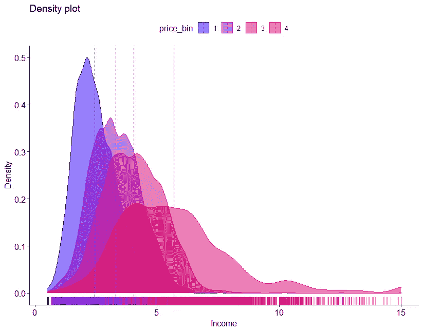

图片作者。

```
df %>%
  gghistogram(x       = "median_income",
              add     = "mean", 
              rug     = TRUE,
              color   = "price_bin", 
              fill    = "price_bin",
              title   = "Histogram plot",
              xlab    = "Income",
              ylab    = "Count",
              palette = c("#2e00fa","#a000bc","#ca0086","#e40058")
   )
```

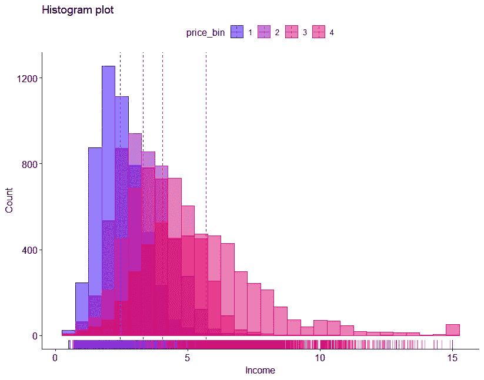

图片作者。

我们甚至可以在一个页面上混合多个图，甚至可以通过`ggarrange`功能创建一个独特的图例:

```
p1 <- df %>%
  ggdensity(x       = "median_income", 
            add     = "mean", 
            rug     = TRUE,
            color   = "price_bin", 
            fill    = "price_bin",
            title   = "Density plot",
            xlab    = "Income",
            ylab    = "Density",
            palette =  c("#2e00fa","#a000bc","#ca0086","#e40058")
   )p2 <- df %>%
  gghistogram(x       = "median_income",
              add     = "mean", 
              rug     = TRUE,
              color   = "price_bin", 
              fill    = "price_bin",
              title   = "Histogram plot",
              xlab    = "Income",
              ylab    = "Count",
              palette = c("#2e00fa","#a000bc","#ca0086","#e40058")
   )ggarrange(p1, 
          p2, 
          labels = c("A", "B"),
          ncol   = 2
   )
```

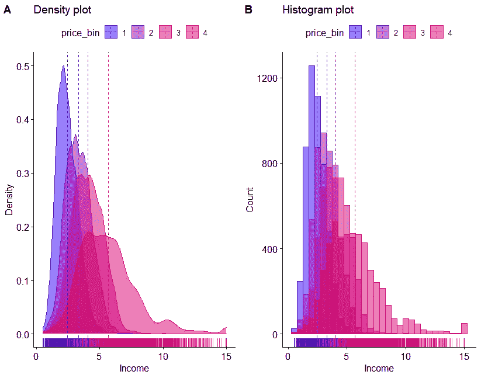

图片作者。

官方文档包含更多信息和示例。

## 2.3 拼接

*作者:* [*托马斯·林*](https://github.com/thomasp85)

`patchwork`允许轻松地将单独的`ggplot2`可视化组合到同一图形中。它还提供了数学运算符，可以更直观地操纵图形。

与前面的`ggarrange`示例类似，我们可以在同一个图形上混合两个图，如下所示:

```
p1 + p2
```

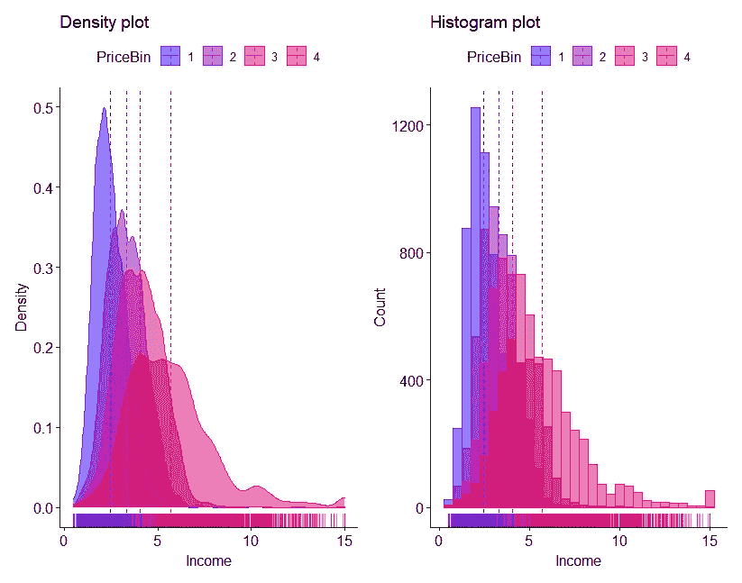

图片作者。

该软件包的最大优势在于直观和简单的 API 的完美结合，以及创建任意复杂的绘图组合的能力。以下是一些例子:

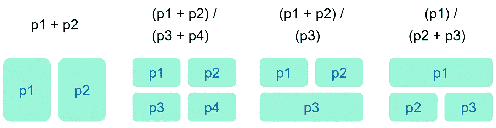

图片作者。

更多信息和例子可以在这里找到。

## 2.4 ggforce

*作者:* [*托马斯·林*](https://github.com/thomasp85)

`ggforce`延伸`ggplot2`为构成专门地块提供设施。

在分享一些示例之前，我们创建了一个新的列，*大约*标识了一些著名的地点及其周边地区:

*   洛杉矶(纬度:34.052235，经度:118.243683)
*   圣何塞(纬度:37.335480，经度:121.893028)
*   旧金山(纬度:37.773972，经度:122.431297)
*   萨克拉门托(纬度:38.575764，经度:121.478851)
*   圣地亚哥(纬度:32.715736，-117.161087)
*   弗雷斯诺(纬度:36.746841，经度:119.772591)
*   斯托克顿(纬度:37.961632，经度:121.275604)

```
df <- df %>% 
  mutate(area = case_when(
    between(longitude, -118.54, -117.94) 
     & between(latitude, 33.75, 34.35) ~ 'Los Angeles',
    between(longitude, -122.19, -121.59) 
     & between(latitude, 37.03, 37.63) ~ 'San Jose',
    between(longitude, -122.73, -122.13) 
     & between(latitude, 37.47, 38.07) ~ 'San Francisco',
    between(longitude, -121.77, -121.17) 
     & between(latitude, 38.27, 38.87) ~ 'Sacramento',
    between(longitude, -117.46, -116.86) 
     & between(latitude, 32.41, 33.01) ~ 'San Diego',
    between(longitude, -120.07, -119.47) 
     & between(latitude, 36.44, 37.04) ~ 'Fresno',
    between(longitude, -121.57, -120.97) 
     & between(latitude, 37.66, 38.26) ~ 'Stockton',
    TRUE ~ 'Other areas'
    )
  ) %>%
  mutate_if(is.character,as.factor)
```

我们观察结果:

```
df %>%
  filter(area != "Other areas") %>%
  ggplot(aes( x = longitude, y = latitude)) +
  geom_point()
```


图片作者。

`ggforce`提供不同的功能来高亮显示数据集。人们可以围绕具有不同形状的数据组画出轮廓:

*   圆圈:`geom_mark_circle()`
*   省略号:`geom_mark_ellipse()`
*   矩形:`geom_mark_rect()`
*   外壳(凸闭包):`geom_mark_hull()`

我们可以试着在地理区域周围画一个矩形:

```
df %>%
  filter(area != "Other areas") %>%
  ggplot(aes(x = longitude, y = latitude, color = area)) +
  geom_mark_rect(aes(fill = area), concavity=10) +
  geom_point()
```

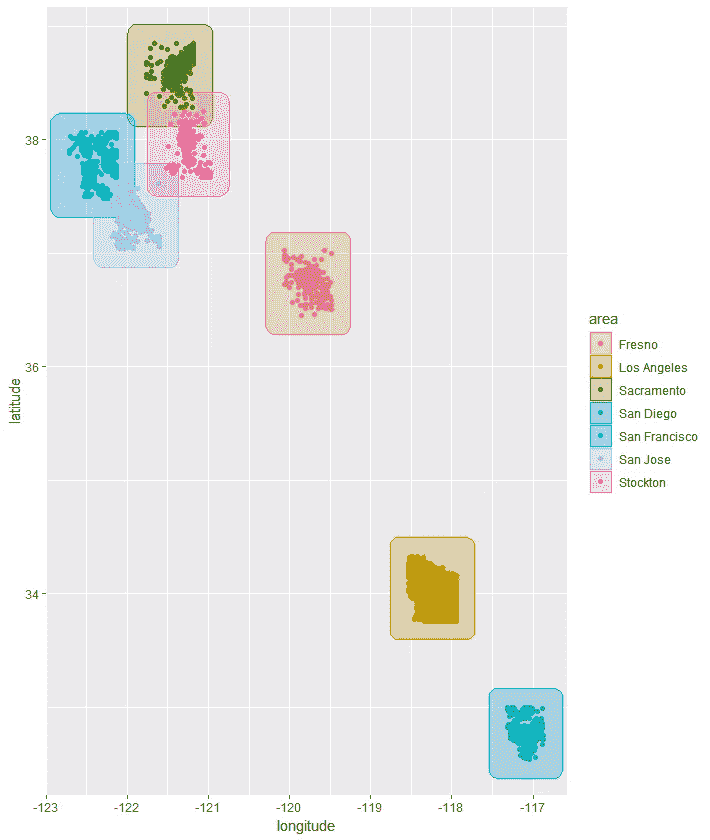

图片作者。

我们可以尝试用`geom_mark_hull()`画更复杂的多边形。可以通过`concavity`参数调整最终船体的凹度:

```
df %>%
  filter(area != "Other areas") %>%
  ggplot(aes(x = longitude, y = latitude, color = area)) +
  geom_mark_hull(aes(fill = area), concavity=10) +
  geom_point()
```

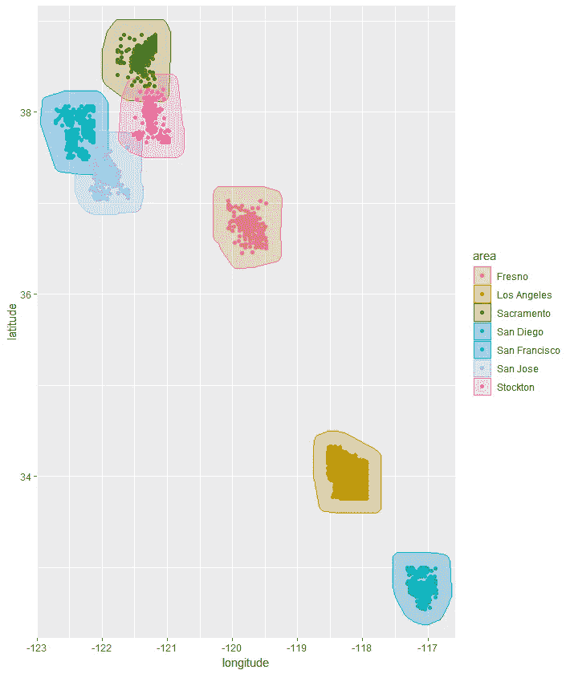

图片作者。

可以向图上的组添加标签:

```
df %>%
  filter(area != "Other areas") %>%
  ggplot(aes(x = longitude, y = latitude, color = area)) +
  geom_mark_hull(aes(fill = area, label = area), concavity = 10) +
  geom_point()
```

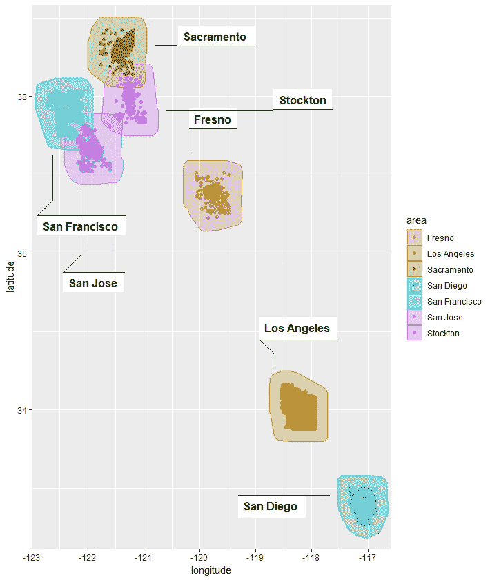

图片作者。

我们也可以将图与来自`ggmap`的地理信息结合起来，如下所示:

```
df %>%
  filter(area != "Other areas") %>%
  qmplot(x = longitude, y = latitude, data = .) +
  geom_mark_hull(aes(fill  = area, label = area), concavity = 10) +
  geom_point()
```

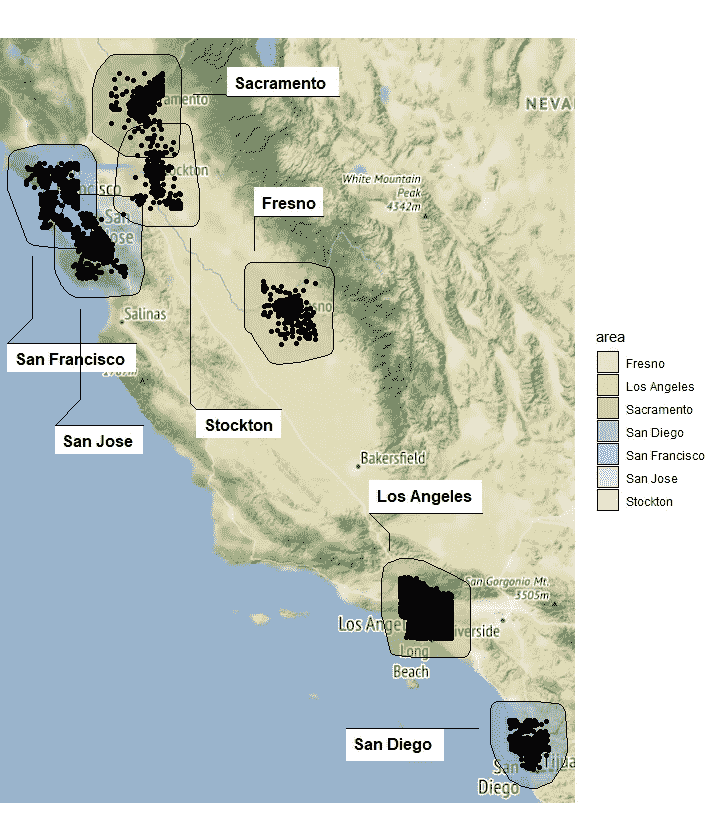

图片作者。

更多信息和进一步的例子可以在这里找到⁵.

# 3.结论

r 是一个强大的数据分析和可视化工具。

在这篇文章中，我们的目标是**而不是**分享完整的数据分析工作或机器学习问题的解决方案。相反，我们想探索一些能够简化创建漂亮可视化的任务的包。

参考文档提供了更多示例和信息。

关于图形的*语法和`ggplot2`背后的概念的更多见解，我们推荐 Hadley Wickham 的“*gg plot 2——数据分析的优雅图形*”。*

# 4.参考

[1] Hadley Wickham，“ *ggplot2 —用于数据分析的优雅图形*”，Springer，2009 年([公共链接](https://ggplot2-book.org/))。

[2]利兰·威尔金森，“*图形的语法*”，斯普林格，2005。

[3][https://www . ka ggle . com/datasets/camnugent/California-housing-prices](https://www.kaggle.com/datasets/camnugent/california-housing-prices)

[https://creativecommons.org/publicdomain/zero/1.0/](https://creativecommons.org/publicdomain/zero/1.0/)

[https://cran.r-project.org/package=ggmap](https://cran.r-project.org/package=ggmap)

[6][https://www . rdocumentation . org/packages/gg map/versions/3 . 0 . 0/topics/QM plot](https://www.rdocumentation.org/packages/ggmap/versions/3.0.0/topics/qmplot)

[7] David Kahle 和 Hadley Wickham， *ggmap:用 ggplot2* 实现空间可视化，《R Journal》第 5/1 卷，2013 年 6 月，[链接](https://journal.r-project.org/archive/2013-1/kahle-wickham.pdf)。

[https://cran.r-project.org/package=ggpubr](https://cran.r-project.org/package=ggpubr)

[9][https://www . rdocumentation . org/packages/gg pubr/versions/0 . 4 . 0/topics/gg violin](https://www.rdocumentation.org/packages/ggpubr/versions/0.4.0/topics/ggviolin)

[10][https://www . rdocumentation . org/packages/gg pubr/versions/0 . 4 . 0/topics/stat _ compare _ means](https://www.rdocumentation.org/packages/ggpubr/versions/0.4.0/topics/stat_compare_means)

[https://rpkgs.datanovia.com/ggpubr/](https://rpkgs.datanovia.com/ggpubr/)

[https://cran.r-project.org/package=patchwork](https://cran.r-project.org/package=patchwork)

[13][https://patchwork . data-imaginist . com/articles/guides/assembly . html](https://patchwork.data-imaginist.com/articles/guides/assembly.html)

[https://cran.r-project.org/package=ggforce](https://cran.r-project.org/package=ggforce)

[15][https://ggforce.data-imaginist.com/](https://ggforce.data-imaginist.com/)