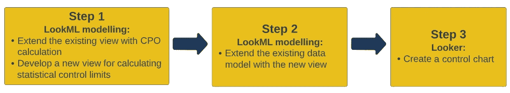
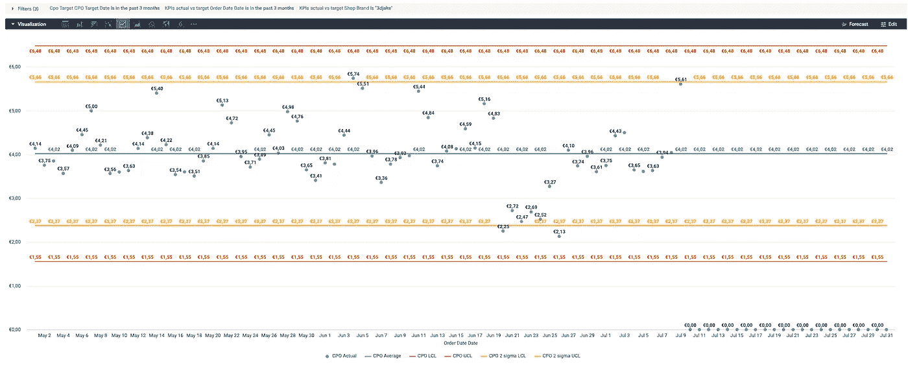

# 使用 BigQuery 统计聚集函数和 Looker 创建控制图

> 原文：<https://towardsdatascience.com/create-control-charts-using-bigquery-statistical-aggregate-functions-and-looker-2808c14fc102>

## 另一种监控 KPI 目标的方法


亨利&公司在 [Unsplash](https://unsplash.com?utm_source=medium&utm_medium=referral) 上拍摄的照片

# 检查图

*统计*

“一种图表，在其上绘制一个变量的**观察值**，通常对照该变量的**预期值**及其**允许偏差**，以便**在质量、数量等方面的过度变化**。变量**的，可以被** **检测到**[1](https://www.collinsdictionary.com/dictionary/english/control-chart)

# 介绍

在我的本科学习期间，一门颇有见地的大学课程是“*质量保证简介*”。从本质上讲，这是另一个以不同名称包装的统计学课程，但旨在传授跟踪生产过程质量的技术和仪器知识。

其中， ***控制图*** 就是这些工具之一，因为它们**显示了以下内容:**

*   **过程度量如何发展，**
*   **如果工艺措施在预期控制范围内，**
*   **应该改进哪些措施来提高生产过程质量。**

换句话说，它们是**过程图片**，通过为观察测量设置以下元素来评估**过程质量:**

*   **中线** —测量的平均历史值，
*   **控制上限(UCL)** —在中心线上方设置三个[标准偏差](https://en.wikipedia.org/wiki/Standard_deviation) (+3σ)，以及
*   **控制下限(LCL)** —在中心线以下设置三个标准偏差(-3σ)。

并且这三个要素易于计算，可用于**跟踪**各业务领域**而不仅仅是生产领域**的持续 KPI 的目标。

也就是说，这篇文章旨在展示控制图的**实现方法，使用 [BigQuery 统计聚合函数](https://cloud.google.com/bigquery/docs/reference/standard-sql/statistical_aggregate_functions#stddev)来计算标准偏差并找到 UCL 和 LCL 值。**

此处介绍的工作是之前使用 [BigQuery ML](https://cloud.google.com/bigquery-ml/docs) 和硬编码 Looker 方法设置 KPI 目标的后续工作:

[](/looker-and-bigquery-ml-create-control-charts-for-your-kpis-3d9ad6ee99f7) [## Looker 和 big query ML:KPI 监控的两种方法

### 如何跟踪和报告多系列数据集中的 KPI 目标

towardsdatascience.com](/looker-and-bigquery-ml-create-control-charts-for-your-kpis-3d9ad6ee99f7) 

与前一篇文章类似，数据将通过 [Looker](https://www.looker.com/) 实例进行建模和可视化。

我们开始吧。:)

# 用例解释

在[过去的工作](/looker-and-bigquery-ml-create-control-charts-for-your-kpis-3d9ad6ee99f7)中，我们重点介绍了跟踪`marketing costs`、`[cost revenue ratio](https://www.indeed.com/career-advice/career-development/cost-revenue-ratio#:~:text=What%20is%20a%20cost%20revenue,including%20marketing%20and%20shipping%20costs.)`和`[return on ad spend](https://www.klipfolio.com/metrics/marketing/return-on-ad-spend-roas)`KPI 的方法。

现在，我们将关注`[Cost per Order (CPO)](https://www.klipfolio.com/resources/kpi-examples/ecommerce/cost-per-order)` KPI，并展示一种创建统计控制图以跟踪`CPO`值的方法。

在我们开始解释新开发之前，应该提到以下实施说明:

*   从业务角度来看，`Cost per order` KPI 的未来值不应该**偏离其历史值太多，**这就是为什么**用统计控制极限**来监控其目标是可行的。
*   **多系列数据集**将再次用于开发。
*   开发**的重点放在方法**而不是数据集上，并且**底层数据源不会被共享**。

# 开发方法学

下图展示了 Looker 中控制图的数据建模和可视化的三步方法。



开发方法的分解[图片由作者提供]

第一步，我们将扩展现有的 [LookML](https://docs.looker.com/data-modeling/learning-lookml/what-is-lookml#:~:text=LookML%20is%20a%20language%20for,queries%20against%20a%20particular%20database.) 视图，对`CPO`度量进行新的计算。在此步骤之后，我们将计算`CPO`控制上限和下限。最后，我们将可视化的见解，并提出了一个在 Looker 创建控制图的教程。

前两个步骤是为 Looker 开发者设计的，而最后一个步骤是为商业用户设计的。

**步骤 1/3: LookML 建模:使用 CPO 计算扩展现有视图，并开发一个用于计算统计控制限值的新视图**

第一步的任务很简单:

*   用`CPO`计算扩展[视图](https://docs.looker.com/reference/view-params/view)T2。
*   创建一个新视图`[cpo_targets](https://gist.github.com/CassandraOfTroy/6d375f59431d0a6bd579e00d33c26266)`，用于计算统计控制上限和下限。

计算`CPO`的公式是实际绩效营销成本与观察时间段内创建的订单总数的比率:

```
measure: cost_per_order { 
  label: “CPO Actual” 
  description: “Cost per Order = PM Costs / Total Order Number”                          
  type: number 
  value_format_name: eur
  sql: ${pm_costs_actual}/NULLIF(${total_number_of_orders},0);; 
}
```

在我们创建了一个新的度量之后，接下来是从现有数据模型`[marketing_control_charts](https://gist.github.com/CassandraOfTroy/494188438a739c098b3f8adefc72a5c6#file-marketing_control_charts-model)`开发一个[派生表](https://docs.looker.com/reference/view-params/derived_table)视图。

我们将从模型中选择所需的[维度](https://docs.looker.com/reference/field-params/dimension)和[度量](https://docs.looker.com/reference/field-params/measure)，并使用 BigQuery 统计函数创建一个派生列来计算`CPO`标准偏差。

新创建的视图的功能可以总结如下:

*   我们使用了 [STDDEV_SAMP](https://cloud.google.com/bigquery/docs/reference/standard-sql/statistical_aggregate_functions#stddev_samp) 统计聚合函数，它返回值的样本(无偏)标准偏差。
*   除了计算标准偏差之外，我们还计算了`CPO`平均值，从这两个测量值中，我们计算了 UCL 和 LCL 值。
*   测量值`cpo_lcl_2sigma`和`cpo_ucl_2sigma`被计算以设置可能的`CPO`异常值的早期警报。

让我们进入下一步，展示如何用新的开发来扩展现有的数据模型。

**步骤 2/3: LookML 建模:用新视图扩展现有的数据模型**

在这一步，我们创建了一个新的数据模型版本，即`[marketing_control_charts_v2](https://gist.github.com/CassandraOfTroy/d52fd4c87b662afe469d3c37cd3bc20b)`，以显示旧模型`[marketing_control_charts](https://gist.github.com/CassandraOfTroy/494188438a739c098b3f8adefc72a5c6#file-marketing_control_charts-model)`之间的代码差异。

在新模型中，我们在两个视图上增加了一个`join`:

*   “旧”视图`kpi_actual_vs_target`——保存`CPO`实际值，以及
*   “新”视图`cpo_target` —包含`CPO’s`统计控制限值。

视图之间的连接是在序列标识符(`shop_brand`和`marketing_shop_types)`上创建的，而不是在`date`标识符上创建的，因为我们希望在**不同的时间范围**中灵活地观察统计控制限值和实际`CPO`值的变化。

有了这个解释，我们可以移动到最后一步。:)

**第 3/3 步:观察者:创建控制图**

见解展示环节终于开始了。利用之前开发的数据模型，业务用户可以[探索](https://docs.looker.com/reference/explore-params/explore) it 并创建控制图。

教程:

*   选择过滤器:`CPO Target Date`、`Order Date Date`、`Shop Brand`。
*   选择维度和度量:`Order Date Date`、`Shop Brand`、`CPO Actual`、`CPO Average`、`CPO LCL`、`CPO UCL`、`CPO 2 sigma LCL`、`CPO 2 sigma UCL`。
*   选择`Table (Report)`可视化类型来呈现结果。



Looker:监控 CPO 值的控制图[图片由作者提供]

功能性:

*   通过上述设置，我们可以在数据集中为**的每个商店(系列)每天跟踪`CPO`，**
*   **过滤器部分的两个日期**，即`CPO Target Date`和`Order Date Date`，使我们能够跟踪`CPO` **目标**日期的**实际** `CPO`值**不可知**(统计控制限)。**例如**，我们可以将当月的实际`CPO`值与上个月或去年同月的目标`CPO`值进行比较。
*   **2 西格玛 UCL 和 LCL** 经过计算，可用于及早提醒业务用户可能的`CPO`异常值。

# 结论

这个职位的目标可以总结如下:

*   开发目标是展示**使用 BigQuery 统计函数和 Looker 实例**创建控制图的方法。
*   业务目标是为跟踪 KPI 记分卡提供一个简单的框架**。**

总的来说,“大”目标是**通过让最终用户尽早识别**KPI 异常值来创造商业价值**。**此外，提议的方法旨在**减少采取行动的反应时间，以将 KPI 保持在控制范围内。**

带着这些笔记，我们结束我们的帖子。一如既往…编码快乐！:)

**参考文献:**

[1]柯林斯字典，访问时间:2022 年 6 月 11 日，[https://www . Collins Dictionary . com/Dictionary/English/control-chart](https://www.collinsdictionary.com/dictionary/english/control-chart)