# 在 R 图中创建自定义布局

> 原文：<https://towardsdatascience.com/create-custom-layouts-in-your-r-plots-eb7488e6f19f>


哈尔·盖特伍德在 [Unsplash](https://unsplash.com/s/photos/layout?utm_source=unsplash&utm_medium=referral&utm_content=creditCopyText) 上拍摄的照片

当绘制数据时，我们通常试图创建一个单独的图。但是，如果您想创建一组相关情节的单一呈现，该怎么做呢？在 r 中有许多方法可以做到这一点。在本文中，我将向您展示其中的三种，使用我在一些#TidyTuesday 提交中创建的示例。完整的代码可以在我的 github 页面上找到。

# 基本多情节

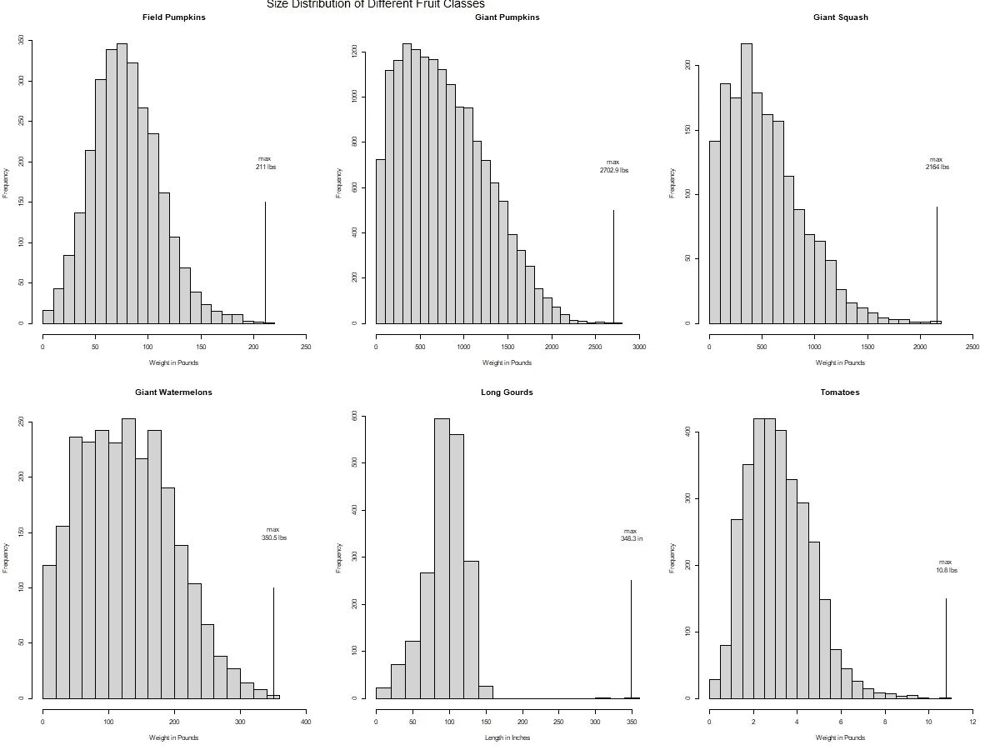

作者图片

创建多图的最基本方法之一是使用 par()函数和" mfrow = "属性。在这个项目中，我们有六种不同类型水果的尺寸数据。我决定为它们分别创建直方图，但是我想把它们都放在一个图表中。

我的第一次尝试如上图。这完全是用 base R 图形做的。这些图是简单的 hist()函数，注释是用 lines()和 text()函数创建的。

制作多图的关键是在创建任何图之前运行以下代码块:

```
par(mfrow = c(2,3))
```

这将屏幕分为两行和三列，每个图将按顺序逐行填充屏幕。如果您想回到单图模式，只需再次运行该功能，在结束时进行重置即可:

```
par(mfrow = c(1,1))
```

这使我们回到一行一列。

这个情节的完整代码在 https://github.com/dikbrown/TTGiantPumpkins/blob/main/EDA.R[的](https://github.com/dikbrown/TTGiantPumpkins/blob/main/EDA.R)

# 网格库

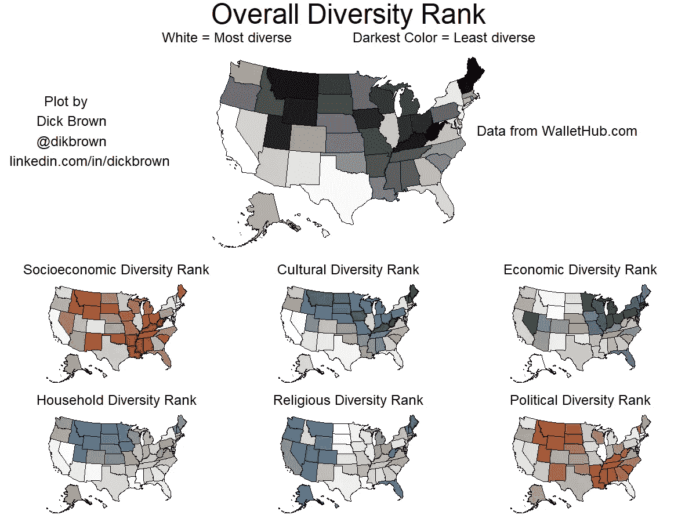

作者图片

对于这个#TidyTuesday 提交，我们只是被要求做一些映射。由于 WalletHub 最近刚刚发表了一篇关于美国多元化的文章，我决定看看我能利用这些数据做些什么。

该数据集包括六个主要类别的多样性排名，以及总体多样性排名。我决定为这些排名创建一个地图，其中“整体”多样性得分在顶部占据优先位置。

除了 ggplot2 和 usmap 库，我发现 grid 和 gridExtra 库在这里也很有帮助。这些库使您能够通过创建矩阵将屏幕分割成单独的窗口。

```
layout <- rbind(c(1, 2, 2, 2, 2, 3),
                c(1, 2, 2, 2, 2, 3),
                c(4, 4, 5, 5, 6, 6),
                c(7, 7, 8, 8, 9, 9)) 
```

由于刚刚创建的矩阵有四行六列，屏幕以同样的方式划分:

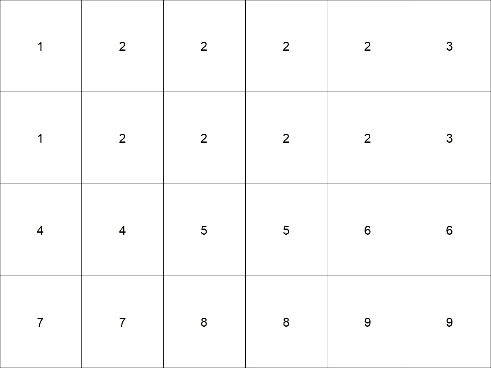

作者图片

但是，我们使用的数字允许我们定义哪些扇区将成为屏幕每个部分的一部分。例如，所有的“1”部分将组合成屏幕的一个部分，我们可以在那里放置一些东西。这将创建以下布局:

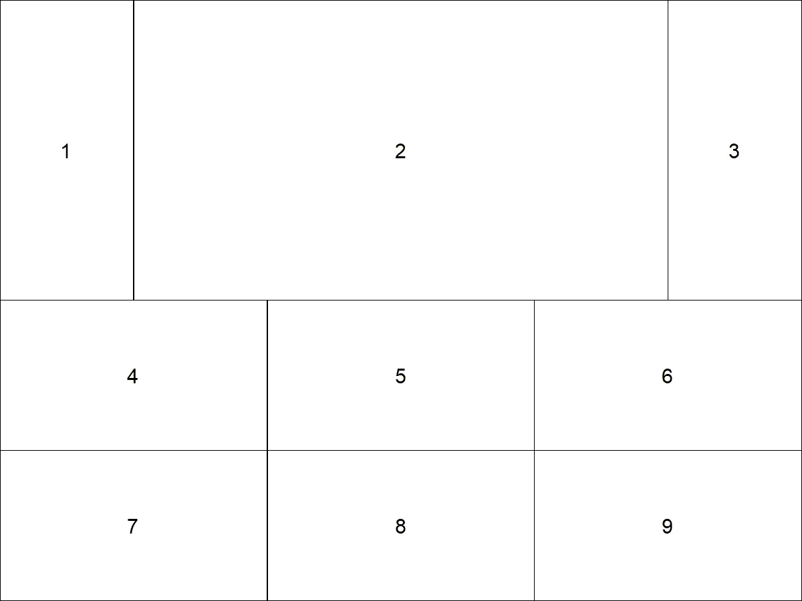

作者图片

现在我们有了布局，我们可以用 grid.arrange()函数把东西放进去。然而，我们只能放入某些类型的对象，例如图形对象(称为 grobs)或 ggplot 对象。如果我们只想在其中一个部分中放入文本，我们可以使用 textGrob()函数。上图中的线条是用 rectGrob()函数创建的。

```
textobj1 <- textGrob("This is some text.", gp = gpar(fontsize = 24), hjust = 1)
...
create some plots
...
grid.arrange(textobj1, plot1, textobj2, 
             plot2, plot3, plot4, plot5, plot6, plot7,
             layout_matrix = layout)
```

我们添加的不同对象将按照 grid.arrange()函数中指示的顺序进入上面的部分。因此，textobj1 进入第 1 部分，plot1 进入第 2 部分，以此类推。

我在本节开始创建地图的所有代码，以及布局图像，都可以在我的 GitHub 页面上找到，地址是[https://github.com/dikbrown/TTMappingDiversity21](https://github.com/dikbrown/TTMappingDiversity21)

您可以在 https://bookdown.org/rdpeng/RProgDA/the-grid-package.html[获得网格包的概述，并在](https://bookdown.org/rdpeng/RProgDA/the-grid-package.html)[https://stat . ethz . ch/R-manual/R-devel/library/grid/html/00 index . html](https://stat.ethz.ch/R-manual/R-devel/library/grid/html/00Index.html)找到文档

# split.screen()

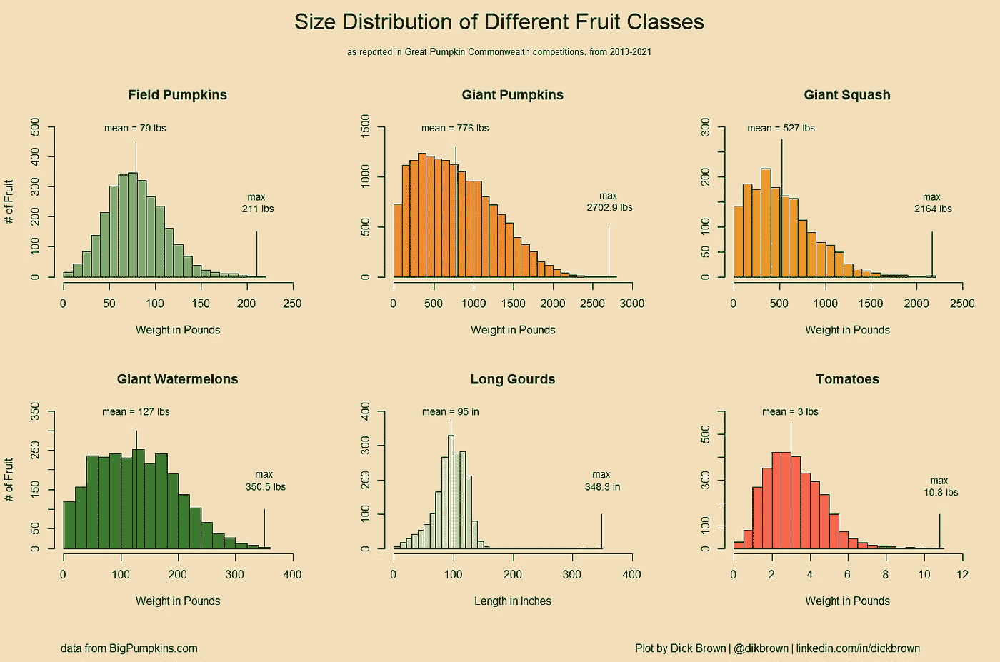

作者图片

split.screen()函数是 r 中基本图形包的一部分，用于将屏幕分割成不同的区域。此外，每个区域可以进一步划分成更小的区域(尽管这超出了本文的范围)。这种能力比前面提到的其他方法更加复杂。它也比其他任何一种方法更容易微调。我用这种方法重做了之前展示的巨型南瓜图片。

首先，我们创建一个布局，其方式类似于网格图形中的布局。然而，我们不是简单地标记不同的区域，而是使用布局矩阵来定义每个区域的边界。该矩阵将由四列组成。这些列表示 x1(左边缘)、x2(右边缘)、y1(下边缘)和 y2(上边缘)。对于要创建的每个区段，基准表中都有一行。以下是一些例子:

最简单的布局，只有一个部分:

```
layout <- matrix(c(0, 1, 0, 1),          # x1=0, x2=1, y1=0, y2=1
                  ncol = 4, byrow = TRUE)
```

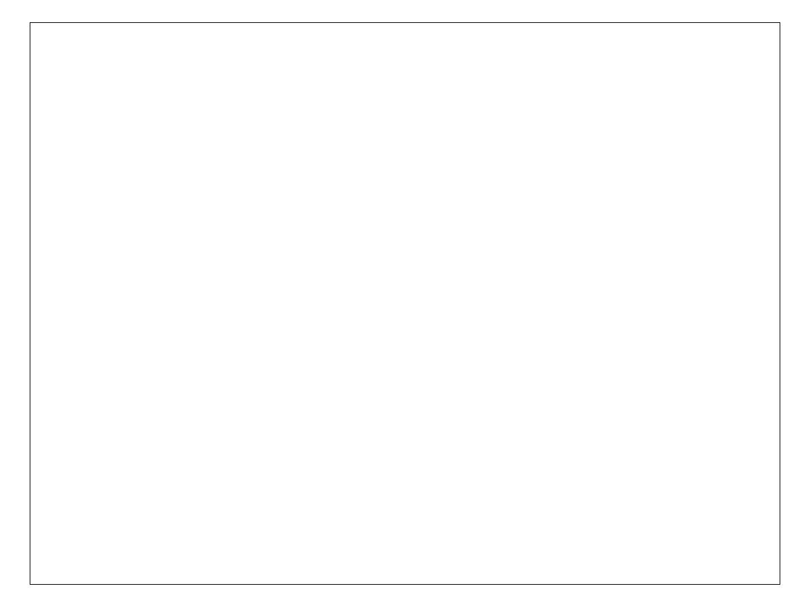

作者图片

请注意，编号从左下方的(0，0)开始，正如您在笛卡尔坐标系中所期望的那样，右上角的坐标为(1，1)。

现在，假设您想将屏幕分成并排的两半。您可以使用:

```
layout <- matrix(c(0, 0.5, 0, 1,          # x1=0, x2=0.5, y1=0, y2=1
                   0.5, 1, 0, 1),         # x1=0.5, x2=1, y1=0, y2=1
                  ncol = 4, byrow = TRUE)
```

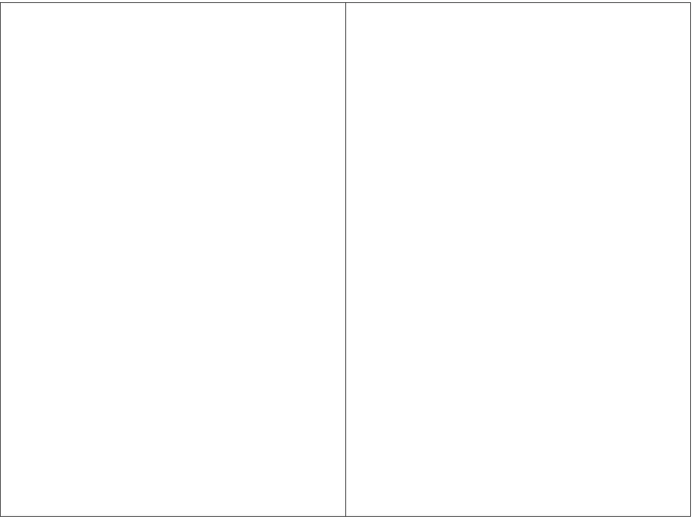

作者图片

相反，如果您想将屏幕分成上下两半，您可以使用以下布局:

```
layout <- matrix(c(0, 1, 0.5, 1,         # x1=0, x2=1, y1=0.5, y2=1
                   0, 1, 0, 0.5),        # x1=0, x2=1, y1=0, y2=0.5 
                  ncol = 4, byrow = TRUE)
```

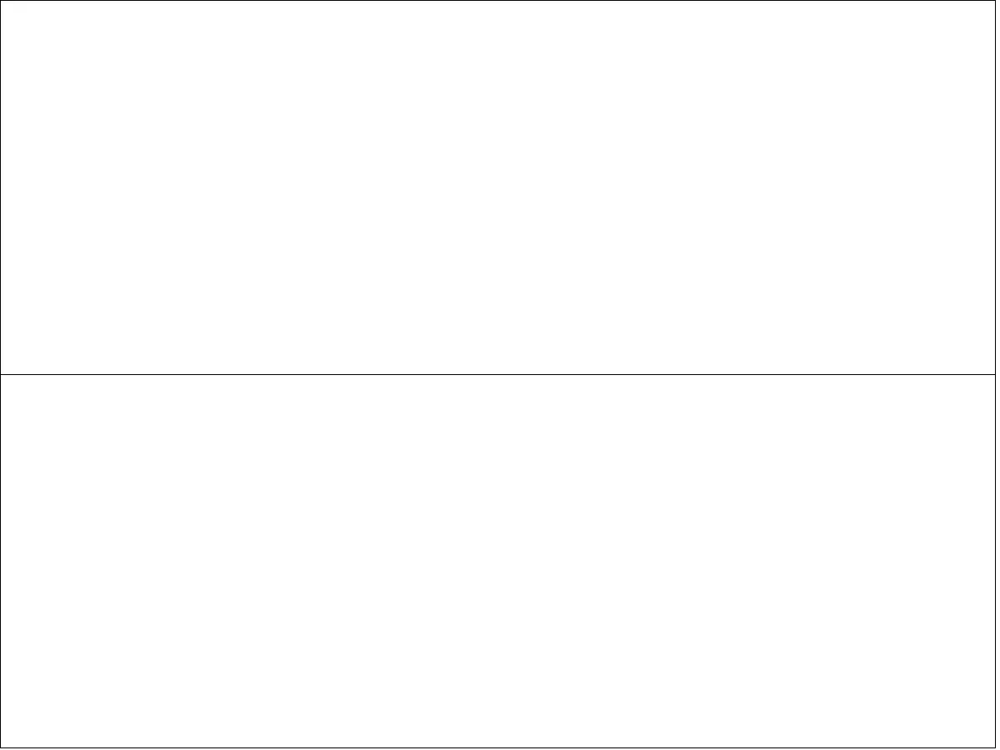

作者图片

您应该意识到行的顺序不是固定的，但是跟踪它们的顺序是很重要的。例如，以下布局在质量上等同于第一个布局(即上半部分和下半部分):

```
layout <- matrix(c(0, 1, 0, 0.5,
                   0, 1, 0.5, 1),
                  ncol = 4, byrow = TRUE)
```

这里唯一的区别是，在第一个版本中，上半部分是第 1 部分，下半部分是第 2 部分，而在第二个版本中，情况正好相反。当你想把一些东西放在一个特定部分时，这就变得很重要了。出于这个原因，我*强烈*建议用注释标记这些行:

```
layout <- matrix(c(0, 1, 0.5, 1,          # top half
                   0, 1, 0, 0.5),         # bottom half
                  ncol = 4, byrow = TRUE)
```

或者

```
layout <- matrix(c(0, 1, 0, 0.5,        # bottom half
                   0, 1, 0.5, 1),       # top half
                  ncol = 4, byrow = TRUE)
```

让我们开始变得更好一点。让我们把顶部(2/3)做得比底部(1/3)大，而不是一模一样的两半

```
layout <- matrix(c(0, 1, 0.33, 1,        # top section
                   0, 1, 0, 0.33),       # bottom section
                  ncol = 4, byrow = TRUE)
```

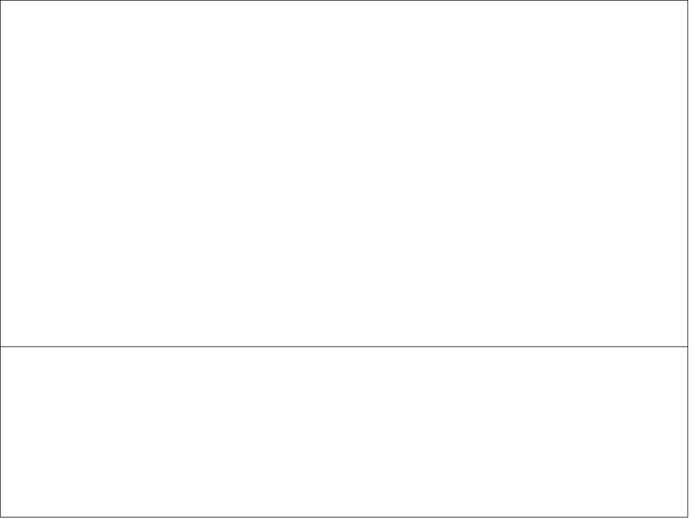

我们还可以将屏幕垂直和水平分成两半:

```
layout <- matrix(c(0,   0.5, 0.5, 1,        # top-left section
                   0.5, 1,   0.5, 1,        # top-right section
                   0,   0.5, 0,   0.5,      # bottom-left section
                   0.5, 1,   0.5, 1),       # bottom-right section
                  ncol = 4, byrow = TRUE)
```

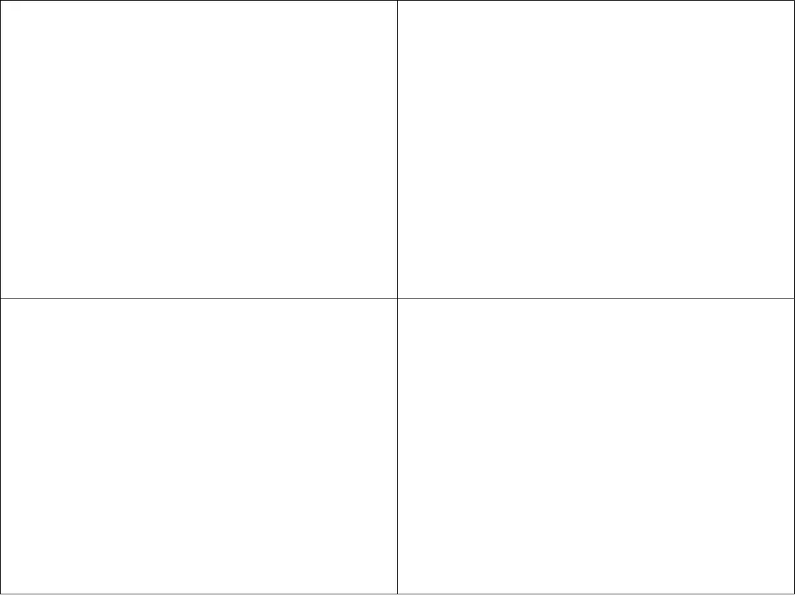

作者图片

为了创建本节开头所示的图，我决定要八个部分:六个部分用于六个图，顶部和底部的条用于额外的文本。标题和副标题在顶部，而引用信息(数据源和作者信息)在底部。通过这种方式，我可以非常简单地完全控制文本部分的格式。以下是我使用的布局:

```
layout <- matrix(c(0,    1,    0.9,  1,      #top strip for title
                   0,    0.33, 0.47, 0.9,    # row 1, plot 1
                   0.33, 0.67, 0.47, 0.9,    # row 1, plot 2
                   0.67, 1,    0.47, 0.9,    # row 1, plot 3
                   0,    0.33, 0.06, 0.47,   # row 2, plot 1
                   0.33, 0.67, 0.06, 0.47,   # row 2, plot 2
                   0.67, 1,    0.06, 0.47,   # row 2, plot 3
                   0,    1,    0,    0.04),  # bottom strip for citation
                 ncol = 4, byrow = TRUE)
```

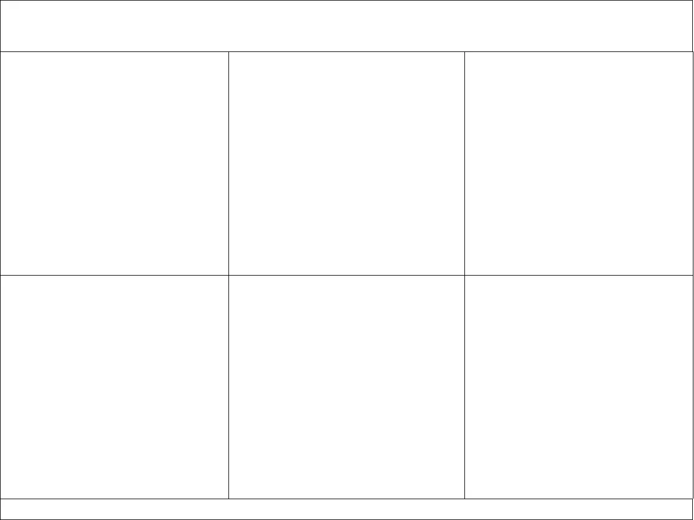

总而言之，顶部的条代表屏幕的顶部 10%,底部的条代表屏幕的底部 4%。剩下的 86%的身高被一分为二(43%)，这就是我得出 0.47 的数值(0.04 + 0.43)的原因。然后我给每个图 1/3 的水平空间(因此 0.33 和 0.67 作为分界点)。

现在，要填充这些部分，您必须添加一些代码来告诉系统如何使用布局矩阵，并指示您的输出(绘图或文本)将去往何处。

```
# tell the system to use the layout matrix to split the screen
split.screen(layout)      

# screen(#) tells the system to put the upcoming output in section #
screen(1)                 
text("Overall title of plot", formatting parameters)

screen(2)  # use section 2: row 1, plot 1 from layout
hist(data, parameters)  # add a histogram to section 2 

...

screen(8)
text("Other text to be added", parameters)

# The next step is very important, or you will have 
# issues trying to re-run the code

close.screen(all = TRUE)
```

创建上述情节的完整代码位于[https://github . com/dik brown/TTGiantPumpkins/blob/main/Distribution。R](https://github.com/dikbrown/TTGiantPumpkins/blob/main/Distribution.R)

值得注意的是，这些不同的技术并不总是相互兼容。你一定要阅读每个包装上的警告。例如，您会发现以下一些问题:

1.  split.screen()与其他排列地块的方法不兼容，如 par(mfrow)和 layout()。
2.  网格图形和常规图形不一定能很好地配合。
3.  par(mfrow)函数根本不适用于 ggplot2 图形。但是，ggplot2 中的 geom_facet()函数会做一些类似的事情。

如果你觉得这篇文章有用，请关注我，看看我的其他文章，包括:

[](/how-do-decision-trees-and-random-forests-work-15cc2a925788) [## 决策树和随机森林是如何工作的？1b

### 回归树

towardsdatascience.com](/how-do-decision-trees-and-random-forests-work-15cc2a925788) [](/use-rattle-to-help-you-learn-r-d495c0cc517f) [## 用拨浪鼓来帮助你学习 R

### 初学者指南

towardsdatascience.com](/use-rattle-to-help-you-learn-r-d495c0cc517f) [](/creating-a-custom-r-package-9a2e303d3332) [## 创建自定义的 R 包

### 为所有用户定义的函数创建一个中心位置。

towardsdatascience.com](/creating-a-custom-r-package-9a2e303d3332)