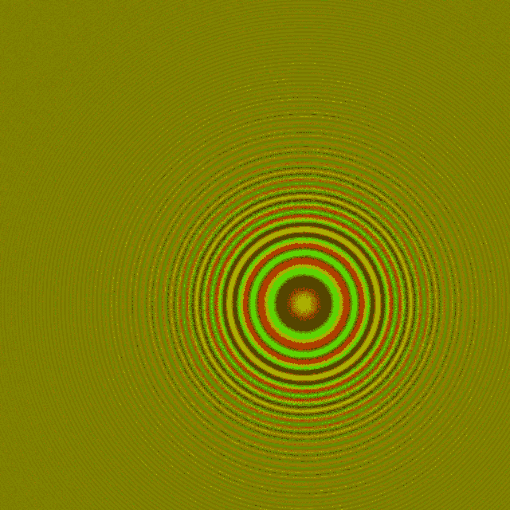
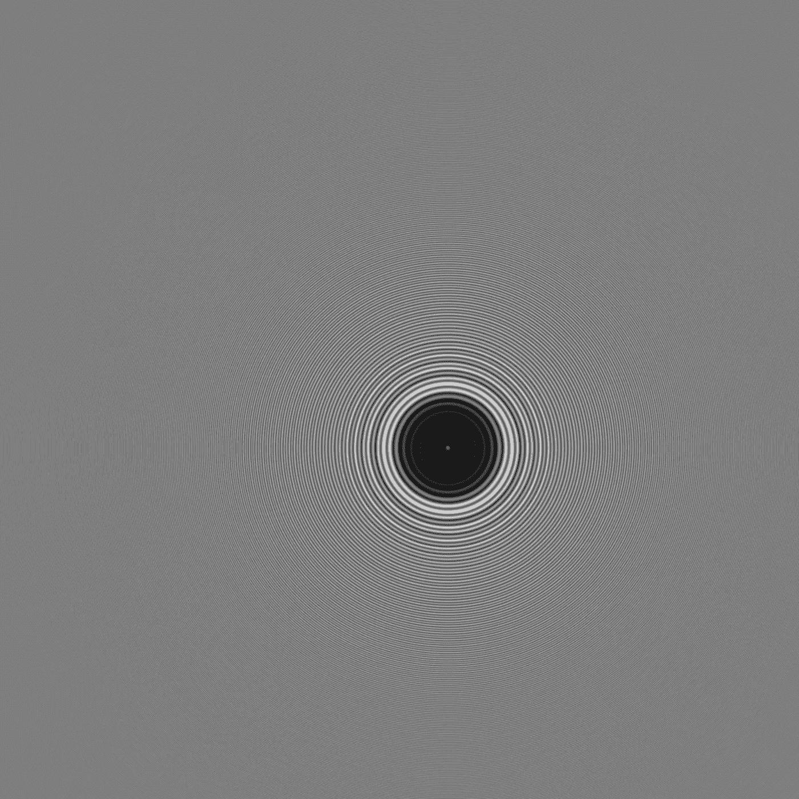
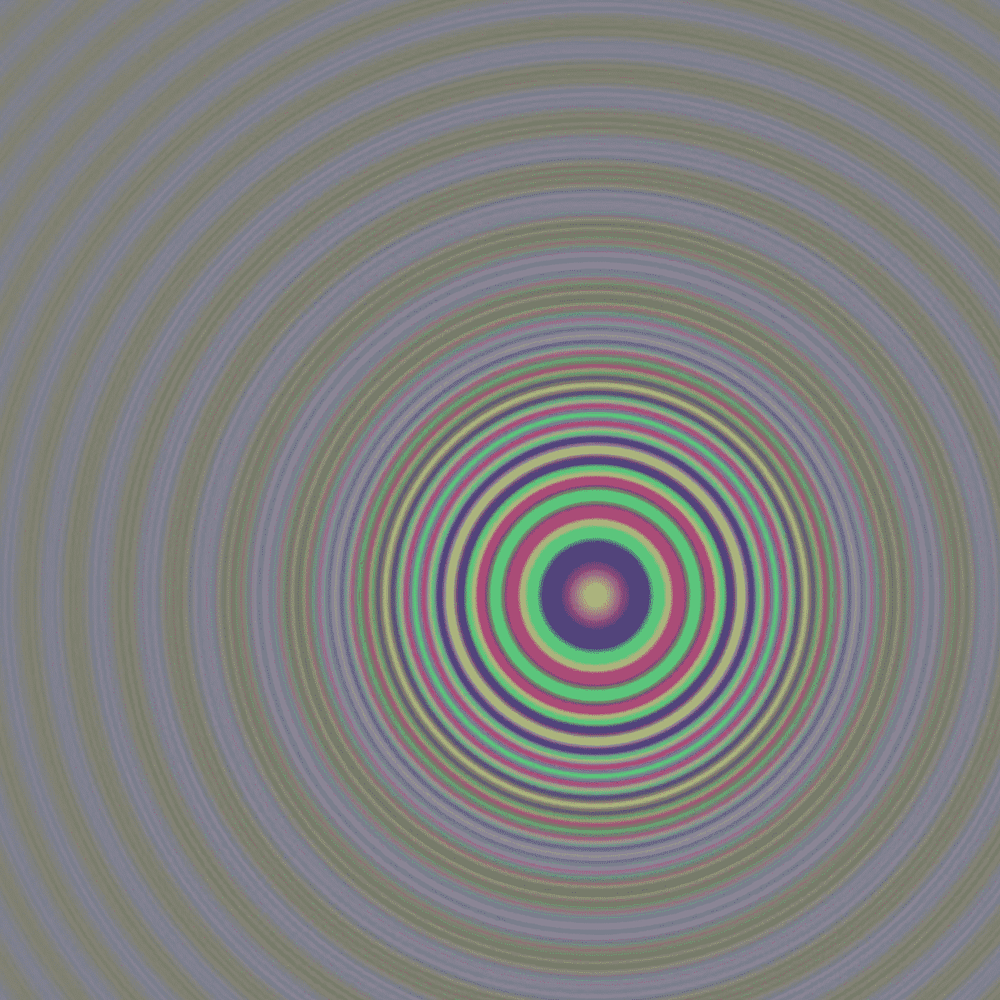

# 用 Python 创建数字全息图

> 原文：<https://towardsdatascience.com/create-digital-holograms-in-python-with-holopy-eacacad989ae>

## 用 HoloPy 探索数字全息图的世界——用于计算光散射和数字全息术的 python 包

为了看到全息图，前后移动你的头，聚焦在中心点上至少五次。它在桌面显示器或笔记本电脑上显示得更好。图片由作者提供，使用 Holopy。

全息图是用激光制作的一种特殊类型的图像，其中平面物体看起来是固体，就好像它们是真实的一样。随着计算机科学的最新进展，我们可以通过编程从一张图片中重建全息图，而无需使用物理技术(数字传感器、照相机、激光等)。)

似乎数字全息术意味着人类通信许多领域的未来。Meta 的首席执行官马克·扎克伯格解释了流入增强现实的巨额资金，并预测了全息图是其不可或缺的一部分的未来:

> “在未来，你将能够坐在我的沙发上，或者我将能够坐在你的沙发上，而不只是通过电话来做这件事，这将实际上感觉我们在同一个地方，即使我们在不同的州或相距数百英里。我认为那真的很强大。”( [BBC 新闻，2021](https://www.bbc.com/news/technology-57942909) )。

此外，谷歌最近推出了[项目 Starline](https://blog.google/technology/research/project-starline/) ，一个类似全息图的视频聊天工具。想象一下，透过一个全息窗口，透过那个窗口，你看到的是另一个三维的人。你可以说话、做手势、眼神交流，就好像那个人就在你面前一样。Starline 项目目前只在谷歌的几个办公室可用，它依赖于定制的硬件，但我们可以预计它很快会扩展到标准的谷歌产品。

这篇文章属于这一类。它将为数字全息术提供非常实用的介绍，并介绍 HoloPy，一种基于 python 的处理数字全息图的工具。我们可以在舒适的办公室里编写全息图，而不是建造复杂的机器。

# 全息照相术:Python 环境中的数字全息术

[*HoloPy*](https://github.com/manoharan-lab/holopy) 是由[哈佛大学马诺哈兰实验室打造的计算光散射和数字全息软件包。它提供了管理元数据、从 2D 图像重建全息图、将散射模型拟合到数字全息图以及许多其他应用的工具。](https://manoharan.seas.harvard.edu/holopy)

Barkley 等人(2020)在[中详细描述了全息照相背后的理论。](https://arxiv.org/abs/1806.00058)

## 全息图示例

我们用 HoloPy 准备一些简单的全息图。经过一些编辑，它们是从 [HoloPy 文档](https://buildmedia.readthedocs.org/media/pdf/holopy/3.1.1/holopy.pdf)中改编而来的。下面这段文字包括(a) python 实现和(b)创建高分辨率全息图。

***你是怎么看到全息图的？***

1.  用鼠标缩小，直到图片变小
2.  慢慢放大，直到隐藏的图案开始出现
3.  当图像有正常尺寸时，来回移动头部几次，以查看更多新的隐藏动机。

全息图至少可以在 14ʺ大小的桌面显示器或笔记本电脑上清晰可见。下面是实现过程:

一个简单的代码产生一个灰度全息图:

全息图在台式显示器或笔记本电脑上显示得更好。图片由作者提供，使用 Holopy。

下一个例子是一个缺乏一些背景动机的单中心彩色全息图。这是 python 代码，后面是全息图像:

图片由作者提供，使用 Holopy。

Holopy 提供了不同的球体、颜色、参数和理论来重建全息图，进行散射计算，并根据数据拟合模型，这确实值得进行实验。

# 结论

这篇文章用 python 提供了一个数字全息术的实用介绍。全息图在其他领域也有许多应用。例如，在市场营销中， [Tohana (2020)](https://futureofmarketinginstitute.com/advantages-of-holograms-and-what-it-means-for-the-future-of-marketing/) 和 [Ardolf (2021)](https://youdontneedwp.com/mathewardolf/hologram-marketing-the-future-of-digital-marketing) 强调了全息营销蓬勃发展的三个原因:

*   **X-Factor**–全息图具有突破噪音的独特方式
*   可展示的体验的——它们提供了真实的生活体验
*   **难忘的**–**难忘的经历可以与朋友和家人分享。**

**数字全息是一门广泛的科学，其概述超出了本文的范围。该领域发展非常迅速，研究和创新在学术界和私营部门受到优先重视。一个激动人心的例子是苏塞克斯大学的科学家 T21 正在开发一种 3D 图像，它可以移动，重现声音，甚至模仿触觉。**

**所有这些进步看起来都很有希望。自然地，任何 3D 图像都会被拿来与星球大战全息图相比较。但是，目前的技术创造的图像仍然很小，远远没有达到照片级的真实感。然而，Gibney (2019)在《自然》杂志的一篇文章中持乐观态度，并引用了北京航空航天大学的琼的话:**

***“以任何方式创造《星球大战》中的那种 3D 效果可能需要十年，甚至更长时间”(* [*吉布尼，2019*](https://www.nature.com/articles/d41586-019-03454-y) *)。***

**这些预测非常激动人心，值得期待。**

***PS:你可以订阅我的* [*邮件列表*](https://medium.com/subscribe/@petrkorab) *在我每次写新文章的时候得到通知。如果你还不是中等会员，你可以在这里加入*<https://medium.com/@petrkorab/membership>**。****

# ***参考资料:***

***[1]阿尔多夫，M. (2021)。全息营销-数字营销的未来。2021 年 8 月 16 日。检索自:[https://youdontneedwp . com/mathewardolf/hologram-marketing-the-future-of-digital-marketing](https://youdontneedwp.com/mathewardolf/hologram-marketing-the-future-of-digital-marketing)。***

***[2] Barkley，s .，Dimiduk，t .，g .，Fung，j .，Kaz，d .，m .，Manoharan，v .，n .，McGorty，r .，Perry，r .，w .，Wang，A. (2020 年)。用 Python 和 HoloPy 实现全息显微术。*科学中的计算&工程*，第 22 卷，第 5 期。***

***[3] BBC 新闻(2021)。扎克伯格希望脸书成为网上的“元宇宙”。2021 年 7 月 23 日，英国广播公司新闻处。从[https://www.bbc.com/news/technology-57942909](https://www.bbc.com/news/technology-57942909)取回。***

***[4]吉布尼，E. (2019)。由一粒泡沫创造的星球大战风格的 3D 图像。*自然，* 575，第 272–273 页。检索自:[https://www.nature.com/articles/d41586-019-03454-y](https://www.nature.com/articles/d41586-019-03454-y)。***

***[5]托哈纳，L. (2020)。全息图的优势及其对未来营销的意义。*营销学院的未来，*2020 年 9 月 23 日。检索自:[https://futureofmarketinginstitute . com/advantages-of-holograms-and-it-means-for-the-future-of-marketing/](https://futureofmarketinginstitute.com/advantages-of-holograms-and-what-it-means-for-the-future-of-marketing/)。***