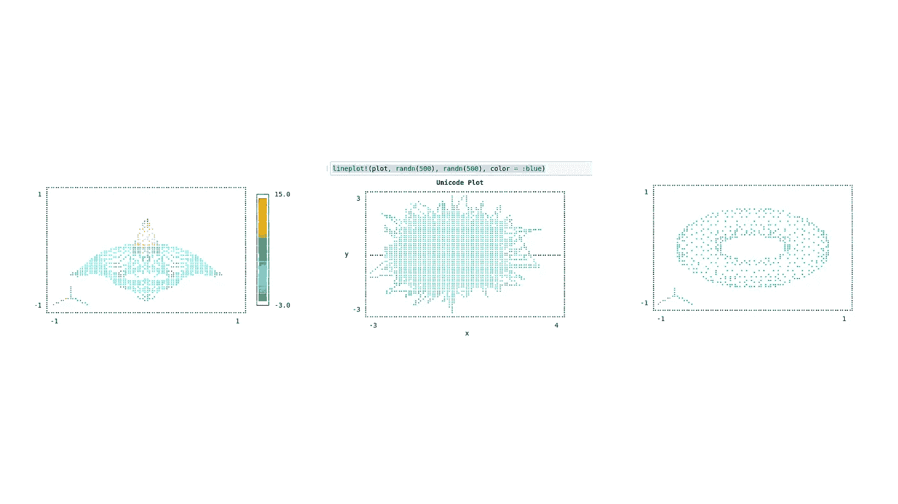
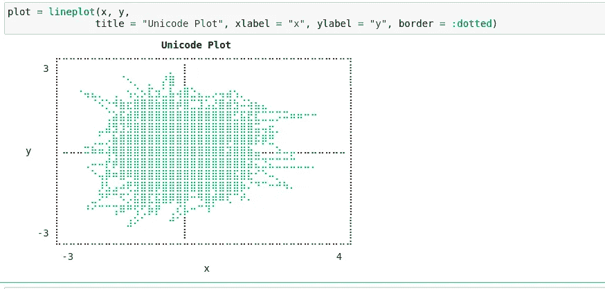
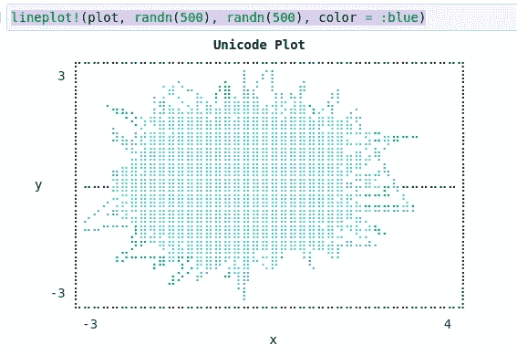
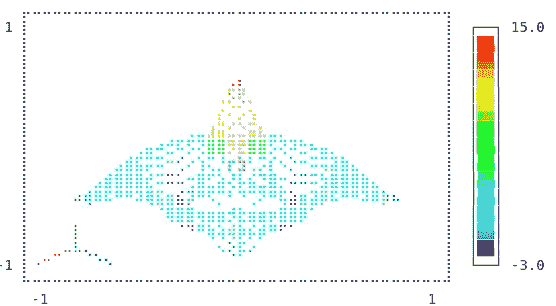
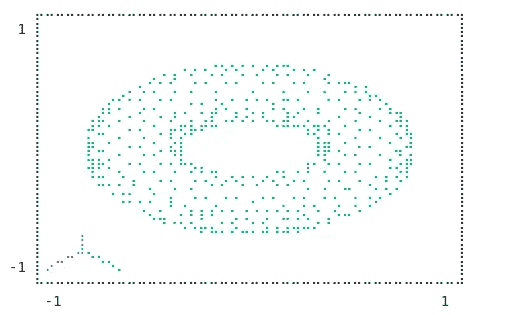

# 使用 Julia 的 Unicode 绘图创建快速、通用的可视化效果

> 原文：<https://towardsdatascience.com/create-fast-versatile-visualizations-with-julias-unicode-plots-8750bb7d7450>

## Julia 的 UnicodePlots.jl 包中令人敬畏的特性概述



(图片由作者提供)

# 介绍

在很多方面，那些从事更多计算领域和数据科学的人将自己与其他程序员区分开来。首先，我们通常不会一次性编译我们的工作。我们更希望有某种程度的互动，因为你需要从你的数据中获得持续的反馈，以便真正理解它。这当然也是笔记本这个创意的来源。然而，虽然这些笔记本电脑从表面上看是一个很好的解决方案，但它们也带来了一些挑战。

Jupyter 笔记本经常提到的一个重要问题是状态。许多人试图解决这一问题，像 Pluto.jl 这样的项目试图通过使环境对实际查看的代码更具反应性来缓解这些问题。另一个重要的问题是，Jupyter 内核的局限性很大，当达到极限时，有时会令人沮丧。一遍又一遍重启死内核很烦。

然而，这些笔记本电脑的一个非常大的好处是，数据科学家经常想要在网络浏览器中查看他们的输出。在某些情况下，这有点像试图在没有浏览器的情况下测试新的 JavaScript 网站，而试图在浏览器之外进行数据科学研究。至少，对于许多分析任务来说是这样的——更具体地说，是可视化。说到数据可视化，Julia 确实有一些相当健壮和有用的图形库，在大多数情况下，我已经在我的博客上查看了几乎所有的图形库。如果你想看看我过去写的故事的模块的比较，这里有一个文章的链接，我在这里做了一个概述，并对 Plots.jl 和 Vegalite.jl 这样的模块做了比较:

[](/julia-visualization-libraries-which-is-best-e4108d3eeaba)  

鉴于笔记本电脑存在的所有问题，大多数数据科学家可能已经考虑彻底抛弃它们。REPLs 虽然不是地球上最具可复制性的东西，但实际上工作得相当好——而且有一些 IDE 提供了数据科学家经常渴望的那种反应式编程，所以为什么不抛弃笔记本，尝试一些新的东西呢？今天，我们将在 Julia 中测试 REPL 的潜力，尝试使用一个名为 UnicodePlots.jl 的强大软件包将我们的数据可视化移回 REPL。除了强大之外，这些可视化对于那些可能会暂时或永久绑定到终端的人来说也非常有用。然而，以我的读者能够非常容易地复制我的代码(并在他们的 web 浏览器中查看输入/输出)的名义，我将在下面的例子中在笔记本中使用这个库。如果您想查看此笔记本，请点击以下链接:

[](https://github.com/emmettgb/Emmetts-DS-NoteBooks/blob/master/Julia/Unicode%20Plotting.ipynb)  

# 基础知识

UnicodePlots 的基础可能是您对大多数不以 Unicode 编码的图形库的期望。这很好，因为它增加了一种熟悉程度。此外，将方法和参数与 Julia 中的许多其他解决方案进行比较，我觉得 UnicodePlots 有许多更容易进行和阅读的调用。当然，这都是主观的——但我的观点是，作为一个有经验的可视化库用户，我非常喜欢 UnicodePlots 的界面设计方式。让我们为我们的绘图示例制作一些快速数组:

```
x = randn(500)
y = randn(500)
```

关于许多其他的 Julia 可视化库，我不喜欢的一点是，它们需要大量的工作来获得第一个图，此外，对于它们中的许多来说，“第一个图的时间”真的很长。当然，由于预编译的原因，这是大部分时间，Julia 通常需要编译几个后端，无论是 SDL、Cairo 还是其他，这肯定会增加为数据绘图所需的时间。然而，这些图是 unicode 的，所以这里唯一的可视化库是显示管理器或内核向我们显示的文本。结果，绘图真的很快。该库还关注简单的位置参数，但功能丰富的关键字参数—这在大多数软件情况下不是您想要的，但在绘图的情况下却是最佳的。

```
plot = lineplot(x, y,
               title = "Unicode Plot", xlabel = "x", ylabel = "y", border = :dotted)
```



作者图片

基本的线条画看起来确实很棒。这些图的可读性真的很好，因为有时你可能不希望它们像这样超级容易评估。更酷的是，如果你在电脑上，我可以把它粘贴到 Medium 上的一个文本框中，看起来太酷了！！！

```
⠀⠀⠀⠀⠀⠀⠀⠀⠀⠀⠀⠀⠀⠀⠀**Unicode Plot**⠀⠀⠀⠀⠀⠀⠀⠀⠀⠀⠀⠀⠀⠀⠀          ⡤⠤⠤⠤⠤⠤⠤⠤⠤⠤⠤⠤⠤⠤⠤⠤⠤⠤⠤⠤⠤⠤⠤⠤⠤⠤⠤⠤⠤⠤⠤⠤⠤⠤⠤⠤⠤⠤⠤⠤⠤⢤        3 ⡇⠀⠀⠀⠀⠀⠀⠀⠀⠀⠀⠀⠀⠀⠀⠀⡀⠀⡇⠀⠀⠀⠀⠀⠀⠀⠀⠀⠀⠀⠀⠀⠀⠀⠀⠀⠀⠀⠀⠀⠀⢸          ⡇⠀⠀⠀⠀⠀⠀⠀⠀⠈⠢⡀⠀⡀⠀⡜⣿⠀⡇⠀⠀⠀⠀⠀⠀⠀⠀⠀⠀⠀⠀⠀⠀⠀⠀⠀⠀⠀⠀⠀⠀⢸          ⡇⠀⠀⠐⢤⣄⡀⠀⢀⠀⢢⢌⡢⣏⣲⣁⣧⢴⣿⣑⣄⣀⡠⢤⣴⢢⡀⠀⠀⠀⠀⠀⠀⠀⠀⠀⠀⠀⠀⠀⠀⢸          ⡇⠀⠀⠀⠀⠈⠪⡑⠺⣷⣖⣿⣿⣿⣷⣿⣿⡾⣿⣉⣹⣡⣜⣿⣾⣳⠬⢵⣦⣄⠀⠀⠀⠀⠀⠀⠀⠀⠀⠀⠀⢸          ⡇⠀⠀⠀⠀⠀⠀⢈⣵⣯⣾⡿⣿⣿⣿⣿⣿⣿⣿⣿⣿⣿⣿⣿⣿⣋⣯⣟⣏⣉⣉⡩⠭⠶⠶⠒⠒⠀⠀⠀⠀⢸          ⡇⠀⠀⠀⠀⠀⣀⣼⣻⣹⣻⣿⣿⣿⣿⣿⣿⣿⣿⣿⣿⣿⣿⣿⣿⣿⣿⣿⣭⢤⣖⡀⠀⠀⠀⠀⠀⠀⠀⠀⠀⢸          ⡇⠀⠀⠀⠀⢀⣁⡠⣷⣿⣿⣿⣿⣿⣿⣿⣿⣿⣿⣿⣿⣿⣿⣿⡿⣿⣿⣿⡯⡿⣛⠀⠀⠀⠀⠀⠀⠀⠀⠀⠀⢸     y    ⡇⠤⠤⠤⠭⠷⠶⢼⢿⣿⣿⣿⣿⣿⣿⣿⣿⣿⣿⣿⣿⣿⣿⣿⣽⣿⣿⣷⣤⠤⠤⠵⠤⡤⠤⠤⠤⠤⠤⠤⠤⢸          ⡇⠀⠀⠀⢀⠤⠤⡞⡾⣿⣿⣿⣿⣿⣿⣿⣿⣿⣿⣿⣿⣿⣿⣿⣿⣿⣿⣽⣍⣙⣍⣉⣉⣉⣀⣀⡀⠀⠀⠀⠀⢸          ⡇⠀⠀⠀⠀⠑⢤⡿⠶⣿⠿⣿⣿⣿⣿⣿⣿⣿⣿⣿⣿⣿⣿⣿⣿⣯⣿⣗⠊⠑⠤⡀⠀⠀⠀⠀⠀⠀⠀⠀⠀⢸          ⡇⠀⠀⠀⠀⠀⡸⣣⣠⠴⢟⣻⣿⣿⡿⣿⣿⣿⣿⣿⣿⣿⢿⣿⣿⣿⡷⠌⠙⠉⠒⠚⠳⠄⠀⠀⠀⠀⠀⠀⠀⢸          ⡇⠀⠀⠀⠀⣀⠝⠋⠉⠫⡡⣯⣿⣏⣯⣿⡿⣿⡿⠒⠻⣿⡾⠿⢏⠉⠞⠄⠀⠀⠀⠀⠀⠀⠀⠀⠀⠀⠀⠀⠀⢸          ⡇⠀⠀⠀⠘⠊⠉⠉⢩⠿⠛⢫⢋⡷⡟⠀⢀⢎⡧⠒⠉⠹⠁⠀⠀⠀⠀⠀⠀⠀⠀⠀⠀⠀⠀⠀⠀⠀⠀⠀⠀⢸          ⡇⠀⠀⠀⠀⠀⠀⠀⠀⠀⣰⠕⠁⠀⠀⠀⠚⠁⡇⠀⠀⠀⠀⠀⠀⠀⠀⠀⠀⠀⠀⠀⠀⠀⠀⠀⠀⠀⠀⠀⠀⢸       -3 ⡇⠀⠀⠀⠀⠀⠀⠀⠀⠀⠀⠀⠀⠀⠀⠀⠀⠀⡇⠀⠀⠀⠀⠀⠀⠀⠀⠀⠀⠀⠀⠀⠀⠀⠀⠀⠀⠀⠀⠀⠀⢸          ⠓⠒⠒⠒⠒⠒⠒⠒⠒⠒⠒⠒⠒⠒⠒⠒⠒⠒⠒⠒⠒⠒⠒⠒⠒⠒⠒⠒⠒⠒⠒⠒⠒⠒⠒⠒⠒⠒⠒⠒⠒⠚          ⠀-3⠀⠀⠀⠀⠀⠀⠀⠀⠀⠀⠀⠀⠀⠀⠀⠀⠀⠀⠀⠀⠀⠀⠀⠀⠀⠀⠀⠀⠀⠀⠀⠀⠀⠀⠀⠀⠀4⠀          ⠀⠀⠀⠀⠀⠀⠀⠀⠀⠀⠀⠀⠀⠀⠀⠀⠀⠀⠀⠀⠀x⠀⠀⠀⠀⠀⠀⠀⠀⠀⠀⠀⠀⠀⠀⠀⠀⠀⠀⠀⠀
```

你可能会想，与 unicode 相比，这样的东西在 ASCII 中是多么的可能。不管怎样，这看起来很棒。然而，正如您所料，这并不是 UnicodePlots 能够产生的唯一东西。

# 可变地块

这就是 Unicode 比许多其他绘图库更聪明的地方。库中的图实际上是可变的，这意味着我们可以在刚刚创建的这个新图中添加或删除元素。比如我们可以用线图！()方法来添加另一行:

```
lineplot!(plot, randn(500), randn(500), color = :blue)
```



作者图片

# 探索更多可视化

这可能令人惊讶，但是这个库实际上能够实现很多非常酷的可视化，例子包括

*   散点图
*   楼梯图
*   条形图
*   柱状图
*   箱线图
*   稀疏模式
*   密度图
*   热图图
*   等值线图表
*   表面图
*   等值面图

没错，甚至还有 3D 图可用。虽然三维图是相当新的，它是相当令人印象深刻的，结果看起来相当可怕。下面是一个使用曲面图制作的示例:

```
sombrero(x, y) = 15sinc(√(x^2 + y^2) / π)
surfaceplot(-8:.5:8, -8:.5:8, sombrero, colormap=:jet, border=:dotted)
```



作者图片

还有非常酷的等值面图:

```
torus(x, y, z, r=0.2, R=0.5) = (√(x^2 + y^2) - R)^2 + z^2 - r^2
isosurface(-1:.1:1, -1:.1:1, -1:.1:1, torus, cull=true, zoom=2, elevation=50, border=:dotted)
```



作者图片

# 结论

jl 是一个非常棒的图形库，我怎么推荐都不为过。对于探索性分析，与调用真正的图形 API 绑定相比，使用类似 unicode 的东西进行绘图具有很多优势。性能和预编译可能是最大的。此外，我真的很喜欢这种方法，这种可变性，以及这个包的总体设计。

与 Julia 中的许多其他选项相比，UnicodePlots.jl 是一个显而易见的选项。我强烈建议把它捡起来，即使只是为了新奇。该库能够产生一些非常激进的可视化效果，在大多数情况下，我认为这些可视化效果会覆盖你！非常感谢您的阅读，我希望您考虑将此模块添加到您的朱利安科学计算团队中！