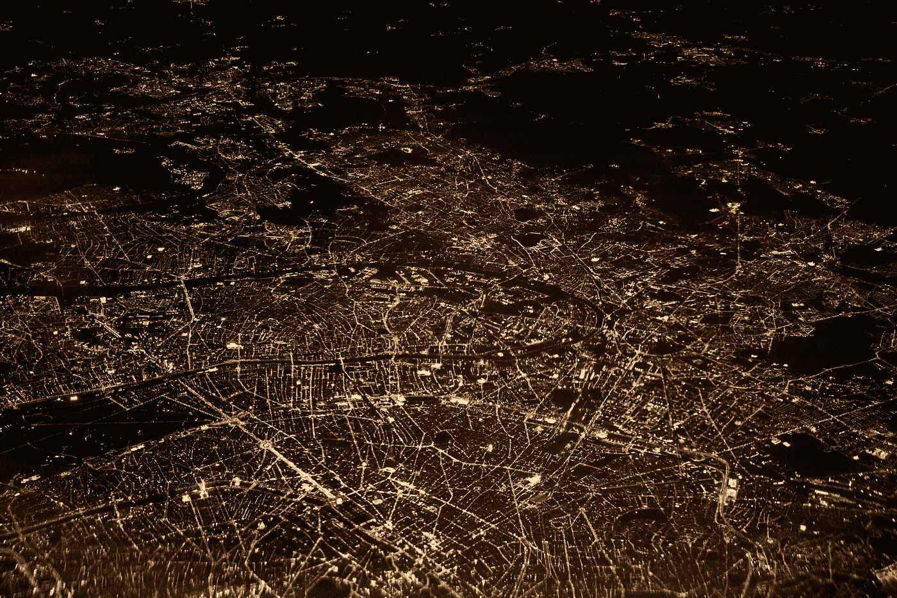
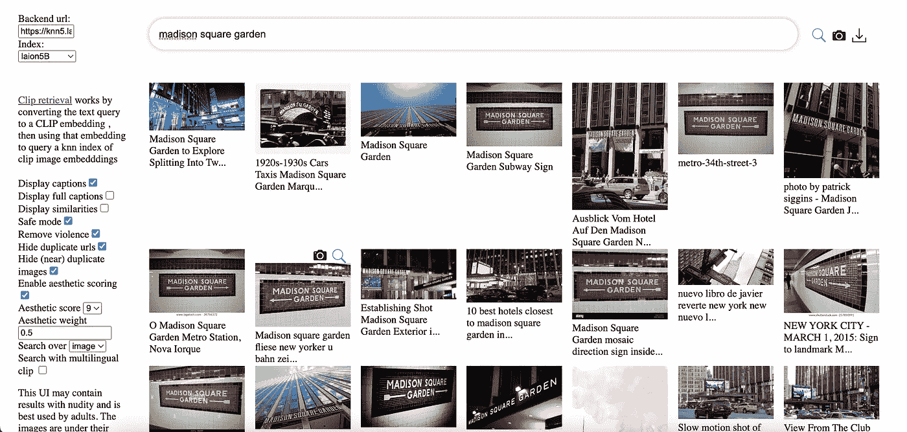
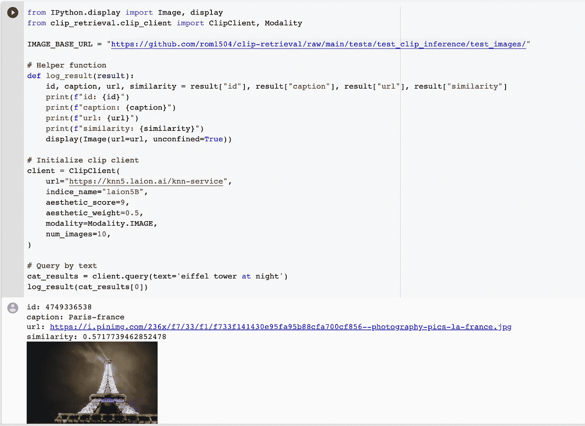
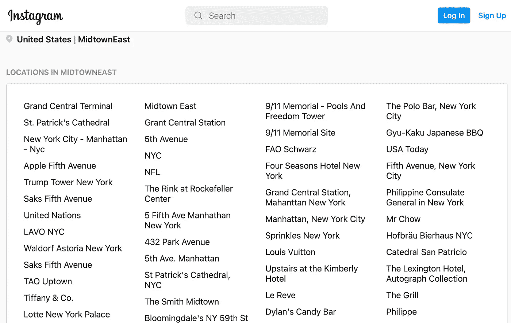
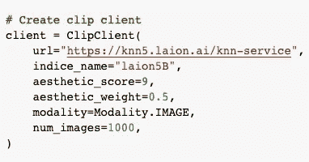
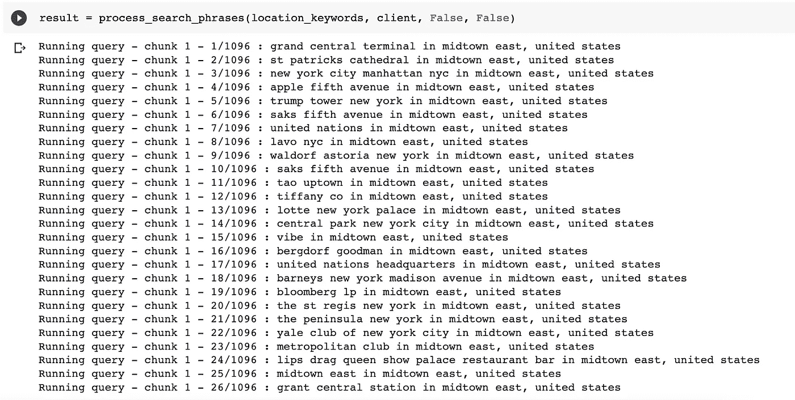
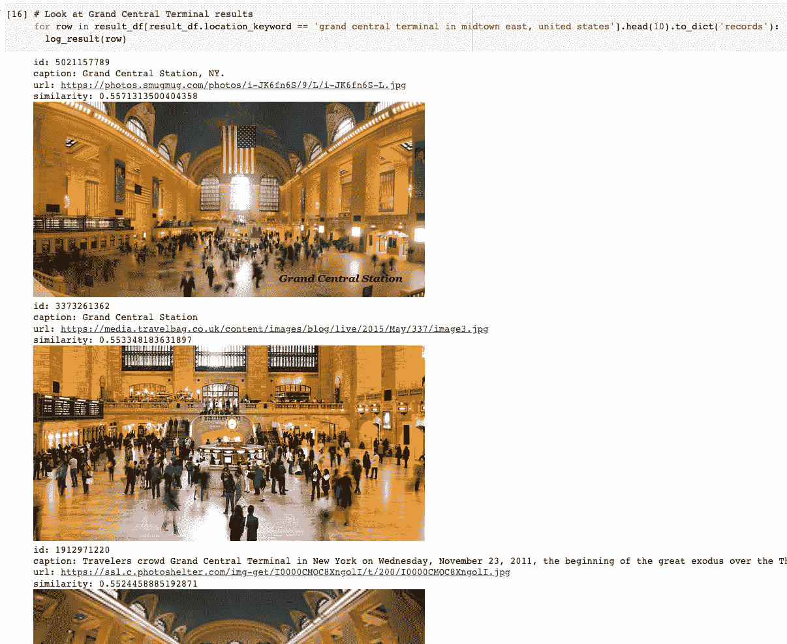
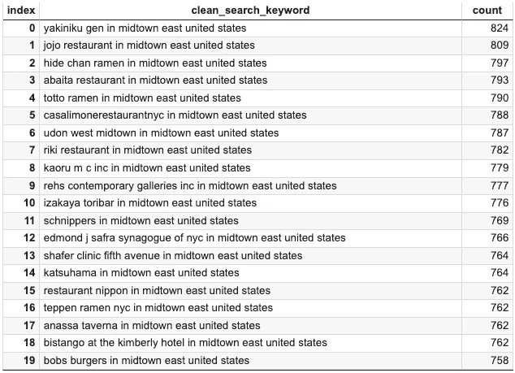
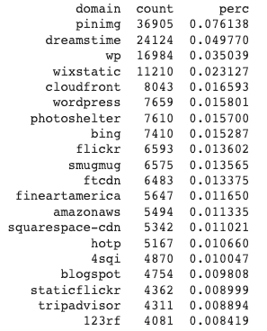

# 在 20 分钟内创建地理图像数据集

> 原文：<https://towardsdatascience.com/create-geo-image-dataset-in-20-minutes-4c893c60b9e6>

## 构建 LAION-5B 的地理特定子集



由[丹尼斯·库默](https://unsplash.com/@dekubaum?utm_source=unsplash&utm_medium=referral&utm_content=creditCopyText)在 [Unsplash](https://unsplash.com/s/photos/location-data?utm_source=unsplash&utm_medium=referral&utm_content=creditCopyText) 拍摄的照片

## LAION-5B 简介

大规模人工智能开放网络(LAION)是一个非营利性组织，旨在向公众提供机器学习资源。最近，LAION 发布了一个从互联网收集的 58.5 亿个图文对的数据集。LAION-5B 数据集包含 URL、文本以及 KNN 索引。

KNN 索引为一个名为[剪辑检索](https://github.com/rom1504/clip-retrieval)的搜索引擎提供动力，使用户能够交互式地探索 LAION-5B 数据集。剪辑检索提供了一个 anUI 和一个 API 来查询带有文本、图像或嵌入向量的 LAION。剪辑检索使得创建原始 LAION-5B 图像数据集的特定任务子集变得容易。



[使用剪辑检索 UI 构建的 LAION 搜索网络界面](https://rom1504.github.io/clip-retrieval/?back=https%3A%2F%2Fknn5.laion.ai&index=laion5B&useMclip=false)



`[ClipClient](https://github.com/rom1504/clip-retrieval/blob/main/notebook/clip-client-query-api.ipynb) API Example`

## 先前关于介子子集的工作

LAION 数据集以及剪辑检索为生成特定领域的 LAION 子集提供了巨大的机会。这些领域特定的子集然后可以用于训练任务特定的模型。其他人已经探索了这种方法来创建以下子集-

[LAION-Face](https://github.com/FacePerceiver/LAION-Face) 是 [LAION-400M](https://laion.ai/laion-400-open-dataset/) 的人脸子集，它由 5000 万个图文对组成。进行人脸检测是为了找到带有人脸的图像。LAION-Face 随后被用作 [FaRL](https://github.com/FacePerceiver/FaRL) 的训练集，为人脸分析任务提供强大的预训练变压器骨干。

[LAION Aesthetic](https://github.com/LAION-AI/laion-datasets/blob/main/laion-aesthetic.md) 是 LAION-5B 的一个子集，已经通过在被判断为美学的图像的剪辑嵌入顶部训练的模型进行了估计。其预期目标是能够创建图像生成模型。

[LAION 高分辨率](https://github.com/rom1504/img2dataset/blob/main/dataset_examples/laion-high-resolution.md)是 LAION-5B 的一个> = 1024x1024 的子集，它有 170M 个样本。该数据集的预期用途是训练超分辨率模型。

## 里昂地理子集

鉴于 LAION 5B 中存在的规模和多样性，我们希望了解创建 geo 子集的可行性。地理子集可用于训练地理标记、地标检测等的模型。创建子集的流水线大致包括三个阶段，

*   生成一组位置关键词
*   使用剪辑检索 API 检索图像
*   执行探索性分析

**位置关键词数据集:**为了获得高质量的位置关键词，我们利用 [Instagram 的探索位置页面](https://www.instagram.com/explore/locations)。为了构建概念验证，我们将位置关键字限制在美国>(纽约市)中城东部。然后使用 [JavaScript 代码片段](https://gist.github.com/aadityaubhat/1b6dba5d8519724a8b3a5307547e9573)下载位置关键字。这给了我们 1096 个位置关键字的列表。



Instagram 位置探索页面

**使用 ClipClient 检索图像:**使用 clip-retrieval，我们可以为每个关键字检索图像。剪辑客户端有以下参数:

*   `backend_url`:后台的 url
*   `indice_name`:指定要使用的索引的名称
*   `aesthetic_score`:由[审美检测器](https://github.com/rom1504/aesthetic_detector)评定的审美分数
*   `use_mclip`:是否使用多语言版本的剪辑，默认为 False
*   `aesthetic_weight`:审美得分的权重
*   `modality`:在索引中搜索图像或文本
*   `num_images`:从 API 返回的图像数量
*   `deduplicate`:是否通过图像嵌入对结果进行去重，默认为真
*   `use_safety_model`:是否删除不安全图像，默认为真
*   `use_violence_detector`:是否删除暴力图片，默认为真

为了获得最相关的结果，我们对 clip 客户端使用以下配置:



剪辑客户端配置

例如，我们通过向关键字添加上下文来创建搜索字符串。从关键字' **grand central terminal** '中，我们创建搜索字符串'**grand central terminal in midtown east，united states** '。我们遍历搜索字符串列表，为每个关键字检索多达 1000 张图片。



检索关键字的图像

**执行探索性分析:**从 clip 客户端检索所有位置关键字的图像后，我们目测检查一些结果，以执行基本的健全性检查。



中央车站的结果

我们在目视检查一些结果后进行探索性分析。对于 **1096 个**位置关键字，我们总共有 **484，714 个**图像，平均每个位置关键字有 **513.47 个**图像和 **540.5 个**图像的&中值。图片数量最多的前 20 个地点大多是餐馆。



数据集中的属性域分布高度倾斜。总共有**44992 个域**，但是数据集中所有图像的 **37.88%** 仅来自前 20 个域。



前 20 个域

## 结论和未来工作

我们构建了 LAION-5B 的美国中城东(纽约市)子集，并对数据集进行了探索性分析。该数据集可用于训练地理标记、地标检测模型。您可以通过运行 [colab 笔记本](https://colab.research.google.com/drive/1LIwvoXgTBrAA38FcW9ZAh3DOAf4dl0nu?usp=sharing)中的代码来重现结果。

未来，我们计划扩展到美国的所有地理位置，通过比较现有地理模型的性能来验证结果，并发布带有验证分数的数据集。

如果你觉得我们的工作有帮助，请考虑引用

```
@article{LAION-geo,
  title={Create geo image dataset in 20 minutes},
  author={Bhat, Aaditya and Jain, Shrey},
  journal={Towards Data Science},
  year={2022},
  url={[https://towardsdatascience.com/create-geo-image-dataset-in-20-minutes-4c893c60b9e6](/create-geo-image-dataset-in-20-minutes-4c893c60b9e6)}
}
```