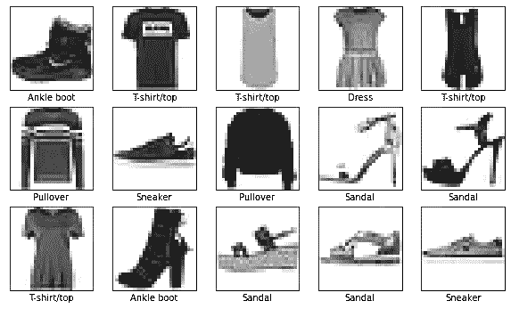
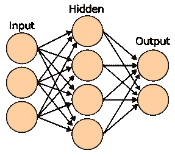
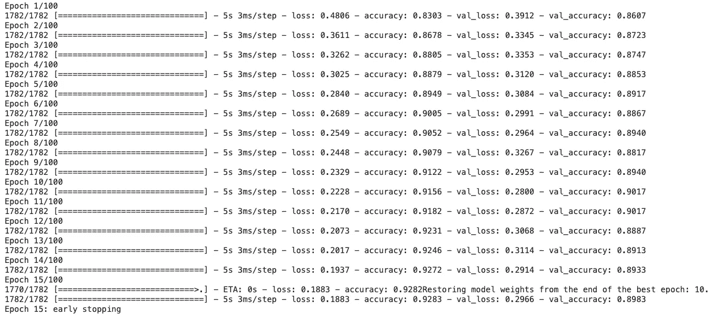
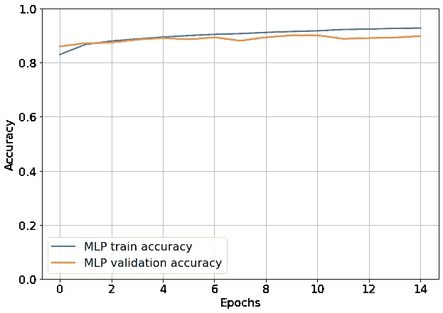
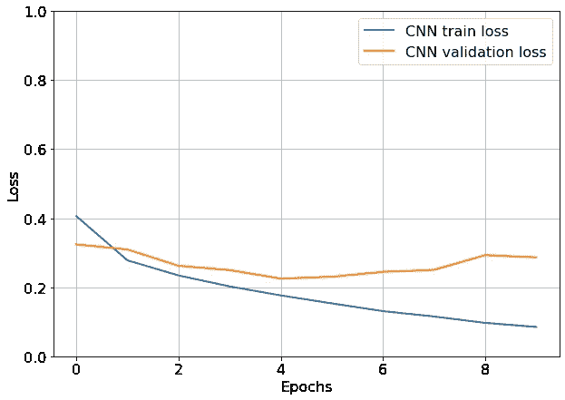
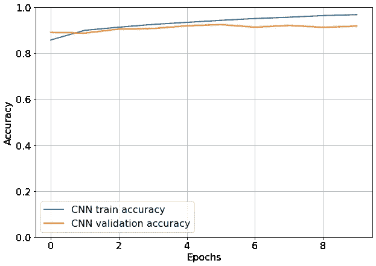

# 使用 TensorFlow 在 10 分钟内创建图像分类模型

> 原文：<https://towardsdatascience.com/create-image-classification-models-with-tensorflow-in-10-minutes-d0caef7ca011>

## 端到端教程—从数据准备到模型训练和评估


Anton Maksimov 5642.su 在 [Unsplash](https://unsplash.com?utm_source=medium&utm_medium=referral) 上的照片

机器学习生命周期是一个复杂的过程，涉及许多不同的部分，包括:

*   预处理和数据清洗。
*   寻找和建立正确的模型。
*   测试和适当的评估。

本文将上述所有技术打包成一个简单的教程:

> 如果我对**深度学习**或 **Tensorflow** 一无所知，这就是我希望有人给我看的！

**先决条件:**你需要 Tensorflow 2.0+和几个库——*Numpy*、*熊猫*、 *Sklearn、*和 *Matplotlib* 。我们将使用 Tensorflow 中包含的[时尚 MNIST[1]](https://www.kaggle.com/datasets/zalando-research/fashionmnist) 数据集。

# **加载数据**

数据集包含训练集中的 60，000 幅灰度图像和测试集中的 10，000 幅图像。每张图片代表属于 10 个类别之一的时尚单品。图 1 中给出了一个例子:

```
fashion_mnist = tf.keras.datasets.fashion_mnist(train_images, train_labels), (test_images, test_labels) = fashion_mnist.load_data()class_names={ 0: 'T-shirt/top',
              1: 'Trouser',
              2: 'Pullover',
              3: 'Dress',
              4: 'Coat',
              5: 'Sandal',
              6: 'Shirt',
              7: 'Sneaker',
              8: 'Bag',
              9: 'Ankle boot' }plt.figure(figsize=(10,10))
for i in range(25):
   plt.subplot(5,5,i+1)
   plt.xticks([])
   plt.yticks([])
   plt.imshow(train_images[i], cmap=plt.cm.binary)
   plt.xlabel(class_names[train_labels[i]])
plt.show()
```



**图 1:** 来自数据集的图像样本

我们的目标是建立一个模型，正确预测每个图像的标签/类别。于是，我们有了一个**多类**，分类问题。

# 培训/验证/测试分割

我们已经有了*训练*和*测试*数据集。我们保留 5%的训练数据集，我们称之为**验证**数据集。这用于超参数优化。

```
train_x, val_x, train_y, val_y = train_test_split(train_images, train_labels, stratify=train_labels, random_state=48, test_size=0.05)(test_x, test_y)=(test_images, test_labels)
```

# 像素重新缩放

由于图像是**灰度**，所有值都在*0–255*的范围内。我们除以 *255* ，使像素值位于 *0* 和 *1* 之间。这是**常态化**的一种形式，以后会加快我们的训练进程。

```
# normalize to range 0-1
train_x = train_x / 255.0
val_x = val_x / 255.0
test_x = test_x / 255.0
```

# 目标值的一键编码

每个标签属于我们上面看到的 10 个类别中的一个。因此，目标值(y)取 0 到 9 之间的值。比如根据字典`class_names` *，*，**，【0】，**就是**，【t 恤/上衣】，**的类。

让我们看看训练集中前 5 件衣服的目标值:

```
train_y[:5]
-> array([[2],                  (Pullover)
          [8],                  (Bag)
          [6],                  (Shirt)
          [1],                  (Trouser)
          [.3]], dtype=uint8).  (Dress)
```

然后，我们对它们进行一次性编码——将每个目标值分配给一个向量。对所有 y 数据集(训练、验证、测试)进行该过程。我们使用**to _ categorial()**函数:

```
train_y = to_categorical(train_y)
val_y = to_categorical(val_y)
test_y = to_categorical(test_y)
```

因此，前 5 件衣服的目标值变为:

```
array([[0., 0., 1., 0., 0., 0., 0., 0., 0., 0.],        
       [0., 0., 0., 0., 0., 0., 0., 0., 1., 0.],        
       [0., 0., 0., 0., 0., 0., 1., 0., 0., 0.],        
       [0., 1., 0., 0., 0., 0., 0., 0., 0., 0.],        
       [0., 0., 0., 1., 0., 0., 0., 0., 0., 0.]], dtype=float32)
```

# 概述

每个数据集存储为一个 *Numpy* 数组。让我们检查一下它们的尺寸:

```
print(train_x.shape)  #(57000, 28, 28)
print(train_y.shape)  #(57000, 10)
print(val_x.shape)    #(3000, 28, 28)
print(val_y.shape)    #(3000, 10)
print(test_x.shape)   #(10000, 28, 28)
print(test_y.shape)   #(10000, 10)
```

# 训练分类模型

现在，构建我们的模型的一切都准备好了:我们将使用两种类型的神经网络:经典的**多层感知器** ( *MLP* )和**卷积神经网络** ( *CNN* )。

## 多层感知器(MLP)

标准神经网络架构如图 1 中**所示。具有至少一个隐藏层和非线性激活的 *MLP* 的行为类似于**通用连续函数逼近器**。像所有的神经网络一样，它们基于**斯通-维尔斯特拉斯定理:****

> **E** 定义在闭区间上的非常连续函数[ *a* ， *b* ]可以用一个多项式函数按所希望的那样一致逼近。

当然，**神经网络的每一层都将输入的多项式表示投射到不同的空间**。



**图 1** :具有一个隐藏层的多层感知器[2]

接下来，让我们使用来自 **Tensorflow** 的 **Keras API** 来定义我们的模型。

```
model_mlp = Sequential()
model_mlp.add(Flatten(input_shape=(28, 28)))
model_mlp.add(Dense(350, activation='relu'))
model_mlp.add(Dense(10, activation='softmax'))print(model_mlp.summary())
model_mlp.compile(optimizer="adam",loss='categorical_crossentropy', metrics=['accuracy'])
```

你应该知道的是:

*   **网络结构:**每幅图像是`28x28`个像素。第一层将输入展平成一个`28*28=784`大小的向量。然后，我们添加一个有 350 个神经元的隐藏层。最后一层有 10 个神经元，一个用于我们数据集中的类。
*   **激活功能:****隐藏层使用标准 *RELU* 激活。最后一层使用 *softmax* 激活，因为我们有一个多类问题。**
*   ****损失函数:**我们的模型试图最小化的目标。由于我们有一个多类问题，我们使用`categorical_crossentropy`损失。**
*   ****度量:**在训练期间，我们监控准确性:即，我们正确分类的实例的百分比。**
*   ****时期:**模型在训练期间遍历整个数据集的次数。**

**这是我们网络的结构:**

```
_________________________________________________________________
 Layer (type)                Output Shape              Param #   
=================================================================
 flatten (Flatten)           (None, 784)               0         

 dense (Dense)               (None, 350)               274750    

 dense_1 (Dense)             (None, 10)                3510      
                                                               =================================================================
Total params: 278,260
Trainable params: 278,260
Non-trainable params: 0
```

**尽管这是一个初学者友好的教程，但是有一个重要的特性你应该知道:**

**神经网络容易过度拟合:有可能从训练数据中学习得如此之好，以至于它们可能无法对新的(测试)数据进行归纳。**

**如果我们让网络无限地训练，过拟合最终会发生。由于我们无法确切知道神经网络需要多长时间才能开始过度拟合，我们使用一种称为 ***提前停止的机制。*****

*****提前停止*** 监控训练期间的确认损失。如果验证损失在指定的时期(称为*耐心*)内停止下降，训练立即停止。让我们在实现中使用它:**

```
early_stop=EarlyStopping(monitor='val_loss', restore_best_weights= True, patience=5, verbose=1)callback = [early_stop]
```

**最后，我们训练我们的模型:**

```
history_mlp = model_mlp.fit(train_x, train_y, epochs=100, batch_size=32, validation_data=(val_x, val_y), callbacks=callback)
```

****

****图 2:**MLP 模型的训练历史**

**对于这个简单的数据集，我们使用了大量的时段(100)来证明*提前停止*在时段 10 被激活，并恢复了最佳权重(具体来说，在时段 5)。**

**现在，这里最重要的指标是 ***损失*** 和 ***准确性*** :让我们把它们形象化在一个图中。我们定义 *plot_history* 函数:**

```
# define the function:
def plot_history(hs, epochs, metric):
    plt.rcParams['font.size'] = 16
    plt.figure(figsize=(10, 8))
    for label in hs:
        plt.plot(hs[label].history[metric], label='{0:s} train {1:s}'.format(label, metric), linewidth=2)
        plt.plot(hs[label].history['val_{0:s}'.format(metric)], label='{0:s} validation {1:s}'.format(label, metric), linewidth=2)
    plt.ylim((0, 1))
    plt.xlabel('Epochs')
    plt.ylabel('Loss' if metric=='loss' else 'Accuracy')
    plt.legend()
    plt.grid()
    plt.show()plot_history(hs={'MLP': history_mlp}, epochs=15, metric='loss')
plot_history( hs={'MLP': history_mlp}, epochs=15, metric='accuracy')
```

****

****图 3:**MLP 的培训和验证损失**

****

****图 4:**MLP 的训练和验证精度**

**两个图都显示了度量标准的改进:损失减少了，而准确性提高了。**

**如果模型被训练了更多的时期，训练损失将继续减少，而验证损失将保持不变(甚至更糟，增加)。这将导致模型过度拟合。**

**最后，让我们检查培训、验证和测试集的准确性:**

```
mlp_train_loss, mlp_train_acc = model_mlp.evaluate(train_x,  train_y, verbose=0)
print('\nTrain accuracy:', np.round(mlp_train_acc,3))mlp_val_loss, mlp_val_acc = model_mlp.evaluate(val_x,  val_y, verbose=0)
print('\nValidation accuracy:', np.round(mlp_val_acc,3))mlp_test_loss, mlp_test_acc = model_mlp.evaluate(test_x,  test_y, verbose=0)
print('\nTest accuracy:', np.round(mlp_test_acc,3)) #Output:#Train accuracy: 0.916
#Validation accuracy: 0.889
#Test accuracy: 0.866
```

**测试精度约为 90%。此外，训练和验证/测试精度之间存在 2%的差异。**

## ****卷积神经网络****

**另一类神经网络是**卷积神经网络**(或 **CNN** )。CNN 更适合图像分类。他们使用 ***滤镜*** (也称为 ***内核*** 或 ***特征图*** )帮助模型捕捉和学习图像的各种特征。 *CNN* 的通用架构如图 5**所示。****

**这些过滤器不是静态的:它们是可训练的，这意味着模型在拟合期间以优化训练目标的方式学习它们。这与传统的计算机视觉相反，传统的计算机视觉使用静态过滤器进行特征提取。**

**此外，CNN 的深度至关重要。这是因为图像可以被视为一个层次结构，所以几层处理对这个领域有直观的意义。CNN 的第一层专注于提取底层特征(如边缘、角落)。随着深度的增加，特征地图学习更复杂的特征，例如形状和脸。**

**此外，在每个步骤中，信息在被传递到下一个过滤层之前经历“**子采样“**”。最后一个组件是一个**全连接层**，它看起来像一个 MLP，但是没有隐藏层。**

****

****图 5:**CNN 的顶层架构[3]**

**让我们深入研究一下实现。**

**首先，了解每个网络接受什么类型的输入至关重要。对于 MLPs，每个图像被展平成一个单独的`28x28`向量。这里，每个图像被表示为一个 3d 立方体，其尺寸`28x28x1`表示格式(宽度、高度、颜色通道)。如果我们的图像不是灰度的，尺寸将会是`28x28x3`。**

**我们仍然会像以前一样使用相同的激活和损失函数。此外，我们只执行一组过滤/特征映射和子采样。在 *Keras API* 中，这些分别被称为 ***Conv2D*** 和 ***MaxPooling2D*** 层:**

```
model_cnn = Sequential()
model_cnn.add(Conv2D(32, (3, 3), activation='relu', input_shape=(28, 28, 1)))
model_cnn.add(MaxPooling2D((2, 2)))
model_cnn.add(Flatten())
model_cnn.add(Dense(100, activation='relu'))
model_cnn.add(Dense(10, activation='softmax'))model_cnn.compile(optimizer="adam", loss='categorical_crossentropy', metrics=['accuracy'])
print(model_cnn.summary())history_cnn= model_cnn.fit(train_x, train_y, epochs=100, batch_size=32, validation_data=(val_x, val_y), callbacks=callback)
```

**输出是:**

```
_________________________________________________________________
 Layer (type)                Output Shape              Param #   
=================================================================
 conv2d_3 (Conv2D)           (None, 26, 26, 32)        320       

 max_pooling2d_3 (MaxPooling  (None, 13, 13, 32)       0         
 2D)                                                             

 flatten_3 (Flatten)         (None, 5408)              0         

 dense_6 (Dense)             (None, 100)               540900    

 dense_7 (Dense)             (None, 10)                1010      

=================================================================
Total params: 542,230
Trainable params: 542,230
Non-trainable params: 0
_________________________________________________________________
Epoch 1/100
1782/1782 [==============================] - 19s 5ms/step - loss: 0.4063 - accuracy: 0.8581 - val_loss: 0.3240 - val_accuracy: 0.8913
Epoch 2/100
1782/1782 [==============================] - 9s 5ms/step - loss: 0.2781 - accuracy: 0.9001 - val_loss: 0.3096 - val_accuracy: 0.8883
Epoch 3/100
1782/1782 [==============================] - 9s 5ms/step - loss: 0.2343 - accuracy: 0.9138 - val_loss: 0.2621 - val_accuracy: 0.9057
Epoch 4/100
1782/1782 [==============================] - 9s 5ms/step - loss: 0.2025 - accuracy: 0.9259 - val_loss: 0.2497 - val_accuracy: 0.9080
Epoch 5/100
1782/1782 [==============================] - 9s 5ms/step - loss: 0.1763 - accuracy: 0.9349 - val_loss: 0.2252 - val_accuracy: 0.9200
Epoch 6/100
1782/1782 [==============================] - 9s 5ms/step - loss: 0.1533 - accuracy: 0.9437 - val_loss: 0.2303 - val_accuracy: 0.9250
Epoch 7/100
1782/1782 [==============================] - 9s 5ms/step - loss: 0.1308 - accuracy: 0.9516 - val_loss: 0.2447 - val_accuracy: 0.9140
Epoch 8/100
1782/1782 [==============================] - 9s 5ms/step - loss: 0.1152 - accuracy: 0.9573 - val_loss: 0.2504 - val_accuracy: 0.9213
Epoch 9/100
1782/1782 [==============================] - 9s 5ms/step - loss: 0.0968 - accuracy: 0.9644 - val_loss: 0.2930 - val_accuracy: 0.9133
Epoch 10/100
1779/1782 [============================>.] - ETA: 0s - loss: 0.0849 - accuracy: 0.9686Restoring model weights from the end of the best epoch: 5.
1782/1782 [==============================] - 9s 5ms/step - loss: 0.0849 - accuracy: 0.9686 - val_loss: 0.2866 - val_accuracy: 0.9187
Epoch 10: early stopping
```

**同样，我们用 100 个历元初始化我们的模型。然而，10 个纪元足够训练了——直到*提前停止*开始。**

**让我们画出我们的训练和验证曲线。我们使用与之前相同的 *plot_history* 函数方法:**

```
plot_history(hs={'CNN': history_cnn},epochs=10,metric='loss')
plot_history(hs={'CNN': history_cnn},epochs=10,metric='accuracy')
```

****

****图 6:**CNN 的训练和验证损失**

****

****图 7:**CNN 的训练和验证精度**

**验证曲线遵循与 *MLP* 车型相同的模式。**

**最后，我们计算训练、验证和测试精度:**

```
cnn_train_loss, cnn_train_acc = model_cnn.evaluate(train_x,  train_y, verbose=2)
print('\nTrain accuracy:', cnn_train_acc)cnn_val_loss, cnn_val_acc = model_cnn.evaluate(val_x,  val_y, verbose=2)
print('\nValidation accuracy:', cnn_val_acc)cnn_test_loss, cnn_test_acc = model_cnn.evaluate(test_x,  test_y, verbose=2)
print('\nTest accuracy:', cnn_test_acc)#Output:#Train accuracy: 0.938
#Validation accuracy: 0.91
#Test accuracy: 0.908
```

**CNN 的*模式胜过了 MLP 的*模式。这是意料之中的，因为 CNN*更适合图像分类。***

# **结束语**

*   **神经网络用于训练的优化函数是“*随机*”。这意味着，除了别的以外，每次你训练一个模型，你会得到稍微不同的结果。**
*   **数据集很简单。首先，图像是灰度的，这意味着它们只有一个通道。彩色图像有 3 个通道(RGB)。**
*   **即使我们使用了验证集，我们也没有执行任何超参数调优。在本教程的下一部分，我们将展示如何进一步优化我们的模型。**

**完整的例子可以在[这里](https://jovian.ai/nkafr/create-image-classification-models-with-tensorflow-in-10-minutes)找到。**

# **感谢您的阅读！**

*   **订阅我的[简讯](https://towardsdatascience.com/subscribe/@nikoskafritsas)！**
*   **在 [Linkedin](https://www.linkedin.com/in/nikos-kafritsas-b3699180/) 上关注我！**
*   **[**加入介质**](https://medium.com/@nikoskafritsas/membership) **！**(附属链接)**

# **参考**

1.  **时尚 MNIST 数据集由 Zalando，[https://www . ka ggle . com/datasets/Zalando-research/fashion mnist](https://www.kaggle.com/datasets/zalando-research/fashionmnist)，麻省理工学院许可(MIT)版权【2017】**
2.  **By Glosser.ca —自己的作品，衍生文件:人工神经网络. svg，CC BY-SA 3.0，[https://commons.wikimedia.org/w/index.php?curid=24913461](https://commons.wikimedia.org/w/index.php?curid=24913461)**
3.  **By Aphex34 —自己的作品，CC BY-SA 4.0，[https://commons.wikimedia.org/w/index.php?curid=45679374](https://commons.wikimedia.org/w/index.php?curid=45679374)**