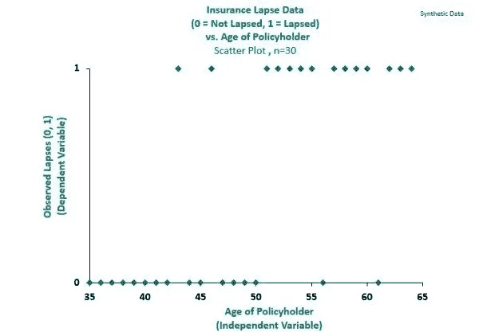
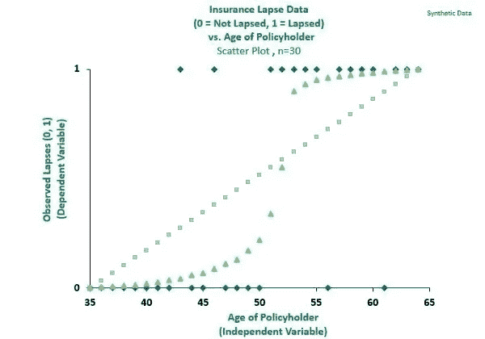
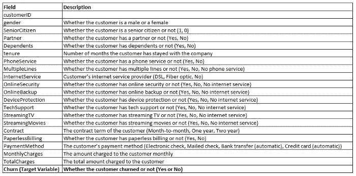
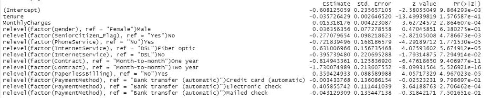
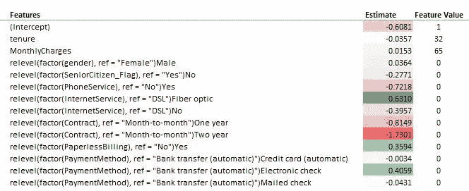
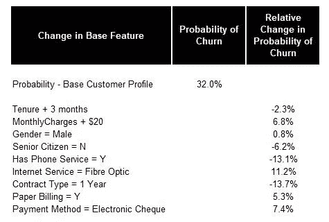
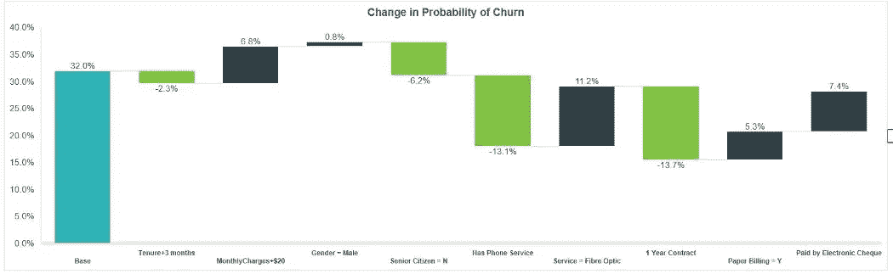

# 使用逻辑回归为分类问题创建强大的模型解释

> 原文：<https://towardsdatascience.com/create-powerful-model-explanations-for-classification-problems-with-logistic-regression-9bdd5f1c3648>

## 从业者指南，使用 IBM 电信客户流失数据集进行演示


巴勃罗·加西亚·萨尔达尼亚在 [Unsplash](https://unsplash.com?utm_source=medium&utm_medium=referral) 上拍摄的照片

# 介绍

逻辑回归通常用于建模分类问题。这是一种参数算法，其输出提供了强大的模型解释(被许多人称为可解释的 ML)。特别是，除了克服线性回归对分类问题建模的已知限制之外，与非参数的基于树的算法相比，它还能够轻松地告知用户特定特性的步长变化如何影响目标变量，我将在本文的后面部分使用 IBM 共享的数据集来演示这一点。

# 分类问题的逻辑回归与线性回归

在第一个例子中，我将通过一个例子来展示在分类问题中使用逻辑回归比线性回归的优势。

在保险领域，失效是指投保人行使选择权终止与保险人的保险合同的事件。从商业角度来说，了解投保人在下一次保单续期时是否可能失效符合保险公司的利益，因为这通常有助于保险公司优先考虑其保留工作。这就变成了一个分类问题，因为给定特定投保人的属性，响应变量采用 0(非失效)或 1(失效)的二进制形式。

在下图的合成数据集中，我们记录了 30 名投保人的过失行为，1 表示过失，0 表示过失。



图表 1:观察到的 30 名投保人的过失。按作者分类的图表

在这种情况下，使用线性回归对失误进行建模是违反直觉的，如下图中的灰线所示。显然，绿线所示的逻辑回归提供了更好的拟合。



图表 2:线性回归与逻辑回归。按作者分类的图表

逻辑回归属于广义线性模型(“GLM”)家族。假设我们想要为投保人的失效概率建模，用 ***p*** 表示，逻辑回归具有如下形式的方差函数，当 *p* 取值为 0 或 1 时，方差函数最小化。


这是为投保人的失效概率建模的一个很好的属性，因为观察到的失效事件只能取值 0 或 1。一个相应的结果是，逻辑回归对 0 和 1 的观察值给出了更大的可信度，并且可以很容易地扩展到其他分类问题。

# 逻辑回归与基于树的分类算法

在这一节中，我将使用一个 IBM 数据集演示使用逻辑回归比基于树的算法的优势。我将从描述逻辑回归的模型输出开始。

## 对数优势比

预测模型旨在表达独立特征(“ ***X*** ”)和目标变量(“ ***Y*** ”)之间的关系。在线性回归中，该关系可以表示为:


在这种情况下，***【y】***可能表示房产价格，而***【x₁】***和***【x₂】***可能分别表示房产大小和房产中卧室的数量，在这种情况下，我们会期望自变量和因变量之间以正系数的形式存在正关系，用于**和 *β₂.***

**另一方面，逻辑回归旨在对事件的概率(***【p***”)进行建模(例如，投保人的失效)。这首先通过用下面等式(3)中所示的**对数比**替换等式(2)中的 ***Y*** 来表示:**

****

**数学上，重新排列等式(3)得到 ***p*** ，如下面的等式(4)和(5)所示:**

********

**等式(3)、(4)和(5)使得逻辑回归模型输出的解释更全面，原因如下:**

*   **等式(3)和(4)使用保持线性的结构来表示比值比。**
*   **等式(5)将特征映射到范围从 0 到 1 的概率。这使得模型的用户能够为每个输入数据点分配输出概率 ***p*** (例如，每个投保人的失效概率，根据该概率可以对保留努力进行优先级排序)。**

## **β系数**

**通过使用截距项 *β* ₀，可以很容易地建立基准测试的基线场景。例如，在逻辑回归下，如果 *β₂* 是分类变量的估计系数，该分类变量已被编码为取值 1 或 0(例如，对于高或低收入水平)，则下面的等式(6)可用于显示输出概率**t5】pT7 因该特定特征而有多大差异(即，在高和低收入水平的客户之间)。****

****

**等式(6)暗示收入水平对失效概率*的影响是基于系数 *β₂* 的常数。当 *β₂* 系数足够小时，概率变化**pt19】可以直接用系数 *β₂来近似(当 *β* 小时*为*β*≈***e****ᵝ*)。*****

*此外，从等式(4)可以推断出， *β* 系数的符号表示相应特征影响输出概率 *p* 的方向。*

*然而，在实践中，并不是所有拟合的特征都是重要的。根据经验，如果特征的 *β* 系数的[*p*-值](http://me.dm/r-ejhEaRzelO?source=email-333e9ae026bc-1646647917224-newsletter.subscribeToProfile-------------------------01f05873_48b3_48a1_a1c0_a978c3c2e5f6--------7a8cde655d1a)小于 0.05，则特征通常被认为具有统计显著性，这表明这些 *β* 系数具有相对较小的方差。*

**β* 方差较大的系数表明应减少对相应特征的依赖，因为估计的系数可能在很大范围内变化。*

*总之，利用逻辑回归估计的 *β* 系数，用户可以输出目标事件的概率，并显示每个特征如何在数据点级别影响输出概率。这非常有助于模型解释，我将在后面演示。*

## *IBM 数据集*

*我将使用的数据集是众所周知的 IBM Telco 流失数据集，用于演示逻辑回归下的模型解释。它包含 20 个独立特征和 1 个目标变量“流失”,该变量指示客户是否停止使用电信公司的服务。最初的目的是训练一个预测目标变量的分类模型。*

*这个数据集来自官方的 [IBM GitHub 存储库](https://github.com/IBM/telco-customer-churn-on-icp4d)。下表提供了该数据集的数据字典。除了*任期*、*月费*(即每月保费)和*总费用*之外，所有功能都是绝对的。*

**

*表 3:数据字典。按作者分类的表格*

## *模型拟合*

*出于演示的目的，我用表 3 中列出的特性子集拟合了 R 中的逻辑回归。下面提供了模型拟合的 R 代码，请注意，基本客户资料是使用 *relevel* 方法为每个分类特征设置的。这使我们能够根据预定义的基本客户资料，量化特定功能的预测流失概率的相对变化。*

```
*## 1\. Load Telco Churn data
data_raw <- read.csv('Directory/Telco-Customer-Churn.csv', header = TRUE)

## 2\. 70/30 Train-Test Split
y = data_raw$Churn_Flag

set.seed(268)
sample_size <- floor(0.7 * nrow(data_raw))
sample_indi <- sample(seq_len(nrow(data_raw)), size = sample_size)
d_train <- data_raw[sample_indi,]
d_test <- data_raw[-sample_indi,]
y_train <- y[sample_indi]
y_test <- y[-sample_indi]

## 3\. Logistic Regression Model Fitting
glm_1 <- glm(Churn_Flag ~

  tenure
+ MonthlyCharges
+ relevel(factor(gender), ref = "Female")
+ relevel(factor(SeniorCitizen_Flag), ref = "Yes")
+ relevel(factor(PhoneService), ref = "No")
+ relevel(factor(InternetService), ref = "DSL")
+ relevel(factor(Contract), ref = "Month-to-month")
+ relevel(factor(PaperlessBilling), ref = "No")
+ relevel(factor(PaymentMethod), ref = "Bank transfer (automatic)")
#+ Partner
#+ Dependents
#+ MultipleLines
#+ OnlineSecurity 
#+ OnlineBackup 
#+ DeviceProtection
#+ TechSupport
#+ StreamingTV
#+ StreamingMovies
, data = d_train
, family = binomial("logit")
)

summary(glm_1)*
```

*下面的屏幕截图显示了上面拟合的 *glm_1* 模型的输出。特别是:*

*   ***估计值**栏存储每个拟合特征的估计 *β* 系数。*
*   ***Pr( > |z|)** 列存储了每个特征的 *p 值*(可以宽松地看做接受特征不显著假设的概率)，大部分是< 0.05。*

**

*表 4:逻辑回归的 R 输出。按作者分类的表格*

*另外，模型 *glm_1* 实现了 0.84 的 AUC(这一点都不差，尽管模型性能并不十分重要，因为这个演示是为了解释模型)。*

*利用上面估计的 *β* 系数，我们可以立即校准基本客户档案的流失概率。具体使用等式(5)，在代码中被设置为参考水平的基本客户简档的流失概率是 32%(即，几乎三分之一！).*

*这是通过取下表所示的**估计值**和**特征值**列的和积(得到-0.7557)，取该值的指数，然后按照等式(5)除以 1 加上该值的指数来计算的。*

**

*表 5:估计基本概率。按作者分类的表格*

*此外，**通过用感兴趣的客户的简档填充表 5 中的特征值列，可以计算数据**中任何客户的流失概率。这可能有助于应用优先与流失可能性最高的客户接触。*

*此外， *β* 系数的符号告知特定特征影响流失的方向。例如，如果客户是男性，或者每月费用较高(这是直觉)，那么他更有可能离开电信公司，如果客户已经锁定了两年的合同，那么他就不太可能离开。*

*将模型解释进一步，再次使用等式(5)，我们可以显示相对于“平均”客户的 32%概率，特定特征的阶跃变化如何影响流失。下表显示了相对于基本客户资料的流失概率的(附加)变化。*

**

*表 6:按功能划分的流失概率变化。按作者分类的表格*

*总之，逻辑回归有效地告知用户以下信息:*

*   *给定 p 值机制，表 4 中确定的流失的重要驱动因素自然会过滤掉不重要的驱动因素；*
*   *数据中任何客户流失的概率；*
*   *相对于预定义的基本客户资料，特定特征引起的客户流失概率的变化。*

*表 6 也可以在下面的瀑布图中可视化，其中绿色条表示相对于基本客户档案，特定特征的流失概率降低，黑色条表示流失概率增加。*

**

*图表 7:按功能划分的流失概率变化。按作者分类的表格*

*根据模型的输出，如果我是电信公司的决策者，我会开始主动管理客户流失，将注意力集中在以下客户身上:*

*   *拥有光纤互联网服务(可能需要调查这是原因还是关联)*
*   *用电子支票支付*
*   *每月支付高额保费*
*   *有纸质账单*

# *限制*

*在实践中应用逻辑回归(或更一般的 GLM)有一些已知的限制，包括:*

*   *由于模型的参数化性质，它需要大量的特征工程工作，因为特征可能需要手动拟合。这包括交互项的拟合，其中一个特征的效果可能取决于另一个特征的水平。保险业中这种相互作用的一个例子是，保险费的增加可能因年龄而异。可能的相互作用项的数量随着特征的数量呈指数增长。此外，虽然逻辑回归允许调查相互作用的条款，他们可能会证明很难解释。*
*   *自变量( ***X*** )是假设独立的，这可能不成立。对于预测流失的用例，流失事件可能需要按时间段进行度量和细分，这可能会引入不同时间段的重叠客户和相关性。*

# *总结想法*

*逻辑回归是分类问题的一个很好的模型，因为它的输出允许全面的模型解释，特别是对于非技术观众。*

*在实践中，我认为将逻辑回归模型的性能与其他已知的用于解决分类问题的模型(如基于树的模型)进行比较，以获得最佳推断，这符合从业者的最佳利益。这两种模型协作的一个用例是使用基于树的模型来指导数字特征的拟合，如年龄和任期，其中这些特征的片段预计会对目标变量产生不同的影响。*

# *数据源*

*[1] IBM GitHub 存储库，[电信客户流失 GitHub 页面](https://github.com/IBM/telco-customer-churn-on-icp4d)，2023 年 1 月 7 日访问，在[https://GitHub . com/IBM/Telco-Customer-Churn-on-ICP 4d/blob/master/LICENSE](https://github.com/IBM/telco-customer-churn-on-icp4d/blob/master/LICENSE)获得许可*