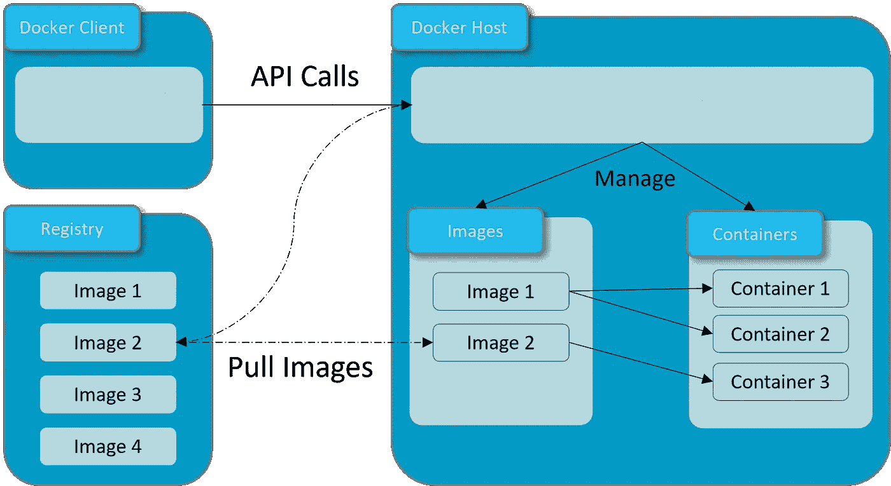
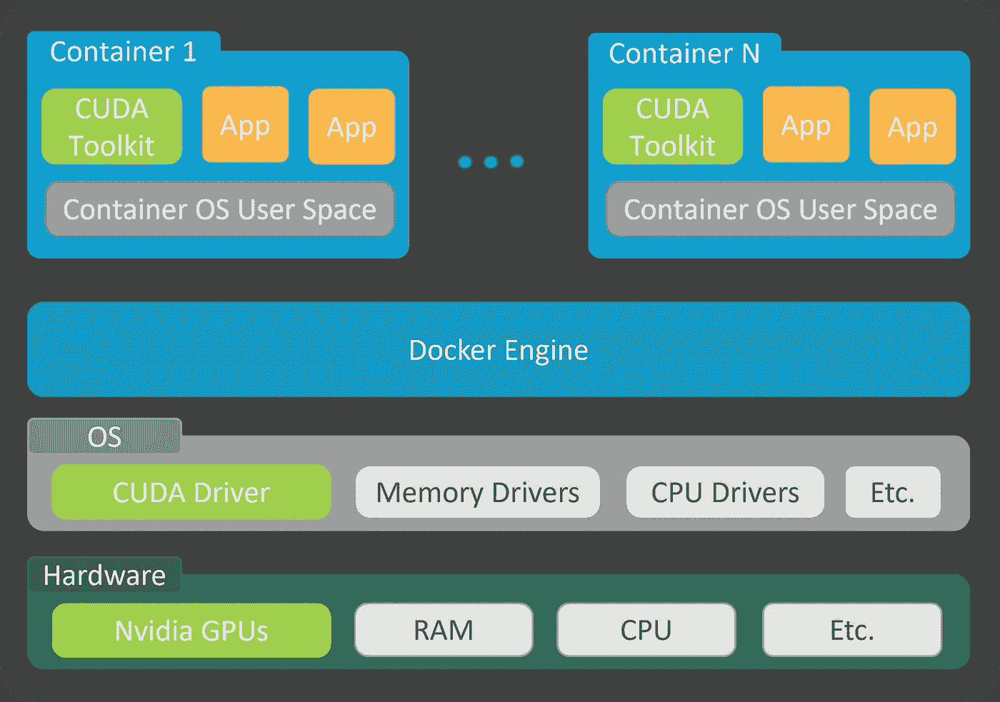
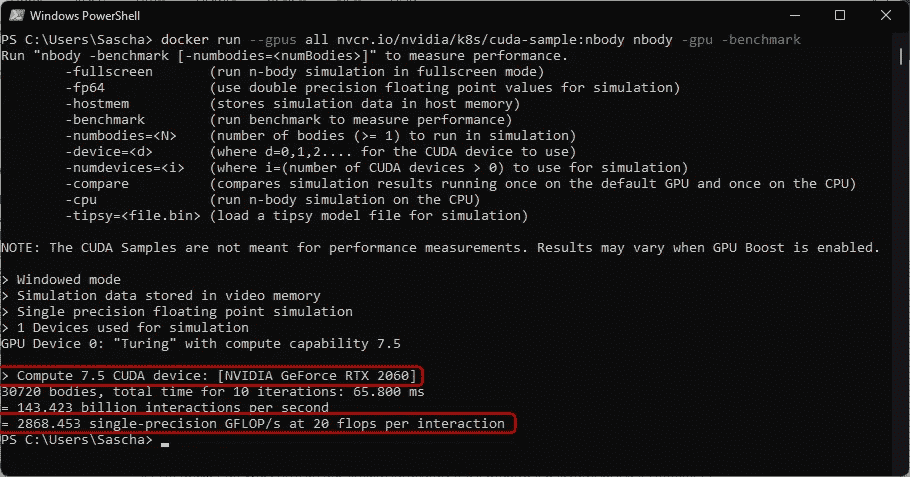
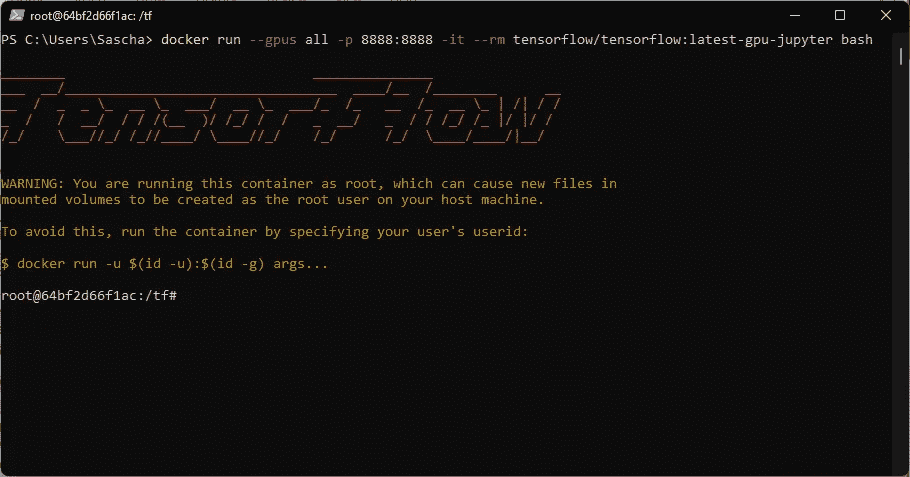
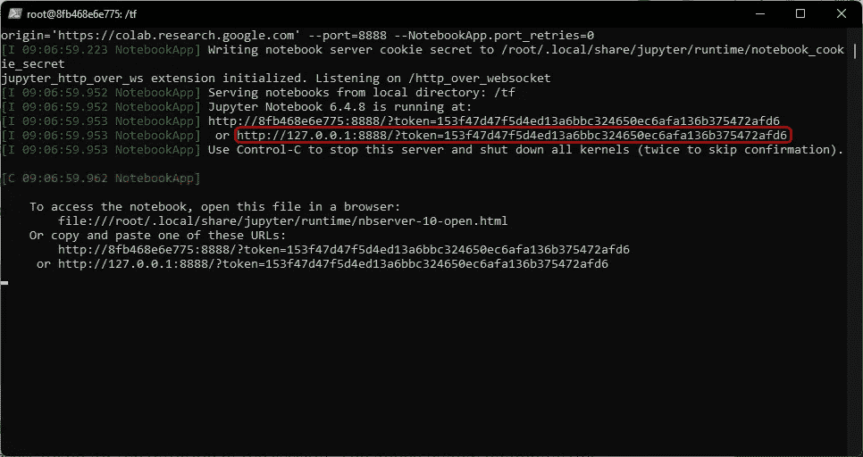
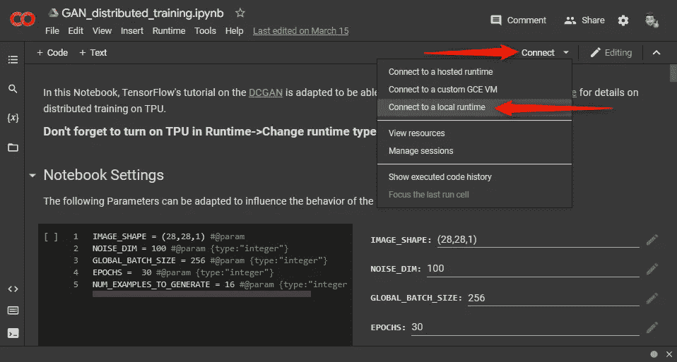
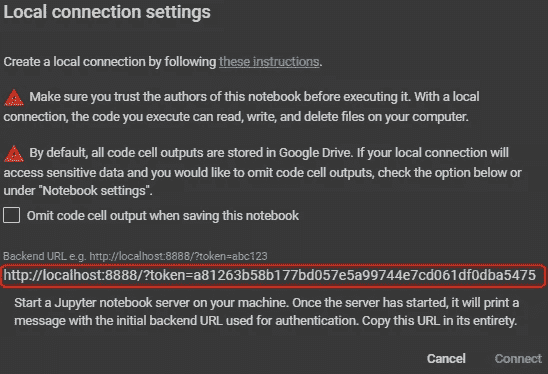

# 使用 Docker 为 Google Colab 创建自己的 GPU 加速 Jupyter 笔记本服务器

> 原文：<https://towardsdatascience.com/create-your-own-gpu-accelerated-yupyter-notebook-server-with-google-colab-using-docker-2fa14900bab5>

## 循序渐进的指南


SpaceX 在 [Unsplash](https://unsplash.com?utm_source=medium&utm_medium=referral) 上拍摄的

Y 你想在你自己的电脑或服务器上训练你的深度学习模型，你不想处理免费环境如 Google Colab 或 Kaggle 的资源限制，你不想花费数小时安装运行训练所需的所有驱动程序和软件包？那么我有好消息要告诉你，因为今天我们将探讨如何在你自己的系统上使用 Docker 创建你自己的 Jupyter 笔记本服务器，如何启用 GPU 加速，以及如何从 Google Colab 连接到你的服务器。

首先，我想简单地谈谈 Docker，以及为什么它是 ML 从业者的一个很好的工具，他们希望专注于 ML，而不是处理复杂的环境问题，如驱动程序、不同版本和依赖关系等。之后，我们看看安装(剧透警告，这将是简短和容易的)。最后，我将向您展示，如何使用 Google Colab 连接到您的服务器。瞧，现在你可以用自己的电脑运行笔记本了。

# 概述

1.  [简单地说就是 Docker](#88b0)
2.  [安装指南](#b649)
3.  [运行您的第一台笔记本电脑](#45be)
4.  [结论](#e936)

# 1.简单地说，码头工人

您可能已经听到人们谈论 Docker 和容器，以及它与虚拟化的关系。我记得我很困惑，我想，如果我可以使用虚拟机，为什么我要在容器中使用 Linux 发行版，比如 Ubuntu？有许多很好的理由，我希望你在读完这一节后同意我的观点。

Docker 能够在隔离的容器中运行应用程序。容器是一个轻量级的构造，包含了应用程序运行所需的一切。这已经是主要优势之一了。因为您需要的所有东西都打包在容器中，所以您可以在不同的主机上执行容器，而不管该主机上当前安装了什么。因此，您可以与同事共享您的容器，并确保您的应用程序以相同的方式运行。它们都与硬件和平台无关。现在让我们更深入一层，检查 Docker 的架构:



作者的 Docker 架构灵感来自 [Docker](https://docs.docker.com/get-started/overview/)

Docker 遵循客户端-服务器原则。客户端与 Docker 守护进程通信，除了其他任务之外，Docker 守护进程还管理图像、处理依赖关系并执行容器。Docker 守护程序可以在本地主机上，也可以在远程主机上。图像可以被理解为带有如何构建容器的指令的蓝图。容器是一个图像的可运行实例。单个图像的多个容器可以并行运行，这意味着它可以轻松缩放。默认情况下，容器与其他容器和主机隔离。可选地，可以配置接口，例如打开端口。

映像安装在主机上。如果您想创建一个容器，而映像没有安装在主机上，Docker 会自动从标准注册表中下载映像。

现在让我们联系到我们的主要目标:运行 GPU 加速的笔记本来训练我们的机器学习模型。前面我说过容器是硬件不可知的。大多数情况下都是这样。为了在可接受的时间内训练大规模模型，GPU 是必不可少的，由于其硬件架构，可以并行化大规模计算。英伟达是专门用于机器学习应用的 GPU 的大型供应商，包括一个强大的软件框架。由于我们将在本教程中关注 Nvidia GPUs，我们限制我们的硬件不可知的方法。

Docker 本身不支持 GPU 加速。我们需要使用 Nvidia 工具包。让我们看看下面的图片，以了解这在高层次上是如何工作的:



作者的 Nvidia 容器工具包灵感来自于 Nvidia

我们从堆栈的底部开始。我们有一个带有一个或多个 GPU 的服务器(或任何类型的计算机)。这台计算机的操作系统安装了 docker 引擎。支持我们的 GPU 所需的第一个组件是安装它的专用驱动程序。对于 Nvidia，这些被称为 CUDA 驱动程序。Docker 引擎可以创建隔离的容器，为某个应用程序分配操作系统资源。CUDA 工具包支持容器内的 GPU 驱动程序。

# 2.安装指南

开始之前，我们要做的是:

1.  我们确保激活了 wsl 2(Linux 的 Windows 子系统)并安装了一个 Linux 发行版，即 Ubuntu
2.  我们安装 Docker 桌面
3.  我们启用 GPU 支持
4.  我们拉官方 TensorFlow Jupyter 笔记本服务器带 GPU 支持

作为参考，此程序已在 Win11、英特尔酷睿 i7 第 10 代和英伟达 GeForce RTX 2060 上进行了测试。你也可以在其他操作系统上安装 Docker，比如 Ubuntu。你甚至可以在 Ubuntu 虚拟机上安装 Docker。但是你应该记住，从虚拟机内部你不能访问你的物理 GPU，这意味着你不能利用 GPU 加速。

> **注意:**以下命令必须在 Windows PowerShell 和 Linux shell 中执行。带有 PS >的代码嵌入是 PowerShell 命令，带有$的代码嵌入是 Linux 命令。

## 步骤 1:确保 WSL2 被激活并安装 Ubuntu

要在 Linux 的 Windows 子系统中安装 ubuntu，只需打开 PowerShell 并执行:

```
PS> wsl --install -d Ubuntu
```

安装完成后，使用以下命令检查您正在运行的 WSL 版本:

```
PS> wsl -l -v
```

如果您的版本不是 2，您可以使用以下命令进行设置:

```
PS> wsl --set-default-version 2
```

现在，通过浏览开始菜单或在 PowerShell 中键入`wsl`来启动 Ubuntu 子系统。现在应该要求您创建一个新用户并分配一个密码。该用户将自动成为具有管理员权限的默认用户，并在启动时自动登录。

> **注意:**如果不要求您创建新用户，而是以 root 用户身份登录，您必须手动创建一个用户，使其成为默认用户并添加管理员权限。

1.  添加新用户(在 WSL 中以 root 用户身份登录):

```
$ sudo adduser <USER_NAME>
```

2.将您的用户设置为默认用户(在 PowerShell 中):

```
PS> ubuntu config — default-user <USER_NAME>
```

3.将您的用户添加到 sudoers(在 WSL 中以 root 用户身份登录):

```
$ usermod -aG sudo <USER_NAME>
```

## 步骤 2:安装 Docker 桌面

从 [DockerHub](https://hub.docker.com/editions/community/docker-ce-desktop-windows/) 下载 Docker Desktop，并按照安装说明进行操作。确保在安装过程中选择 WSL2。

## 步骤 3:启用 GPU 加速支持

为了用我们的 Nvidia GPU 加速我们的机器学习代码，我们必须安装 CUDA 框架。因此，下载并安装支持 WLS 的 [Nvidia CUDA 驱动程序。安装 CUDA 驱动程序后，打开 Ubuntu 子系统，按照 Nvidia](https://www.nvidia.com/download/index.aspx) 的[安装指南安装 Nvidia 容器工具包。为了更好的可读性，我复制了文档中的三个步骤。](https://docs.nvidia.com/cuda/wsl-user-guide/index.html#ch04-sub02-install-nvidia-docker)

1.  设置稳定的存储库和 GPG 键。支持 WSL 2 的运行时更改可在稳定的存储库中获得:

```
$ distribution=$(. /etc/os-release;echo $ID$VERSION_ID)$ curl -s -L [https://nvidia.github.io/nvidia-docker/gpgkey](https://nvidia.github.io/nvidia-docker/gpgkey) | sudo apt-key add -$ curl -s -L [https://nvidia.github.io/nvidia-docker/$distribution/nvidia-docker.list](https://nvidia.github.io/nvidia-docker/$distribution/nvidia-docker.list) | sudo tee /etc/apt/sources.list.d/nvidia-docker.list
```

2.更新软件包列表后，安装 NVIDIA 运行时软件包(及其依赖项):

```
$ sudo apt-get update$ sudo apt-get install -y nvidia-docker2
```

3.打开一个单独的 WSL 2 窗口，并使用以下命令重新启动 Docker 守护程序以完成安装:

```
$ sudo service docker stop$ sudo service docker start
```

就是这样！现在，您可以充分利用 Docker 容器中的 GPU。要测试安装是否成功，您可以运行一个 GPU 基准测试容器。打开 Docker 桌面，然后打开 PowerShell 来执行

```
PS> docker run --gpus all nvcr.io/nvidia/k8s/cuda-sample:nbody nbody -gpu -benchmark
```

您现在应该会看到与我的结果类似的内容，如下所示:



GPU 基准测试容器的结果

## 第 4 步:拉张量流 Docker 图像

TensorFlow 提供现成的用户 Docker 映像，用于配置包含运行 TensorFlow 所需的所有包的容器。可以在[这里](https://www.tensorflow.org/install/docker)找到可能配置的完整概述。在这里，我们正在测试最新的稳定 TensorFlow 构建与 GPU 支持，包括一个 Jupyter 笔记本电脑服务器。确保 docker 正在运行，并在 PowerShell 中执行以下命令来提取所述 Docker 映像:

```
PS> docker pull tensorflow/tensorflow:latest-gpu-jupyter
```

通过这最后一步，我们现在可以运行我们的笔记本了！细节在下一节。

# 3.运行您的第一台笔记本电脑

在本部分教程中，我们将:

1.  使用所需的配置启动我们支持 GPU 的 TensorFlow 容器，
2.  启动 Jupyter 笔记本服务器，
3.  将 Google Colab 连接到我们的本地运行时。

> **注:**如果你手头没有笔记本，[看看这个笔记本](https://github.com/sascha-kirch/ML_Notebooks/blob/7591d0c595620a28ccccc028618619815fd0d607/GAN_distributed_training.ipynb)，我在里面实现了一个简单的生成对抗网络。

## 步骤 1:启动支持 GPU 的 TensorFlow 容器

首先，我们确保 docker 正在运行，并在 PowerShell 中执行下面的命令来创建一个新容器。

```
PS> docker run --gpus all -p 8888:8888 -it --rm tensorflow/tensorflow:latest-gpu-jupyter bash
```

**配置:**

*   **运行**:运行一个新的容器
*   **—所有 GPU**:使用所有可用的 GPU
*   **-p 8888:8888** :向主机发布容器的端口 8888:8888
*   **-it** :保持 STDIN 打开，分配一个伪 tty。
*   **—RM tensor flow/tensor flow:latest-GPU-jupyter**:如果容器存在，自动移除容器
*   **bash** :打开容器的 bash，从容器内部执行命令

随着上面命令的执行，从 TensorFlow 图像创建容器，bash 命令行打开:



GPU 支持的 TensorFlow 容器和 Jupyter 笔记本服务器

## 步骤 2:启动 Jupyter 笔记本服务器

我们现在在容器内部，可以访问 bash。现在我们必须手动启动 Jupyter 笔记本服务器，主要是因为我们必须允许 Google Colab 作为 origin。

```
$ jupyter notebook --notebook-dir=/tf --ip 0.0.0.0 --no-browser --allow-root --NotebookApp.allow_origin='https://colab.research.google.com' --port=8888 --NotebookApp.port_retries=0
```

该命令启动本地主机上的服务器，并在会话期间生成一个秘密访问令牌。下图突出显示了这个令牌。它需要从 Google Colab 内部连接到本地运行时



生成访问令牌以连接到本地 Jupyter 笔记本运行时

## 步骤 3:将 Google Colab 连接到我们的本地运行时

首先在 Google Colab 中打开一个笔记本。

> **注意:**如果你手头没有笔记本，[看看这个笔记本](https://github.com/sascha-kirch/ML_Notebooks/blob/7591d0c595620a28ccccc028618619815fd0d607/GAN_distributed_training.ipynb)，我在里面实现了一个简单的生成对抗网络。

在笔记本中，导航到右上角，然后按“connect(连接)”按钮旁边的小箭头。选择“连接到本地运行时”,如下图所示



连接到本地运行时的导航

将弹出一个新窗口，您可以在其中粘贴上一步中突出显示的令牌。确保将 127.0.0.1 改为 localhost，因为 Google Colab 要求这种格式。现在只需按下连接，你应该完成了。



本地连接设置

现在，您可以从笔记本电脑中查看所有可用设备的设备列表。

> **注:**在我的深度学习包[Github 上的 DeepSaki](https://github.com/sascha-kirch/DeepSaki)中，你可以在许多有用的模块中找到与硬件检测和性能提升相关的助手，用于你的 GPU 训练。


本地机器上所有可用设备的列表

如上面的截图所示，检测到一个 GPU，你可以看到它是我的 Nvidia GeForce RTX 2060。

# 4.结论

Docker 可以在隔离的容器中运行应用程序，并提供执行应用程序所需的一切。如果你想从容器内访问你的 GPU，就需要 Nvidia 的 CUDA 工具包。这允许提取包含 Jupyter 笔记本服务器的 GPU 支持的 TensorFlow 图像。我们可以配置 Google Colab 连接到这个本地运行时，并充分利用我们的 GPU。

如果你想用你的 GPU 进一步加速你的训练，我推荐你阅读我的关于如何[在 GPU/TPU 上用混合精度加速你的 TensorFlow 训练的文章](https://medium.com/@SaschaKirch/speed-up-your-tensorflow-training-with-mixed-precision-on-gpu-tpu-acf4c8c0931c)。