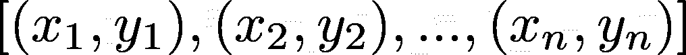
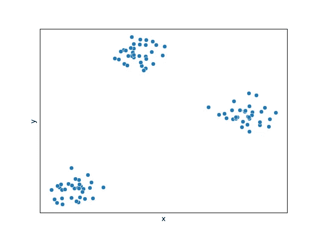
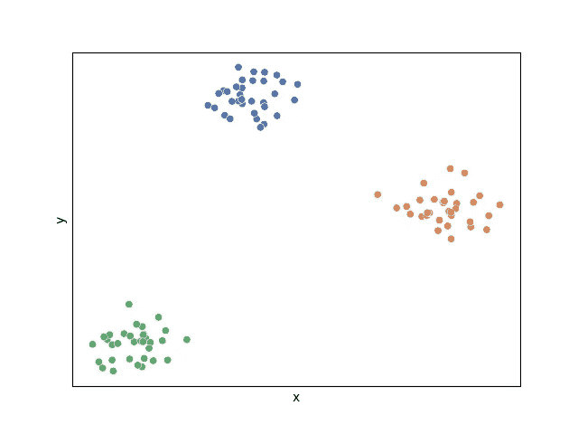
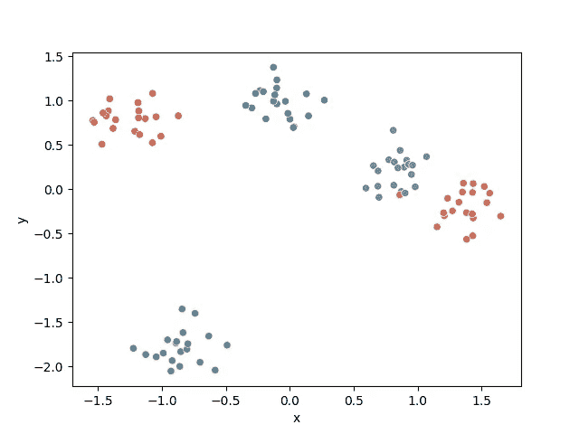
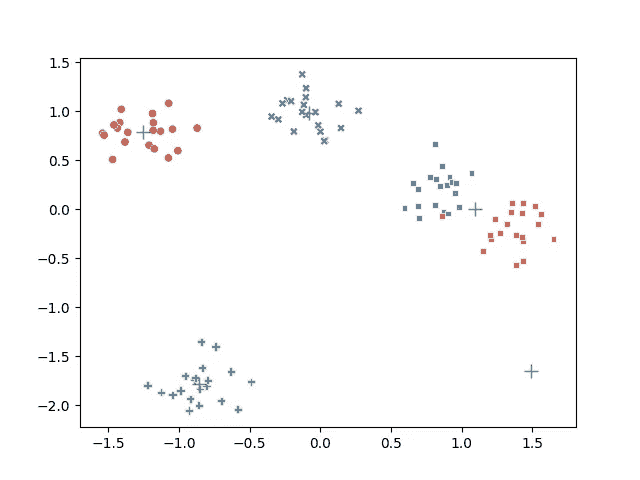
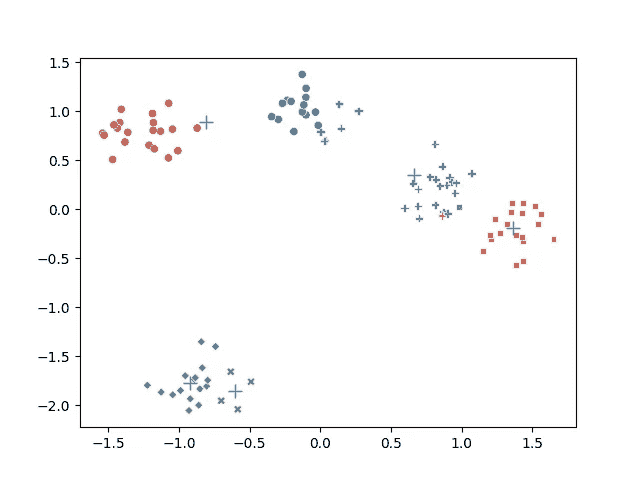

# 用 Python 从头开始创建 K-Means 聚类算法

> 原文：<https://towardsdatascience.com/create-your-own-k-means-clustering-algorithm-in-python-d7d4c9077670>

## 通过自己实现 k-means 聚类巩固你的知识

# 介绍

k-means 聚类是一种**无监督的**机器学习算法，旨在根据数据点的相似性将数据集分割成组。无监督模型有**自变量**，没有**因变量**。

假设您有一个二维标量属性的数据集:



图片作者。

如果该数据集中的点属于不同的组，且这些组之间的属性差异很大，但组内的属性差异不大，则绘制时这些点应形成聚类。



图片作者。

**图 1:** *具有不同属性组的点的数据集。*

该数据集清楚地显示了 3 类不同的数据。如果我们试图将一个新的数据点分配给这三组中的一组，可以通过找到每组的中点(质心)并选择最近的质心作为未分配数据点的组来实现。



图片作者。

**图 2:** *数据点被分割成用不同颜色表示的组。*

# 算法

对于给定的数据集，k 被指定为点所属的不同组的数量。这 k 个质心首先被随机初始化，然后执行迭代以优化这 k 个质心的位置，如下所示:

1.  计算从每个点到每个质心的距离。
2.  点被分配给它们最近的质心。
3.  质心被移动为属于它的点的平均值。如果质心没有移动，算法结束，否则重复。

# 数据

为了评估我们的算法，我们将首先在二维空间中生成一个组数据集。sklearn.datasets 函数 make_blobs 创建二维正态分布的分组，并分配与所述点所属的组相对应的标签。

```
import seaborn as sns
from sklearn.datasets import make_blobs
import matplotlib.pyplot as plt
from sklearn.preprocessing import StandardScalercenters = 5
X_train, true_labels = make_blobs(n_samples=100, centers=centers, random_state=42)
X_train = StandardScaler().fit_transform(X_train)sns.scatterplot(x=[X[0] for X in X_train],
                y=[X[1] for X in X_train],
                hue=true_labels,
                palette="deep",
                legend=None
                )plt.xlabel("x")
plt.ylabel("y")
plt.show()
```



图片作者。

**图 3:** *我们将用来评估我们的 k 均值聚类模型的数据集。*

该数据集提供了 k-means 算法的独特演示。观察橙色点一反常态地远离其中心，并直接位于紫色数据点群中。这个点不能被准确地分类为属于正确的组，因此即使我们的算法工作得很好，它也应该被错误地表征为紫色组的成员。

# 模型创建

# 助手功能

在这个算法中，我们需要多次计算一个点和一组点之间的距离。为此，让我们定义一个计算欧几里德距离的函数。

```
def euclidean(point, data):
    """
    Euclidean distance between point & data.
    Point has dimensions (m,), data has dimensions (n,m), and output will be of size (n,).
    """
    return np.sqrt(np.sum((point - data)**2, axis=1))
```

# 履行

首先，用 k 值和寻找最佳质心位置的最大迭代次数初始化 k 均值聚类算法。如果在优化质心位置时没有考虑最大迭代次数，则存在运行无限循环的风险。

```
class KMeans: def __init__(self, n_clusters=8, max_iter=300):
        self.n_clusters = n_clusters
        self.max_iter = max_iter
```

现在，大部分算法是在将模型拟合到训练数据集时执行的。

首先，我们将在测试数据集的域中随机初始化质心，使其均匀分布。

```
# Randomly select centroid start points, uniformly distributed across the domain of the dataset
min_, max_ = np.min(X_train, axis=0), np.max(X_train, axis=0)
self.centroids = [uniform(min_, max_) for _ in range(self.n_clusters)]
```

接下来，我们执行优化质心位置的迭代过程。

优化过程是将质心位置重新调整为属于它的点的平均值。重复这个过程，直到质心停止移动，或者经过了最大迭代次数。我们将使用 while 循环来说明这个过程没有固定的迭代次数。此外，您还可以使用 for 循环，该循环重复 max_iter 次，并在质心停止变化时中断。

在开始 while 循环之前，我们将初始化退出条件中使用的变量。

```
iteration = 0
prev_centroids = None
```

现在，我们开始循环。我们将遍历训练集中的数据点，将它们分配给一个初始化的空列表。sorted_points 列表为每个质心包含一个空列表，数据点一旦被赋值就被追加到这个列表中。

```
while np.not_equal(self.centroids, prev_centroids).any() and iteration < self.max_iter:
    # Sort each data point, assigning to nearest centroid
    sorted_points = [[] for _ in range(self.n_clusters)]
    for x in X_train:
        dists = euclidean(x, self.centroids)
        centroid_idx = np.argmin(dists)
        sorted_points[centroid_idx].append(x)
```

既然我们已经将整个训练数据集分配给它们最近的质心，我们可以更新质心的位置并完成迭代。

```
# Push current centroids to previous, reassign centroids as mean of the points belonging to them
    prev_centroids = self.centroids
    self.centroids = [np.mean(cluster, axis=0) for cluster in sorted_points]
    for i, centroid in enumerate(self.centroids):
        if np.isnan(centroid).any():  # Catch any np.nans, resulting from a centroid having no points
            self.centroids[i] = prev_centroids[i]
    iteration += 1
```

迭代完成后，再次检查 while 条件，算法将继续，直到质心被优化或最大迭代次数被通过。下面介绍了完全适合的方法。

```
class KMeans: def __init__(self, n_clusters=8, max_iter=300):
        self.n_clusters = n_clusters
        self.max_iter = max_iter def fit(self, X_train): # Randomly select centroid start points, uniformly distributed across the domain of the dataset
        min_, max_ = np.min(X_train, axis=0), np.max(X_train, axis=0)
        self.centroids = [uniform(min_, max_) for _ in range(self.n_clusters)] # Iterate, adjusting centroids until converged or until passed max_iter
        iteration = 0
        prev_centroids = None
        while np.not_equal(self.centroids, prev_centroids).any() and iteration < self.max_iter:
            # Sort each datapoint, assigning to nearest centroid
            sorted_points = [[] for _ in range(self.n_clusters)]
            for x in X_train:
                dists = euclidean(x, self.centroids)
                centroid_idx = np.argmin(dists)
                sorted_points[centroid_idx].append(x) # Push current centroids to previous, reassign centroids as mean of the points belonging to them
            prev_centroids = self.centroids
            self.centroids = [np.mean(cluster, axis=0) for cluster in sorted_points]
            for i, centroid in enumerate(self.centroids):
                if np.isnan(centroid).any():  # Catch any np.nans, resulting from a centroid having no points
                    self.centroids[i] = prev_centroids[i]
            iteration += 1
```

最后，让我们创建一个方法来评估一组点的质心，我们已经优化了我们的训练集。该方法返回每个点的质心和所述质心的索引。

```
def evaluate(self, X):
        centroids = []
        centroid_idxs = []
        for x in X:
            dists = euclidean(x, self.centroids)
            centroid_idx = np.argmin(dists)
            centroids.append(self.centroids[centroid_idx])
            centroid_idxs.append(centroid_idx) return centroids, centroid_idx
```

# 首次模型评估

现在我们终于可以部署我们的模型了。让我们在原始数据集上训练和测试它，看看结果。我们将保留绘制数据的原始方法，通过颜色分离真实标注，但现在我们将额外通过标记样式分离预测标注，以查看模型的执行情况。

```
kmeans = KMeans(n_clusters=centers)
kmeans.fit(X_train)# View results
class_centers, classification = kmeans.evaluate(X_train)
sns.scatterplot(x=[X[0] for X in X_train],
                y=[X[1] for X in X_train],
                hue=true_labels,
                style=classification,
                palette="deep",
                legend=None
                )
plt.plot([x for x, _ in kmeans.centroids],
         [y for _, y in kmeans.centroids],
         '+',
         markersize=10,
         )plt.show()
```



图片作者。

**图 4:** *一个失败的例子，一个质心没有点，一个包含两个集群。*


图片作者。

**图 5:** *一个失败的例子，一个质心没有点，两个包含两个簇，两个分裂一个簇。*



图片作者。

**图 6:** *两个质心包含一个半簇，两个质心分裂一个簇的失败例子。*

# 重新评估质心初始化

看来我们的模型表现不太好。我们可以从这三个失败的例子中推断出两个主要问题。

1.  如果质心被初始化为远离任何组，它不太可能移动。(例:**图 4** 中的右下质心。)
2.  如果质心被初始化得太近，它们不太可能彼此分开。(例如:**图 6** 中绿色组的两个质心。)

我们将开始用初始化质心位置的新过程来解决这些问题。这种新方法被称为 k-means++算法。

1.  将第一质心初始化为数据点之一的随机选择。
2.  计算每个数据点和所有质心之间的距离总和。
3.  随机选择下一个质心，其概率与到质心的总距离成比例。
4.  返回步骤 2。重复上述步骤，直到所有质心都已初始化。

该代码包含在下面。

```
# Initialize the centroids, using the "k-means++" method, where a random datapoint is selected as the first,
# then the rest are initialized w/ probabilities proportional to their distances to the first
# Pick a random point from train data for first centroid
self.centroids = [random.choice(X_train)]for _ in range(self.n_clusters-1):
    # Calculate distances from points to the centroids
    dists = np.sum([euclidean(centroid, X_train) for centroid in self.centroids], axis=0)
    # Normalize the distances
    dists /= np.sum(dists)
    # Choose remaining points based on their distances
    new_centroid_idx, = np.random.choice(range(len(X_train)), size=1, p=dists)
    self.centroids += [X_train[new_centroid_idx]]
```

如果我们运行这个新模型几次，我们会看到它表现得更好，但仍然不总是完美的。


图片作者。

**图 7:** *实现 k-means++初始化方法后的理想收敛。*

# 结论

就这样，我们结束了。我们学习了一个简单而优雅的无监督机器学习模型的实现。完整的项目代码包含在下面。

```
import numpy as np
import matplotlib.pyplot as plt
from sklearn.preprocessing import StandardScaler
from numpy.random import uniform
from sklearn.datasets import make_blobs
import seaborn as sns
import random def euclidean(point, data):
    """
    Euclidean distance between point & data.
    Point has dimensions (m,), data has dimensions (n,m), and output will be of size (n,).
    """
    return np.sqrt(np.sum((point - data)**2, axis=1)) class KMeans: def __init__(self, n_clusters=8, max_iter=300):
        self.n_clusters = n_clusters
        self.max_iter = max_iter def fit(self, X_train): # Initialize the centroids, using the "k-means++" method, where a random datapoint is selected as the first,
        # then the rest are initialized w/ probabilities proportional to their distances to the first
        # Pick a random point from train data for first centroid
        self.centroids = [random.choice(X_train)] for _ in range(self.n_clusters-1):
            # Calculate distances from points to the centroids
            dists = np.sum([euclidean(centroid, X_train) for centroid in self.centroids], axis=0)
            # Normalize the distances
            dists /= np.sum(dists)
            # Choose remaining points based on their distances
            new_centroid_idx, = np.random.choice(range(len(X_train)), size=1, p=dists)
            self.centroids += [X_train[new_centroid_idx]] # This initial method of randomly selecting centroid starts is less effective
        # min_, max_ = np.min(X_train, axis=0), np.max(X_train, axis=0)
        # self.centroids = [uniform(min_, max_) for _ in range(self.n_clusters)] # Iterate, adjusting centroids until converged or until passed max_iter
        iteration = 0
        prev_centroids = None
        while np.not_equal(self.centroids, prev_centroids).any() and iteration < self.max_iter:
            # Sort each datapoint, assigning to nearest centroid
            sorted_points = [[] for _ in range(self.n_clusters)]
            for x in X_train:
                dists = euclidean(x, self.centroids)
                centroid_idx = np.argmin(dists)
                sorted_points[centroid_idx].append(x) # Push current centroids to previous, reassign centroids as mean of the points belonging to them
            prev_centroids = self.centroids
            self.centroids = [np.mean(cluster, axis=0) for cluster in sorted_points]
            for i, centroid in enumerate(self.centroids):
                if np.isnan(centroid).any():  # Catch any np.nans, resulting from a centroid having no points
                    self.centroids[i] = prev_centroids[i]
            iteration += 1 def evaluate(self, X):
        centroids = []
        centroid_idxs = []
        for x in X:
            dists = euclidean(x, self.centroids)
            centroid_idx = np.argmin(dists)
            centroids.append(self.centroids[centroid_idx])
            centroid_idxs.append(centroid_idx) return centroids, centroid_idxs # Create a dataset of 2D distributions
centers = 5
X_train, true_labels = make_blobs(n_samples=100, centers=centers, random_state=42)
X_train = StandardScaler().fit_transform(X_train)# Fit centroids to dataset
kmeans = KMeans(n_clusters=centers)
kmeans.fit(X_train)# View results
class_centers, classification = kmeans.evaluate(X_train)
sns.scatterplot(x=[X[0] for X in X_train],
                y=[X[1] for X in X_train],
                hue=true_labels,
                style=classification,
                palette="deep",
                legend=None
                )
plt.plot([x for x, _ in kmeans.centroids],
         [y for _, y in kmeans.centroids],
         'k+',
         markersize=10,
         )plt.show()
```

感谢阅读！
[在 LinkedIn 上和我联系](https://www.linkedin.com/in/turnermluke/)
[在 GitHub 上看到这个项目](https://github.com/turnerluke/ML-algos/blob/main/k_means/k_means.py)