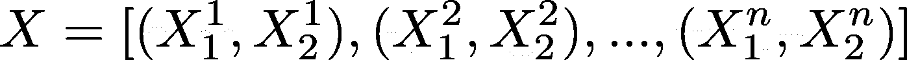
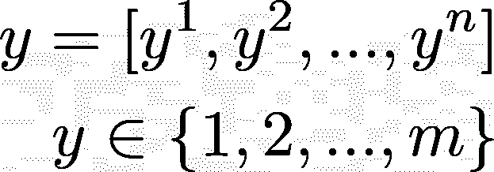
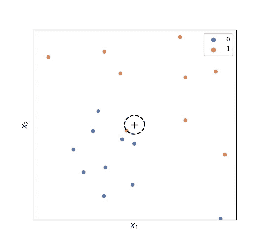
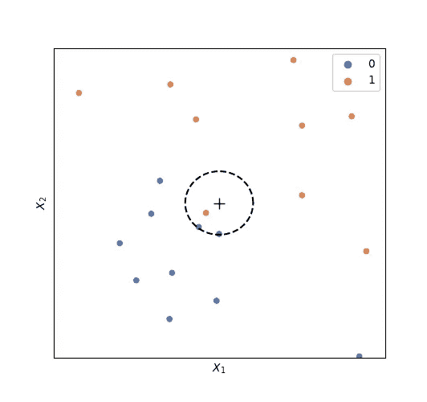
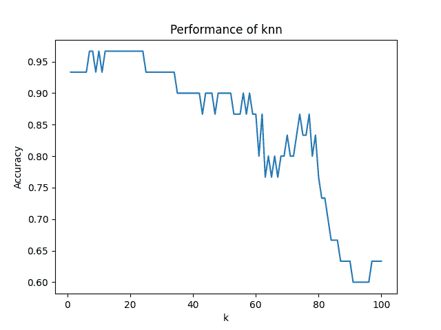

# 用 Python 从头开始创建 K-最近邻算法

> 原文：<https://towardsdatascience.com/create-your-own-k-nearest-neighbors-algorithm-in-python-eb7093fc6339>

## 通过亲身实践来巩固你对 KNN 的了解


马库斯·斯皮斯克在 [Unsplash](https://unsplash.com?utm_source=medium&utm_medium=referral) 上的照片

# 介绍

有一句名言说:“你是和你相处时间最长的五个人的平均值。”尽管我们不会为你的友谊质量建模(任何人的作品集)。)，本教程将教授一种简单直观的算法方法来根据数据的邻居对数据进行分类。k-最近邻(knn)算法是一种监督学习算法，具有优雅的执行和令人惊讶的简单实现。正因为如此，knn 为机器学习初学者提供了一个很好的学习机会，用几行 Python 代码创建一个强大的分类或回归算法。

# 算法

Knn 是一个**监督的**机器学习算法。监督模型既有目标变量又有独立变量的**。**目标变量**或因变量，表示为 y，取决于自变量，是您寻求预测的值。标为 X(单值)或 X(多值)的**独立变量**提前已知，用于预测 y。**

Knn 既可以用于**分类**也可以用于**回归**。**分类**模型预测一个*分类*目标变量，而**回归**模型预测一个*数字*目标。

假设您有一个标量属性和对应于这些属性的类的数据集。



图片作者。



图片作者。

这里，n 是数据点的总数，m 是类的总数。y 不是一个类，它也可以是一个标量值，knn 可以用作回归，但对于本教程，我们将重点放在分类上。

在这个二维例子中，我们可以很容易地在二维空间中看到这些点。假设类将倾向于与该空间中相同类的点聚集在一起，我们可以通过在其附近最频繁出现的类来对新点进行分类。因此，在给定点 k 被指定为所述点附近要考虑的邻居的数量，并且从这些邻居中，最频繁出现的类被预测为即将到来的点的类。



图片作者。

**图 1:** *当 k=1 时，此点归为第 1 组。*



图片作者。

**图 2:** *当 k=3 时，该点被归为 0 组。*

# 数据

我们将用 [UCI 机器学习库虹膜数据集](https://archive.ics.uci.edu/ml/datasets/iris)来评估我们的算法。但是，任何由标量输入组成的分类数据集都可以。我们将对数据集进行解包，并对属性进行标准化，使其均值和单位方差为零。这样做是因为我们不想判断哪些特征对于预测类是最重要的(对于这个分析！).最后，我们将把数据集分成训练集和测试集，测试集由 20%的原始数据集组成。

```
from sklearn import datasets
from sklearn.model_selection import train_test_split
from sklearn.preprocessing import StandardScaler# Unpack the iris dataset, from UCI Machine Learning Repository
iris = datasets.load_iris()
X = iris['data']
y = iris['target']# Preprocess data
X = StandardScaler().fit_transform(X)# Split data into train & test sets
X_train, X_test, y_train, y_test = train_test_split(X, y, test_size=0.2)
```

# 模型创建

**助手功能**

在这个算法中，我们需要找出给定组中多次出现的最常见的元素。下面的函数给出了一种直观的 Pythonic 式方法来查找列表中最常见的元素。

```
def most_common(lst):
    '''Returns the most common element in a list'''
    return max(set(lst), key=lst.count)
```

接下来，我们需要计算数据集中一个点和每个点之间的距离。最常见和直观的方法是欧几里德距离，但是也可以使用其他距离方法。

```
def euclidean(point, data):
    '''Euclidean distance between a point  & data'''
    return np.sqrt(np.sum((point - data)**2, axis=1))
```

**实施**

现在，让我们开始构造一个 knn 类。对于给定的 knn 分类器，我们将指定 k 和一个距离度量。为了保持该算法的实现类似于广泛使用的 scikit-learn 套件，我们将初始化 self。X_train 和 self.y_train，但是这可以在初始化时完成。

```
class KNeighborsClassifier():
    def __init__(self, k=5, dist_metric=euclidean):
        self.k = k
        self.dist_metric = dist_metric def fit(self, X_train, y_train):
        self.X_train = X_train
        self.y_train = y_train
```

接下来，knn 算法的大部分由预测方法执行。逐点迭代属性数据集(X_test)。对于每个数据点，执行以下步骤:

1.  计算到训练数据集中每个点的距离
2.  训练数据集类按到数据点的距离排序
3.  前 k 个类保存并存储在邻居列表中。现在，我们只需将最近邻居列表映射到我们的 most_common 函数，返回 X_test 中传递的每个点的预测列表。

```
class KNeighborsClassifier():
    def __init__(self, k=5, dist_metric=euclidean):
        self.k = k
        self.dist_metric = dist_metric def fit(self, X_train, y_train):
        self.X_train = X_train
        self.y_train = y_train def predict(self, X_test):
        neighbors = []
        for x in X_test:
            distances = self.dist_metric(x, self.X_train)
            y_sorted = [y for _, y in sorted(zip(distances, self.y_train))]
            neighbors.append(y_sorted[:self.k]) return list(map(most_common, neighbors))
```

最后，定义了一种评估方法来方便地评估模型的性能。属性及其类的数据集作为 X_test 和 y_test 进行传递，并且将属性的模型预测与实际类进行比较。

```
class KNeighborsClassifier():
    def __init__(self, k=5, dist_metric=euclidean):
        self.k = k
        self.dist_metric = dist_metric def fit(self, X_train, y_train):
        self.X_train = X_train
        self.y_train = y_train def predict(self, X_test):
        neighbors = []
        for x in X_test:
            distances = self.dist_metric(x, self.X_train)
            y_sorted = [y for _, y in sorted(zip(distances, self.y_train))]
            neighbors.append(y_sorted[:self.k]) return list(map(most_common, neighbors)) def evaluate(self, X_test, y_test):
        y_pred = self.predict(X_test)
        accuracy = sum(y_pred == y_test) / len(y_test)
        return accuracy
```

信不信由你，我们已经完成了——我们可以轻松地部署这个算法来建模分类问题。但是，为了完整性，我们应该为 iris 数据集优化 k。我们可以通过迭代 k 的范围并绘制模型的性能来做到这一点。

```
accuracies = []
ks = range(1, 30)
for k in ks:
    knn = KNeighborsClassifier(k=k)
    knn.fit(X_train, y_train)
    accuracy = knn.evaluate(X_test, y_test)
    accuracies.append(accuracy)fig, ax = plt.subplots()
ax.plot(ks, accuracies)
ax.set(xlabel="k",
       ylabel="Accuracy",
       title="Performance of knn")
plt.show()
```



图片作者。

**图 3:** *knn 精度对比 k*

看来我们的 knn 模型在低 k 下表现最好。

# 结论

就这样，我们结束了。我们用不到 100 行 python 代码实现了一个简单直观的 k 近邻算法(不包括绘图和数据解包，不到 50 行)。下面包含了整个项目代码。

```
import numpy as np
import matplotlib.pyplot as plt
from sklearn import datasets
from sklearn.model_selection import train_test_split
from sklearn.preprocessing import StandardScaler def most_common(lst):
    return max(set(lst), key=lst.count) def euclidean(point, data):
    # Euclidean distance between points a & data
    return np.sqrt(np.sum((point - data)**2, axis=1)) class KNeighborsClassifier:
    def __init__(self, k=5, dist_metric=euclidean):
        self.k = k
        self.dist_metric = dist_metric def fit(self, X_train, y_train):
        self.X_train = X_train
        self.y_train = y_train def predict(self, X_test):
        neighbors = []
        for x in X_test:
            distances = self.dist_metric(x, self.X_train)
            y_sorted = [y for _, y in sorted(zip(distances, self.y_train))]
            neighbors.append(y_sorted[:self.k]) return list(map(most_common, neighbors)) def evaluate(self, X_test, y_test):
        y_pred = self.predict(X_test)
        accuracy = sum(y_pred == y_test) / len(y_test)
        return accuracy # Unpack the iris dataset, from UCI Machine Learning Repository
iris = datasets.load_iris()
X = iris['data']
y = iris['target']# Split data into train & test sets
X_train, X_test, y_train, y_test = train_test_split(X, y, test_size=0.2)# Preprocess data
ss = StandardScaler().fit(X_train)
X_train, X_test = ss.transform(X_train), ss.transform(X_test)# Test knn model across varying ks
accuracies = []
ks = range(1, 30)
for k in ks:
    knn = KNeighborsClassifier(k=k)
    knn.fit(X_train, y_train)
    accuracy = knn.evaluate(X_test, y_test)
    accuracies.append(accuracy)# Visualize accuracy vs. k
fig, ax = plt.subplots()
ax.plot(ks, accuracies)
ax.set(xlabel="k",
       ylabel="Accuracy",
       title="Performance of knn")
plt.show()
```

回到我们的名言“你是和你相处时间最长的五个人的平均值”，knn 分类应该改为“你是和你相处时间最长的 k 个人中最频繁的。”对于一个独立的挑战，通过创建一个 knn 回归模型来修改这个代码以更好地适应原始代码，其中一个点被解释为它的 k 个最近邻居的平均标量目标值。

感谢阅读！
[在 LinkedIn 上跟我联系](https://www.linkedin.com/in/turnermluke/)
[在 GitHub 中看到这个项目](https://github.com/turnerluke/ML-algos/blob/main/knn/KNeighborsClassifier.py)
[看到一个 knn 回归实现](https://github.com/turnerluke/ML-algos/blob/main/knn/KNeighborsRegressor.py)