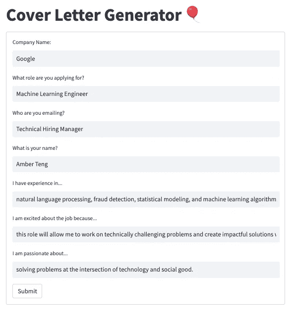
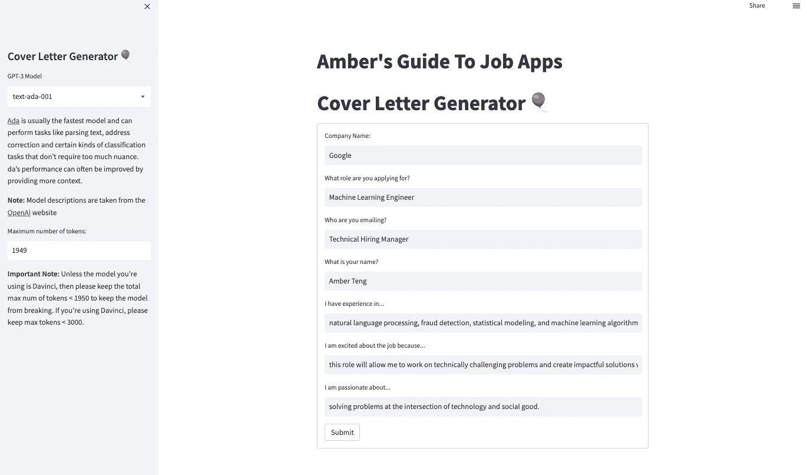

# 使用 Python 和 GPT-3 创建求职信生成器

> 原文：<https://towardsdatascience.com/creating-a-cover-letter-generator-using-python-and-gpt-3-297a6b2a3886>

## 我们可以使用 NLP 来帮助求职者找到更适合的工作吗？


来源:https://unsplash.com/photos/HXOllTSwrpM

随着 2022 年大辞职的临近，越来越多的工人估计也在找工作。[自从新冠肺炎疫情开始以来，已经有创纪录数量的人](https://www.weforum.org/agenda/2022/06/the-great-resignation-is-not-over/)辞职，尽管这一趋势似乎不会很快放缓，但很明显，这场工人革命也需要适当的工具来帮助这些新失业的工人找到更满意的工作。这就是为什么我开始建立一个求职信生成器作为一个快速的周末项目。



求职信生成器应用程序的屏幕截图

申请工作最乏味的部分之一是写求职信。尽管求职者非常想分享他们的技能和经验如何适合某个角色，但为求职者申请的每份工作和每个雇主写多封求职信通常是一种非常紧张和疲惫的经历。有了这个求职信生成器，我使用 [OpenAI](https://openai.com/) 提供的工具和模型创建了一个 web 应用程序，减轻了工作负担，同时仍然允许求职者创建定制的求职信来展示他们的激情和兴奋。

# TLDR:

1.  使用 [GPT-3](https://en.wikipedia.org/wiki/GPT-3) 模型进行文本生成，包括 Curie、Ada、Babbage 和 DaVinci，创建一个 OpenAI 引擎，从给定的提示生成响应。
2.  收集用户生成的输入，包括公司名称、申请的角色、联系人、申请人信息、个人经历、工作描述和热情，以创建定制求职信回复的提示。
3.  使用 S [treamlit](https://streamlit.io/) 将模型部署为 web 应用程序，并允许用户基于计算和时间约束选择模型，以及根据他们申请的角色输入他们的响应。

# 什么是 GPT-3？

在我们开始创建应用程序之前，让我们更深入地了解一下 GPT-3。2021 年的某个时候，OpenAI 的最新型号 GPT-3 在科技界掀起了波澜。然而，这种宣传并非没有风险——来自于对包括数据伦理、模型管理和节制在内的问题的讨论。那么 GPT 3 号到底是什么，是什么让它如此受欢迎？

生成式预训练变压器 3 (GPT-3)是一种深度学习自然语言处理模型，可用于生成“类似人类”的文本，以及其他任务。它还可以用来编写代码、诗歌、故事和其他基于提示的输出。根据他们的论文，OpenAI 的研究人员称 GPT-3 是“*一个具有 1750 亿个参数*的自回归语言模型”，这个规模是任何其他语言模型的十倍。使用这个使用更大的计算能力和更大的数据集训练的大规模模型，研究人员能够在多个 NLP 任务上实现强大的性能，包括机器翻译、问答、单词解读、在句子中使用新单词，甚至执行 3 位数字运算。不过，最值得注意的是，GPT-3 可以用来生成新闻文章样本，人类评估人员一直难以从真正的人写新闻文章中区分和识别这些样本。

更具体地说，GPT-3 是一系列[语言预测模型](https://www.theaidream.com/post/openai-gpt-3-understanding-the-architecture#:~:text=Generative%20Pre%2Dtrained%20Transformer%203,based%20artificial%20intelligence%20research%20laboratory.)——这是一种自回归语言模型，采用深度学习来产生类似人类的文本。简而言之，语言模型使用统计和概率技术来预测特定单词在句子中以给定顺序出现的概率。语言模型的下一个单词预测功能可以应用于包括词性(PoS)标注、机器翻译、文本分类、语音识别、信息检索、新闻文章生成和问题回答等领域。GPT-3 家族中的每个语言模型都包含许多可训练参数，尽管所有这些模型都基于相同的 transformer 架构。围绕 GPT-3 的许多兴奋部分是由于它被训练的巨大语料库——[common crawl](https://commoncrawl.org/)、 [WebText](https://www.webtext.com/) 、维基百科数据以及许多书籍。

# 求职信应用程序概述

我构建求职信生成器的主要考虑因素包括创建一个直观易用的 web 应用程序，它不需要大量信息或繁琐的用户交互。



可以在 https://bit.ly/coverletter_app[网站](https://bit.ly/coverletter_app)上观看该应用的现场版

在当前状态下，web 应用程序允许您输入特定于工作的信息，包括公司、角色、招聘经理和工作描述。它还允许你在简历中加入个人信息，比如你的经历、激情以及对这份工作的兴趣。最后，该应用程序允许你选择使用什么样的 GPT-3 模型，这通常不会对结果产生太大影响，以及使用多少令牌(从用户的角度来看，这可能会影响他们希望自己的求职信有多长)。

我使用 [Streamlit](https://streamlit.io/) 构建了这个应用，并将其部署在 [Streamlit Cloud](https://streamlit.io/cloud) 上。我创建了文本框，用户可以在其中输入关于工作、公司和个人经历的具体信息。然后，我在 Streamlit 界面上添加了一个`submit_button`开关，允许用户根据需要调整 GPT-3 模型。

# 通过 OpenAI 使用 GPT-3 模型

为了开始探索 GPT 3 号，我在 OpenAI 上注册了一个账户。当你开始的时候，OpenAI 会给你一些免费的积分，我发现这些 18 美元的积分足够我的个人周末黑客马拉松应用了。然而，请注意，这些免费积分将在三个月后到期——因此，如果你正在建立一个作品集项目，请确保记住，测试该应用程序的用户只能在你的积分到期时免费使用。

OpenAI 有一个强大的“[入门](https://beta.openai.com/docs/introduction/overview)”指南，介绍了 GPT-3 可以完成的关键概念和潜在任务。也就是说，OpenAI API 允许用户使用 GPT 3 完成几乎任何涉及理解或创建自然语言(和代码，目前处于测试阶段)的任务。

## 用户可以访问四种主要的 OpenAI GPT-3 模型:

1.  Ada - " [能够完成非常简单的任务，通常是 GPT-3 系列中最快的型号，成本最低。](https://beta.openai.com/docs/models/gpt-3)”
2.  巴贝奇- " [能够直接完成任务，速度非常快，成本较低。](https://beta.openai.com/docs/models/gpt-3)”
3.  达芬奇- " [最有能力的 GPT-3 型号。可以完成其他模型可以完成的任何任务，通常需要更少的环境](https://beta.openai.com/docs/models/gpt-3)。除了响应提示之外，还支持在文本中插入[完成。](https://beta.openai.com/docs/guides/completion/inserting-text)
4.  居里- " [很有能力，但比达芬奇更快，成本更低。](https://beta.openai.com/docs/models/gpt-3)

我用来制作求职信的提示如下:

Streamlit + GPT 用户输入代码。回购可以在[这里](https://github.com/angelaaaateng/job_app_tool)查看

因此，一个示例提示如下所示:

```
Cover Letter PromptWrite a cover letter to Technical Hiring Manager from Amber Teng for a Machine Learning Engineer job at Google. I have experience in natural language processing, fraud detection, statistical modeling, and machine learning algorithms. I am excited about the job because this role will allow me to work on technically challenging problems and create impactful solutions while working with an innovative team. I am passionate about solving problems at the intersection of technology and social good.
```

自动生成的随函回复看起来会像这样:

```
Auto-Generated Cover LetterDear Technical Hiring Manager,I am writing to apply for the Machine Learning Engineer job at Google. I have experience in natural language processing, fraud detection, statistical modeling, and machine learning algorithms. I am excited about the job because this role will allow me to work on technically challenging problems and create impactful solutions while working with an innovative team. I am passionate about solving problems at the intersection of technology and social good.I believe that my skills and experience make me a perfect fit for this job. I am confident that I can be an asset to the team and contribute to the success of Google.Thank you for your time and consideration.Sincerely,Amber Teng
```

虽然求职信的文本还不完美，而且在这一点上还需要一些输入，但我很兴奋地看到，根据我的几个读过这封信的朋友所说，它将能够作为一封由人写的“合法的”求职信。

# 后续步骤

我想在未来探索一些扩展这个应用程序的方法，包括:

*   为用户创建一个选项，输入他们简历的 PDF 文件，以便他们可以自动上传他们的工作经验和当前技能
*   添加一个 html 阅读器或网站上传按钮，允许用户自动包含职位描述和公司信息——该功能最好使用 Selenium 来收集职位描述、职位或角色以及公司名称
*   微调“好”简历上的各种 GPT-3 模型，这些简历由申请相同工作的人类或数据科学家创建，并由人类“专家”或注释者审查

简化应用程序代码

> ***测试 live app*** [***此处***](https://bit.ly/coverletter_app) ***请务必通过*** [***邮箱***](mailto:at2507@nyu.edu) ***报告任何 bug 或建议。***
> 
> 通过 [LinkedIn](https://www.linkedin.com/in/angelavteng/) 或 [Twitter](https://twitter.com/ambervteng) 与我联系。
> 
> 跟着我上[中型](https://medium.com/@angelamarieteng)。

# 参考资料:

*   [*https://www . weforum . org/agenda/2022/06/the-great-deficiency-is-not-over/*](https://www.weforum.org/agenda/2022/06/the-great-resignation-is-not-over/)
*   [*https://www . springboard . com/blog/data-science/machine-learning-GPT-3-open-ai/*](https://www.springboard.com/blog/data-science/machine-learning-gpt-3-open-ai/)
*   [https://arxiv.org/pdf/2005.14165.pdf](https://arxiv.org/pdf/2005.14165.pdf)
*   [https://www . techtarget . com/search enterprise ai/definition/GPT-3](https://www.techtarget.com/searchenterpriseai/definition/GPT-3)
*   [https://www . the aidream . com/post/open ai-GPT-3-understanding-the-architecture #:~:text = Generative % 20 pre % 2d trained % 20 transformer % 203，based % 20 artificial % 20 intelligence % 20 research % 20 laboratory](https://www.theaidream.com/post/openai-gpt-3-understanding-the-architecture#:~:text=Generative%20Pre%2Dtrained%20Transformer%203,based%20artificial%20intelligence%20research%20laboratory)。

**注意:如果 streamlit 应用程序停止工作，这很不幸，因为我用完了 OpenAI 信用，因为该应用程序直接连接到我的 API 密钥。**