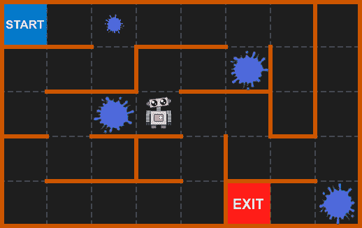
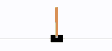
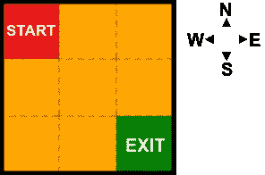
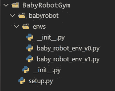
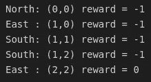

# 为 Jupyter 笔记本电脑创建定制的健身房环境

> 原文：<https://towardsdatascience.com/creating-a-custom-gym-environment-for-jupyter-notebooks-e17024474617>

## [婴儿机器人强化学习指南](https://towardsdatascience.com/tagged/baby-robot-guide)

## 第 1 部分:创建框架



[所有图片由作者提供]

> 【2023 年 1 月 3 日更新:
> 
> 用于强化学习的开放 AI 健身房库的开发已经停止，它是本文最初描述的基础框架。现在已经被 [**体育馆**](https://github.com/Farama-Foundation/Gymnasium) 所取代，这是一个由[法拉马基金会](https://farama.org/Announcing-The-Farama-Foundation)管理的新项目包。
> 
> 在大多数情况下，这个新框架与原来的框架保持一致，但是 API 有一些细微的变化。因此，本文及其附带的代码示例已经更新，以考虑这些变化并利用这个最新的框架。
> 
> 因此，尽管框架仍然被称为“体育馆”，但这实际上意味着新的“体育馆”版本的库。

# **概述**

本文(分两部分)描述了为**强化学习** ( *RL* )问题创建一个自定义[***open ai Gym***](https://gymnasium.farama.org/)环境。

已经有相当多的教程展示了如何创建一个定制的 *Gym* 环境(参见 [*References*](#4bd3) 部分获得一些好的链接)。在所有这些例子中，实际上在最常见的 *Gym* 环境中，这些产生基于文本的输出(例如 [*Frozenlake*](https://gymnasium.farama.org/environments/toy_text/frozen_lake/) )或者出现在单独的图形窗口中的基于图像的输出(例如 [*月球着陆器*](https://gymnasium.farama.org/environments/box2d/lunar_lander/) )。

相反，我们将创建一个自定义环境，在 *Jupyter* *笔记本*中生成其输出。环境的图形表示将直接写入笔记本电脑单元，并实时更新。此外，它可以在任何测试框架中使用，并且具有任何 *RL* 算法，这也实现了 *Gym* 接口。

到本文结束时，我们将创建一个定制的*健身房*环境，可以定制该环境以生成一系列不同的网格世界供*婴儿机器人*探索，并呈现类似于上面显示的封面图像的输出。

# 密码

> *相关* [**Jupyter 笔记本**](https://github.com/WhatIThinkAbout/BabyRobotGym/blob/main/notebooks/Part%201%20-%20Creating%20the%20framework.ipynb) *本文可在*[**Github**](https://github.com/WhatIThinkAbout/BabyRobotGym)*上找到。这包含设置和运行下面描述的*婴儿机器人定制健身房环境*所需的所有代码。*


# 介绍

到目前为止，在我们关于强化学习的 [***系列***](https://towardsdatascience.com/tagged/baby-robot-guide) ( *RL* )中，我们已经使用定制的环境来表示机器人宝宝找到自己的位置。从一个简单的网格世界开始，我们添加了一些组件，比如墙和水坑，以增加机器人宝宝面临的挑战的复杂性。

既然我们知道了 *RL* 的基础知识，在我们进入更复杂的问题和算法之前，似乎是时候正式确定*婴儿机器人的*环境了。如果我们给这个环境一个固定的、已定义的接口，那么我们可以在我们所有的问题中重用同一个环境，并使用多个 *RL* 算法。这将使事情变得简单得多，因为我们将向前看不同的 *RL* 方法。

通过采用一个公共接口，我们可以将这个环境放入任何实现相同接口的现有系统中。我们需要做的就是决定我们应该使用什么接口。幸运的是，我们已经做到了这一点，它被称为 **OpenAI Gym** 接口。

## OpenAI 健身房简介

[*OpenAI Gym*](https://gymnasium.farama.org/content/basic_usage/) 是一套*强化学习(RL)* 环境，问题范围从简单的网格世界到复杂的物理引擎。

这些环境中的每一个都实现了相同的接口，使得使用一系列不同的 *RL* 算法测试单个环境变得容易。类似地，它使得在一系列不同的问题上评估单个 *RL* 算法变得简单明了。

因此， *OpenAI Gym* 已经成为*事实上的*学习和基准测试 *RL* 算法的标准。

## 开放式健身界面

所有 *OpenAI Gym* 环境的界面可以分为 3 个部分:

1.**初始化**:创建并初始化环境。

2.**执行**:在环境中采取重复动作。在每一步，环境提供信息来描述它的新状态和作为采取特定行动的结果而收到的奖励。这种情况一直持续到环境发出情节结束的信号。

3.**终止**:清理破坏环境。

## ***举例:翻车环境***

健身房中一个比较简单的问题是 [*翻跟斗*](https://gymnasium.farama.org/environments/classic_control/cart_pole/) 的环境。在这个问题中，我们的目标是向左或向右移动手推车，这样手推车上的平衡杆就会保持直立。



图 CartPole 环境的输出——目标是通过向左或向右移动小车来平衡杆子。

设置和运行这个健身房环境的代码如下所示。这里我们只是随机选择向左或向右的动作，所以杆子不会停留很长时间！

清单 1:运行健身房环境的 3 个阶段。

在上面的*清单 1* 中，我们标记了健身房环境的 3 个阶段。更详细地说，其中每个都执行以下操作:

**1。初始化**

```
env = gym.make(‘CartPole-v1’, render_mode='human')
```

*   创建所需的环境，在本例中是版本' *0* '的 *CartPole* 。然后可以使用返回的环境对象' *env* '来调用公共 Gym 环境接口中的函数。
*   “render_mode”参数定义了调用“render”函数时环境应该如何显示。在这种情况下,“人”被用来连续地将环境渲染到显示窗口中。

```
obs = env.reset()
```

*   在每集开始时调用，这将环境置于其开始状态，并返回环境的初始观察结果。

**2。执行**

这里我们一直运行，直到环境' *done* '标志被置位，表示剧集完成。如果代理已经达到终止状态或者已经执行了固定数量的步骤，就会发生这种情况。

```
env.render()
```

*   画出环境的当前状态。在 *CartPole* 的情况下，这将导致一个新窗口打开，显示购物车及其杆的图形视图。在更简单的环境中，例如 [*FrozenLake*](https://gymnasium.farama.org/environments/toy_text/frozen_lake/) 简单网格世界，显示文本表示。

```
action = env.action_space.sample()
```

*   从环境的一组可能操作中选择一个随机操作。

```
observation, reward, terminated, truncated, info = env.step(action)
```

采取行动，并从环境中获取有关该行动结果的信息。

这包括 4 条信息:

*   “观察”:定义环境的新状态。在*磁极*的情况下，这是关于磁极的位置和速度的信息。在网格世界的环境中，它将是关于下一个状态的信息，也就是我们采取行动后的最终状态。
*   *奖励*’:因采取行动而获得的奖励金额(如果有)。
*   *终止*’:一个标志，表示我们是否已经到达该集的结尾
*   *truncated*’:一个标志，表示剧集在完成前是否已经停止。
*   *信息*’:任何附加信息。一般来说，这是不成立的。

> **注意** :
> 在早期版本的健身房环境中,“终止”和“截断”标志由一个“完成”标志表示。现在这已经被一分为二，使得这一集结束的原因更加清晰(更多信息参见'[步骤](https://gymnasium.farama.org/api/env/#gymnasium.Env.step)'函数的 API 文档)。

**3。终止**

```
env.close()
```

*   终止环境。这也将关闭任何由渲染功能创建的图形窗口。

# 创造一个定制的健身房环境

如前所述，使用 *OpenAI Gym* 的主要优势是每个环境都使用完全相同的界面。我们可以将上面的' *gym.make* '行中的环境名字符串' *CartPole-v1* '替换为任何其他环境的名称，其余的代码可以保持不变。

对于任何实现 Gym 接口的定制环境也是如此。所需要的是一个从体育馆环境继承的类，它增加了上面描述的一组功能。

下面显示了我们将要创建的自定义' *BabyRobotEnv* '的初始框架(类名后面的' *_v0* '表示这是我们环境的零版本)。随着功能的增加，我们将对此进行更新):

在这个自定义环境的基本框架中，我们从 base ' gym 继承了我们的类。Env '类，它为我们提供了创建环境所需的所有主要功能。在此基础上，我们添加了将该类转变为我们自己的定制环境所需的 4 个函数:

*   *__init__* ':类初始化，在这里我们可以设置类需要的任何东西
*   *步骤*:实现当婴儿机器人在环境中迈出一步时发生的事情，并返回描述迈出这一步的结果的信息。
*   重置':在每集开始时调用，将环境恢复到初始状态。
*   *render*’:提供基于图形或文本的环境表示，让用户看到事情进展如何。

我们还没有实现一个' *close* '函数，因为目前没有要关闭的东西，所以我们可以依靠基类来完成任何需要的清理。此外，我们还没有添加任何功能。我们的类满足了 Gym 接口的需求，并且可以在 Gym 测试工具中使用，但是它目前不会做太多！

# 行动和观察空间

上面的代码定义了一个定制环境的框架，但是它还不能运行，因为它目前没有' ***action_space*** '来对随机动作进行采样。‘***action _ space***’定义了代理在环境中可以采取的一组动作。这些可以是离散的、连续的或两者的组合。

*   ***离散动作*** 表示一组互斥的可能动作，例如*横翻*环境中的左右动作。在任何时间步长，您可以选择向左或向右，但不能同时选择两者。
*   ***连续动作*** 是有关联值的动作，表示该动作要进行的量。例如，当转动方向盘时，可以指定一个角度来表示方向盘应该转动多少。

我们正在创建的*婴儿机器人*环境被称为*网格世界*。换句话说，这是一个正方形网格，机器人宝宝可以在其中移动，从一个正方形到另一个正方形，探索和导航环境。这个环境中的默认级别是一个 3 x 3 的网格，起点在左上角，出口在右下角，如图 2 所示:



图 2:婴儿机器人环境中的默认级别。

因此，对于我们正在创建的自定义 *BabyRobotEnv* ，只有 4 种可能的移动动作:*北、南、东*或*西*。此外，我们将添加一个'*停留*动作，婴儿机器人保持在当前位置。因此，我们总共有 5 个互斥的动作，因此我们设置动作空间来定义 5 个离散值:

```
self.action_space **=** gym.spaces.Discrete(5)
```

除了一个 *action_space，*所有环境都需要指定一个'***observation _ space '***。这定义了当代理接收到关于环境的观察时提供给它的信息。

当*婴儿机器人*在环境中迈出一步时，我们想要返回他的新位置。因此，我们将定义一个观察空间，将网格位置指定为' *x* 和' *y* '坐标。

健身房界面定义了几个不同的' [***空格***](https://gymnasium.farama.org/api/spaces/#spaces) '可以用来指定我们的坐标。例如，如果我们的坐标在连续的地方，浮点值我们可以用 [*框空格*](https://gymnasium.farama.org/api/spaces/fundamental/#box) *。*这也将让我们对可用于“ *x* ”和“ *y* ”坐标的值的可能范围进行限制。此外，我们可以使用 [*Gym 的字典空间*](https://gymnasium.farama.org/api/spaces/composite/#dict) 将这些组合起来，形成环境观察空间的单一表达。

然而，由于我们只允许从一个方块整体移动到下一个方块(而不是在两个方块之间移动一半)，我们将用整数指定网格坐标。因此，与动作空间一样，我们将使用一组离散的值。但是现在，不是只有一个离散值，而是有两个:分别对应“ *x* 和“ *y* ”坐标。幸运的是，Gym 界面正好有这个东西，即[](https://gymnasium.farama.org/api/spaces/fundamental/#multidiscrete)*。*

*在水平方向上，最大' *x* '位置由网格的宽度限定，在垂直' *y* '方向上由网格的高度限定。因此，观察空间可以定义如下:*

```
*self.observation_space = MultiDiscrete([ self.width, self.height ])*
```

*离散空间是从零开始的，所以我们的坐标值将从零到比定义的最大值小 1。*

*有了这些改变后， *BabyRobotEnv* 类的新版本如下所示:*

*关于新版本的 *BabyRobotEnv* 类，有几点需要注意:*

*   *我们向 ***init*** 函数提供了一个 ***kwargs*** 参数，让我们用一个参数字典创建我们的实例。在这里，我们将提供我们想要制作的网格的宽度和高度，但是接下来我们可以使用它来传递其他参数，并且通过使用 ***kwargs*** 我们可以避免更改类的接口。*
*   *当我们从 ***kwargs、*** 中获取宽度和高度时，如果没有提供参数，那么在这两种情况下我们都将默认值设为 3。因此，如果在创建环境的过程中没有提供参数，我们将得到一个大小为 3x3 的网格。*
*   *我们现在已经使用' *self.x* 和' *self.y* '定义了婴儿机器人在网格中的位置，我们现在从' *reset'* 和' *step'* 函数返回该位置。在这两种情况下，我们都将这些值转换成了 numpy 数组，虽然不需要匹配 Gym 接口，但是 Gym 环境检查器需要它，这将在下一节中介绍。*

# *测试自定义环境*

*在我们开始添加任何真正的功能之前，有必要确认我们的新环境符合 *Gym* 接口。为了测试这一点，我们可以使用 [*体育馆环境检查器*](https://gymnasium.farama.org/api/utils/#environment-checking) *来验证我们的类。**

*该测试不仅测试我们已经实现了 *Gym* 接口所需的功能，还检查了动作和观察空间是否设置正确，以及功能响应是否与相关的观察空间匹配。*

*要运行检查，只需创建一个环境实例，并将其提供给' *check_env* '函数。如果有任何问题，将会显示警告信息。如果没有输出，那么一切都很好。*

*我们还可以看看环境的*动作*和*观察*空间，以确保它们返回预期值:*

```
*print(f”Action Space: {env.action_space}”)
print(f”Action Space Sample: {env.action_space.sample()}”)*
```

*应该会产生类似于以下内容的输出:*

**动作空间:离散(5)
动作空间样本:3**

*   *正如所料，动作空间是一个具有 5 个可能值的离散空间。*
*   *从动作空间采样的值将是 0 和 4 之间的随机值。*

*对于观察空间:*

```
*print(f"Observation Space: {env.observation_space}")
print(f"Observation Space Sample: {env.observation_space.sample()}")*
```

*应该会产生类似于以下内容的输出:*

**观察空间:多离散([3 ^ 3])
观察空间样本:[0 ^ 2]**

*   *观察空间有一个*多离散*类型，它的两个组成部分各有 3 个可能的值(因为我们创建了一个默认的 3×3 网格)。*
*   *从该网格的观察空间采样时，' *x* '和' *y* '都可以取值 0、1 或 2。*

# *创造环境*

*您可能已经注意到，在上面的测试中，我们没有像对 *CartPole* 那样使用‘*gym . make*创建环境，而是通过执行以下操作简单地创建了它的一个实例:*

```
*env = BabyRobotEnv_v1()*
```

*当我们自己处理环境时，这绝对没问题，但是如果我们想要将我们的自定义环境注册为一个合适的 *Gym* 环境，可以使用' *gym.make* '来创建，那么我们需要采取一些进一步的步骤。*

*首先，从 [*Gym 文档*](https://gymnasium.farama.org/tutorials/environment_creation/) 中，我们需要用如下所示的结构设置我们的文件和目录:*

**

*图 3:定制健身房环境的目录结构。*

*因此，我们需要 3 个目录:*

1.  *主目录(在本例中为' *BabyRobotGym* ')保存我们的' *setup.py* '文件。这个文件定义了项目目录的名称，并引用了所需的资源，在本例中就是‘g*ymnasium*库。该文件的内容如下所示:*

*2.项目目录，与设置文件的' *name* '参数同名。因此，在这种情况下，目录名为' *babyrobot* '。这包含一个文件' *__init.py__* '，它定义了环境的可用版本:*

*3.主功能所在的' *envs* '目录。在我们的例子中，它包含了我们上面定义的两个版本的婴儿机器人环境(“ *baby_robot_env_v0.py* ”和“ *baby_robot_env_v1.py* ”)。这些定义了' *babyrobot/__init__ 中引用的两个类。py'* 文件。*

*此外，该目录包含自己的' *__init__。引用目录中包含的两个文件的 py* 文件:*

*我们现在已经定义了一个 Python 包，它可以上传到一个资源库，比如 [*PyPi*](https://pypi.org/) ，以便于分享你的新作品。此外，有了这个结构，我们现在可以导入我们的新环境，并使用' *gym.make'* 方法创建它，就像我们之前对 *CartPole* 所做的那样:*

```
*import babyrobot# create an instance of our custom environment
env = gym.make(‘BabyRobotEnv-v1’)*
```

*请注意，用于指定环境的名称是用于注册环境的名称，而不是类名。所以，在这种情况下，虽然类名为' *BabyRobotEnv_v1* '，但注册名实际上是 *'BabyRobotEnv-v1'* 。*

## ***克隆 Github 库***

*为了更容易检查上面描述的目录结构，可以通过克隆[***BabyRobotGym Github***](https://github.com/WhatIThinkAbout/BabyRobotGym)*存储库来重新创建它。完成此操作的步骤如下:**

****1。获取代码并移动到新创建的目录:****

```
**git clone [https://github.com/WhatIThinkAbout/BabyRobotGym.git](https://github.com/WhatIThinkAbout/BabyRobotGym.git)
cd BabyRobotGym**
```

*   **这个目录包含我们上面定义的文件和文件夹结构(加上一些我们将在第 2 部分中看到的额外的文件和文件夹)。**

****2。创建一个 Conda 环境并安装所需的包:****

**为了能够运行我们的环境，我们需要安装一些其他的包，最明显的是' *Gym* 本身。为了方便设置环境，Github repo 包含了几个'*。列出所需软件包的 yml* 文件。**

**要使用这些创建一个 *Conda* 环境并安装软件包，请执行以下操作(选择适合您的操作系统的一个):**

***在 Unix 上:***

```
**conda env create -f environment_unix.yml**
```

***在 Windows 上:***

```
**conda env create -f environment_windows.yml**
```

****3。激活环境:****

**我们已经创建了包含所有必需包的环境，所以现在只需要激活它，如下所示:**

```
**conda activate BabyRobotGym**
```

**(当你玩完这个环境后，运行" *conda deactivate* "退出)**

****4。运行笔记本****

**现在，运行自定义健身房环境的一切都应该就绪了。为了测试这一点，我们可以运行资源库中包含的示例 Jupyter 笔记本'*baby _ robot _ gym _ test . ipynb*'。这将加载' *BabyRobotEnv-v1* '环境，并使用 Gymnasium 环境检查器对其进行测试。**

**要在浏览器中启动，只需键入:**

```
**jupyter notebook baby_robot_gym_test.ipynb**
```

**或者在 VS 代码中打开这个文件，确保选择' *BabyRobotGym* '作为内核。这将创建' *BabyRobotEnv-v1* '环境，在*稳定基线*中测试它，然后运行环境直到它完成，这恰好发生在一个单独的步骤中，因为我们还没有编写'*步骤*'函数！**

# **添加操作**

**尽管定制环境的当前版本满足了 Gym 界面的要求，并且具有通过环境检查器测试所需的功能，但是它还没有做任何事情。我们希望机器人宝宝能够在他的环境中活动，为此我们需要他能够采取一些行动。**

**由于机器人宝宝将在一个简单的网格世界环境中工作(见上图 2)，他可以采取的行动将被限制在向北、向南、向东或向西移动。此外，我们希望他能够留在同一个地方，如果这将是最佳的行动。因此，我们总共有 5 种可能的行动(正如我们在行动空间中已经看到的)。**

**这可以用 Python 整数枚举来描述:**

**为了简化代码，我们可以从之前的' *BabyRobotEnv_v1* '类继承。这为我们提供了所有以前的功能和行为，然后我们可以扩展它们来添加与动作相关的新部分。如下所示:**

**添加到类中的新功能具有以下功能:**

*   **在'*_ _ init _ _【T3]'功能中，可以提供关键字参数，用于指定环境中的开始和结束位置以及婴儿机器人的开始位置(默认设置为网格的开始位置)。***
*   **“ *take_action* ”功能通过应用所提供的动作简单地更新机器人宝宝的当前位置，然后检查新位置是否有效(以防止他离开网格)。**
*   **'*步骤*'函数应用当前动作，然后获得新的观察和奖励，然后返回给调用者。默认情况下，每次移动返回-1 的奖励，除非机器人宝宝已经到达终点位置，在这种情况下，奖励设置为零，并且“*终止*标志设置为真。**
*   **函数' *render* '打印出当前位置和奖励。**

**所以，最后，我们现在可以采取行动，从一个细胞移动到下一个细胞。然后我们可以使用上面清单 1 的 [*的修改版本(从使用 *CartPole* 改为使用我们最新的 *BabyRobot_v2* 环境)来选择随机动作并在网格中移动，直到*婴儿机器人*到达被指定为网格出口的单元格(默认情况下是单元格(2，2))。*](#397c)**

*我们新环境的测试框架如下所示:*

*当我们运行这个程序时，我们会得到一个类似如下所示的输出。*

**

*图 4:从起始单元格(0，0)到出口单元格(2，2)的网格路径示例。*

*在这种情况下，通过网格的路径非常短，从起点方块(0，0)移动到出口方块(2，2)只需几步。由于随机选择动作，路径通常会更长。还要注意，在到达出口之前，每一步都会得到-1 的奖励。所以机器人宝宝到达出口的时间越长，返回值越负。*

# *创建渲染函数*

*技术上我们已经创建了渲染功能，只是它不是很令人兴奋！如*图 4* 所示，我们得到的都是描述行动、位置和奖励的简单短信。我们真正想要的是环境的图形化表示，显示机器人宝宝在网格世界中移动。*

*如上所述，体育馆库中的环境集合通过生成基于文本的表示或者通过创建包含图像的数组来执行它们的渲染，以显示环境的当前状态。*

*基于文本的表示提供了一种在基于终端的应用程序中渲染环境的快速方法。当您只需要当前状态的简单概述时，它们是理想的。*

*另一方面，图像给出了当前状态的非常详细的画面，非常适合创建一集的视频，以便在该集结束后显示。*

*虽然这两种表现都很有用，但在 *Jupyter 笔记本*中工作时，它们都不太适合创建实时、详细的环境状态视图。当机器人宝宝在一个网格水平上移动时，我们希望实际看到他在移动，而不仅仅是收到一条描述他位置的短信，或者看一幅简单的文字画，上面有一个“ *X* ”在一个点网格上移动。*

*此外，我们希望随着剧集的展开看到这种情况的发生，而不仅仅是能够在之后观看，或者在闪烁的显示屏上实时看到。简而言之，我们希望使用不同的方法来呈现文本字符或图像数组。我们可以通过使用优秀的 [*ipycanvas*](https://ipycanvas.readthedocs.io/en/latest/) 库在 HTML5 画布上绘图来实现这一点，我们将在第 2 部分中对此进行全面介绍。*

# *摘要*

****OpenAI Gym*** 环境是测试*强化学习*算法的标准方法。基本系列带来了一大堆不同的、具有挑战性的问题。但是，在许多情况下，您可能想要定义自己的自定义环境。通过实现 *Gym* 环境的结构和接口，很容易创建这样一个环境，它将无缝地嵌入到任何使用 *Gym* 接口的应用程序中。*

*总之，创建自定义健身房环境的主要步骤如下:*

*   *创建一个从 *env 继承的类。健身房*基地班。*
*   *实现' *reset '、' step'* 和' *render'* 函数(如果需要整理资源，可能还有' *close'* 函数)。*
*   *定义 ***动作空间*** ，指定环境允许的动作数量和类型。*
*   *定义 ***观察空间*** *，* 来描述在每一步上提供给代理的信息，并设置环境内的移动边界。*
*   *组织目录结构，添加' *__init__。py* 和' *setup.py* '文件，以匹配 *Gym* 规范，并使环境与 *Gym* 框架兼容。*

*遵循这些步骤将为您提供一个基本框架，您可以从这个框架开始添加您自己的定制特性，以针对您自己的特定问题定制环境。*

*在我们的例子中，我们想要创建一个婴儿机器人可以探索的网格世界环境。此外，我们希望能够图形化地查看这个环境，并观察机器人宝宝在周围移动。在第二部分 中，我们将看到这是如何实现的。*

*[](/creating-a-custom-gym-environment-for-jupyter-notebooks-e8718f36547b) * **

# *参考资料:*

1.  *体育馆图书馆:*

*[](https://gymnasium.farama.org/)  

而完整系列的婴儿机器人强化学习指南可以在 [***这里***](https://towardsdatascience.com/tagged/baby-robot-guide) …

[](/state-values-and-policy-evaluation-ceefdd8c2369) *