# 为 Jupyter 笔记本电脑创建定制的健身房环境

> 原文：<https://towardsdatascience.com/creating-a-custom-gym-environment-for-jupyter-notebooks-e8718f36547b>

## [婴儿机器人强化学习指南](https://towardsdatascience.com/tagged/baby-robot-guide)

## 第 2 部分:呈现 Jupyter 笔记本单元格

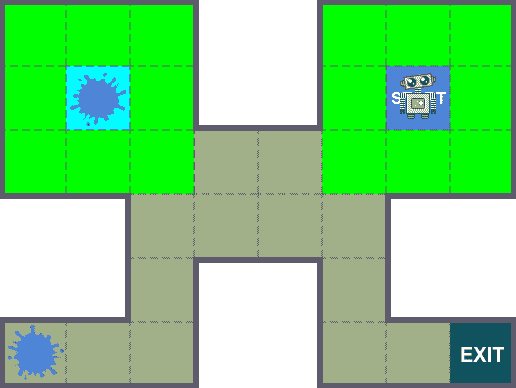

所有图片由作者提供。

> 【2023 年 1 月 7 日更新:
> 
> 用于强化学习的开放 AI 健身房库的开发已经停止，它是本文最初描述的基础框架。现在已经被 [**体育馆**](https://github.com/Farama-Foundation/Gymnasium) 所取代，这是一个由[法拉马基金会](https://farama.org/Announcing-The-Farama-Foundation)管理的新项目包。
> 
> 在大多数情况下，这个新框架与原来的框架保持一致，但是 API 有一些细微的变化。因此，本文及其附带的代码示例已经更新，以考虑这些变化并利用这个最新的框架。
> 
> 因此，尽管框架仍然被称为“体育馆”，但这实际上意味着新的“体育馆”版本的库。

# 介绍

在 [**第一部分**](/creating-a-custom-gym-environment-for-jupyter-notebooks-e17024474617) 中，我们看到了如何为**强化学习** ( *RL* )问题创建一个定制的 Gym 环境，只需扩展 Gym 基类并实现一些功能。然而，我们最终得到的定制环境有点简单，只有简单的文本输出。

因此，在这一部分，我们将通过添加图形渲染来扩展这个简单的环境。此外，该渲染输出将明确针对 *Jupyter 笔记本*，直接在笔记本单元中生成环境的图形表示。


> 这篇文章的所有相关代码都可以在 Github 上找到。此外，我们创建的自定义**婴儿机器人健身房环境**可以通过运行 **pip install babyrobot** 来安装，您可以在附带的 [API 笔记本](https://github.com/WhatIThinkAbout/BabyRobotGym/blob/9b28be6e32d9b40ad6bc201509a4be4283618510/notebooks/Part%202%20-%20Rendering%20to%20Jupyter%20Notebook%C2%A0Cells.ipynb)中玩这个。
> 
> 同样，这篇文章的交互式版本可以在 [**笔记本**](https://github.com/WhatIThinkAbout/BabyRobotGym/blob/main/notebooks/Part%202%20-%20Rendering%20to%20Jupyter%20Notebook%C2%A0Cells.ipynb) 中找到，在那里你可以实际运行下面描述的所有代码片段。

# ipycanvas 库简介

在 *Jupyter* *笔记本*中运行强化学习问题时，很容易在笔记本单元格中写入文本来显示事情的进展情况。然而，考虑到随着时间的推移会产生大量的信息，通过创建环境的图形视图可以获得更清晰的表示。

通常，这种图形视图是通过在每个时间步拍摄环境的快照图像，然后在一集结束时将这些图像结合在一起，以创建一部短片。然后可以在笔记本上回放，看看事情进展如何。

这种方法的缺点是您需要等待电影被创建。理想情况下，我们希望实时看到我们环境中发生的变化。我们需要一些可以添加到笔记本单元格中的东西，然后随着动作的发生被绘制和更新。

这个确切的功能可以使用 [***HTML 画布元素***](https://developer.mozilla.org/en-US/docs/Web/API/Canvas_API) 来实现，该元素可以使用优秀的[***ipycanvas***](https://ipycanvas.readthedocs.io/en/latest/)库在 *Jupyter 笔记本*中访问。

## 示例:

我们首先需要创建我们的 ***婴儿机器人网格世界*** ，也就是实际的“世界”，所有的动作都发生在那里。最基本的，这只是一个彩色的矩形。这可以在 *ipycanvas* 中非常容易地创建，只需定义一个画布，然后指定要绘制的矩形的大小和颜色:

在上面的代码中，我们已经导入了 *ipycanvas* 库，然后定义了我们将要创建的网格世界的维度。这将是一个 3x3 的网格，其中每个单元是一个 64 像素的正方形。使用这些尺寸，我们可以创建我们的画布。

最初画布是空白的，所以要真正看到画布，我们需要画一些东西。在上面显示的' *draw_base* '函数中，填充颜色设置为橙色，然后用它来绘制一个覆盖整个画布区域的矩形。

调用这个函数后，最后一行， *canvas* ，只是将完成的画布绘制到笔记本单元格中，如下图*图 1* 所示。这个正方形将作为我们网格世界的基础。相当刺激！


图 1:基本的画布世界。

**添加网格**

任何自尊的网格世界都需要一个真正的网格。同样，这可以通过在 *ipycanvas* 中画几条虚线来轻松实现:

这里我们定义了一个函数，它设置画布属性来绘制一条 1 像素宽的灰色虚线。然后，我们简单地为网格中的每个单元格绘制一个矩形，这给出了如图 2 所示的输出:

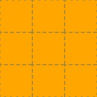

图 2:基本的网格世界。

**添加边框**

我们可以通过在外部添加边框来改善网格世界的外观。这只是一个黑色矩形，线条比网格略粗，在' *draw_border* '函数中定义。这会产生如下所示的输出:

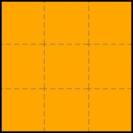

图 3:添加了边框的网格世界。

**添加动画图像**

我们的*婴儿机器人网格世界*最后需要的是一个*婴儿机器人*，最好是会动的！因为我们希望我们的机器人在网格层的顶部移动，而不损坏我们已经绘制的任何东西，所以我们将为我们的机器人动画使用单独的画布。

使用 ***MultiCanvas*** 元素很容易做到这一点。有了它，我们可以堆叠任意多的画布，并分别绘制每一张，从而构建出完整的环境。如下图所示，我们定义了 *MultiCanvas* 有两层，然后使用上面的函数在第一层(层索引 0)上重建网格世界。

最后，我们可以加载我们的婴儿机器人图像，并创建一个非常简单的动画，将我们的动画绘制到上层画布上(index = 1)。

为了让机器人宝宝在屏幕上移动，我们使用了一个简单的循环，在绘制下一幅图像之前清除上一幅图像。由于图像上有一些填充，我们可以简单地清除想要绘制新图像的区域。这两个操作都使用' *hold_canvas* 绑定在一起，这使得事情稍微顺畅一些(对于更高级的动画，请查看 ipycanvas 文档 )。

最终的*婴儿机器人网格世界*如下图*图 4* 所示:

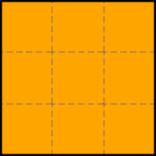

图 4。网格世界中的婴儿机器人。

# 创建图形网格级别

使用 *ipycanvas* 库和上面描述的基本绘图例程，我们可以创建封装了为我们的定制健身房环境绘制图形网格级别所需的所有功能的类。

作为其中的一部分，我们有两个主要的类:

*   ***网格级*** :管理网格级的绘制和查询。
*   ***RobotDraw*** :将机器人宝宝绘制到网格上的特定位置，并在他在单元格之间移动时制作动画。

这两个类的完整代码可以在 [*Github*](https://github.com/WhatIThinkAbout/BabyRobotGym/tree/main/babyrobot/envs/lib) 上找到。

在下面的代码中，我们导入这两个类，然后用它们绘制一个默认的 3x3 网格级别，我们在上面添加婴儿机器人，定位在单元格[1，1]。

我们在 *Jupyter 笔记本*单元中得到的输出显示在下面的*图 5* 中。这给了我们一个默认的*婴儿机器人*网格世界级别，我们可以用它来为我们的健身房环境创建图形渲染功能。

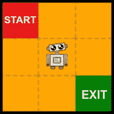

图 5:一个默认的婴儿机器人网格世界水平。

# 创建一个图形化体育馆渲染函数

在创建自定义健身房环境的第一部分结束时，我们用一个渲染函数完成了这个过程:


图 BabyRobotEnv 的“render”函数版本 2 的输出。

虽然提供了关于环境当前状态的所有重要信息，但这并不令人兴奋。此外，很难想象这一集是如何发展的。通过查看每个时间点的坐标，你可以想象出*机器人宝宝*是如何在网格中移动的，但是如果我们真的能看到这种情况发生，事情会更清楚。

正如我们所见，可以使用 *ipycanvas* 在 *Jupyter Notebook* 单元中创建实时图形，因此我们可以用一个显示环境图形视图的函数来替换当前基于文本的渲染函数，并在发生变化时更新它。如下所示:

正如我们之前所做的，新类继承了环境的前一版本(在本例中是从 *BabyRobotEnv_v2* 继承的)，这为我们提供了 *Gym* 基类的所有功能，以及我们在之前的迭代中添加的额外内容。然后，我们只需要提供我们想要替换的函数的新版本，在本例中如下所示:

*   ***__init__*** :包含我们分别绘制网格和*婴儿机器人*所需的“ *GridLevel* ”和“ *RobotDraw* ”类的实例。
*   ***复位*** :将*婴儿机器人*和环境都放回初始位置。
*   ***渲染*** :将*婴儿机器人*移动到新的位置(该位置已经在*健身房*界面的’*步骤*函数中计算过，在 *BabyRobotEnv_v2)* 中定义)并绘制关卡。当*婴儿机器人*从一个单元移动到下一个单元时，这将为移动设置动画。

现在，当我们创建这个环境的实例并调用它的渲染函数时，我们会看到:

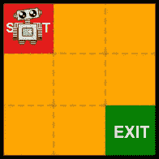

图 BabyRobotEnv _ v3 的“render”函数的初始输出。

更好的是，当我们运行我们的标准强化学习循环时，如上所示，我们现在可以看到机器人宝宝在环境中移动。在寻找出口的过程中，机器人宝宝目前正在采取随机抽样的行动，因此每一集都将遵循不同的路径。图 7 中显示了一个这样的情节:


图 BabyRobotEnv _ v3 制作的典型剧集的渲染输出。

# **陈述具体行动空间**

如果你再看一下 *BabyRobotEnv_v3* ' *渲染*函数，你会看到我们仍然在打印每个时间步的动作、位置和奖励。因此，除了新的图形输出之外，我们还从环境的版本 2 中获得了文本输出。此外，如果您检查这个文本输出，您会看到条目，例如图 5 中的第一行:

*“北:(0，0)奖励=-1”*

换句话说，*婴儿机器人*在最初的开始方块(0，0)然后选择了向北移动，这会把他直接撞墙！

虽然他只是一个婴儿，但他不笨，所以应该只选择有效的行动。我们可以通过引入特定于状态的动作空间来实现这一点，在该空间中，不是简单地从所有动作中进行选择，而是返回的动作取决于当前状态。

在上面的代码中，我们创建了一个自定义的 [*健身房空间*](https://www.gymlibrary.ml/content/spaces/) 。我们将使用它来存储当前状态下可用的动作，然后，当调用' *sample* '时，我们将随机选择这些动作中的一个。

使用这个类，我们可以增强我们以前的环境，这样，当进入一个新的状态时，它会为该状态设置可能的操作。如下所示:

和以前一样，我们继承了以前的环境(在本例中是 *BabyRobotEnv_v3* )，这样我们就可以在它的功能上进行构建。然后，我们添加一个'*动态*'类的实例，每次调用' *take_action* '函数时，我们都用当前状态可用的操作填充它。

因此，当对特定状态的动作进行采样时，它将从有效动作集中抽取，不会导致机器人宝宝撞到墙上。

例如，对于开始状态，调用 *BabyRobotEnv_v4* 的' *show_available_actions* 函数返回动作 South 和 East。类似地，对于图 8 所示的网格位置(2，1)，可用的动作是北、南或西。

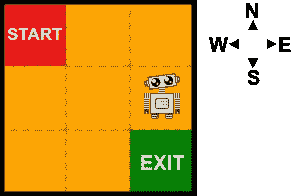

图 8:网格位置(2，1)，其中可用的动作是北、南或西。

# 注册和检查本地环境类

为了检查我们的新环境是否符合 Gym API 标准，我们可以使用 Gym '*check _ env*'函数。如果这没有返回警告，那么我们都很好。

然而，为了给这个函数提供我们的环境，我们首先需要调用' *gym.make* '来创建环境，但是在我们这样做之前，我们需要为 gym 注册环境以了解它。

在本文的第一部分中，我们看到了当自定义环境包含在自己的 python 文件中时，如何做到这一点。在这种情况下，提供给' *_register_* '函数的' *entry_point* 定义了文件和类名。

注册本地类略有不同。在这种情况下，' *entry_point* '只是类名而不是字符串。因此，在这种情况下，我们可以注册并检查***BabyRobotEnv _ v4***类，如下所示:

# **增强图形环境**

虽然能够看到文本输出是有用的，给出了每个动作的细节，但它生成了不断增加的文本列表，最终淹没了笔记本单元格，这不是很好。

与其在' *render'* 函数中使用 *print* 语句，我们可以直接将文本写到画布上。为此，我们首先需要扩展画布来创建一个可以显示文本的区域。通过使用' *__init__* '函数的' *kwargs* '参数，我们可以提供一个定义该文本区域的对象:

在上面的例子中，我们指定了一个灰色的侧面板，其宽度大约等于网格层的宽度。这将产生以下输出:

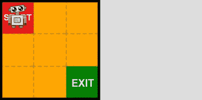

图 9:为文本输出添加侧面板。

我们现在需要的是一种方法来写入这个面板，并在每次调用' *render* '时显示所需的信息。我们环境的下一次迭代包含了' *show_info* '函数来完成这一任务:

新的' *show_info* '方法调用基础' [*GridLevel*](https://github.com/WhatIThinkAbout/BabyRobotGym/blob/main/babyrobot/envs/lib/grid_level.py) '类中的函数。这需要一个信息对象，给出要显示的文本和它应该去哪里的细节。

之前，在' *render* 函数中，我们提供了动作和奖励，然后使用 print 命令显示它们:

```
print(f”{Actions(action): <5}: ({self.x},{self.y}) reward = {reward}”)
```

在新的图形版本中，我们在主循环中创建一个信息对象，并将其交给 render 函数:

标准健身房环境强化学习循环。

现在，当我们运行主 RL 循环时，我们得到以下输出:

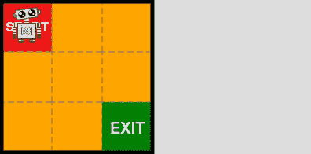

图 10:直接写入画布的图形文本输出。

# 增加挑战

虽然我们新的自定义健身房环境的图形输出看起来不错，但这并不是一个非常困难的强化学习挑战。为了让事情变得更困难，我们需要给机器人宝宝增加一些障碍来谈判。

## **添加墙壁:**

在创建环境时，我们可以提供一组墙定义。该数组中的每一项都定义了网格坐标和应放置墙的单元格的边:

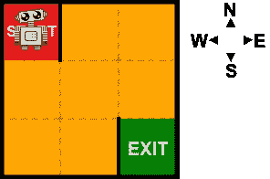

图 11:给环境添加墙壁。

## 添加水坑:

目前，当在网格中移动时，婴儿机器人的所有动作都是确定的。例如，在上面的*图 11* 中，机器人宝宝目前从开始状态只有一个可能的动作，那就是向南走。当他采取这一行动时，他肯定会在下面的单元格中结束，并会因为采取这一行动而获得-1 的奖励。

相反，许多 RL 问题考虑的是概率环境，在这种环境中，当采取一项行动时，不能保证你最终会达到目标状态，也不能保证你会得到预期的回报(有关这方面的更多信息，请参见“ [*马尔可夫决策过程和贝尔曼方程*](/markov-decision-processes-and-bellman-equations-45234cce9d25) ”一文)。我们可以通过添加水坑将这种随机性引入网格世界。当机器人宝宝遇到这种情况时，他有可能打滑，在这种情况下，他将会在不同于他试图到达的牢房中结束。此外，机器人宝宝需要更长的时间才能通过水坑，因此进入水坑的奖励更为消极(即更大的惩罚)。

在我们添加水坑之前，我们将对环境做最后的改变。在' *take_action* '函数中，我们将检查该操作是否导致了预期目标的实现。然后，在'*步骤*函数中，我们将利用 Gym 接口的' *info* '对象来返回这些信息。这将使我们能够监控机器人宝宝进入水坑的效果:

然后我们可以创建这个新环境的一个实例来设置一个包含水坑的关卡。此外，我们将移动起点和出口，并在起点广场周围放置一些墙壁，这样机器人宝宝就没有其他选择，只能直接进入水坑。

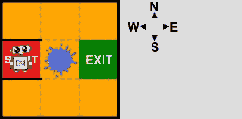

图 12:给环境添加一个水坑。

与墙一样，水坑是通过给出其网格位置的坐标来指定的。然而，水坑存在于单元的中间，所以不需要指定边。相反，定义了水坑的大小，有两个可能的选项，默认情况下，具有以下属性:

*   1 =小水坑。奖励= -2，打滑概率= 0.4
*   2 =大水坑。奖励= -4，打滑概率= 0.6

如果我们现在运行简单的测试代码，如下所示，机器人宝宝将尝试向东走两步。第一个会成功，因为他是从干燥的起点出发的。然而，他正在进入一个大水坑，所以将自动获得奖励-4。在下一步行动中，他想要到达出口，所以再次尝试向东移动。然而，他现在正从一个大水坑里出来，所以有 0.6 的概率他会打滑，并最终处于其他可能的状态之一。

当打滑发生时，将显示以下类型的输出:


图 13:打滑后的机器人宝宝。

机器人宝宝并没有停在出口处，也没有得到零奖励，而是下滑到了(1，0)处，得到了-1 的奖励。

## 添加迷宫:

许多网格世界问题定义了需要被导航的迷宫，以寻找出口。虽然我们可以通过指定大量的墙来实现这一点，但这很快就会变得令人讨厌。因此，我们可以指定我们想要添加一个迷宫，并提供一个随机的种子，它将决定创建的墙壁。

默认情况下，迷宫只有一条路径可以到达出口。对于许多 RL 问题，当几个可能的选项可用时，产生了更好的挑战，并且学习算法将需要找到这些选项中的最佳选项。通过移除迷宫中的一些墙壁，我们可以创建几条通往出口的路线。RL 算法需要找出哪一个能让机器人宝宝获得最大的回报。

在这里，在我们的最后一关，我们已经添加了几乎所有的东西！我们指定了一个更大的 8x5 大小的迷宫。然后我们移除了几堵墙，创造了几条通往出口的路线。然后，我们增加了一些水坑，只是为了创造更多的挑战。最后，为了让事情看起来更好，我们已经指定我们想要使用' *black_orange* '主题(所有的颜色都是完全可定制的)。

此配置产生以下级别:

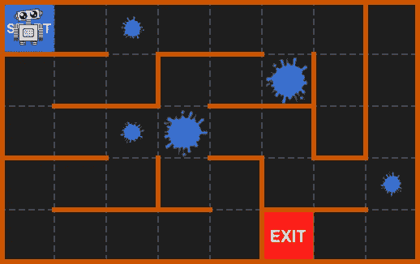

图 14:一个完整的婴儿机器人定制健身房环境。

机器人宝宝现在有一个具有挑战性的问题，他必须在迷宫中寻找出口。当标准健身房环境强化学习循环运行时，机器人宝宝将开始随机探索迷宫，收集他可以用来学习如何逃脱的信息。下面的*图 15* 显示了其中一集的部分内容。

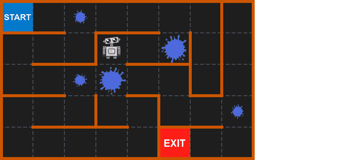

图 15:婴儿机器人探索迷宫寻找出口。

> 显然，考虑到正在采取的随机行动，加上可能导致打滑的水坑的复杂性，机器人宝宝可能需要一些时间来定位出口。要了解如何使用强化学习算法来找到穿过迷宫的最佳路线，请查看 [**培训笔记本**](https://colab.research.google.com/github/WhatIThinkAbout/BabyRobotGym/blob/main/notebooks/PPO_Training.ipynb) 。

# 摘要

在这两篇文章中，我们已经看到了如何创建一个定制的*体育馆环境*，将实时图形输出直接呈现到 *Jupyter 笔记本*单元格中。

*ipycanvas* 库提供了对 HTML 画布的直接访问，在这里可以组合简单的图形组件来生成*强化学习*环境的信息视图。

此外，通过将这个环境建立在 *Gym API* 的基础上，我们可以创建*强化学习*问题，这些问题与许多不同的开箱即用学习算法兼容。希望这些文章已经为您提供了开始构建自己的定制 RL 环境所需的所有信息。


如果你只是想在*婴儿机器人*环境中玩一玩，看看这个 [***笔记本***](https://colab.research.google.com/github/WhatIThinkAbout/BabyRobotGym/blob/main/notebooks/BabyRobot_API.ipynb) 展示了*婴儿机器人网格世界*可以创建的不同方式以及可以添加的组件。

现在，我们可以为机器人宝宝创造一系列具有挑战性的世界来探索，剩下要做的就是学习如何解决这些问题。关于如何做到这一点的系列文章的第一部分可以在这里找到:

</state-values-and-policy-evaluation-ceefdd8c2369>  