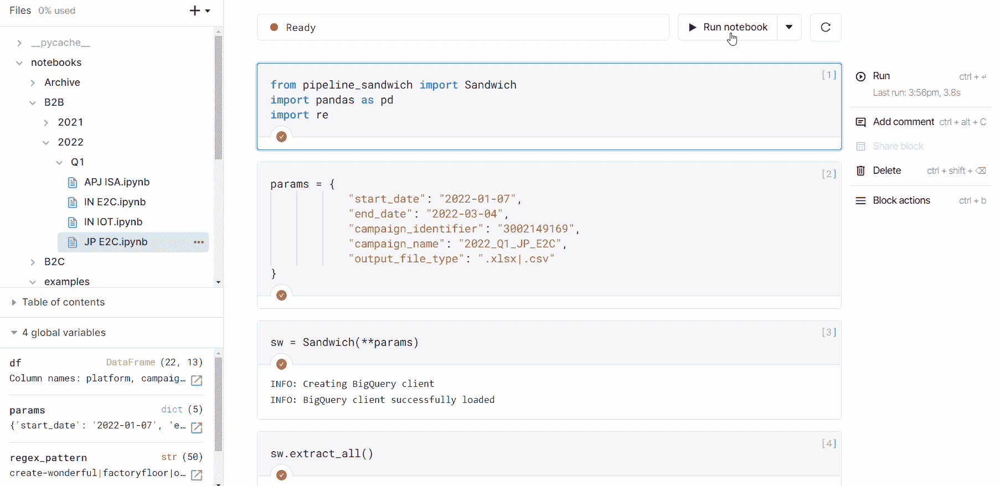
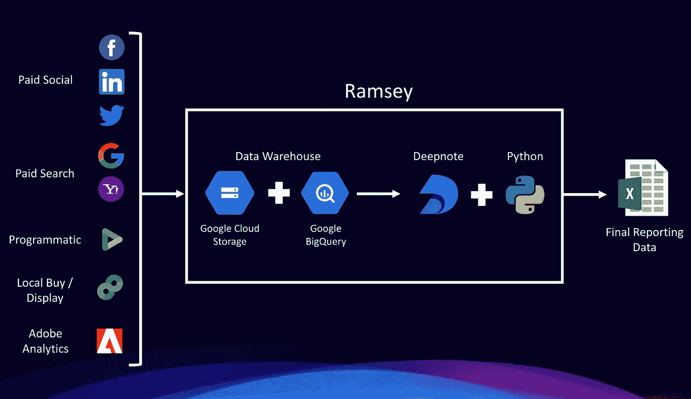
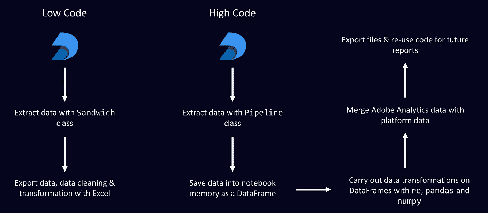

# 用 Deepnote 创建数据库前端

> 原文：<https://towardsdatascience.com/creating-a-database-front-end-with-deepnote-3271b441a47d>

## 数据工程

## 下面是我如何在云中用 Python 笔记本自动完成报告的


照片由[塞巴斯蒂安·科曼摄影](https://unsplash.com/@sebastiancoman?utm_source=unsplash&utm_medium=referral&utm_content=creditCopyText)在 [Unsplash](https://unsplash.com/s/photos/chef?utm_source=unsplash&utm_medium=referral&utm_content=creditCopyText) 拍摄

作为数据专业人员处理报告就像是在厨房里做厨师。你有大量的原材料需要采购、运输和转化为顾客的食物。

除了在这种情况下，原材料是数据，输出往往是业务涉众的报告。可以想象，在 Excel 和第三方平台上一遍又一遍地做这些是重复的，一点也不好玩。

幸运的是，大量关于重复和低价值报告的问题可以通过混合使用 SQL 和 Python 来解决(例如`pandas`)。我们还看到 Power BI 和 Tableau 等产品大力推动自助报告，各公司开发了自己的数据基础设施来支持这一点。

然而，许多这些公司的主要问题是，他们在运营数据的关键步骤上失败了。

当然，他们可能将数据存放在某个地方的仓库中，但是最终用户仍然需要一种灵活的方法来访问他们想要的数据。如果您的用户没有很强的 SQL 技能，并且仪表板不够用，那么数据库前端可能是您所需要的。

在本文中，我将介绍 Deepnote 以及我如何使用它为我的公司创建数据库前端。

# **进入 Deepnote**

如果你以前没有听说过它，Deepnote 是一个免费的协作 Python 笔记本，可以在你的浏览器中运行——它与 Jupyter Notebook 非常相似，但可以在云中运行，无需安装 Python。


Deepnote ( [来源](https://deepnote.com/static/landing-new/video.mp4))

您可以通过使用 Python 客户端库来超越 Deepnote 的基本 SQL 查询功能，该客户端库直接连接到 Google BigQuery 等数据仓库，代码片段如下:

```
import json
import os
from google.oauth2 import service_account
from google.cloud import bigquerybq_credentials = service_account.Credentials.from_service_account_info(
 json.loads(os.environ[‘INTEGRATION_NAME_SERVICE_ACCOUNT’]))
client = bigquery.Client(credentials=bq_credentials, 
 project=bq_credentials.project_id)
```

Deepnote 还集成了 GitHub，这意味着您可以轻松创建和存储可以在多台笔记本电脑中重用的功能。这使得为您的用户自动化报告过程变得更加容易。

所有这些让我能够创建一个 Python 库(或者我喜欢称之为“Ramsey ”),通过从我们的各种营销平台中提取数据来自动生成报告。

没有复杂的 SQL 查询——只需填写参数，添加一些可选的 lambda 表达式，然后点击执行并下载。



借助 Ramsey 实现自动化数据提取和转换

对于我的特定用例(基本上是上面的 GIF ),数据从各种平台被提取到一个数据仓库中，但实际上并没有用于帮助报告。我采取了额外的步骤，为我的团队创建了一个前端，以便轻松地提取、转换和下载数据。



报告流程图

# **实现前端**

上面的这个前端看起来似乎很简单，但实际上有很多事情在进行。

前端基于一个名为`Pipeline`的父类，它保存一个 SQL 查询模板，其中的参数可以根据正在使用的表进行交换。

带有 SQL 模板的父类

`Pipeline`类还包含生成最终 SQL 查询的函数，看起来像这样

用 Python 生成 SQL 代码

如果你曾经尝试过跨平台比较数据，比如脸书和 Twitter，你会发现几乎所有的指标和维度都有不同的名称。

这需要对数据进行大量的清理和分组。相应地，每个营销数据提供者(或 BigQuery 中的表)由一个子类表示，该子类包含各种字典，用于帮助重命名或分组维度和指标。

具有特定维度和度量的子类

简而言之，`FacebookAdsPipeline`子类从`Pipeline`父类继承了查询模板和`generate_query()`函数。然后，在创建和运行管道之前，用户创建一个存储必要参数的字典。

```
import pandas as pd
from pipeline import Pipeline
from platforms import FacebookAdsPipeline# Creating a dictionary to pass into the pipeline
params = {
"start_date": "2021-10-01",
"end_date": "2021-12-24",
"campaign_identifier": "123123123",
"campaign_name": "2022_Q1_Campaign_Name",
"output_file_type": "csv" # Options are .csv / .xlsx
}# Passing in parameters & extracting data via BigQuery SQL
fb = FacebookAdsPipeline(**params)
df = fb.extract()
df.to_csv("output.csv")
```

为了避免手动实例化每个子类，我创建了一个祖父类——`Sandwich`——它可以自动检测并从营销活动使用的每个平台中提取数据。

这消除了跟踪营销活动在哪个平台上运行的需要。总的来说，这为我的团队(老实说，是我)节省了无数时间，无论是复制粘贴 SQL 代码还是直接从每个营销平台提取数据。

用祖父类提取数据

通过存储在`Sandwich`类中的`extract_all()`函数提取数据。该函数查询跨所有营销平台的顶级活动数据的聚合表，并返回发现活动已经运行的平台列表。

然后实例化每个提供者的管道，并在每个管道上单独运行`extract()`方法。然后，数据按营销渠道分组，并作为字典保存在实例化的类中。

最后，用`transform_all()`函数转换数据，并以 CSV 或 XLSX 文件的形式保存到输出目录。

这一切都很复杂，但这是我根据用户偏好设计前端的结果。我想给用户提供一个选择，根据他们是想使用 Excel 还是 Python 进行数据清理和转换，将它作为一个低代码工具还是高代码工具。



前端选项:低代码和高代码

# **为未来做准备**

老实说，很多工作都可以用 SQL 来完成，但这又回到了 SQL 代码复杂性的问题，以及必须在单个查询中连接大量表的问题。这还没有考虑完全聚集的表的大小(可能有几 TB ),查询起来可能会很慢/很昂贵。

在我看来，与编写数千行 SQL 代码相比，为不同的报告和项目托管单独的笔记本和小型函数更可行。

我还想要实时协作的选项，让用户可以随时随地创建新功能。最后，拥有 Python 笔记本格式为使用像`scikit-learn`这样的包进行更高级的分析，或者使用`plotly` / `seaborn`进行更高级的可视化铺平了道路。

归根结底，自动化报告没有单一的“正确”方法。仪表板、Python 笔记本和 Excel/Google Sheet 报告都是很好的选择。有了更多的选择，最终用户将受益匪浅。

本文到此为止！我希望它对你有深刻的见解/有帮助。如果您有任何反馈或想法，请通过 [LinkedIn](https://www.linkedin.com/in/benjamindornel/) 联系我们。