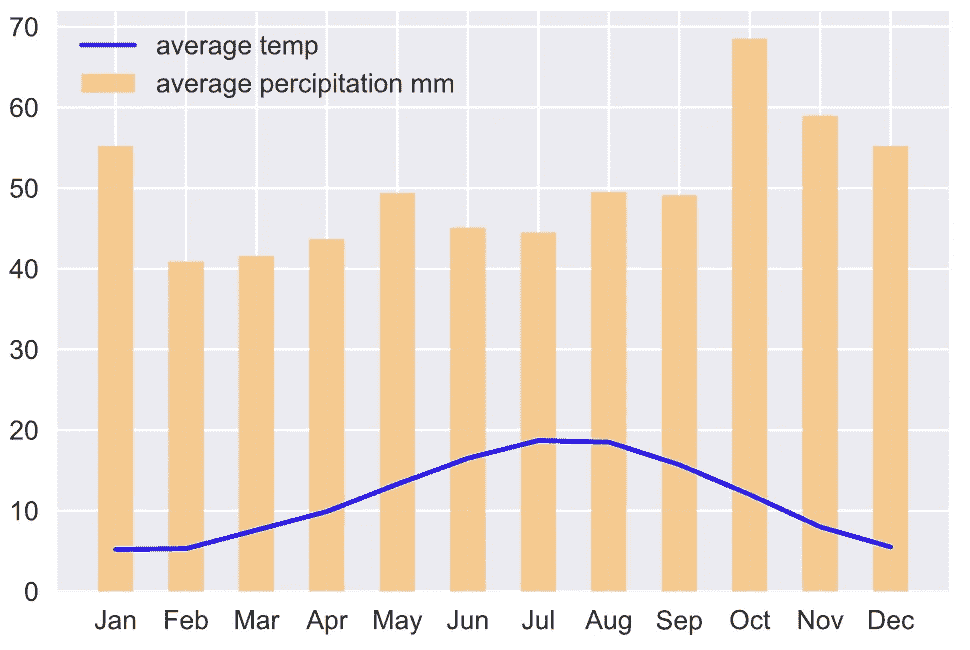
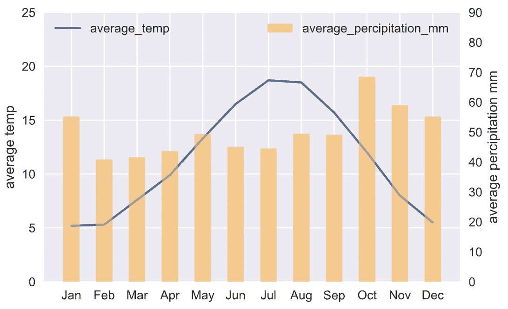
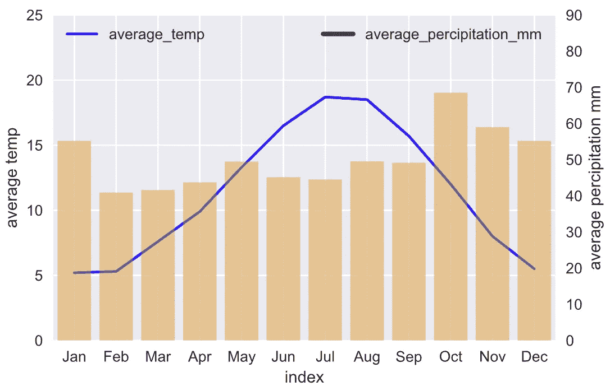
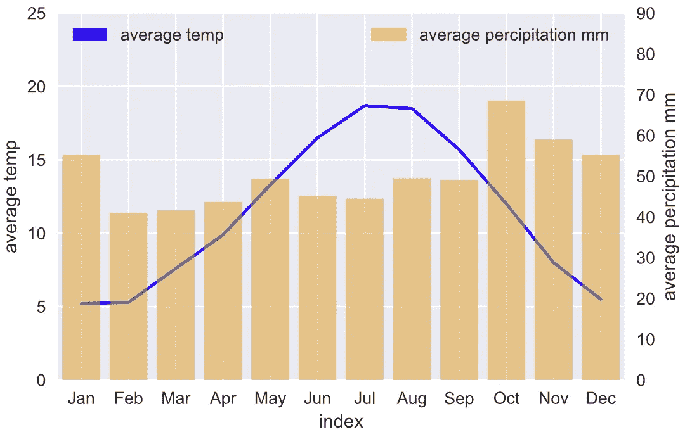
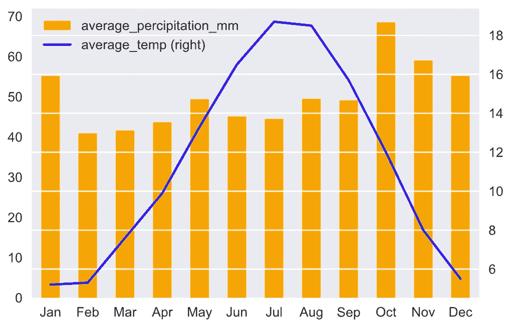

# 用 Python 创建双轴组合图

> 原文：<https://towardsdatascience.com/creating-a-dual-axis-combo-chart-in-python-52624b187834>

# 用 Python 创建双轴组合图

## 使用 Matplotlib、Seaborn 和 Pandas plot()创建双轴组合图的实践教程


[Firmbee.com](https://unsplash.com/@firmbee?utm_source=unsplash&utm_medium=referral&utm_content=creditCopyText)在 [Unsplash](https://unsplash.com/s/photos/data-visualization?utm_source=unsplash&utm_medium=referral&utm_content=creditCopyText) 上拍照

> 可视化数据对于分析数据至关重要。如果你看不到你的数据——从多方面看，你将很难分析这些数据。
> 
> 来源于 Python 数据[1]

python 中有许多不同的图形来可视化数据，幸好有 Matplotlib、Seaborn、Pandas、Plotly 等。在数据分析过程中，你可以做一些非常强大的可视化。其中**组合图**是在同一个图形上组合两种图表类型(如条形图和折线图)。这是 Excel 最受欢迎的内置图表之一，广泛用于显示不同类型的信息。

在同一个图表上绘制多个图表非常容易，但是使用双轴一开始可能会有点混乱。在本文中，我们将探索如何用 Matplotlib、Seaborn 和 Pandas `plot()`创建双轴组合图。这篇文章的结构如下:

1.  为什么使用双轴:使用同一轴的问题
2.  Matplotlib
3.  海生的
4.  熊猫情节()

> 源代码请查看[笔记本](https://github.com/BindiChen/machine-learning/blob/master/data-visualization/0006-dual-axis-combo-chart/dual-axis-combo-chart.ipynb)。更多教程可从 [Github Repo](https://github.com/BindiChen/machine-learning) 获取。

为了演示，我们将使用来自维基百科的[伦敦气候数据](https://en.wikipedia.org/wiki/London):

```
**x_label** = ['Jan', 'Feb', 'Mar', 'Apr', 'May', 'Jun', 'Jul', 'Aug', 'Sep', 'Oct', 'Nov', 'Dec']
**average_temp** = [5.2, 5.3,7.6,9.9,13.3,16.5,18.7, 18.5, 15.7, 12.0, 8.0, 5.5]
**average_percipitation_mm** = [55.2, 40.9, 41.6, 43.7, 49.4, 45.1, 44.5, 49.5, 49.1, 68.5, 59.0, 55.2]london_climate = pd.DataFrame(
  {
    'average_temp': average_temp,
    'average_percipitation_mm': average_percipitation_mm
  }, 
  index=x_label
)
```

# 1.为什么使用双轴:使用同一轴的问题

在同一个图表上绘制多个图表非常容易。例如，使用 Matplotlib，我们可以简单地一个接一个地调用图表函数。

```
**plt.plot**(x, y1, "-b", label="average temp")
**plt.bar**(x, y2, width=0.5, alpha=0.5, color='orange', label="average percipitation mm", )
plt.legend(loc="upper left")
plt.show()
```



单轴组合图(图片由作者提供)

这当然会创建一个组合图，但是折线图和条形图使用相同的 y 轴。查看和解释可能非常困难，尤其是当数据在不同的范围内时。

我们可以使用双轴有效地解决这个问题。但是一开始使用双轴可能会有点混乱。让我们继续探索如何用 Matplotlib、Seaborn 和 Pandas `plot()`创建双轴组合图。

# 2.Matplotlib

制作双轴组合图的诀窍是使用共享同一 x 轴的两个不同的轴。这可以通过 ***Matplotlib*** 中的`twinx()`方法实现。这会生成共享同一 x 轴的两个独立的 y 轴:

```
# Create figure and axis #1
fig, ax1 = plt.subplots()# plot line chart on axis #1
ax1.plot(x, average_temp) 
ax1.set_ylabel('average temp')
ax1.set_ylim(0, 25)
ax1.legend(['average_temp'], loc="upper left")# set up the 2nd axis
**ax2 = ax1.twinx()**# plot bar chart on axis #2
ax2.bar(x, average_percipitation_mm, width=0.5, alpha=0.5, color='orange')
**ax2.grid(False)** # turn off grid #2
ax2.set_ylabel('average percipitation mm')
ax2.set_ylim(0, 90)
ax2.legend(['average_percipitation_mm'], loc="upper right")plt.show()
```

我们通常会在`ax1`上绘制折线图。诀窍是调用`ax2 = ax1.twinx()`来设置第二个轴，并在其上绘制条形图。注意，`ax2.grid(False)`被调用来隐藏第二轴上的网格，以避免网格显示问题。因为两个图表使用相同的 x 值，所以它们共享相同的 x 轴。通过执行代码，您应该得到以下输出:



使用 Matplotlib 的双轴组合图(图片由作者提供)

# 3.海生的

Seaborn 是一个构建在 ***Matplotlib*** 之上的高级数据可视化库。在幕后，它使用 ***Matplotlib*** 来绘制它的情节。对于底层配置和设置，我们总是可以调用 ***Matplotlib*** 的 API，这就是在 ***Seaborn*** 中制作双轴组合图的窍门:

```
# plot line graph on axis #1
ax1 = sns.lineplot(
    x=london_climate.index, 
    y='average_temp', 
    data=london_climate_df, 
    sort=False, 
    color='blue'
)
ax1.set_ylabel('average temp')
ax1.set_ylim(0, 25)
ax1.legend(['average_temp'], loc="upper left")# set up the 2nd axis
**ax2 = ax1.twinx()**# plot bar graph on axis #2
sns.barplot(
    x=london_climate.index, 
    y='average_percipitation_mm', 
    data=london_climate_df, 
    color='orange', 
    alpha=0.5, 
    **ax = ax2**       # Pre-existing axes for the plot
)
ax2.grid(b=False) # turn off grid #2
ax2.set_ylabel('average percipitation mm')
ax2.set_ylim(0, 90)
ax2.legend(['average_percipitation_mm'], loc="upper right")plt.show()
```

`sns.lineplot()`返回一个 Matplotlib 轴对象`ax1`。然后，类似于 Matplotlib 解决方案，我们也调用`ax2 = ax1.twinx()`来设置第二个轴。之后，使用参数`ax = ax2`调用`sns.barplot()`在现有轴`ax2`上绘图。通过执行代码，您应该得到以下输出:



使用 Seaborn 的双轴组合图(图片由作者提供)

您可能会注意到图例显示不正确，条形图为黑色。我们可以做的一个修复是使用`mpatches.Patch()`创建一个自定义图例:

```
import matplotlib.patches as mpatches# plot line graph on axis #1
ax1 = sns.lineplot(
    x=london_climate.index, 
    y='average_temp', 
    data=london_climate_df, 
    sort=False, 
    color='blue'
)
ax1.set_ylabel('average temp')
ax1.set_ylim(0, 25)
**ax1_patch = mpatches.Patch(color='blue', label='average temp')
ax1.legend(handles=[ax1_patch], loc="upper left")**# set up the 2nd axis
ax2 = ax1.twinx()# plot bar chart on axis #2
sns.barplot(
    x=london_climate.index, 
    y='average_percipitation_mm', 
    data=london_climate_df, 
    color='orange', 
    alpha=0.5, 
    ax = ax2       # Pre-existing axes for the plot
)
ax2.grid(False) # turn off grid #2
ax2.set_ylabel('average percipitation mm')
ax2.set_ylim(0, 90)
**ax2_patch = mpatches.Patch(color='orange', label='average percipitation mm')
ax2.legend(handles=[ax2_patch], loc="upper right")**plt.show()
```

`mpatches.Patch()`创建一个 Matplotlib 2D 艺术家对象，我们将它传递给轴的图例。通过执行代码，您将获得以下输出:



使用 Seaborn 的双轴组合图(图片由作者提供)

# 4.熊猫情节

熊猫用`plot()`的方法制作图表。在引擎盖下，它默认调用 Matplotlib 的 API 来创建图表(注意:后端默认为 Matplotlib)。诀窍是将参数`secondary_y`设置为`True`以允许在辅助 y 轴上绘制第二个图表。

```
# Create the figure and axes object
fig, ax = plt.subplots()# Plot the first x and y axes:
london_climate.plot(
    use_index=True, 
    kind='bar',
    y='average_percipitation_mm', 
    ax=ax, 
    color='orange'
)# Plot the second x and y axes. 
# By secondary_y = True a second y-axis is requested
london_climate.plot(
    use_index=True, 
    y='average_temp', 
    ax=ax, 
    **secondary_y=True,** 
    color='blue'
)plt.show()
```

注意，我们还设置了`use_index=True`来使用索引作为 x 轴的刻度。通过执行代码，您应该得到以下输出:



使用熊猫图()的双轴组合图(图片由作者提供)

# 结论

在本文中，我们学习了如何用***【Matplotlib】******Seaborn******Pandas***`plot()`创建双轴组合图。组合图是数据可视化中最流行的图表之一，知道如何创建双轴组合图对分析数据非常有帮助。

感谢阅读。请查看[笔记本](https://github.com/BindiChen/machine-learning/blob/master/data-visualization/0006-dual-axis-combo-chart/dual-axis-combo-chart.ipynb)获取源代码，如果您对机器学习的实用方面感兴趣，请继续关注。更多教程可从 [Github Repo](https://github.com/BindiChen/machine-learning) 获得。

# 参考

*   [1] Python 数据— [可视化数据—用 Python 叠加图表](https://pythondata.com/visualizing-data-overlaying-charts/)