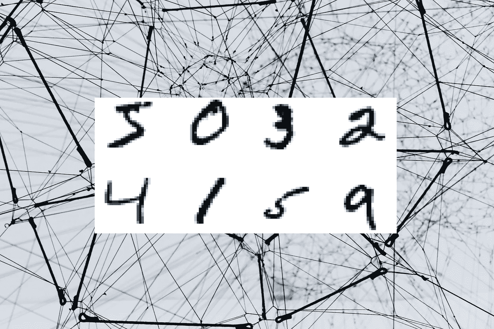
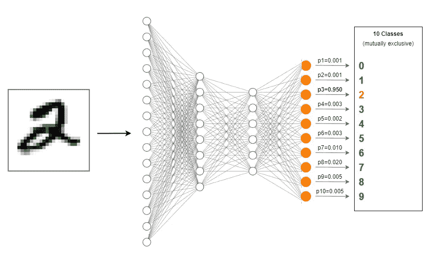
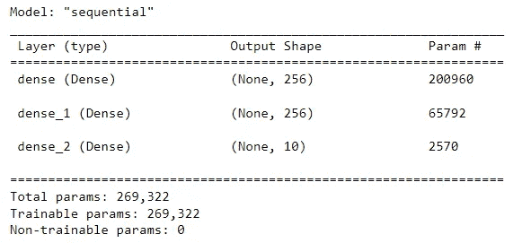
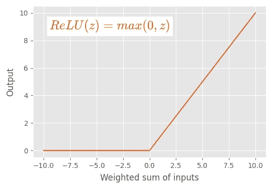
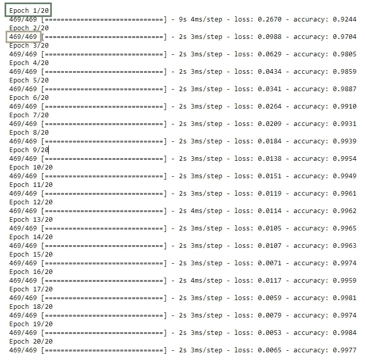
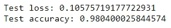
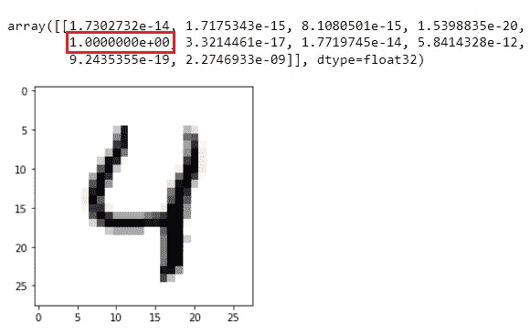

# 创建多层感知器(MLP)分类器模型以识别手写数字

> 原文：<https://towardsdatascience.com/creating-a-multilayer-perceptron-mlp-classifier-model-to-identify-handwritten-digits-9bac1b16fe10>

## 神经网络和深度学习课程:第 16 部分



[阿丽娜·格鲁布尼亚](https://unsplash.com/@alinnnaaaa?utm_source=unsplash&utm_medium=referral&utm_content=creditCopyText)在 [Unsplash](https://unsplash.com/?utm_source=unsplash&utm_medium=referral&utm_content=creditCopyText) 上的原始照片，由作者编辑

现在，我们已经熟悉了神经网络的大部分基础知识，因为我们已经在前面的部分中讨论过了。是时候利用我们的知识为现实世界的应用建立一个神经网络模型了。

与卷积神经网络(CNN)、递归神经网络(RNN)、自动编码器(AE)和生成对抗网络(GAN)等其他主要类型相比，多层感知器(MLP)是最基本的神经网络架构类型。

```
***Table of contents*** -----------------
**1\. Problem understanding****2\. Introduction to MLPs****3\. Building the model** - Set workplace
 - Acquire and prepare the MNIST dataset
 - Define neural network architecture
 - Count the number of parameters
 - Explain activation functions
 - Optimization (Compilation)
 - Train (fit) the model
 - Epochs, batch size and steps
 - Evaluate model performance
 - Make a prediction**4\. The idea of "Base Model"****5\. Parameters vs hyperparameters in our MLP model
 -** Hyperparameter examples**6\. Summary
** - The idea of "parameter efficient"***Prerequisites - My own articles*** -------------------------------
1\. [Previous parts of my neural networks and deep learning course](https://rukshanpramoditha.medium.com/list/neural-networks-and-deep-learning-course-a2779b9c3f75)
```

# 问题理解

今天，我们将构建一个**多层感知器(MLP)** 分类器模型来识别手写数字。我们有 70，000 张手写数字的灰度图像，分为 10 个类别(0 到 9)。我们将用它们来训练和评估我们的模型。

识别手写数字是一个多类分类问题，因为手写数字的图像属于 10 个类别(0 到 9)。如果我们将手写数字 2 的图像输入到我们的 MLP 分类器模型，它将正确地预测数字是 2。



**MLP 多阶层预测演示**(图片由作者提供，用 draw.io 制作)

# 多层感知器简介(MLP)

在我们继续之前，有必要介绍一下多层感知器(MLP)。我已经在第二部分中定义了什么是 MLP。

关于 MLP，强调以下几点:

*   在 MLP 中，感知器(神经元)堆叠在多层中。
*   每层上的每个节点都与下一层上的所有其他节点相连。
*   单个层内的节点之间没有连接。
*   MLP 是一个*完全(密集)连接的神经网络(FCNN)* 。所以，我们使用 Keras 中的`Dense()`类来添加层。
*   在 MLP 中，数据沿一个方向(正向)通过图层从输入移动到输出。
*   MLP 在一些文献中也被称为*前馈神经网络*或*深度前馈网络*。
*   MLP 是一种[顺序模型](https://rukshanpramoditha.medium.com/implicit-and-explicit-input-layers-in-keras-sequential-models-733049f83a32#23c8)。所以，我们使用 Keras 中的`Sequential()`类来构建 MLP。

# 构建模型

我们将按照以下步骤构建模型。

## 设置深度学习工作场所来运行代码

我已经在 [Part 12](https://rukshanpramoditha.medium.com/setting-up-a-deep-learning-workplace-with-an-nvidia-graphics-card-gpu-for-windows-os-b6bff06eeec7) 中详细解释了整个过程。

如果你想在谷歌实验室运行代码，请阅读[第 13 部分](https://rukshanpramoditha.medium.com/how-to-use-google-colab-free-gpu-to-run-deep-learning-code-incredibly-faster-760604d26c7e)。

## 获取、理解和准备 MNIST 数据集

我们使用 **MNIST** ( **M** 修正的 **N** 国家**I**N 代替 **S** 标准和 **T** 技术)数据集来训练和评估我们的模型。它包含 10 个类别(0 到 9)下的 70，000 幅手写数字的灰度图像。

下面的代码块显示了如何在构建模型之前获取和准备数据。我不打算解释这段代码，因为我已经在 [Part 15](https://rukshanpramoditha.medium.com/acquire-understand-and-prepare-the-mnist-dataset-3d71a84e07e7) 中详细解释过了。因此，我强烈建议您在进入下一步之前阅读它。

**为我们的 MLP 车型获取并准备 MNIST 数据**(代码由作者编写)

## 定义神经网络架构

*   **网络类型:**多层感知器(MLP)
*   **隐藏层数:** 2
*   **总层数:** 4(两个隐藏层+输入层+输出层)
*   **输入形状:** (784，)—输入层的 784 个节点
*   **隐藏层 1:** 256 个节点， [ReLU 激活](/how-to-choose-the-right-activation-function-for-neural-networks-3941ff0e6f9c#b34f)
*   **隐藏层 2:** 256 个节点， [ReLU 激活](/how-to-choose-the-right-activation-function-for-neural-networks-3941ff0e6f9c#b34f)
*   **输出层:** 10 节点， [Softmax 激活](/how-to-choose-the-right-activation-function-for-neural-networks-3941ff0e6f9c#bd87)

这是网络架构的代码。输入层是明确定义的。也可以隐式定义。阅读[第 10 部分](https://rukshanpramoditha.medium.com/implicit-and-explicit-input-layers-in-keras-sequential-models-733049f83a32)中的完整指南。

**定义 MLP 网络架构，获取参数个数**(作者代码)



**MLP 车型总结**(图片由作者提供)

## 计算参数的数量

可训练参数的数量是 269，322！这是什么？通过训练我们的神经网络，我们将找到这些参数的最佳值。

这些参数包括网络中的权重和偏差项。要了解这方面的更多信息，请阅读本节。

在深度学习中，这些参数用权重矩阵( **W1** 、 **W2** 、 **W3** )和偏置向量( **b1** 、 **b2** 、 **b3** )来表示。要了解更多相关信息，请阅读本节。

可训练参数的总数等于权重矩阵和偏差向量中的元素总数。

*   从输入层到第一个隐藏层:784 x 256 + 256 = 200，960
*   从第一个隐藏层到第二个隐藏层:256 x 256 + 256 = 65，792
*   从第二个隐藏层到输出层:10 x 256 + 10 = 2570
*   可转换参数总数:200，960 + 65，792 + 2570 = 269，322

## 解释激活功能

输入层不需要激活功能。

我们需要在隐藏层中使用非线性激活函数。这是因为手写数字分类是一项非线性任务。在隐藏层中没有非线性激活函数的情况下，我们的 MLP 模型将不会学习数据中的任何非线性关系。因此，我们在两个隐藏层中都使用了 [ReLU 激活函数](/how-to-choose-the-right-activation-function-for-neural-networks-3941ff0e6f9c#b34f)。ReLU 是非线性激活函数。



**ReLU 激活函数**(图片由作者提供，用 latex 编辑器和 matplotlib 制作)

在输出层，我们使用 [Softmax 激活函数](/how-to-choose-the-right-activation-function-for-neural-networks-3941ff0e6f9c#bd87)。这是多类分类问题的唯一选择。输出层有 10 个节点，对应于 10 个标签(类)。


**Softmax 激活功能**(图片由作者提供，用 latex 编辑器制作)

Softmax 函数计算一个事件(类)在 **K 个**不同事件(类)上的概率值。这些类是互斥的；如果我们将每一类的概率值相加，我们得到 1.0。

## 最佳化

这也叫编译。这里我们配置学习参数。阅读本节了解更多相关信息。

**配置学习参数**(作者代码)

## 训练(拟合)模型

这里，我们向`fit()`方法提供训练数据(X 和标签)。

**训练模型**(作者代码)



**训练时期和步骤**(作者代码)

## 时期、批量和步骤

一个**历元**是整个训练数据集的完整传递。这里， *Adam* 优化器遍历整个训练数据集 20 次，因为我们在`fit()`方法中配置了`epochs=20`。

我们把训练集分成批次(样本数)。 **batch_size** 为样本量(每批包含的训练实例数)。批次数量通过以下方式获得:

```
**No. of batches = (Size of the train dataset / batch size) + 1**
```

根据上面的等式，这里我们得到 469 (60，000 / 128 + 1)个批次。我们加 1 来补偿任何小数部分。

在一个时期内，`fit()`方法处理 469 个 ***步骤*** 。在每个优化时期，模型参数将被更新 469 次。

在每个时期，该算法采用前 128 个训练实例，并更新模型参数。然后，它采用接下来的 128 个训练实例并更新模型参数。该算法将进行这一过程，直到每个时期完成 469 个步骤。

## 评估模型性能

在这里，我们使用测试数据(X 和标签)对`evaluate()`方法评估我们的模型。我们从不使用训练数据来评估模型。

**评估模型**(作者代码)



**损失和准确度得分**(图片由作者提供)

根据算法的随机性，你会得到稍微不同的结果。您可以通过如下设置随机种子来获得静态结果。

```
import numpy as np
import tensorflow as tfnp.random.seed(42)
tf.random.set_seed(42)
```

## 做一个预测

现在，我们使用`predict()`方法对看不见的数据进行预测。我们使用**测试图像**组的第五幅图像。这个图像代表数字 4。如果我们的模型是准确的，它应该为数字 4 预测更高的概率值。让我们看看。

**做个预测**(作者代码)



**我们的 MLP 模型做出的预测**(图片由作者提供)

因为我们在输出图层中使用了 Softmax 激活函数，所以它会返回一个包含 10 个元素的 1D 张量，这些元素对应于每个类的概率值。预测数字位于具有最高概率值的索引处。请注意，索引从零开始。

为了获得具有最高概率值的索引，我们可以使用`np.argmax()`函数。

```
np.argmax(MLP.predict(digit, verbose=0))
```

这会返回 4！所以，我们的 MLP 模型对新数据做出了正确的预测！

由于所有类别都是互斥的，所以上述 1D 张量中所有概率值的总和等于 1.0。

# 基本模型

我们刚刚在 MNIST 数据上建立的 MLP 分类器模型被认为是我们神经网络和深度学习课程中的*基础模型。我们将在 MNIST 数据上构建几个不同的 MLP 分类器模型，并将这些模型与这个基础模型进行比较。*

# *MLP 模型中的参数与超参数*

> ***注:**要了解参数和超参数的区别，看[我写的这篇文章](https://rukshanpramoditha.medium.com/parameters-vs-hyperparameters-what-is-the-difference-5f40e16e2e82)。*

*之前我们计算了 MLP 模型中的参数数量(权重和偏差项)。*

*即使对于简单的 MLP，我们也需要为以下超参数指定最佳值，这些超参数控制参数值，然后控制模型的输出。*

## *超参数*

*   *网络中的隐藏层数*
*   *每个隐藏层中的节点数*
*   *损失函数的类型*
*   *优化器的类型*
*   *评估指标的类型*
*   *每个隐藏层中激活函数的类型*
*   *批量*
*   *时代数*
*   *学习率*

*通过改变这些超参数的值，我们可以建立许多不同的模型。例如，我们可以在网络中添加 3 个隐藏层，建立一个新的模型。我们可以在每个隐藏层中使用 512 个节点，并建立一个新的模型。我们可以改变 Adam 优化器的学习率，建立新的模型。我们可以在隐藏层中使用泄漏的 ReLU 激活函数来代替 ReLU 激活函数，并建立新的模型。每次，我们都会得到不同的结果。*

*请注意，一些超参数的值只有一个选项。例如，损失函数的类型总是**分类交叉熵**，并且输出层中的激活函数的类型总是 **Softmax** ，因为我们的 MLP 模型是多类分类模型。*

# *摘要*

*我们的基本 MLP 模型获得了更高的准确度分数。然而，我们的 MLP 模型不是参数有效的。即使对于这个小的分类任务，它也需要 269，322 个可训练参数，仅用于两个隐藏层，每个隐藏层 256 个单元。*

*在下一篇文章的[中，我将向您介绍一个特殊的技巧，在不改变 MLP 模型的架构和不降低模型精度的情况下，显著减少可训练参数的数量！](https://rukshanpramoditha.medium.com/using-pca-to-reduce-number-of-parameters-in-a-neural-network-by-30x-times-fcc737159282)*

*今天的帖子到此结束。*

*如果您有任何问题或反馈，请告诉我。*

*我希望你喜欢阅读这篇文章。如果你愿意支持我成为一名作家，请考虑 [***注册会员***](https://rukshanpramoditha.medium.com/membership) *以获得无限制的媒体访问权限。它只需要每月 5 美元，我会收到你的会员费的一部分。**

*<https://rukshanpramoditha.medium.com/membership>  

非常感谢你一直以来的支持！下一篇文章再见。祝大家学习愉快！

## MNIST 数据集信息

*   **引用:**邓，l，2012。用于机器学习研究的手写数字图像 mnist 数据库。 **IEEE 信号处理杂志**，29(6)，第 141–142 页。
*   **来源:**[http://yann.lecun.com/exdb/mnist/](http://yann.lecun.com/exdb/mnist/)
*   **许可:***Yann le Cun*(NYU 库朗研究所)和 *Corinna Cortes* (纽约谷歌实验室)持有 MNIST 数据集的版权，该数据集可根据*知识共享署名-共享 4.0 国际许可*([**CC BY-SA**](https://creativecommons.org/licenses/by-sa/4.0/))获得。您可以在此了解有关不同数据集许可类型[的更多信息。](https://rukshanpramoditha.medium.com/dataset-and-software-license-types-you-need-to-consider-d20965ca43dc#6ade)

[鲁克山普拉莫迪塔](https://medium.com/u/f90a3bb1d400?source=post_page-----9bac1b16fe10--------------------------------)
**2022–06–09***