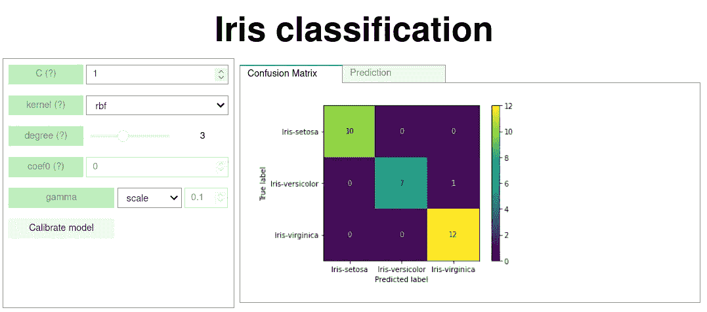

# 使用 Jupyter 和 autocalc 为您的数据分析项目创建一个用户界面

> 原文：<https://towardsdatascience.com/creating-a-ui-with-ipywidgets-and-autocalc-2ef8ea4cc6c2>

# 使用 Jupyter 和 autocalc 为您的数据分析项目创建一个用户界面

## autocalc 软件包如何让您自动重新计算变量

App 预览。作者图片

这篇文章的目标读者是使用 Python 的数据科学家，他们希望用最少的努力为他们的项目创建简单的用户界面，如上图所示。

在我之前的文章中，我介绍了 autocalc 包，它可以让你组织内部变量之间的依赖关系。在这篇文章中，我们将更进一步，实现一个更复杂的例子，涉及机器学习，模型拟合和预测。

 [## 使用 Jupyter 笔记本快速创建一个简单的应用程序

### 数据科学家和其他希望将 Python 函数转化为交互式应用程序的人的指南。

towardsdatascience.com](/create-a-simple-app-quickly-using-jupyter-notebook-312bdbb9d224) 

特别是，我们将:

*   加载分类数据集，并将其分为训练样本和测试样本
*   为用户提供微调机器学习模型的超参数(来自 scikit-learn 的支持向量分类器)
*   报告测试数据集的混淆矩阵
*   提供一个界面，根据手动输入的参数运行模型。

注意，这篇文章的目的是展示如何使用 Jupyter 笔记本和[自动计算](https://pypi.org/project/autocalc/)包来实现这一点。我们在这里的目的不是深入机器学习算法的细节，也不是提供任何意义上的“最佳”模型。有兴趣的读者可以参考分类器的[文档](https://scikit-learn.org/stable/modules/generated/sklearn.svm.SVC.html)。

在文章的最后你会找到整个笔记本的源代码的链接，它包含了下面所有的代码单元。

注意:如果没有安装 autocalc，可以用`pip install autocalc`安装。

所以让我们开始吧！

# 进口

像往常一样，我们从导入相关的包开始

# 创建主布局

让我们从设计我们的小应用程序的外观开始。这个想法是在超参数的左边有一列，在右边有两个选项卡:一个用于混淆矩阵，另一个用于预测。注意，我们使用标准的 IPywidgets 作为我们的接口。

# 创建和显示超参数的输入

## 读取 defaulf 超参数值

幸运的是，scikit-learn 提供了一种以编程方式读取估计器默认参数设置的方法。这是通过用默认参数(即空参数列表)然后使用`get_params`方法。 [SVC](https://scikit-learn.org/stable/modules/generated/sklearn.svm.SVC.html) 类有几个超参数，如`C`、`kernel`、`degree`等。它们中的一些(例如`C`和`kernel`)总是相关的，而其他的，只有当其他参数取某个值时才相关。例如`degree`仅在`kernel=='poly'`时相关。

## 指定输入

让我们从简单的开始，它们总是相关的。注意，`autocalc.autocalc.Var`的第一个位置参数是一个字符串，在显示`Var`时使用，或者作为一个小部件集，或者在使用例如`str(Var('xyz')`时使用。本例中使用的其他参数或者不言自明，或者将在相关阶段详细说明。

如上所述，`degree`参数仅在`kernel=='poly'`时使用。所以我们决定显示，但是当情况不是这样时，禁用相应的小部件。这里的想法是像往常一样创建 degree-Var，并给`kernel`变量分配一个回调，这将在需要时禁用/启用 degree 小部件。

请注意，我们如何使用`Var`来创建回调。这里需要注意的是`autocalc`的方法与`ipywidget`的`.observe`方法的不同之处:

*   当使用`autocalc`时，动作被附加到被作用的实体，而不是触发动作的实体。
*   在`ipywidgets`中，动作由微件触发。在`autocalc`的情况下，动作由`Var`触发，其可能具有关联的窗口小部件，但这不是必需的。

前一个单元格中的代码功能齐全，并给出了如何处理这种情况的想法。然而，对于其他变量，我们将多次使用上述模式。所以让我们避免代码重复，为此创建一个`Var`的子类。我们将使用与上面相同的方法。

定义了类`CVar`之后，我们可以从#+-+-+-+-+开始退出代码片段，使用更直接的定义。(你可以安全地删除那部分代码，不会影响功能。它只是为了更容易理解`CVar`的定义。)

根据[文档](https://scikit-learn.org/stable/modules/generated/sklearn.svm.SVC.html),`gamma`的值可以是`'auto'`、`'scale'`或浮点数。我们将使用下面的两个小部件来实现它。注意，自定义`gamma`值的输入仅在选择`'custom'`时有效。

现在，我们已经创建了小部件，是时候将它们显示在模型参数框中了。请注意，显示带有关联小部件的`Var`会导致显示其名称，后跟其小部件。如果你想把这个部件集放在一个`HBox`中，你必须使用`Var`对象的`.widget_set`字段。如果您只想显示小部件，您可以使用`.widget`字段访问它。当在下面最后一行显示`gamma`参数的输入时，这两者都会显示出来:

# 加载数据

在本例中，我们将使用[鸢尾数据集](https://archive.ics.uci.edu/ml/datasets/Iris)，该数据集将用于根据鸢尾植物的某些特征来识别其类型。

# 创建输出

我们已经指定了我们的输入部件，我们已经加载了数据。是时候处理了。记住，我们希望有两种不同类型的输出:混淆矩阵和预测器。它们都将使用 fitted `SVC`对象，因此将其定义为一个单独的变量是有意义的，这样就可以在它们之间共享。

## 混淆矩阵

下面的`model_fun`函数用于从超参数创建拟合的`SVC`对象，而`confusion_matrix_fun`函数使用`SVC`对象创建混淆矩阵的可绘图表示，也称为“模型”。

在这两个函数中，我们都使用虹膜数据集。这不会出现在输入参数中，对于我们的目的来说，它被认为是一个常数。

模型和混淆矩阵图都将被包装在`Var`中，这样我们就可以自动化它们的计算。注意，`model`变量是用`lazy=True`参数定义的。这个参数是用来做什么的？到目前为止，我们声明的`Var`要么是输入，要么是根据其他`Var`(例如`gamma`)计算出来的，计算速度非常快。所以当他们的一个输入改变时，我们可以立即重新计算。

机器学习模型(如`SVC`)有许多输入参数，一般来说，计算起来很慢。因此，我们不希望在更改其中一个参数后重新计算模型，而是希望更改我们需要的所有参数，然后让重新计算发生。(注意:当前数据集非常小，因此重新计算只需几秒钟，但通常输入数据集要大几个数量级。)

这是通过`lazy`标志实现的。如果任何输入改变，`Var`将进入“未定义”状态(`Var.is_undefined`评估为`True`)，而不是重新计算。它进入这种状态的原因是为了避免我们的变量不一致:一个`Var`有一个不同的状态，要么是由它的输入产生的，要么是被显式覆盖的。

为了强制重新计算一个懒惰的`Var`，需要显式调用它的`.get`或`.recalc`方法。

与`model`变量相反，`cm`并不懒惰，但是它依赖于一个懒惰变量(`model`)。因此，当`model`的其中一个输入发生变化时，`cm`也将处于未定义状态。

所以现在`model`很懒，也就是说我们需要一些手动触发来让它评估。我们将使用一个按钮小部件来实现，它将显示在超参数小部件的下面。

`model`变量是内部变量，不会向用户透露。因此，如果没有定义，用户就看不到它。但是对于公共变量(即。用户看到的那些)需要对未定义的状态做些什么。如果一个公共变量有一个小部件，它可以有一个未定义的状态(例如一个可以是空的文本框)，那么它由`autocalc`处理。但是当一个更复杂的变量，比如混乱矩阵图，变得不确定时，我们必须指定该做什么。

下面的`cm_display`函数将作用于`cm` `Var`的值。如果定义正确，它将绘制在输出框中。否则，该框中的内容将被清除，并替换为一条消息。

关于`cm_display`功能，我们需要注意几点:

1.  我们明确地检查了它的输入是否未定义。在前面的函数中，我们不必做这样的事情。这是因为，默认情况下，这些函数不必处理未定义输入。如果他们的任何一个输入未定义，该函数甚至不会被评估，并且有问题的`Var`也将被设置为未定义状态。要覆盖这种行为，需要将`undefined_input_handling`参数设置为`'function'`，如下所示。
2.  注意，我们如何检查`cm`是否被定义:`cm is undefined`，尽管如上所述，检查`Var`是否被定义需要使用`.is_undefined`方法。值得注意的是，这些在`Var`的`fun`参数中给出的函数总是作用于`Var`内部的值，而不是`Var`对象本身。所以`cm_display`函数范围内的`cm`变量与外部范围内的`cm`变量不同，而是它的“内部”值:`cm._get_raw()`。虽然这可能会造成一些混乱，但基本原理是在`autocalc`框架中，我们希望尽可能重用原始函数，这些函数作用于“普通”变量，而不是`Var`变量。只有在这些特殊情况下，我们才需要为变量`undefined`做准备。
3.  我们重用了之前创建的`calibrate_button`小部件。这个按钮现在可能出现在两个不同的地方。但是对朱庇特来说是可以的。

## 预言者

预测器的想法是，当用户遇到一株鸢尾时，她可以要求模型根据`variable_list`中列出的属性来识别它，如“萼片长度”、“萼片宽度”、“花瓣长度”和“花瓣宽度”。

所以我们为这些参数创建输入部件。我们使用 Python list-comprehension 从`variable_list`创建`Var`，并用来自训练集第一条记录的相应值初始化这些值。

我们需要一个函数来将校准的模型和测量的属性转换为预测，我们需要显示:

我们最终的应用程序将如下所示:

# 结束语

在本文中，我们围绕机器学习任务创建了一个简单的应用程序。我们使用 Jupyter 笔记本作为平台，Ipywidgets 用于大多数输入和输出，autocalc 包用于连接我们的组件。

我希望这篇文章能帮助你在 Jupyter notebook 中轻松创建类似的应用程序。如果你喜欢我的帖子，请鼓掌，关注，分享，评论。这鼓励我生产更多。

*   赠送的[自动计算](https://pypi.org/project/autocalc/)包是我写的。我欢迎对 [github](https://github.com/kefirbandi/autocalc) 的评论/建议/请求。
*   这个帖子最初是作为 Jupyter 笔记本创建的。作为单个笔记本的[代码](https://gist.github.com/kefirbandi/6204da76c2a8f8e26af78331afe6223a)可以作为 github gist 获得。
*   使用 [jupyter_to_medium 工具](https://www.dexplo.org/jupyter_to_medium)将其转换为介质。非常感谢 [Ted Petrou](https://medium.com/u/cf7f60f2eeb3?source=post_page-----2ef8ea4cc6c2--------------------------------) 的这个包。

 [## Jupyter 到中等初始职位

### 我非常兴奋地宣布 jupyter_to_medium 的正式发布，这是一个扩展 jupyter 的 Python 包…

medium.com](https://medium.com/dunder-data/jupyter-to-medium-initial-post-ecd140d339f0)