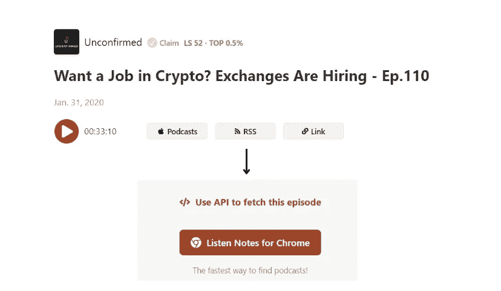
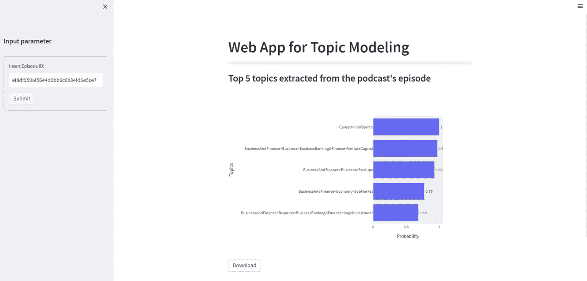
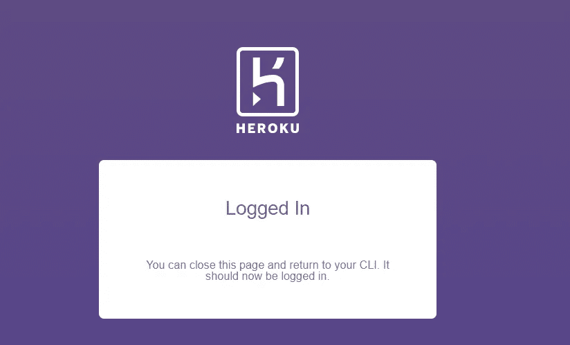

# 用 Python 创建一个从音频中提取主题的 Web 应用程序

> 原文：<https://towardsdatascience.com/creating-a-web-application-to-extract-topics-from-audio-with-python-21c3f541f3ca>

## 为 Spotify 播客的主题建模构建和部署 web 应用程序的分步教程


由[伊斯雷尔·帕拉西奥](https://unsplash.com/@othentikisra)在 [Unsplash](https://unsplash.com/photos/Y20JJ_ddy9M) 拍摄的照片

这篇文章是故事[的续篇，讲述如何用 Python](/how-to-build-a-web-app-to-transcribe-and-summarize-audio-with-python-dc719cb9e1f5?sk=96f349f866419fe55cd6a1496e740069) 构建一个 Web 应用程序来转录和总结音频。在上一篇文章中，我展示了如何构建一个应用程序来转录和总结您最喜欢的 Spotify 播客的内容。课文的摘要有助于听众在听之前决定这一集是否有趣。

但是还有其他可能的特征可以从音频中提取出来。话题。主题建模是许多自然语言处理中的一种，它能够从不同类型的源中自动提取主题，如酒店评论、工作机会和社交媒体帖子。

在这篇文章中，我们将构建一个应用程序，用 Python 收集播客中的主题，并通过漂亮的数据可视化分析每个主题的重要性。最后，我们将免费把 web 应用程序部署到 Heroku。

## 目录:

*   **第 1 部分:创建提取主题的 Web 应用程序**
*   **第 2 部分:将 Web 应用程序部署到 Heroku**

## 要求

*   创建一个 **GitHub 存储库**，这是将 web 应用程序部署到 Heroku 的生产环境中所需要的！
*   使用`git clone <name-repository>.git`在本地 PC 上克隆存储库。在我的例子中，我将使用 VS code，这是一个处理 python 脚本非常有效的 IDE，包括 Git 支持并集成了终端。在终端上复制以下命令:

```
git init
git commit -m "first commit"
git branch -M master
git remote add origin https://github.com/<username>/<name-repository>.git
git push -u origin master
```

*   用 Python 创建一个虚拟环境。

## **第 1 部分:创建提取主题的 Web 应用程序**

本教程分为两个主要部分。在第一部分中，我们创建了一个简单的 web 应用程序来从播客中提取主题。剩下的部分重点是应用的部署，这是随时与世界分享你的应用的重要一步。我们开始吧！

*   [**从听课笔记中提取剧集的网址**](#1297)
*   [**从音频中检索转录和主题**](#60d7)
*   [**用 Streamlit 构建 Web 应用**](#5be6)

**1。从收听笔记中提取剧集的 URL**



我们将从一集名为《想要一份加密的工作？交易所正在招人。110.你可以在这里找到《T2》的链接。正如你从电视和报纸上的新闻中所知道的，区块链的工业正在飞速发展，这一领域的职位空缺需要不断更新。当然，他们将需要数据工程师和数据科学家来管理数据，并从这些海量数据中提取价值。

Listen Notes 是一个播客搜索引擎和在线数据库，允许我们通过其 API 访问播客音频。我们需要定义从网页中提取剧集 URL 的函数。首先，您需要创建一个帐户来检索数据，并订阅[免费计划](https://www.listennotes.com/podcast-api/pricing/)来使用 Listen Notes API。

然后，点击你感兴趣的剧集，在页面右侧选择“使用 API 获取该剧集”选项。一旦您按下它，您就可以将默认的编码语言更改为 python，并单击 requests 选项来使用该 Python 包。之后，您复制代码并将其改编成一个函数。

它从一个单独的文件 **secrets.yaml** 中获取凭证，该文件由一组类似字典的键值对组成:

```
api_key:<your-api-key-assemblyai>
api_key_listennotes:<your-api-key-listennotes>
```

**2。从音频中检索转录和主题**

为了提取主题，我们首先需要向 AssemblyAI 的脚本端点发送一个 post 请求，输入上一步中检索到的音频 URL。之后，我们可以通过向 [AssemblyAI](https://www.assemblyai.com/) 发送 GET 请求来获取脚本和播客的主题。

结果将保存到两个不同的文件中:

下面我展示一个转录的例子:

```
Hi everyone. Welcome to Unconfirmed, the podcast that reveals how the marketing names and crypto are reacting to the week's top headlines and gets the insights you on what they see on the horizon. I'm your host, Laura Shin. Crypto, aka Kelman Law, is a New York law firm run by some of the first lawyers to enter crypto in 2013 with expertise in litigation, dispute resolution and anti money laundering. Email them at info at kelman law. ....
```

现在，我展示从播客的剧集中提取的主题的输出:

我们获得了一个 JSON 文件，包含 AssemblyAI 检测到的所有主题。本质上，我们将播客转录成文本，文本被分解成不同的句子及其相应的相关性。对于每个句子，我们都有一个主题列表。在这本大字典的最后，有一个从所有句子中提取的主题总结。

值得注意的是，职业和求职是最相关的话题。在前五个标签中，我们还发现商业和金融、创业公司、经济、商业和银行、风险投资和其他类似的主题。

**3。使用 Streamlit 构建 Web 应用程序**



已部署应用的链接是[这里是](https://topic-web-app-heroku.herokuapp.com/)

现在，我们将前面步骤中定义的所有函数放入主程序块中，在主程序块中，我们使用 Streamlit 构建我们的 web 应用程序，Streamlit 是一个免费的开源框架，允许使用 Python 用几行代码构建应用程序:

*   使用`st.markdown`显示应用程序的主标题。
*   使用`st.sidebar`创建一个左侧面板工具条。我们需要它来插入播客的剧集 id。
*   按下“提交”按钮后，将出现一个条形图，显示提取的最相关的 5 个主题。
*   如果您想下载转录、主题和数据可视化，可以点击下载按钮

要运行 web 应用程序，您需要在终端上编写以下命令行:

```
streamlit run topic_app.py
```

太神奇了！现在应该会出现两个 URL，单击其中一个，web 应用程序就可以使用了！

## **第 2 部分:将 Web 应用程序部署到 Heroku**

一旦您完成了 web 应用程序的代码，并检查了它是否运行良好，下一步就是在互联网上将它部署到 Heroku。

你可能想知道什么是 Heroku。它是一个云平台，允许使用不同的编码语言开发和部署 web 应用程序。

*   创建 requirements.txt、Procfile 和 setup.sh
*   连接到 Heroku

1.  **创建 requirements.txt、Procfile 和 setup.sh**

之后，我们创建一个文件 **requirements.txt** ，其中包含了您的脚本所请求的所有 python 包。我们可以通过使用这个神奇的 python 库 [pipreqs](https://pypi.org/project/pipreqs/) 使用下面的命令行自动创建它。

```
pipreqs
```

它会神奇地生成一个 *requirements.txt* 文件:

避免使用命令行`pip freeze > requirements`，就像本文建议的那样。问题是它返回了更多的 python 包，而这些包可能不是特定项目所需要的。

除了 **requirements.txt** 之外，我们还需要 Procfile，它指定了运行 web 应用程序所需的命令。

最后一个要求是要有一个包含以下代码的 **setup.sh** 文件:

```
mkdir -p ~/.streamlit/echo "\
[server]\n\
port = $PORT\n\
enableCORS = false\n\
headless = true\n\
\n\
" > ~/.streamlit/config.toml
```

**2。连接到 Heroku**

如果你还没有在 Heroku 的网站上注册，你需要创建一个免费账户来使用它的服务。在你的本地电脑上安装 Heroku 也是必要的。一旦你完成了这两个要求，我们就可以开始有趣的部分了！在终端上复制以下命令行:

```
heroku login
```

按下命令后，一个 Heroku 的窗口会出现在你的浏览器上，你需要输入你的邮箱和密码。如果成功，您应该会得到以下结果:



因此，您可以返回 VS 代码，编写命令在终端上创建您的 web 应用程序:

```
heroku create topic-web-app-heroku
```

输出:

要将应用程序部署到 Heroku，我们需要以下命令行:

```
git push heroku master
```

它用于将代码从本地存储库的主分支推送到 heroku remote。使用其他命令将更改推送到存储库之后:

```
git add -A
git commit -m "App over!"
git push
```

我们终于完成了！现在你应该看到你的应用程序终于部署了！

## 最终想法:

我希望你欣赏这个迷你项目！创建和部署应用程序真的很有趣。第一次可能会有点吓人，但一旦完成，你就不会有任何遗憾了！我还想强调的是，当您在处理内存需求较低的小项目时，最好将您的 web 应用程序部署到 Heroku。其他替代方案可以是更大的云平台框架，如 AWS Lambda 和谷歌云。GitHub 的代码在这里是。感谢阅读。祝您愉快！

你喜欢我的文章吗？ [*成为会员*](https://eugenia-anello.medium.com/membership) *每天无限获取数据科学新帖！这是一种间接的支持我的方式，不会给你带来任何额外的费用。如果您已经是会员，* [*订阅*](https://eugenia-anello.medium.com/subscribe) *每当我发布新的数据科学和 python 指南时，您都会收到电子邮件！*