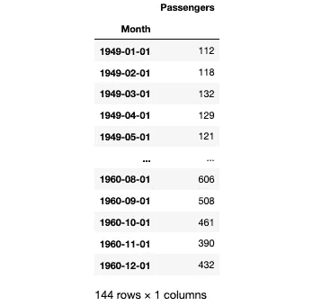
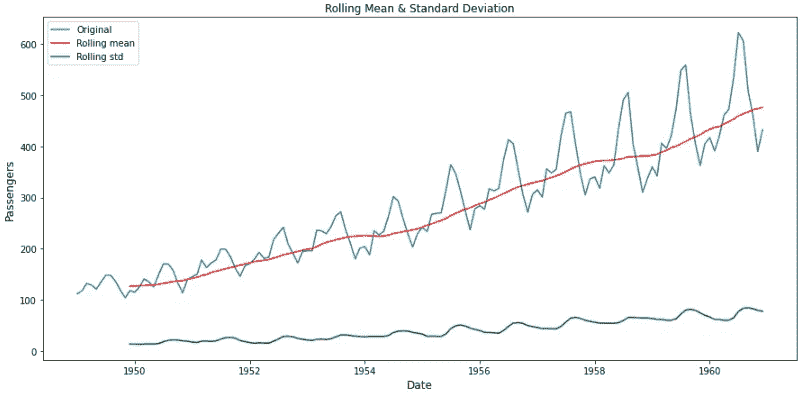
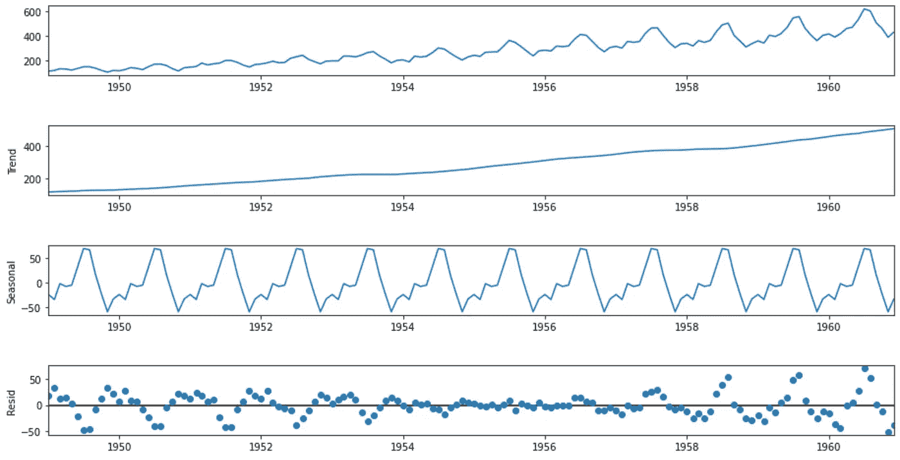
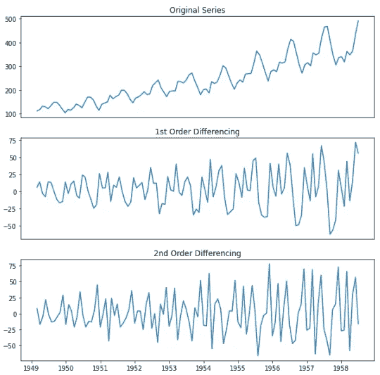
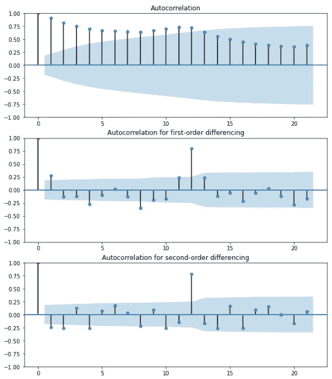
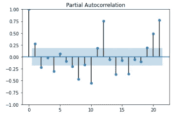
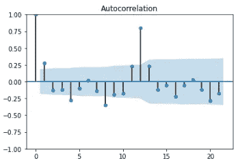
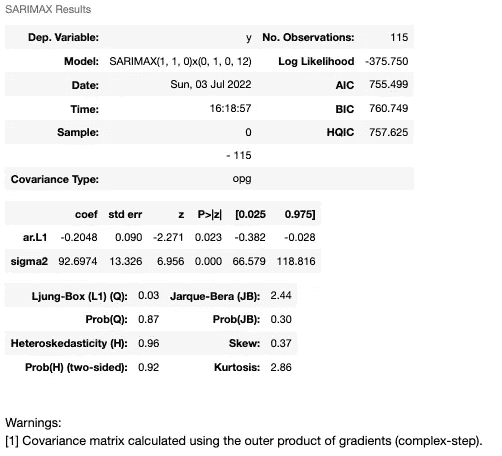
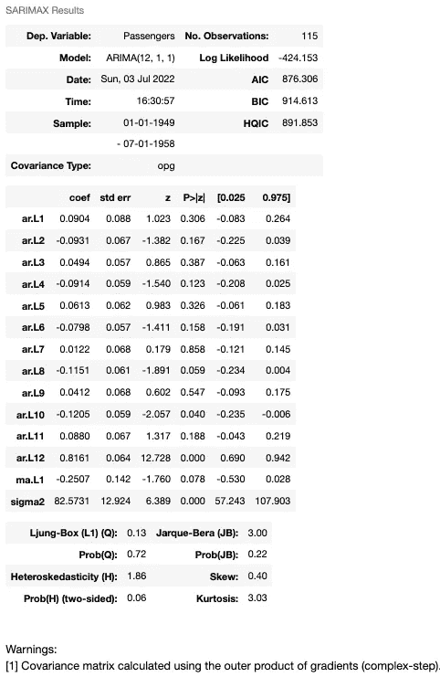
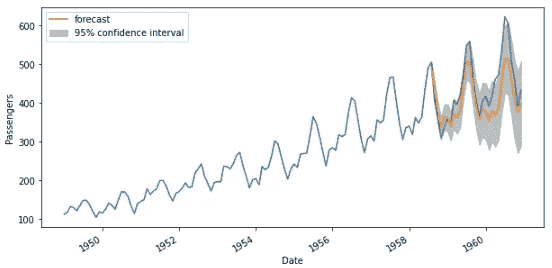

# 为时间序列预测创建 ARIMA 模型

> 原文：<https://towardsdatascience.com/creating-an-arima-model-for-time-series-forecasting-ff3b619b848d>

## 在 AirPassengers 数据集中介绍和实现 ARIMA 模型


照片由[卢卡斯](https://www.pexels.com/@goumbik)在[像素](https://www.pexels.com/photo/chart-close-up-data-desk-590022/)上拍摄

时间序列预测包括做出预测，以便在广泛的应用中推动未来的战略决策。基于在这篇[上一篇](/time-series-forecasting-based-on-the-trend-and-seasonal-components-26b92866e548)文章中介绍的一些术语，如趋势和季节性，这篇文章主要关注基于自回归、集成和移动平均的时间序列预测模型的实现。具体来说，结构展开如下:

1.  AR、I、MA 术语介绍
2.  寻找模型的顺序
3.  ARIMA 模式的实施
4.  带回家的信息

对于本文，我使用了开放数据库“ [Air Passengers](https://www.kaggle.com/datasets/rakannimer/air-passengers) ”，它提供了从 1949 年到 1960 年美国航空公司乘客的月度总数。该数据集包括但不限于对作品进行再许可和将其用于商业用途的权利。代码可以在下面的 [GitHub](https://github.com/javiferfer/medium/tree/master/time_series_arima) 资源库中找到。

# 1.AR、I、MA 术语介绍

## 1.1.自回归(AR)

术语 AR 代表*自回归*，表示模型使用当前数据与其过去值之间的依赖关系。用于预测下一个值的先前输入的数量被称为*阶*，通常被称为 *p* 。

换句话说，序列的当前值可以解释为过去的 *p* 值的线性组合:


其中，𝜖𝑡是白噪声过程(均值为 0，方差恒定，误差不相关)，𝑎𝑖是估计值。

根据 *p* 的值，有以下几种情况:

1.  AR(0):如果 *p* 参数设为零，则没有自回归项，所以这个时间序列只是白噪声。
2.  AR(1):在 *p* 参数设置为 1 的情况下，我们考虑的是之前经过乘数调整的时间戳，然后加上白噪声。
3.  AR(p):增加 *p* 参数意味着增加更多由各自乘数调整的时间戳。

## 1.2.综合(一)

*I* 术语代表 integrated，把你的非平稳时间序列变成平稳时间序列。

> 问:为了使用 ARIMA 模型，我的时间序列应该是平稳的吗？[1]
> 
> 答:如果你想直接使用 ARMA(p，q ),那么你的时间序列最好是平稳的。在实践中，对于“平稳性”总是有一定程度的不确定性，因为你只是观察现实，并不知道真正的随机过程随机变量。这种不确定性意味着你只是近似地看到它是平稳的，并试图应用 ARMA 模型，或强行使用 d 数，尽管这将使你表现不佳。

## 1.3.移动平均线

移动平均模型使用观测值和应用于滞后观测值的移动平均的残差之间的相关性。换句话说，MA 将预测值建模为过去误差项的线性组合:


其中𝜖𝑡是白噪声过程(均值为 0，方差恒定，误差不相关)， *b* 𝑖是估计值， *rt* 定义为


其中，𝑦̂𝑡是预测值，𝑦𝑡是真实值。

# 2.寻找模型的顺序

## 2.1.导入数据

首先，让我们导入库。注意 *statsmodels* 的版本是 0.13.2 ( *print(statsmodels。__version__))。*

对于本文的其余部分，让我们考虑一下[航空乘客](https://www.kaggle.com/datasets/rakannimer/air-passengers)数据集，它提供了从 1949 年到 1960 年美国航空乘客的月度总数。



## 2.2.评估时间序列的平稳性

平稳时间序列被定义为其性质不依赖于观察时间的时间序列。从更数学的意义上来说，当协方差与时间无关时，时间序列是稳定的，并且它在一段时间内具有恒定的均值和方差。但是，*为什么平稳性很重要？*这很重要，因为许多模型假设认为时间序列是平稳的。

可视化趋势和季节性的第一种方法是表示滚动平均值。



**图 1。**滚动平均值和标准值。**参考**:图片由作者提供。

如图所示，随着时间的推移，有增加的趋势。此外，还有一个年度季节性因素。

此外，扩展的 Dickey-Fuller 检验用于确定时间序列数据是否是平稳的。类似于 t-检验，我们设置了一个显著性水平，并根据得到的 p 值得出结论。

*   零假设:数据不是静态的。
*   替代假设:数据是稳定的。

对于静止的数据(即拒绝零假设)，ADF 测试的 p 值必须低于 0.05。

```
Results of Dickey-Fuller Test:
Test Statistic                   0.815369
p-value                          0.991880
Lags Used                       13.000000
Number of Observations Used    130.000000
Critical Value (1%)             -3.481682
Critical Value (5%)             -2.884042
Critical Value (10%)            -2.578770
dtype: float64
```

结果表明 p 值为 0.992，这意味着数据很可能不是稳定的。

以下函数将时间序列分解为趋势分量、季节分量和残差分量，因此也可用于研究时间序列的平稳性。



**图二。**时间序列分解。**参考号**:图片由作者提供。

在图中，我们还可以观察到每年的季节性和随时间推移而增加的趋势。

**但是，如果时间序列是平稳的，会发生什么？**在这种情况下，有必要将数据转换成平稳的时间序列。

一般来说，在进行时间序列预测时，遵循以下步骤是一种很好的做法:

*   **第一步——检查平稳性:**如果一个时间序列有趋势或季节性成分，它必须是平稳的。
*   **第二步——确定 d 值:**如果时间序列不是平稳的，需要通过差分来平稳化。
*   **步骤 3 —选择 AR 和 MA 术语:**使用 ACF 和 PACF 来决定是否包括 AR 术语、MA 术语、(或)ARMA。
*   **步骤 4——构建模型**

> 第 3 步和第 4 步包含在第 2.4-2.7 节中，而第 5 步包含在第 3 节中。

## 2.3.选择训练集和测试集

在继续之前，让我们创建一个训练和测试集，以避免在预测中出现偏差。

## 2.4.求 d(积分)参数的值

如果数据不是平稳的，就需要找到使时间序列成为平稳的综合参数。

因为没有一种方法可以告诉我们最佳的 *d* 值，所以让我们画出一阶和二阶差分:



**图 3。**时序差分。**参考**:图片由作者提供。

在对时间序列进行差分后，趋势性和季节性都有所减弱。

也可以使用自相关图来评估最佳的 *d* 值。当数据中存在趋势时，小滞后的自相关性往往较大且为正，随着滞后的增加而缓慢下降。当时间序列中有季节性成分时，季节性滞后(季节频率的倍数)的自相关性将大于其他滞后。



**图 3。**自相关为不同阶差分。**参考号**:图片作者。

在这里，我们可以看到，在二阶差分中，直接滞后已经变为负值，这表示在二阶差分中，级数已经超过了差分。因此，我们将选择一阶差分。

## 2.5.求 p(自回归)参数的值

在上一节中，我们已经确定了 *d* 的最佳值。现在，在这一节中，让我们通过检查 PACF 图来找到自回归项的最佳数量。

部分自相关函数图可用于绘制时间序列及其滞后之间的相关性。平稳时间序列中的显著相关性可以通过添加自回归项来表示。利用 PACF 图，我们可以把显著的滞后作为 AR 项。



**图 4。**偏自相关。**参考**:图片由作者提供。

由于有许多显著的滞后，我们可以选择大量的自回归项。

## 2.6.寻找 q(移动平均)参数的值

为了找出 *q* 的值，我们可以使用 ACF 图，表示为:


自相关公式

其中 T 是时间序列的长度，k 是应用于时间序列的滞后。



**图 5。**自相关。 **Ref** :图片作者。

这里我们看到第二个滞后已经超出了显著性极限。

> 为了更深入地理解 PACF 和 ACF 的定义，我强烈推荐阅读下面的[文章](/a-step-by-step-guide-to-calculating-autocorrelation-and-partial-autocorrelation-8c4342b784e8)。

## 2.7.使用 *auto_arima* 查找参数

最后，刚才提到有一个函数，它寻求确定一个`**ARIMA**`模型的最佳参数，确定在一个单一拟合的 ARIMA 模型上。



然而，这个输出与 SARIMAX 模型相关，这在本文中没有涉及。因此，我们将忽略所获得的结果，而专注于上面实现的分析。

# 3.ARIMA 模式的实施

最合适的模型将取决于数据的具体特征，如趋势和季节性。在本文中，我们主要关注 ARIMA 模型的实现。

使用从前面的分析中得出的参数(p=12，d=1，q=1 ),让我们检查输出:



**图 6。** ARIMA 预测产量。**参考**:图片由作者提供。

这是输出，其中橙色线表示预测，灰色阴影表示预测区间，用于提供一个范围，在该范围内，预测可能具有特定的置信度[3]。

# 4.带回家的信息

在本文中，我们讨论了在 ARIMA 模型中寻找参数值的过程。在结束本文之前，请记住以下主要提示:

*   自回归模型(AR)使用过去的预测来预测未来值。
*   *I* 术语代表 integrated，把你的非平稳时间序列变成平稳时间序列。
*   移动平均(MA)模型不使用过去的预测来预测未来值，而是使用过去预测的误差。
*   使用 PACF 来确定 AR 模型中使用的术语，使用 ACF 来确定 MA 模型中使用的术语
*   我们可以追溯到我们想要选择的 AR(p)项，但是当我们追溯到更远的时候，我们更有可能应该使用额外的参数，例如移动平均线(MA(q))。

***如果你喜欢这个帖子，请考虑*** [***订阅***](https://javiferfer.medium.com/membership) ***。你将获得我所有的内容+所有其他来自牛逼创作者的文章！***

## 参考

[1] StackExchange，[我的时间序列应该是平稳的才能使用 ARIMA 模型吗？](https://stats.stackexchange.com/questions/394796/should-my-time-series-be-stationary-to-use-arima-model)

[2] Otexts，[平稳性和差分性](https://otexts.com/fpp2/stationarity.html)

[3]中，[时间序列预测预测区间](/time-series-forecasting-prediction-intervals-360b1bf4b085)

重要参考

*   Nist，[型号识别](https://www.itl.nist.gov/div898/handbook/pmc/section6/pmc622.htm#:~:text=The%20autocorrelation%20plot%20indicates%20that,is%20to%20difference%20the%20data.&text=The%20run%20sequence%20plot%20of,autocorrelated%20than%20the%20original%20data)
*   Medium，[计算自相关和偏自相关的分步指南](/a-step-by-step-guide-to-calculating-autocorrelation-and-partial-autocorrelation-8c4342b784e8)
*   中，[查找 ARIMA 车型的订单](https://medium.com/towards-data-science/find-the-order-of-arima-models-b4d99d474e7a)
*   中，[时间序列预测:预测区间](https://medium.com/towards-data-science/time-series-forecasting-prediction-intervals-360b1bf4b085)
*   [ARIMA](https://otexts.com/fpp2/arima.html)

其他:

*   中号， [ARIMA 假人](https://medium.com/analytics-vidhya/arima-for-dummies-ba761d59a051)
*   Kaggle，[商店销售预测 ARIMA 和 AUTOARIMA](https://www.kaggle.com/code/ceruttivini/store-sales-forecasting-arima-and-autoarima)
*   机器学习掌握，[如何用 Python 创建时间序列预测的 ARIMA 模型](https://machinelearningmastery.com/arima-for-time-series-forecasting-with-python/#:~:text=An%20ARIMA%20model%20is%20a,making%20skillful%20time%20series%20forecasts.)