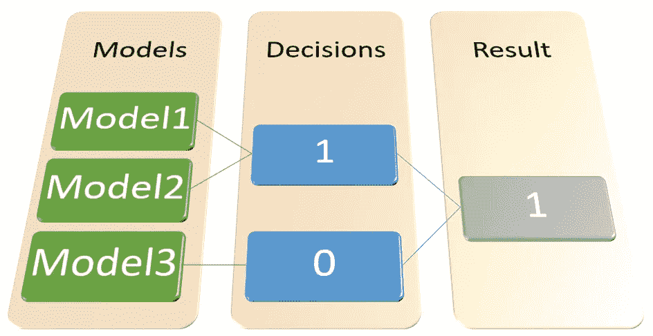
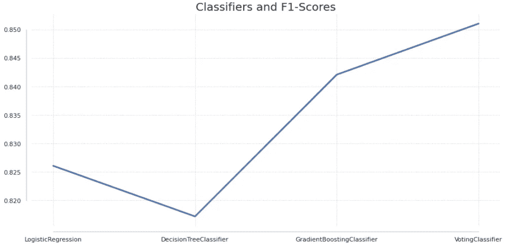
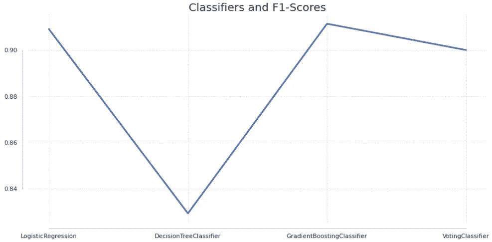

# 用 Scikit-Learn 创建集成投票分类器

> 原文：<https://towardsdatascience.com/creating-an-ensemble-voting-classifier-with-scikit-learn-ab13159662d>

## 您可以使用 Python 创建自己的具有不同算法的分类器


照片由 [Element5 数码](https://unsplash.com/@element5digital?utm_source=unsplash&utm_medium=referral&utm_content=creditCopyText)在 [Unsplash](https://unsplash.com/s/photos/vote?utm_source=unsplash&utm_medium=referral&utm_content=creditCopyText) 上拍摄

# 介绍

分类集成模型是由适合相同数据的许多模型组成的模型，其中分类的结果可以是多数人的投票、结果的平均值或最佳执行模型结果。



图 1:带有投票结果的集合模型。图片由作者提供。

在图 1 中，有一个我们将在这个快速教程中构建的投票分类器的例子。观察到有三个模型符合数据。其中两个把数据归类为 1，一个归类为 0。所以，通过大多数人的投票，1 班获胜，这就是结果。

在 Scikit-Learn 中，集成模型的一个常用示例是[随机森林分类器](https://scikit-learn.org/stable/modules/generated/sklearn.ensemble.RandomForestClassifier.html)。顺便说一句，这是一个非常强大的模型，它使用许多决策树的组合来给我们一个观察的最佳结果。另一个选项是[梯度增强](https://scikit-learn.org/stable/modules/generated/sklearn.ensemble.GradientBoostingClassifier.html#sklearn.ensemble.GradientBoostingClassifier)模型，这也是一个集合类型的模型，但它有一个不同的配置来获得结果。

> 如果你感兴趣，这里有一篇非常完整的 [TDS 文章](/ensemble-methods-bagging-boosting-and-stacking-c9214a10a205)是关于打包和提升集合模型的。

然而，这些都是为了方便我们作为数据科学家的生活而创建的预包装模型。它们表现得非常好，并将提供良好的结果，但它们只使用一种算法来训练模型。

如果我们想用不同的算法创建自己的投票分类器会怎么样？

这就是我们将要学习的内容。

# 投票分类器

> 投票分类器使用选择的算法训练不同的模型，返回多数人的投票作为分类结果。

在 Scikit-Learn 中，有一个名为`VotingClassifier()`的类可以帮助我们以一种简单的方式创建具有不同算法的投票分类器。

首先，导入所需的模块。

```
# Dataset
from sklearn.datasets import make_classification# sklearn
from sklearn.model_selection import train_test_split
from sklearn.tree import DecisionTreeClassifier
from sklearn.linear_model import LogisticRegression
from sklearn.ensemble import GradientBoostingClassifier, VotingClassifier
from sklearn.metrics import f1_score, accuracy_score
```

让我们为我们的练习创建一个数据集。

```
seed=56456462
# Dataset
df = make_classification(n_samples=300, n_features=5, n_informative=4, n_redundant=1, random_state=seed)# Split
X,y = df[0], df[1]# Train Test
X_train, X_test, y_train, y_test = train_test_split(X,y, test_size=0.3, random_state=seed)
```

好了，一切就绪。接下来我们需要决定我们想要使用的算法。我们将使用**逻辑回归**、**决策树**和集合模型**梯度推进**的组合。因此，我们可以注意到，投票分类器可以由其他集成模型组成，这很好。想象一下用梯度推进聚集随机森林的力量？

```
# Creating instances of the algorithms
logit_model = LogisticRegression()
dt_model = DecisionTreeClassifier()
gb_model = GradientBoostingClassifier()
```

现在，我们有了组成投票分类器的所有东西。

```
# Voting Classifier
voting = VotingClassifier(estimators=[
          ('lr', logit_model),
          ('dt', dt_model),
          ('gb', gb_model) ],
           voting='hard')
```

`voting='hard'`是默认值，它意味着用多数规则投票来预测类标签。接下来，让我们创建这些模型的列表，这样我们可以循环它们来分别比较结果。

```
# list of classifiers
list_of_classifiers = [logit_model, dt_model, gb_model, voting]# Loop scores
for classifier in list_of_classifiers:
    classifier.fit(X_train,y_train)
    pred = classifier.predict(X_test)
    print("F1 Score:")
    print(classifier.__class__.__name__, f1_score(y_test, pred))
    print("Accuracy:")
    print(classifier.__class__.__name__, accuracy_score(y_test, pred))
    print("----------")
```

结果是:

```
F1 Score: LogisticRegression 0.8260869565217391
Accuracy: LogisticRegression 0.8222222222222222
---------- 
F1 Score: DecisionTreeClassifier 0.8172043010752689 
Accuracy: DecisionTreeClassifier 0.8111111111111111 
---------- 
F1 Score: GradientBoostingClassifier 0.8421052631578948 
Accuracy: GradientBoostingClassifier 0.8333333333333334 
---------- 
F1 Score: VotingClassifier 0.851063829787234 
Accuracy: VotingClassifier 0.8444444444444444 
----------
```



图 2:优于独立模型的投票分类器。图片由作者提供。

在这个例子中，投票分类器优于其他选项。F1 分数(正类准确性和真阳性率的混合)和准确性分数都略高于单独的梯度增强，并且比单独的决策树好得多。

值得注意的是，如果您更改种子值，输入数据集也会更改，因此您可能会得到不同的结果。例如，尝试使用`seed=8`，您将得到这个结果，其中投票分类器被逻辑回归和梯度提升所超越。



图 3:投票分类器的性能比 Logit 和 Grad 差。助推模型。图片由作者提供。

我告诉你这些是因为表明数据科学不是一门精确的科学是很重要的。它依赖于精确的科学，但不仅仅是成功的秘诀。大多数情况下，为了得到最终的结果，你必须对你的模型进行更多的调整。但是拥有像本文中介绍的工具可以给你很大的帮助。

# 在你走之前

集合模型是很好的选择，它们经常能提供很好的结果。

*   他们不太可能过度拟合数据，因为他们用不同的数据分割来训练许多模型
*   它们可以提供更好的准确性，因为有更多的模型确认分类是在正确的方向上。
*   `VotingClassifier()`可以帮助你用不同的算法创建一个集成模型。
*   语法:使用带有`VotingClassifier("name of the model", Instance() )`的元组

如果你喜欢这个内容，请关注我的博客。也可以在 LinkedIn 上找到我。

[](http://gustavorsantos.medium.com/)  

# 参考

奥雷连恩·盖伦， [*2019。用 Scikit-Learn，Keras&tensor flow*动手机器学习。第二版，奥赖利。](https://tinyurl.com/2s3tsh9x)

[](https://www.amazon.com/Hands-Machine-Learning-Scikit-Learn-TensorFlow/dp/1492032646/ref=asc_df_1492032646/?tag=hyprod-20&linkCode=df0&hvadid=385599638286&hvpos=&hvnetw=g&hvrand=10774777250311570064&hvpone=&hvptwo=&hvqmt=&hvdev=c&hvdvcmdl=&hvlocint=&hvlocphy=9009674&hvtargid=pla-523968811896&psc=1&tag=&ref=&adgrpid=79288120515&hvpone=&hvptwo=&hvadid=385599638286&hvpos=&hvnetw=g&hvrand=10774777250311570064&hvqmt=&hvdev=c&hvdvcmdl=&hvlocint=&hvlocphy=9009674&hvtargid=pla-523968811896)  [](https://scikit-learn.org/stable/modules/generated/sklearn.ensemble.VotingClassifier.html#sklearn.ensemble.VotingClassifier) 